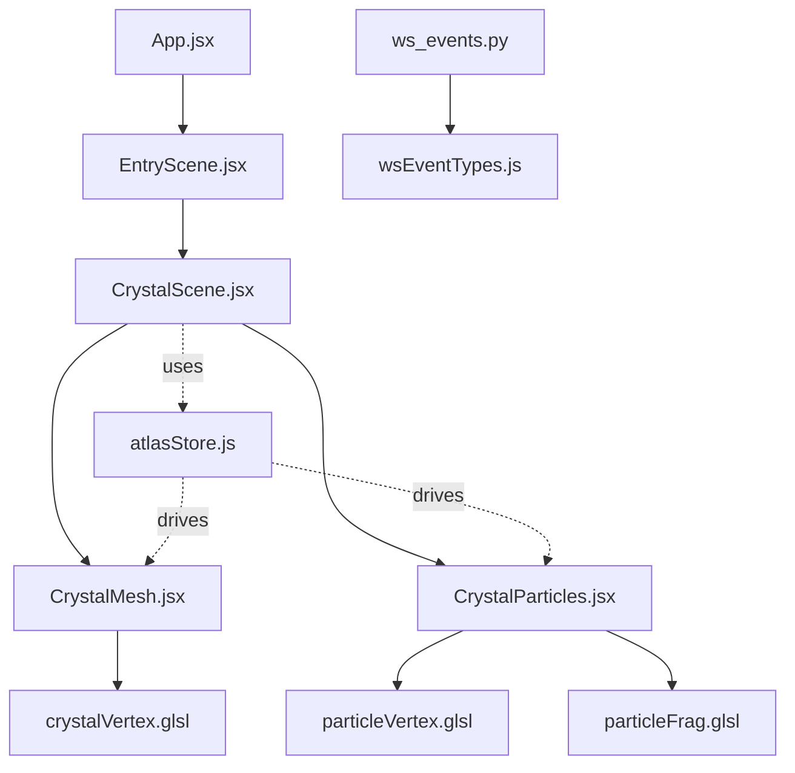
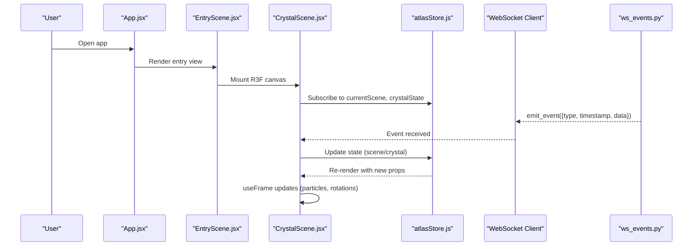
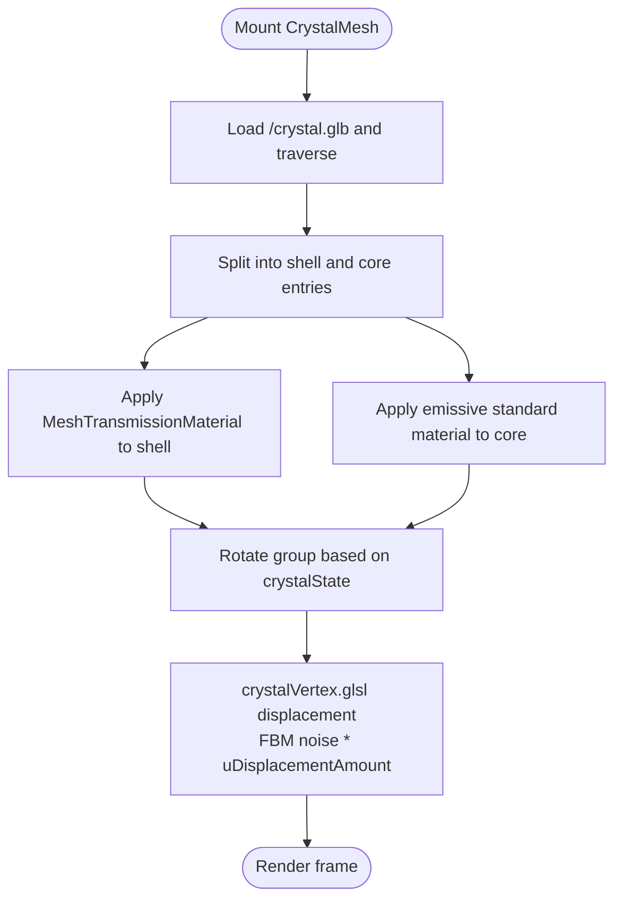
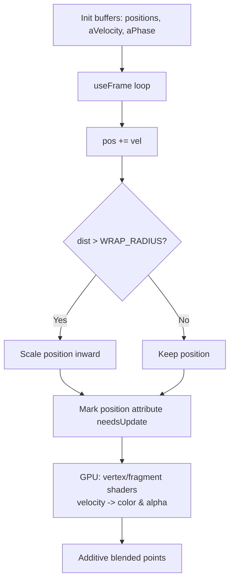
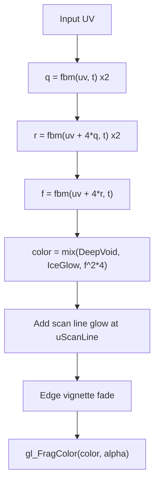
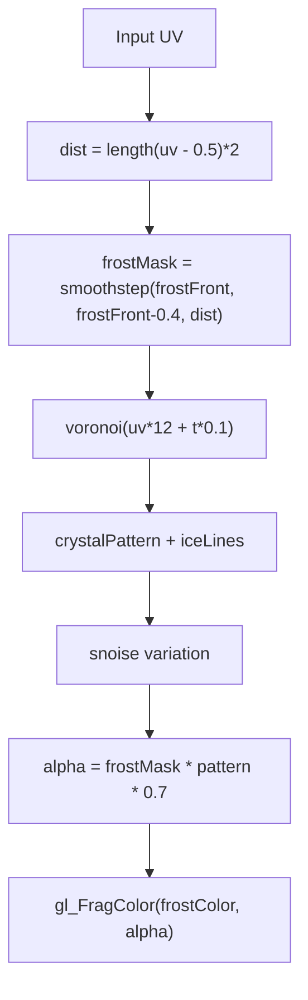
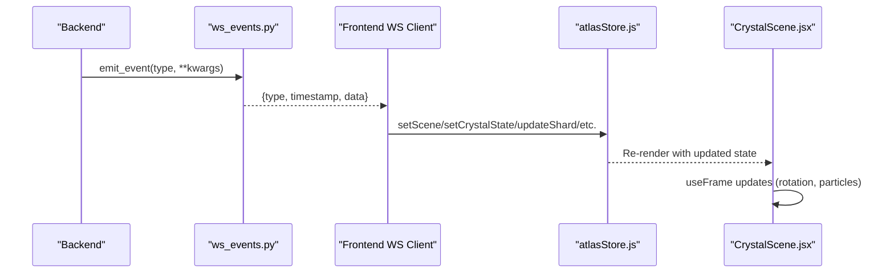
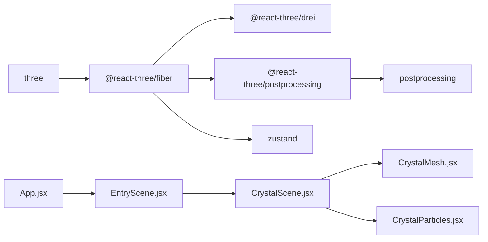

# 3D Visualization System

<cite>
**Referenced Files in This Document**
- [App.jsx](file://frontend/src/App.jsx)
- [EntryScene.jsx](file://frontend/src/scenes/EntryScene.jsx)
- [CrystalScene.jsx](file://frontend/src/components/crystal/CrystalScene.jsx)
- [CrystalMesh.jsx](file://frontend/src/components/crystal/CrystalMesh.jsx)
- [CrystalParticles.jsx](file://frontend/src/components/crystal/CrystalParticles.jsx)
- [crystalVertex.glsl](file://frontend/src/components/crystal/shaders/crystalVertex.glsl)
- [particleVertex.glsl](file://frontend/src/components/crystal/shaders/particleVertex.glsl)
- [particleFrag.glsl](file://frontend/src/components/crystal/shaders/particleFrag.glsl)
- [fluid.frag.glsl](file://frontend/src/components/crystal/shaders/fluid.frag.glsl)
- [frost.frag.glsl](file://frontend/src/components/crystal/shaders/frost.frag.glsl)
- [atlasStore.js](file://frontend/src/store/atlasStore.js)
- [wsEventTypes.js](file://frontend/src/utils/wsEventTypes.js)
- [ws_events.py](file://backend/ws_events.py)
- [package.json](file://frontend/package.json)
</cite>

## Table of Contents
1. [Introduction](#introduction)
2. [Project Structure](#project-structure)
3. [Core Components](#core-components)
4. [Architecture Overview](#architecture-overview)
5. [Detailed Component Analysis](#detailed-component-analysis)
6. [Dependency Analysis](#dependency-analysis)
7. [Performance Considerations](#performance-considerations)
8. [Troubleshooting Guide](#troubleshooting-guide)
9. [Conclusion](#conclusion)

## Introduction
This document explains the 3D visualization system built with Three.js and React Three Fiber that uses a crystallisation metaphor to visualize research progress. The system renders a dynamic crystal whose geometry morphs as the pipeline advances, supported by a velocity-based particle system and custom GLSL shaders for organic irregularity, fluid wall simulation, and frost spread effects. Lighting is provided via HDRI environment maps, directional lights, and post-processing bloom. Scene transitions are coordinated through a Zustand store and WebSocket events from the backend.

## Project Structure
The frontend is organized around a small set of focused components:
- EntryScene composes the 3D canvas and UI overlay.
- CrystalScene sets up rendering, lighting, post-processing, and quality detection.
- CrystalMesh loads a pre-baked crystal model and applies transmission materials; it also drives rotation based on state.
- CrystalParticles implements a GPU-friendly point cloud with custom vertex/fragment shaders.
- Shaders implement noise-driven displacement, particle coloring, fluid walls, and frost growth.
- atlasStore centralizes scene and pipeline state.
- wsEventTypes enumerates event names consumed by the frontend; ws_events.py provides a helper used by the backend to emit structured events.

**Diagram sources**
- [App.jsx:1-42](file://frontend/src/App.jsx#L1-L42)
- [EntryScene.jsx:1-8](file://frontend/src/scenes/EntryScene.jsx#L1-L8)
- [CrystalScene.jsx:1-116](file://frontend/src/components/crystal/CrystalScene.jsx#L1-L116)
- [CrystalMesh.jsx:1-103](file://frontend/src/components/crystal/CrystalMesh.jsx#L1-L103)
- [CrystalParticles.jsx:1-130](file://frontend/src/components/crystal/CrystalParticles.jsx#L1-L130)
- [crystalVertex.glsl:1-87](file://frontend/src/components/crystal/shaders/crystalVertex.glsl#L1-L87)
- [particleVertex.glsl:1-33](file://frontend/src/components/crystal/shaders/particleVertex.glsl#L1-L33)
- [particleFrag.glsl:1-19](file://frontend/src/components/crystal/shaders/particleFrag.glsl#L1-L19)
- [atlasStore.js:1-84](file://frontend/src/store/atlasStore.js#L1-L84)
- [wsEventTypes.js:1-45](file://frontend/src/utils/wsEventTypes.js#L1-L45)
- [ws_events.py:1-14](file://backend/ws_events.py#L1-L14)

**Section sources**
- [App.jsx:1-42](file://frontend/src/App.jsx#L1-L42)
- [EntryScene.jsx:1-8](file://frontend/src/scenes/EntryScene.jsx#L1-L8)
- [CrystalScene.jsx:1-116](file://frontend/src/components/crystal/CrystalScene.jsx#L1-L116)
- [CrystalMesh.jsx:1-103](file://frontend/src/components/crystal/CrystalMesh.jsx#L1-L103)
- [CrystalParticles.jsx:1-130](file://frontend/src/components/crystal/CrystalParticles.jsx#L1-L130)
- [atlasStore.js:1-84](file://frontend/src/store/atlasStore.js#L1-L84)
- [wsEventTypes.js:1-45](file://frontend/src/utils/wsEventTypes.js#L1-L45)
- [ws_events.py:1-14](file://backend/ws_events.py#L1-L14)

## Core Components
- CrystalScene: Initializes the Three.js renderer, camera, fog, background color, HDRI environment, ambient and directional lights, and post-processing (Bloom, Chromatic Aberration, Vignette, Noise, Depth of Field, Tone Mapping). It detects GPU capability and adjusts sampling/resolution accordingly.
- CrystalMesh: Loads a glTF crystal model, separates shell and core meshes, applies MeshTransmissionMaterial to the shell and emissive standard material to the core, and rotates the group based on current crystalState.
- CrystalParticles: Manages a buffer geometry with per-particle attributes (position, velocity, phase), updates positions each frame with wrapping logic, and renders using custom GLSL shaders for velocity-based coloring and soft glow.
- Shaders:
  - crystalVertex.glsl: FBM noise displacement along normals controlled by uDisplacementAmount to simulate raw vs. formed crystal.
  - particleVertex.glsl and particleFrag.glsl: Velocity-mapped color and alpha pulsing with soft circular points and additive blending.
  - fluid.frag.glsl: Domain-warped FBM fluid pattern for Gatherer zone shaft walls with scan-line effect.
  - frost.frag.glsl: Voronoi-based ice growth pattern spreading outward during synthesis events.

**Section sources**
- [CrystalScene.jsx:1-116](file://frontend/src/components/crystal/CrystalScene.jsx#L1-L116)
- [CrystalMesh.jsx:1-103](file://frontend/src/components/crystal/CrystalMesh.jsx#L1-L103)
- [CrystalParticles.jsx:1-130](file://frontend/src/components/crystal/CrystalParticles.jsx#L1-L130)
- [crystalVertex.glsl:1-87](file://frontend/src/components/crystal/shaders/crystalVertex.glsl#L1-L87)
- [particleVertex.glsl:1-33](file://frontend/src/components/crystal/shaders/particleVertex.glsl#L1-L33)
- [particleFrag.glsl:1-19](file://frontend/src/components/crystal/shaders/particleFrag.glsl#L1-L19)
- [fluid.frag.glsl:1-106](file://frontend/src/components/crystal/shaders/fluid.frag.glsl#L1-L106)
- [frost.frag.glsl:1-110](file://frontend/src/components/crystal/shaders/frost.frag.glsl#L1-L110)

## Architecture Overview
The system follows a reactive architecture:
- Zustand store holds scene phase, crystal state, and pipeline data.
- Components subscribe to store slices and update visuals accordingly.
- Backend emits structured WebSocket events; the frontend can listen and mutate store state to drive transitions.
- Rendering pipeline uses R3F’s useFrame loop for per-frame updates and post-processing for visual polish.

**Diagram sources**
- [App.jsx:1-42](file://frontend/src/App.jsx#L1-L42)
- [EntryScene.jsx:1-8](file://frontend/src/scenes/EntryScene.jsx#L1-L8)
- [CrystalScene.jsx:1-116](file://frontend/src/components/crystal/CrystalScene.jsx#L1-L116)
- [atlasStore.js:1-84](file://frontend/src/store/atlasStore.js#L1-L84)
- [wsEventTypes.js:1-45](file://frontend/src/utils/wsEventTypes.js#L1-L45)
- [ws_events.py:1-14](file://backend/ws_events.py#L1-L14)

## Detailed Component Analysis

### CrystalMesh: Icosahedron-like Geometry and Displacement
- Loads a pre-baked glTF asset and traverses meshes to separate shell and core parts.
- Applies MeshTransmissionMaterial to the shell for glassy refraction and chromatic aberration.
- Uses a standard emissive material for the core to suggest inner glow.
- Rotates the group at different rates depending on crystalState (SEED, CHARGING, EMERGED).
- Custom vertex shader (crystalVertex.glsl) displaces vertices using FBM noise; uDisplacementAmount controls how “raw” or “formed” the crystal appears.

**Diagram sources**
- [CrystalMesh.jsx:1-103](file://frontend/src/components/crystal/CrystalMesh.jsx#L1-L103)
- [crystalVertex.glsl:1-87](file://frontend/src/components/crystal/shaders/crystalVertex.glsl#L1-L87)

**Section sources**
- [CrystalMesh.jsx:1-103](file://frontend/src/components/crystal/CrystalMesh.jsx#L1-L103)
- [crystalVertex.glsl:1-87](file://frontend/src/components/crystal/shaders/crystalVertex.glsl#L1-L87)

### CrystalParticles: Velocity-Based Coloring and Soft Glow
- Initializes 1200 particles with random spherical positions, normalized velocities, and per-particle phase offsets.
- Each frame, positions are advanced by velocity; particles beyond a wrap radius are scaled back toward center.
- Vertex shader computes color from speed and alpha from speed + phase + time; fragment shader draws soft circles with exponential glow.
- Additive blending creates luminous accumulation.

**Diagram sources**
- [CrystalParticles.jsx:1-130](file://frontend/src/components/crystal/CrystalParticles.jsx#L1-L130)
- [particleVertex.glsl:1-33](file://frontend/src/components/crystal/shaders/particleVertex.glsl#L1-L33)
- [particleFrag.glsl:1-19](file://frontend/src/components/crystal/shaders/particleFrag.glsl#L1-L19)

**Section sources**
- [CrystalParticles.jsx:1-130](file://frontend/src/components/crystal/CrystalParticles.jsx#L1-L130)
- [particleVertex.glsl:1-33](file://frontend/src/components/crystal/shaders/particleVertex.glsl#L1-L33)
- [particleFrag.glsl:1-19](file://frontend/src/components/crystal/shaders/particleFrag.glsl#L1-L19)

### Fluid Wall Shader (Gatherer Zone)
- Implements domain-warped FBM noise to simulate turbulent fluid motion on shaft walls.
- Mixes two colors (ice glow and deep void) based on noise fields.
- Adds a horizontal scan line that sweeps down the wall, controlled by uScanLine.
- Edge vignette increases brightness near the top where the crystal enters.

**Diagram sources**
- [fluid.frag.glsl:1-106](file://frontend/src/components/crystal/shaders/fluid.frag.glsl#L1-L106)

**Section sources**
- [fluid.frag.glsl:1-106](file://frontend/src/components/crystal/shaders/fluid.frag.glsl#L1-L106)

### Frost Spread Shader (Synthesis Events)
- Computes distance from center and advances a frost front based on uFrostAmount.
- Generates a Voronoi-based crystal pattern with bright ice lines at cell edges.
- Adds subtle noise variation within cells for organic texture.
- Outputs alpha masked by the frost front and pattern intensity.

**Diagram sources**
- [frost.frag.glsl:1-110](file://frontend/src/components/crystal/shaders/frost.frag.glsl#L1-L110)

**Section sources**
- [frost.frag.glsl:1-110](file://frontend/src/components/crystal/shaders/frost.frag.glsl#L1-L110)

### Lighting and Post-Processing
- Environment map loaded from an HDR file for realistic reflections.
- Ambient light plus two directional lights provide key and fill illumination.
- Post-processing includes Bloom, Chromatic Aberration, Vignette, Noise, Depth of Field (conditionally enabled), and ACES Filmic tone mapping.
- Quality detection reduces samples and resolution on low-end GPUs.

**Section sources**
- [CrystalScene.jsx:1-116](file://frontend/src/components/crystal/CrystalScene.jsx#L1-L116)

### Scene Transitions: Entry, Descent, Emergence, Chat
- Current scene is stored in atlasStore.currentScene with values 'entry', 'descent', 'emergence', 'chat'.
- Crystal state evolves through SEED, CHARGING, DESCENDING, FORMING, EMERGED, driving rotation and shader parameters.
- Depth of Field is conditionally enabled for the descent phase on capable hardware.
- Transitions are typically triggered by WebSocket events mapped to wsEventTypes constants.

**Section sources**
- [atlasStore.js:1-84](file://frontend/src/store/atlasStore.js#L1-L84)
- [CrystalScene.jsx:1-116](file://frontend/src/components/crystal/CrystalScene.jsx#L1-L116)
- [wsEventTypes.js:1-45](file://frontend/src/utils/wsEventTypes.js#L1-L45)

### WebSocket Integration and State Synchronization
- Backend emits structured events using a helper that wraps type, timestamp, and data.
- Frontend defines event types for pipeline stages, agents, gatherer, synthesizer, critic, memory, and VRAM lifecycle.
- A typical flow: backend emits event → frontend receives → updates Zustand store → components re-render with new props → 3D visuals update.

**Diagram sources**
- [ws_events.py:1-14](file://backend/ws_events.py#L1-L14)
- [wsEventTypes.js:1-45](file://frontend/src/utils/wsEventTypes.js#L1-L45)
- [atlasStore.js:1-84](file://frontend/src/store/atlasStore.js#L1-L84)
- [CrystalScene.jsx:1-116](file://frontend/src/components/crystal/CrystalScene.jsx#L1-L116)

**Section sources**
- [ws_events.py:1-14](file://backend/ws_events.py#L1-L14)
- [wsEventTypes.js:1-45](file://frontend/src/utils/wsEventTypes.js#L1-L45)
- [atlasStore.js:1-84](file://frontend/src/store/atlasStore.js#L1-L84)

## Dependency Analysis
Key runtime dependencies include Three.js, React Three Fiber/Drei, postprocessing, GSAP, and Zustand. Shader processing is handled by vite-plugin-glsl.

**Diagram sources**
- [package.json:1-35](file://frontend/package.json#L1-L35)
- [App.jsx:1-42](file://frontend/src/App.jsx#L1-L42)
- [EntryScene.jsx:1-8](file://frontend/src/scenes/EntryScene.jsx#L1-L8)
- [CrystalScene.jsx:1-116](file://frontend/src/components/crystal/CrystalScene.jsx#L1-L116)
- [CrystalMesh.jsx:1-103](file://frontend/src/components/crystal/CrystalMesh.jsx#L1-L103)
- [CrystalParticles.jsx:1-130](file://frontend/src/components/crystal/CrystalParticles.jsx#L1-L130)

**Section sources**
- [package.json:1-35](file://frontend/package.json#L1-L35)

## Performance Considerations
- GPU quality detection reduces MeshTransmissionMaterial samples and resolution on low-end devices.
- EffectComposer multisampling is disabled on low-end GPUs to maintain frame rate.
- Particle count is fixed at 1200; consider capping or pooling if further optimization is needed.
- Use frustumCulling off for points to avoid expensive visibility checks when appropriate.
- Avoid frequent geometry attribute updates outside useFrame; batch updates per frame.
- Prefer uniform-driven animation over heavy CPU-side calculations.
- Leverage additive blending and depthWrite=false for efficient transparency.

[No sources needed since this section provides general guidance]

## Troubleshooting Guide
- If the crystal does not rotate or morph, verify crystalState updates in the store and ensure useFrame runs.
- If particles flicker or disappear, check that position attributes are marked needsUpdate and that wrapping logic keeps particles within bounds.
- If fluid or frost shaders appear blank, confirm uniforms (uTime, uIntensity, uScanLine, uFrostAmount) are being passed and animated.
- If bloom or other post-processing looks incorrect, ensure ACES Filmic tone mapping is applied last and exposure is set appropriately.
- For WebSocket issues, validate event types match wsEventTypes and that the backend emits the expected structure.

**Section sources**
- [CrystalMesh.jsx:1-103](file://frontend/src/components/crystal/CrystalMesh.jsx#L1-L103)
- [CrystalParticles.jsx:1-130](file://frontend/src/components/crystal/CrystalParticles.jsx#L1-L130)
- [fluid.frag.glsl:1-106](file://frontend/src/components/crystal/shaders/fluid.frag.glsl#L1-L106)
- [frost.frag.glsl:1-110](file://frontend/src/components/crystal/shaders/frost.frag.glsl#L1-L110)
- [CrystalScene.jsx:1-116](file://frontend/src/components/crystal/CrystalScene.jsx#L1-L116)
- [wsEventTypes.js:1-45](file://frontend/src/utils/wsEventTypes.js#L1-L45)
- [ws_events.py:1-14](file://backend/ws_events.py#L1-L14)

## Conclusion
The 3D visualization system combines a reactive state model with high-performance GPU shaders to render a living crystal that morphs with research progress. Through careful lighting, post-processing, and adaptive quality settings, it achieves smooth visuals while remaining responsive to real-time backend events. The modular design allows easy extension of shader effects and scene phases, supporting future enhancements such as additional zones, richer interactions, and more granular performance tuning.