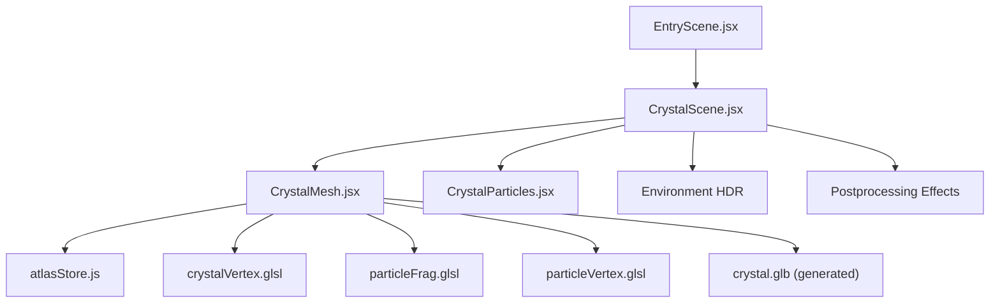
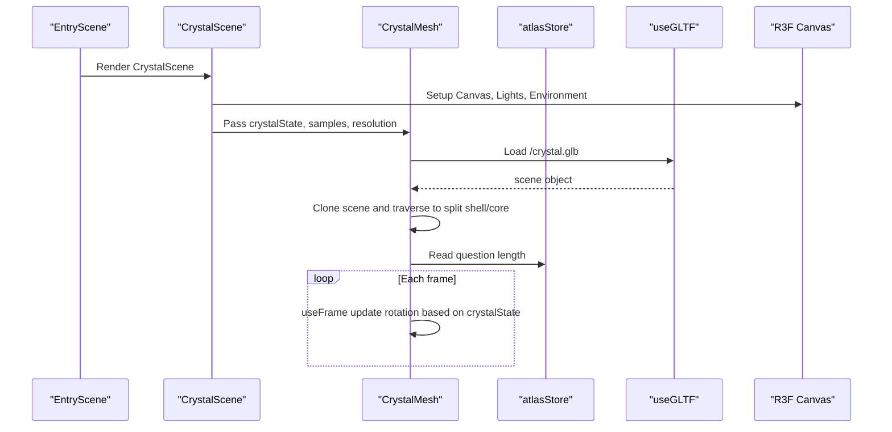
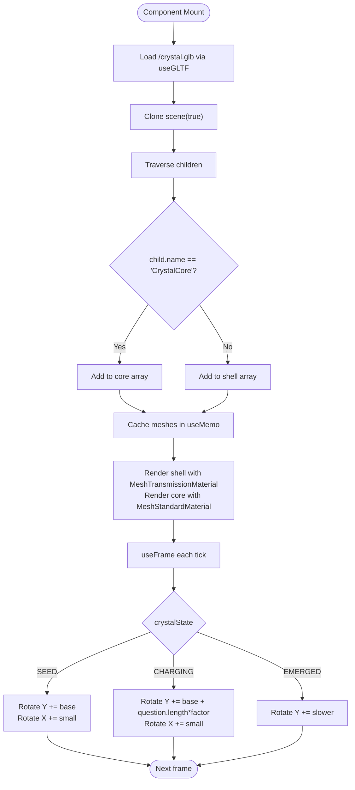
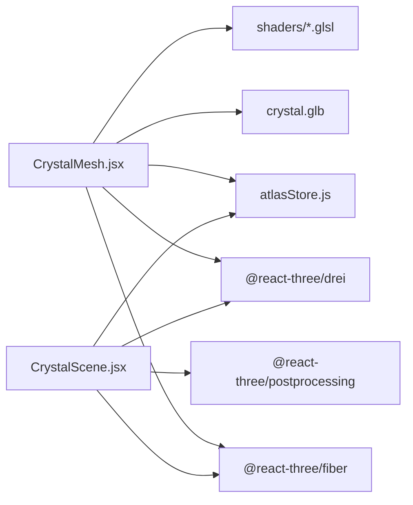

# Crystal Mesh Component

<cite>
**Referenced Files in This Document**
- [CrystalMesh.jsx](file://frontend/src/components/crystal/CrystalMesh.jsx)
- [CrystalScene.jsx](file://frontend/src/components/crystal/CrystalScene.jsx)
- [atlasStore.js](file://frontend/src/store/atlasStore.js)
- [EntryScene.jsx](file://frontend/src/scenes/EntryScene.jsx)
- [particleVertex.glsl](file://frontend/src/components/crystal/shaders/particleVertex.glsl)
- [particleFrag.glsl](file://frontend/src/components/crystal/shaders/particleFrag.glsl)
- [crystalVertex.glsl](file://frontend/src/components/crystal/shaders/crystalVertex.glsl)
- [frost.frag.glsl](file://frontend/src/components/crystal/shaders/frost.frag.glsl)
- [fluid.frag.glsl](file://frontend/src/components/crystal/shaders/fluid.frag.glsl)
- [generate_crystal.mjs](file://frontend/scripts/generate_crystal.mjs)
</cite>

## Table of Contents
1. [Introduction](#introduction)
2. [Project Structure](#project-structure)
3. [Core Components](#core-components)
4. [Architecture Overview](#architecture-overview)
5. [Detailed Component Analysis](#detailed-component-analysis)
6. [Dependency Analysis](#dependency-analysis)
7. [Performance Considerations](#performance-considerations)
8. [Troubleshooting Guide](#troubleshooting-guide)
9. [Conclusion](#conclusion)
10. [Appendices](#appendices)

## Introduction
This document explains the CrystalMesh component that implements a crystallisation metaphor visualization. It covers how the component loads and processes the crystal.glb model, separates it into shell and core meshes using traverse, configures MeshTransmissionMaterial with specific transmission properties, and animates rotation based on state phases (SEED, CHARGING, EMERGED). It also documents the useFrame hook for continuous updates, useMemo optimization for mesh processing, and integration with the Zustand store for state synchronization. Examples are provided for customizing material properties, adjusting samples and resolution parameters, and integrating with the store.

## Project Structure
The crystal visualization is implemented as a React Three Fiber scene with supporting shaders and a Zustand store for state management. The key files include:
- CrystalMesh.jsx: Loads the GLTF model, splits geometry into shell/core, applies materials, and handles animation.
- CrystalScene.jsx: Sets up lighting, environment map, post-processing effects, and passes GPU quality-adapted parameters to CrystalMesh.
- atlasStore.js: Centralized state including crystalState and question text used by the component.
- Shaders: Particle and crystal vertex/fragment shaders for visual effects.
- generate_crystal.mjs: Script that generates the crystal.glb asset used at runtime.

**Diagram sources**
- [EntryScene.jsx:1-8](file://frontend/src/scenes/EntryScene.jsx#L1-L8)
- [CrystalScene.jsx:1-116](file://frontend/src/components/crystal/CrystalScene.jsx#L1-L116)
- [CrystalMesh.jsx:1-103](file://frontend/src/components/crystal/CrystalMesh.jsx#L1-L103)
- [atlasStore.js:1-84](file://frontend/src/store/atlasStore.js#L1-L84)
- [particleVertex.glsl:1-33](file://frontend/src/components/crystal/shaders/particleVertex.glsl#L1-L33)
- [particleFrag.glsl:1-19](file://frontend/src/components/crystal/shaders/particleFrag.glsl#L1-L19)
- [crystalVertex.glsl:1-87](file://frontend/src/components/crystal/shaders/crystalVertex.glsl#L1-L87)
- [generate_crystal.mjs:1-40](file://frontend/scripts/generate_crystal.mjs#L1-L40)

**Section sources**
- [EntryScene.jsx:1-8](file://frontend/src/scenes/EntryScene.jsx#L1-L8)
- [CrystalScene.jsx:1-116](file://frontend/src/components/crystal/CrystalScene.jsx#L1-L116)
- [CrystalMesh.jsx:1-103](file://frontend/src/components/crystal/CrystalMesh.jsx#L1-L103)
- [atlasStore.js:1-84](file://frontend/src/store/atlasStore.js#L1-L84)

## Core Components
- CrystalMesh: Loads /crystal.glb via useGLTF, clones the scene, traverses children to separate shell and core meshes by name, and renders them with appropriate materials. It uses useMemo to compute mesh data once per scene load and useFrame to rotate the group based on crystalState and question length.
- CrystalScene: Configures the Canvas, lighting, Environment HDRI, post-processing (Bloom, ChromaticAberration, Vignette, Noise, DepthOfField, ToneMapping), and adapts samples/resolution based on GPU capability detection.
- atlasStore.js: Provides currentScene, crystalState, and question fields consumed by components.

Key responsibilities:
- Model loading and separation: Use GLTF loader and traverse to split geometry into shell and core parts.
- Material configuration: Apply MeshTransmissionMaterial for the shell and MeshStandardMaterial for the core.
- Animation: Continuous rotation updates driven by useFrame and state changes.
- Performance: useMemo for mesh processing; adaptive samples/resolution based on GPU capabilities.

**Section sources**
- [CrystalMesh.jsx:1-103](file://frontend/src/components/crystal/CrystalMesh.jsx#L1-L103)
- [CrystalScene.jsx:1-116](file://frontend/src/components/crystal/CrystalScene.jsx#L1-L116)
- [atlasStore.js:1-84](file://frontend/src/store/atlasStore.js#L1-L84)

## Architecture Overview
The visualization architecture combines React Three Fiber rendering, Zustand state, and shader-based effects. The flow begins with EntryScene rendering CrystalScene, which sets up the 3D environment and instantiates CrystalMesh and CrystalParticles. CrystalMesh consumes Zustand state to drive animation behavior and uses preloaded GLTF assets.

**Diagram sources**
- [EntryScene.jsx:1-8](file://frontend/src/scenes/EntryScene.jsx#L1-L8)
- [CrystalScene.jsx:1-116](file://frontend/src/components/crystal/CrystalScene.jsx#L1-L116)
- [CrystalMesh.jsx:1-103](file://frontend/src/components/crystal/CrystalMesh.jsx#L1-L103)
- [atlasStore.js:1-84](file://frontend/src/store/atlasStore.js#L1-L84)

## Detailed Component Analysis

### CrystalMesh Component
Responsibilities:
- Load and process the crystal.glb model.
- Separate geometry into shell and core meshes using traverse.
- Configure MeshTransmissionMaterial for the shell with specified transmission properties.
- Animate rotation based on crystalState and question length.
- Optimize mesh processing with useMemo.

Model loading and separation:
- useGLTF('/crystal.glb') loads the model.
- useMemo clones the scene and traverses children to collect geometry and world matrices.
- child.name === 'CrystalCore' identifies core meshes; others are treated as shell.
- Materials from the original GLTF are disposed to avoid leaks before reassigning new materials.

MeshTransmissionMaterial configuration:
- transmission: 0.65
- thickness: 1.4
- roughness: 0.45
- ior: 1.31
- chromaticAberration: 0.04
- distortion: 0.15
- distortionScale: 0.3
- temporalDistortion: 0.1
- color: "#eef1f5"
- envMapIntensity: 0.6
- samples and resolution passed from props (default 6 and 512)
- flatShading: true

Animation logic:
- useFrame increments rotation.y and rotation.x based on crystalState:
  - SEED: base rotation speeds
  - CHARGING: increased rotation.y proportional to question.length
  - EMERGED: slower rotation.y

Optimization:
- useMemo caches the processed mesh arrays keyed by scene reference.
- matrixAutoUpdate disabled for performance since matrices are precomputed.

Customization examples:
- Adjust samples and resolution for performance vs quality trade-offs.
- Modify MeshTransmissionMaterial properties like transmission, thickness, roughness, ior, chromaticAberration, distortion, and envMapIntensity.
- Change colors or emissive properties for the core material.

Integration with Zustand:
- Reads question length from store to influence CHARGING rotation speed.
- Receives crystalState prop from parent (typically set by scene logic).

**Diagram sources**
- [CrystalMesh.jsx:15-40](file://frontend/src/components/crystal/CrystalMesh.jsx#L15-L40)
- [CrystalMesh.jsx:42-54](file://frontend/src/components/crystal/CrystalMesh.jsx#L42-L54)
- [CrystalMesh.jsx:56-99](file://frontend/src/components/crystal/CrystalMesh.jsx#L56-L99)

**Section sources**
- [CrystalMesh.jsx:1-103](file://frontend/src/components/crystal/CrystalMesh.jsx#L1-L103)

### CrystalScene Component
Responsibilities:
- Set up R3F Canvas with antialiasing, tone mapping, and exposure.
- Provide ambient and directional lights.
- Load Environment HDRI for reflections and refractions.
- Instantiate CrystalMesh and CrystalParticles with adaptive parameters.
- Apply post-processing effects (Bloom, ChromaticAberration, Vignette, Noise, DepthOfField, ToneMapping).

GPU quality detection:
- GpuQualityDetector inspects MAX_TEXTURE_SIZE to determine low-end GPUs.
- Low-end devices receive reduced samples (4) and resolution (256) for better performance.

Lighting and environment:
- Ambient light provides base illumination.
- Directional lights simulate sunlight and fill.
- Environment HDRI enables realistic reflections and refractions for MeshTransmissionMaterial.

Post-processing:
- Bloom adds glow to bright areas.
- ChromaticAberration introduces subtle color fringing.
- Vignette darkens edges.
- Noise adds film grain.
- DepthOfField focuses attention when enabled.
- ToneMapping ensures correct color output.

Adaptive parameters:
- samples and resolution passed to CrystalMesh depend on GPU capability.

**Section sources**
- [CrystalScene.jsx:1-116](file://frontend/src/components/crystal/CrystalScene.jsx#L1-L116)

### Zustand Store Integration
Responsibilities:
- Manage application-wide state including currentScene, crystalState, pipelineStage, question, and other features.
- Provide setters for updating state across components.

Relevant fields for CrystalMesh:
- crystalState: Controls rotation behavior in SEED, CHARGING, EMERGED phases.
- question: Length influences CHARGING rotation speed.

Usage in CrystalMesh:
- Reads question length to adjust rotation during CHARGING phase.
- Receives crystalState prop from parent component (typically updated by scene logic).

**Section sources**
- [atlasStore.js:1-84](file://frontend/src/store/atlasStore.js#L1-L84)

### Shaders and Visual Effects
Particle system:
- particleVertex.glsl computes per-particle color based on velocity magnitude and alpha pulsing.
- particleFrag.glsl renders soft glowing points with additive blending.

Crystal shaders:
- crystalVertex.glsl displaces vertices using FBM noise for irregular crystalline shapes.
- frost.frag.glsl creates ice crystal growth patterns spreading outward.
- fluid.frag.glsl simulates turbulent fluid for background walls.

These shaders enhance the visual fidelity of the crystal and surrounding environment.

**Section sources**
- [particleVertex.glsl:1-33](file://frontend/src/components/crystal/shaders/particleVertex.glsl#L1-L33)
- [particleFrag.glsl:1-19](file://frontend/src/components/crystal/shaders/particleFrag.glsl#L1-L19)
- [crystalVertex.glsl:1-87](file://frontend/src/components/crystal/shaders/crystalVertex.glsl#L1-L87)
- [frost.frag.glsl:1-110](file://frontend/src/components/crystal/shaders/frost.frag.glsl#L1-L110)
- [fluid.frag.glsl:1-106](file://frontend/src/components/crystal/shaders/fluid.frag.glsl#L1-L106)

### Model Generation
The crystal.glb asset is generated programmatically using generate_crystal.mjs, which creates two-part geometry:
- CrystalShell: Icosahedron with detail 1, vertex random displacement, light displace, flat facets.
- CrystalCore: Icosahedron with detail 2, irregular scale, clouds displace, smooth organic shape positioned slightly off-axis inside the shell.

This generation script ensures consistent asset creation without requiring external tools.

**Section sources**
- [generate_crystal.mjs:1-40](file://frontend/scripts/generate_crystal.mjs#L1-L40)

## Dependency Analysis
The CrystalMesh component depends on several modules and resources:
- React Three Fiber for rendering and hooks (useFrame).
- React Three Drei for MeshTransmissionMaterial and useGLTF.
- Zustand store for state management.
- GLTF asset (/crystal.glb) loaded at runtime.
- Shaders for particle and crystal effects.

**Diagram sources**
- [CrystalMesh.jsx:1-103](file://frontend/src/components/crystal/CrystalMesh.jsx#L1-L103)
- [CrystalScene.jsx:1-116](file://frontend/src/components/crystal/CrystalScene.jsx#L1-L116)
- [atlasStore.js:1-84](file://frontend/src/store/atlasStore.js#L1-L84)

**Section sources**
- [CrystalMesh.jsx:1-103](file://frontend/src/components/crystal/CrystalMesh.jsx#L1-L103)
- [CrystalScene.jsx:1-116](file://frontend/src/components/crystal/CrystalScene.jsx#L1-L116)
- [atlasStore.js:1-84](file://frontend/src/store/atlasStore.js#L1-L84)

## Performance Considerations
- useMemo optimization: Mesh processing is computed once per scene load to avoid recalculating on every render.
- Adaptive sampling: Lower-end GPUs receive reduced samples (4) and resolution (256) to maintain performance.
- Matrix caching: Precomputing world matrices and disabling auto-update reduces per-frame overhead.
- Post-processing effects: Enable/disable DepthOfField based on device capability to balance visual quality and performance.
- Memory management: Disposing original materials from GLTF prevents memory leaks.

[No sources needed since this section provides general guidance]

## Troubleshooting Guide
Common issues and solutions:
- Model not loading: Ensure /crystal.glb exists in public directory and useGLTF.preload is called.
- Incorrect mesh separation: Verify child names match expected structure ('CrystalCore' for core, others for shell).
- Performance degradation: Reduce samples and resolution for low-end devices; disable expensive post-processing effects.
- Material artifacts: Adjust MeshTransmissionMaterial properties like transmission, thickness, and roughness for desired visual results.
- State synchronization: Confirm crystalState and question values are correctly updated in Zustand store.

**Section sources**
- [CrystalMesh.jsx:1-103](file://frontend/src/components/crystal/CrystalMesh.jsx#L1-L103)
- [CrystalScene.jsx:1-116](file://frontend/src/components/crystal/CrystalScene.jsx#L1-L116)
- [atlasStore.js:1-84](file://frontend/src/store/atlasStore.js#L1-L84)

## Conclusion
The CrystalMesh component provides a sophisticated crystallisation metaphor visualization through careful model processing, material configuration, and state-driven animation. By leveraging React Three Fiber, Zustand, and custom shaders, it achieves both visual fidelity and performance adaptability. The documented customization options enable fine-tuning of material properties, animation behavior, and rendering quality to suit different devices and use cases.

[No sources needed since this section summarizes without analyzing specific files]

## Appendices

### Customization Examples
- Material properties: Adjust transmission, thickness, roughness, ior, chromaticAberration, distortion, and envMapIntensity in MeshTransmissionMaterial.
- Samples and resolution: Modify default values (6, 512) or pass custom values based on device capabilities.
- Animation speed: Tune rotation increments for SEED, CHARGING, and EMERGED states.
- Color schemes: Change color and emissive properties for core and shell materials.

### Integration with Zustand Store
- Update crystalState via setCrystalState to trigger different animation behaviors.
- Modify question field to influence CHARGING rotation speed based on input length.
- Synchronize scene transitions with currentScene for coordinated visual feedback.

[No sources needed since this section provides general guidance]