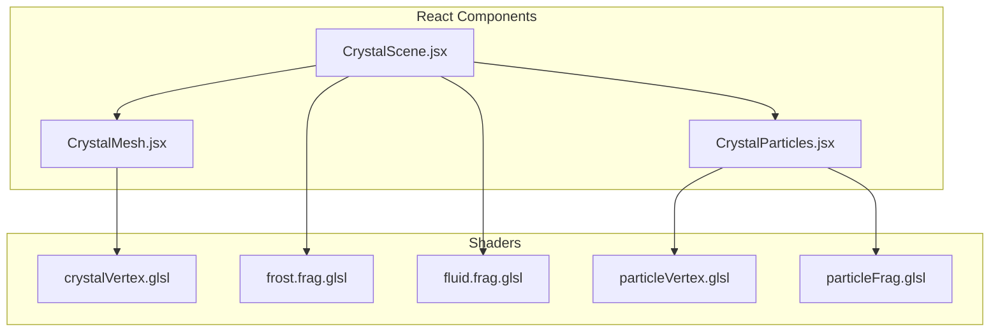
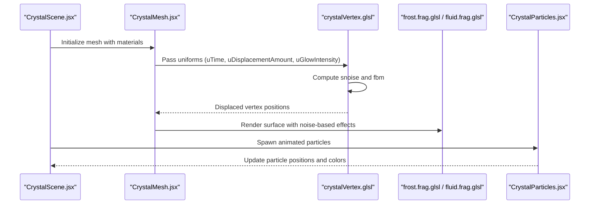
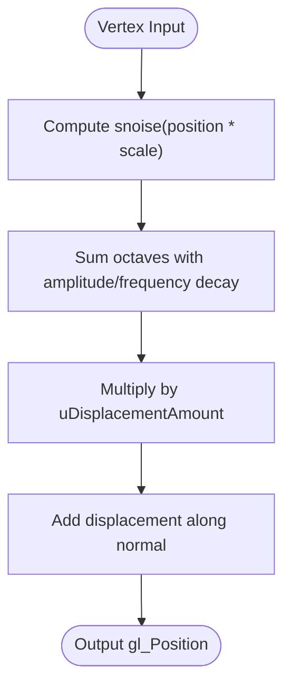
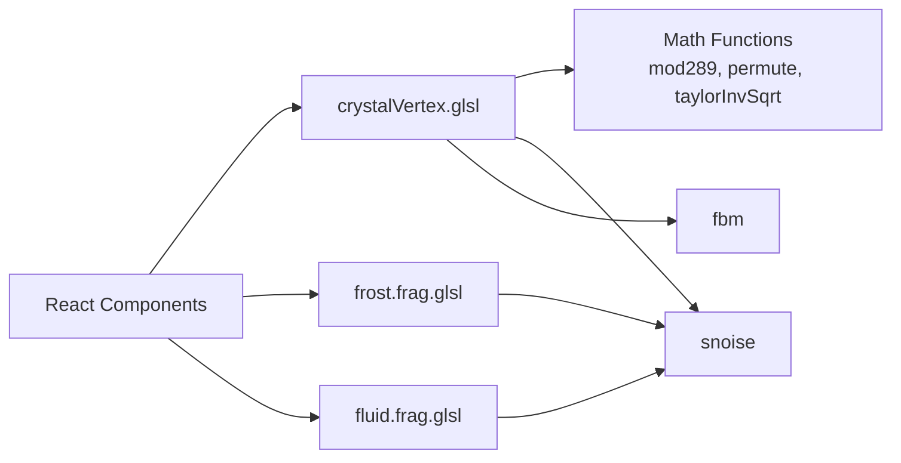

# Crystal Vertex Shader

<cite>
**Referenced Files in This Document**
- [crystalVertex.glsl](file://frontend/src/components/crystal/shaders/crystalVertex.glsl)
- [frost.frag.glsl](file://frontend/src/components/crystal/shaders/frost.frag.glsl)
- [fluid.frag.glsl](file://frontend/src/components/crystal/shaders/fluid.frag.glsl)
- [particleVertex.glsl](file://frontend/src/components/crystal/shaders/particleVertex.glsl)
- [particleFrag.glsl](file://frontend/src/components/crystal/shaders/particleFrag.glsl)
- [CrystalMesh.jsx](file://frontend/src/components/crystal/CrystalMesh.jsx)
- [CrystalScene.jsx](file://frontend/src/components/crystal/CrystalScene.jsx)
</cite>

## Table of Contents
1. [Introduction](#introduction)
2. [Project Structure](#project-structure)
3. [Core Components](#core-components)
4. [Architecture Overview](#architecture-overview)
5. [Detailed Component Analysis](#detailed-component-analysis)
6. [Dependency Analysis](#dependency-analysis)
7. [Performance Considerations](#performance-considerations)
8. [Troubleshooting Guide](#troubleshooting-guide)
9. [Conclusion](#conclusion)
10. [Appendices](#appendices)

## Introduction
This document explains the crystalVertex.glsl shader that transforms perfect geometric crystals into organic, raw crystalline forms using Perlin noise and fractal Brownian motion (FBM). It details the vertex displacement algorithm, the mathematical implementation of 3D noise (mod289 operations, permutation tables, gradient calculations), and the FBM function that combines multiple octaves with varying frequencies and amplitudes. It also documents the uniform parameters uTime, uDisplacementAmount, and uGlowIntensity, their effects on visual output, performance considerations for real-time vertex displacement, debugging techniques for noise visualization, and examples of modifying noise characteristics to achieve different crystal types.

## Project Structure
The shader is part of a React Three Fiber application where GLSL shaders are used for both geometry deformation and surface effects:
- The vertex shader defines noise functions and displaces vertices along normals based on FBM.
- Fragment shaders implement additional effects such as frost patterns and fluid simulations.
- Particle shaders provide animated point clouds around the crystal.
- React components integrate these shaders into the scene and manage uniforms and rendering settings.

**Diagram sources**
- [CrystalScene.jsx:1-116](file://frontend/src/components/crystal/CrystalScene.jsx#L1-L116)
- [CrystalMesh.jsx:1-103](file://frontend/src/components/crystal/CrystalMesh.jsx#L1-L103)
- [crystalVertex.glsl:1-87](file://frontend/src/components/crystal/shaders/crystalVertex.glsl#L1-L87)
- [frost.frag.glsl:1-110](file://frontend/src/components/crystal/shaders/frost.frag.glsl#L1-L110)
- [fluid.frag.glsl:1-106](file://frontend/src/components/crystal/shaders/fluid.frag.glsl#L1-L106)
- [particleVertex.glsl:1-33](file://frontend/src/components/crystal/shaders/particleVertex.glsl#L1-L33)
- [particleFrag.glsl:1-19](file://frontend/src/components/crystal/shaders/particleFrag.glsl#L1-L19)

**Section sources**
- [CrystalScene.jsx:1-116](file://frontend/src/components/crystal/CrystalScene.jsx#L1-L116)
- [CrystalMesh.jsx:1-103](file://frontend/src/components/crystal/CrystalMesh.jsx#L1-L103)

## Core Components
- crystalVertex.glsl: Implements 3D Perlin noise (snoise), FBM, and vertex displacement along normals.
- frost.frag.glsl: Uses snoise and Voronoi patterns to create ice-like frost textures.
- fluid.frag.glsl: Domain-warped FBM to simulate turbulent fluid surfaces.
- particleVertex.glsl and particleFrag.glsl: Animate particles with velocity-based coloring and soft glow.

Key responsibilities:
- Noise generation and sampling for organic irregularity.
- Vertex displacement to morph perfect geometry into raw crystal shapes.
- Surface effects via fragment shaders for enhanced realism.
- Particle systems for ambient atmosphere.

**Section sources**
- [crystalVertex.glsl:1-87](file://frontend/src/components/crystal/shaders/crystalVertex.glsl#L1-L87)
- [frost.frag.glsl:1-110](file://frontend/src/components/crystal/shaders/frost.frag.glsl#L1-L110)
- [fluid.frag.glsl:1-106](file://frontend/src/components/crystal/shaders/fluid.frag.glsl#L1-L106)
- [particleVertex.glsl:1-33](file://frontend/src/components/crystal/shaders/particleVertex.glsl#L1-L33)
- [particleFrag.glsl:1-19](file://frontend/src/components/crystal/shaders/particleFrag.glsl#L1-L19)

## Architecture Overview
The shader pipeline integrates vertex displacement with fragment effects and particle animations within a React Three Fiber scene. The vertex shader computes displaced positions, while fragment shaders apply surface details. Particles add dynamic elements around the crystal.

**Diagram sources**
- [CrystalScene.jsx:1-116](file://frontend/src/components/crystal/CrystalScene.jsx#L1-L116)
- [CrystalMesh.jsx:1-103](file://frontend/src/components/crystal/CrystalMesh.jsx#L1-L103)
- [crystalVertex.glsl:1-87](file://frontend/src/components/crystal/shaders/crystalVertex.glsl#L1-L87)
- [frost.frag.glsl:1-110](file://frontend/src/components/crystal/shaders/frost.frag.glsl#L1-L110)
- [fluid.frag.glsl:1-106](file://frontend/src/components/crystal/shaders/fluid.frag.glsl#L1-L106)
- [CrystalParticles.jsx:1-130](file://frontend/src/components/crystal/CrystalParticles.jsx#L1-L130)

## Detailed Component Analysis

### crystalVertex.glsl: Vertex Displacement Algorithm
The vertex shader implements Perlin noise and FBM to displace vertices along normals, creating organic crystal shapes.

- **Noise Functions**: 
  - mod289: Wraps coordinates to prevent overflow.
  - permute: Generates pseudo-random permutations for noise gradients.
  - taylorInvSqrt: Approximates inverse square root for normalization.
  - snoise: Classic 3D Perlin noise with gradient interpolation.

- **FBM Function**: Combines multiple octaves of snoise with decreasing amplitude and increasing frequency to produce natural-looking surfaces.

- **Vertex Displacement**: Computes noise value at each vertex position, scales by uDisplacementAmount, and offsets the vertex along its normal.

**Diagram sources**
- [crystalVertex.glsl:13-60](file://frontend/src/components/crystal/shaders/crystalVertex.glsl#L13-L60)
- [crystalVertex.glsl:62-73](file://frontend/src/components/crystal/shaders/crystalVertex.glsl#L62-L73)
- [crystalVertex.glsl:75-86](file://frontend/src/components/crystal/shaders/crystalVertex.glsl#L75-L86)

**Section sources**
- [crystalVertex.glsl:13-60](file://frontend/src/components/crystal/shaders/crystalVertex.glsl#L13-L60)
- [crystalVertex.glsl:62-73](file://frontend/src/components/crystal/shaders/crystalVertex.glsl#L62-L73)
- [crystalVertex.glsl:75-86](file://frontend/src/components/crystal/shaders/crystalVertex.glsl#L75-L86)

### Mathematical Implementation of 3D Noise
- **mod289 Operations**: Ensures values stay within a manageable range to avoid precision issues.
- **Permutation Tables**: Generated via permute function to map input coordinates to random gradients.
- **Gradient Calculations**: Uses dot products between gradient vectors and distance vectors for smooth interpolation.

These steps ensure continuous, seamless noise suitable for organic shapes.

**Section sources**
- [crystalVertex.glsl:14-17](file://frontend/src/components/crystal/shaders/crystalVertex.glsl#L14-L17)
- [crystalVertex.glsl:19-60](file://frontend/src/components/crystal/shaders/crystalVertex.glsl#L19-L60)

### FBM Function: Multi-Octave Noise
The FBM function iteratively samples snoise with varying frequencies and amplitudes:
- Initial amplitude: 0.5
- Frequency multiplier: 3.5 per octave
- Octave count: 5

This creates complex, layered noise patterns ideal for crystal surfaces.

**Section sources**
- [crystalVertex.glsl:62-73](file://frontend/src/components/crystal/shaders/crystalVertex.glsl#L62-L73)

### Uniform Parameters and Effects
- **uTime**: Animates noise over time, adding subtle movement to the crystal surface.
- **uDisplacementAmount**: Controls the intensity of vertex displacement (0.0 = perfect crystal, higher values = more irregular).
- **uGlowIntensity**: Intended for glow effects but not directly used in vertex shader; likely applied in fragment shaders or post-processing.

These uniforms allow dynamic control over the crystal's appearance and behavior.

**Section sources**
- [crystalVertex.glsl:5-7](file://frontend/src/components/crystal/shaders/crystalVertex.glsl#L5-L7)
- [crystalVertex.glsl:75-86](file://frontend/src/components/crystal/shaders/crystalVertex.glsl#L75-L86)

### Integration with React Components
- **CrystalMesh.jsx**: Loads and renders the crystal model, applying transmission materials for glass-like effects.
- **CrystalScene.jsx**: Sets up lighting, environment, and post-processing effects like bloom and chromatic aberration.
- **CrystalParticles.jsx**: Adds animated particles around the crystal using custom shaders.

While the vertex shader is defined, it is not currently integrated into the main crystal mesh in the provided code. The current implementation uses standard materials without custom vertex shaders.

**Section sources**
- [CrystalMesh.jsx:1-103](file://frontend/src/components/crystal/CrystalMesh.jsx#L1-L103)
- [CrystalScene.jsx:1-116](file://frontend/src/components/crystal/CrystalScene.jsx#L1-L116)
- [CrystalParticles.jsx:1-130](file://frontend/src/components/crystal/CrystalParticles.jsx#L1-L130)

## Dependency Analysis
The shader components have clear dependencies:
- crystalVertex.glsl depends on math functions (mod289, permute, taylorInvSqrt) and snoise.
- Fragment shaders may reuse snoise implementations from other files.
- React components manage uniform updates and scene setup.

**Diagram sources**
- [crystalVertex.glsl:13-73](file://frontend/src/components/crystal/shaders/crystalVertex.glsl#L13-L73)
- [frost.frag.glsl:11-57](file://frontend/src/components/crystal/shaders/frost.frag.glsl#L11-L57)
- [fluid.frag.glsl:16-62](file://frontend/src/components/crystal/shaders/fluid.frag.glsl#L16-L62)
- [CrystalMesh.jsx:1-103](file://frontend/src/components/crystal/CrystalMesh.jsx#L1-L103)
- [CrystalScene.jsx:1-116](file://frontend/src/components/crystal/CrystalScene.jsx#L1-L116)

**Section sources**
- [crystalVertex.glsl:13-73](file://frontend/src/components/crystal/shaders/crystalVertex.glsl#L13-L73)
- [frost.frag.glsl:11-57](file://frontend/src/components/crystal/shaders/frost.frag.glsl#L11-L57)
- [fluid.frag.glsl:16-62](file://frontend/src/components/crystal/shaders/fluid.frag.glsl#L16-L62)

## Performance Considerations
- **Real-time Vertex Displacement**: FBM with 5 octaves can be computationally expensive. Consider reducing octave count or frequency multipliers for lower-end devices.
- **Uniform Updates**: Minimize frequent uniform updates; batch changes when possible.
- **Shader Optimization**: Use precomputed values where feasible and avoid redundant calculations.
- **GPU Detection**: The scene includes GPU quality detection to adjust rendering quality dynamically.

[No sources needed since this section provides general guidance]

## Troubleshooting Guide
- **Noise Visualization**: Temporarily set uDisplacementAmount to a high value to visualize noise patterns.
- **Performance Issues**: Reduce FBM octaves or simplify noise functions if frame rates drop.
- **Integration Problems**: Ensure the vertex shader is properly attached to the mesh material if implementing custom shaders.
- **Debugging Uniforms**: Log uniform values in React components to verify correct updates.

**Section sources**
- [crystalVertex.glsl:75-86](file://frontend/src/components/crystal/shaders/crystalVertex.glsl#L75-L86)
- [CrystalScene.jsx:19-27](file://frontend/src/components/crystal/CrystalScene.jsx#L19-L27)

## Conclusion
The crystalVertex.glsl shader provides a robust foundation for creating organic crystal shapes through Perlin noise and FBM. While not currently integrated into the main crystal mesh, the implementation demonstrates key techniques for vertex displacement and noise-based effects. With proper integration and optimization, it can significantly enhance the visual fidelity of crystalline objects in real-time applications.

[No sources needed since this section summarizes without analyzing specific files]

## Appendices

### Modifying Noise Characteristics for Different Crystal Types
- **Smooth Crystals**: Reduce FBM octaves and amplitude for smoother surfaces.
- **Jagged Crystals**: Increase frequency multipliers and octave count for sharper edges.
- **Animated Crystals**: Adjust uTime scaling for faster or slower animation speeds.

[No sources needed since this section provides general guidance]