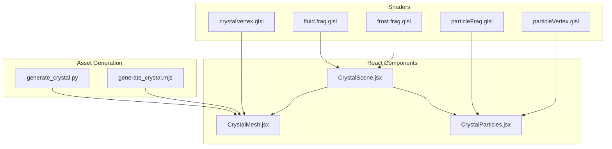
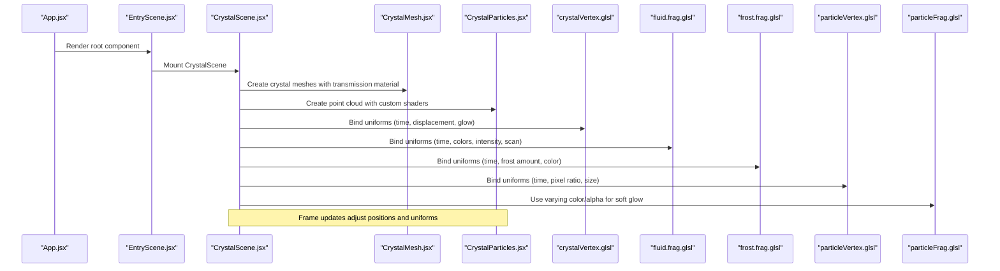
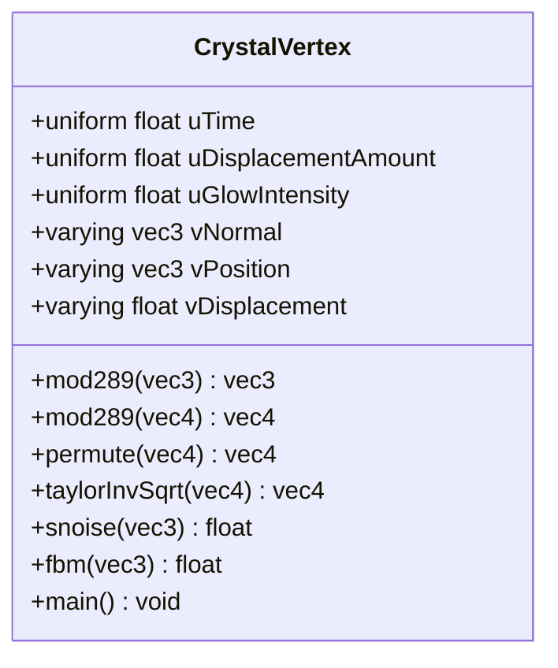
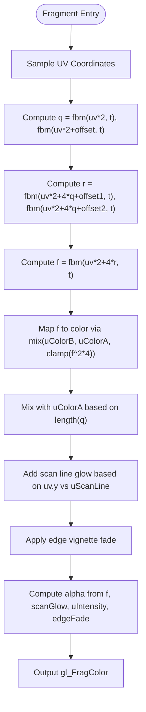
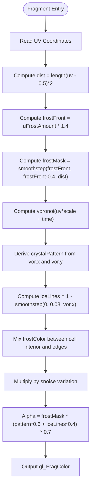
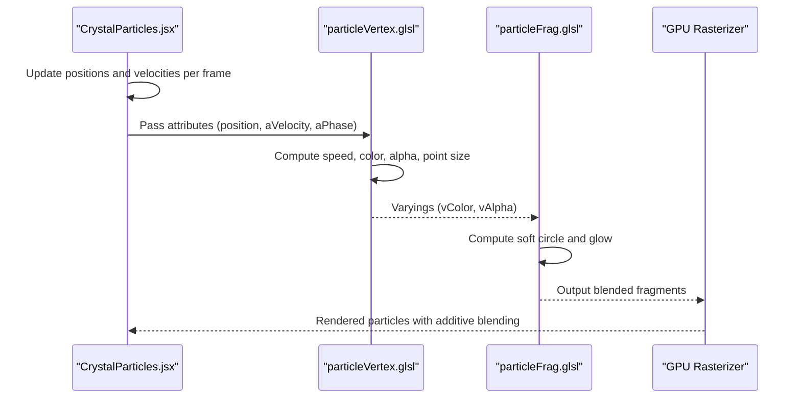
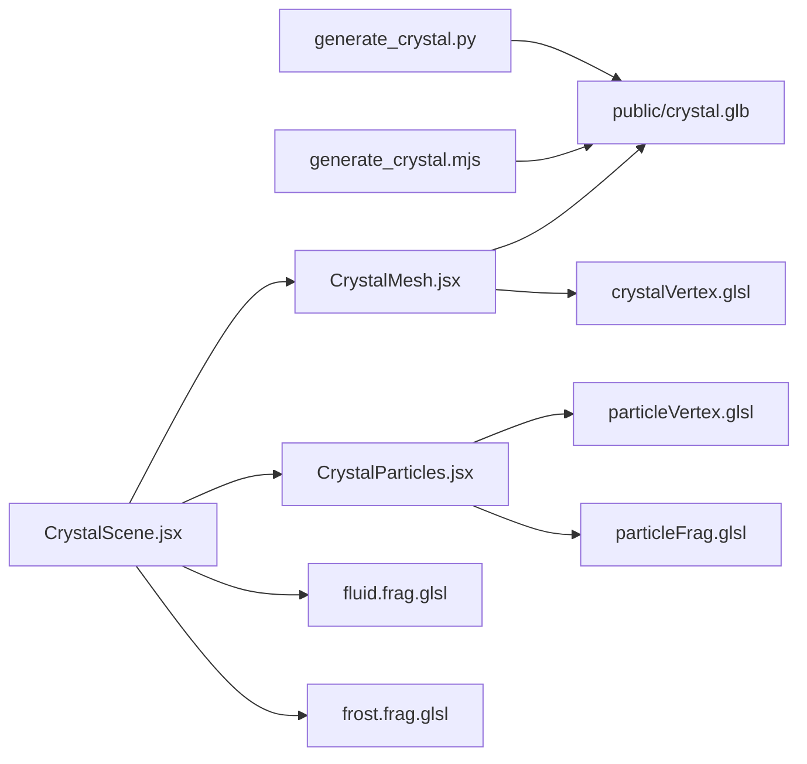

# Custom GLSL Shaders

<cite>
**Referenced Files in This Document**
- [crystalVertex.glsl](file://frontend/src/components/crystal/shaders/crystalVertex.glsl)
- [fluid.frag.glsl](file://frontend/src/components/crystal/shaders/fluid.frag.glsl)
- [frost.frag.glsl](file://frontend/src/components/crystal/shaders/frost.frag.glsl)
- [particleFrag.glsl](file://frontend/src/components/crystal/shaders/particleFrag.glsl)
- [particleVertex.glsl](file://frontend/src/components/crystal/shaders/particleVertex.glsl)
- [CrystalMesh.jsx](file://frontend/src/components/crystal/CrystalMesh.jsx)
- [CrystalParticles.jsx](file://frontend/src/components/crystal/CrystalParticles.jsx)
- [CrystalScene.jsx](file://frontend/src/components/crystal/CrystalScene.jsx)
- [generate_crystal.py](file://frontend/scripts/generate_crystal.py)
- [generate_crystal.mjs](file://frontend/scripts/generate_crystal.mjs)
</cite>

## Table of Contents
1. [Introduction](#introduction)
2. [Project Structure](#project-structure)
3. [Core Components](#core-components)
4. [Architecture Overview](#architecture-overview)
5. [Detailed Component Analysis](#detailed-component-analysis)
6. [Dependency Analysis](#dependency-analysis)
7. [Performance Considerations](#performance-considerations)
8. [Troubleshooting Guide](#troubleshooting-guide)
9. [Conclusion](#conclusion)
10. [Appendices](#appendices)

## Introduction
This document explains the custom GLSL shader system used to create advanced visual effects for the crystal and particle visuals in the project. It covers:
- Vertex displacement using fractal Brownian motion (FBM) noise to produce organic crystal irregularity
- A fluid-like fragment shader simulating dynamic, time-based color blending for Gatherer zone shaft walls
- A frost spread effect driven by growth algorithms and opacity transitions for synthesis events
- Particle shaders that implement size attenuation, velocity-based color interpolation, and alpha blending

The documentation includes mathematical concepts behind the algorithms, performance considerations, debugging techniques, and guidance on modifying parameters and optimizing shaders across hardware capabilities.

## Project Structure
The shader system is implemented as a set of GLSL files integrated into React Three Fiber components. The core assets include:
- Vertex and fragment shaders for crystals, fluids, frost, and particles
- React components that instantiate geometry, bind uniforms, and drive animation frames
- Scripts that generate the crystal mesh assets used at runtime

**Diagram sources**
- [crystalVertex.glsl:1-87](file://frontend/src/components/crystal/shaders/crystalVertex.glsl#L1-L87)
- [fluid.frag.glsl:1-106](file://frontend/src/components/crystal/shaders/fluid.frag.glsl#L1-L106)
- [frost.frag.glsl:1-110](file://frontend/src/components/crystal/shaders/frost.frag.glsl#L1-L110)
- [particleFrag.glsl:1-19](file://frontend/src/components/crystal/shaders/particleFrag.glsl#L1-L19)
- [particleVertex.glsl:1-33](file://frontend/src/components/crystal/shaders/particleVertex.glsl#L1-L33)
- [CrystalMesh.jsx:1-103](file://frontend/src/components/crystal/CrystalMesh.jsx#L1-L103)
- [CrystalParticles.jsx:1-130](file://frontend/src/components/crystal/CrystalParticles.jsx#L1-L130)
- [CrystalScene.jsx:1-116](file://frontend/src/components/crystal/CrystalScene.jsx#L1-L116)
- [generate_crystal.py:1-110](file://frontend/scripts/generate_crystal.py#L1-L110)
- [generate_crystal.mjs:1-217](file://frontend/scripts/generate_crystal.mjs#L1-L217)

**Section sources**
- [crystalVertex.glsl:1-87](file://frontend/src/components/crystal/shaders/crystalVertex.glsl#L1-L87)
- [fluid.frag.glsl:1-106](file://frontend/src/components/crystal/shaders/fluid.frag.glsl#L1-L106)
- [frost.frag.glsl:1-110](file://frontend/src/components/crystal/shaders/frost.frag.glsl#L1-L110)
- [particleFrag.glsl:1-19](file://frontend/src/components/crystal/shaders/particleFrag.glsl#L1-L19)
- [particleVertex.glsl:1-33](file://frontend/src/components/crystal/shaders/particleVertex.glsl#L1-L33)
- [CrystalMesh.jsx:1-103](file://frontend/src/components/crystal/CrystalMesh.jsx#L1-L103)
- [CrystalParticles.jsx:1-130](file://frontend/src/components/crystal/CrystalParticles.jsx#L1-L130)
- [CrystalScene.jsx:1-116](file://frontend/src/components/crystal/CrystalScene.jsx#L1-L116)
- [generate_crystal.py:1-110](file://frontend/scripts/generate_crystal.py#L1-L110)
- [generate_crystal.mjs:1-217](file://frontend/scripts/generate_crystal.mjs#L1-L217)

## Core Components
- Crystal vertex shader applies FBM noise along normals to create organic irregularity controlled by a displacement uniform.
- Fluid fragment shader uses domain-warped FBM to simulate turbulent fluid dynamics with time-driven color blending and a scanning line effect.
- Frost fragment shader generates Voronoi-based ice patterns that grow outward from the center based on an animated amount parameter.
- Particle shaders compute per-particle color and alpha from velocity attributes and apply size attenuation for realistic depth behavior.

Key integration points:
- CrystalMesh.jsx loads and renders the generated crystal GLB, applying transmission materials and rotation animations.
- CrystalParticles.jsx drives a GPU-accelerated point cloud with custom vertex/fragment shaders and additive blending.
- CrystalScene.jsx sets up lighting, post-processing, and quality detection to adapt rendering parameters.

**Section sources**
- [crystalVertex.glsl:1-87](file://frontend/src/components/crystal/shaders/crystalVertex.glsl#L1-L87)
- [fluid.frag.glsl:1-106](file://frontend/src/components/crystal/shaders/fluid.frag.glsl#L1-L106)
- [frost.frag.glsl:1-110](file://frontend/src/components/crystal/shaders/frost.frag.glsl#L1-L110)
- [particleFrag.glsl:1-19](file://frontend/src/components/crystal/shaders/particleFrag.glsl#L1-L19)
- [particleVertex.glsl:1-33](file://frontend/src/components/crystal/shaders/particleVertex.glsl#L1-L33)
- [CrystalMesh.jsx:1-103](file://frontend/src/components/crystal/CrystalMesh.jsx#L1-L103)
- [CrystalParticles.jsx:1-130](file://frontend/src/components/crystal/CrystalParticles.jsx#L1-L130)
- [CrystalScene.jsx:1-116](file://frontend/src/components/crystal/CrystalScene.jsx#L1-L116)

## Architecture Overview
The rendering pipeline integrates React Three Fiber with custom GLSL shaders. Geometry is provided by pre-generated GLB assets and dynamically updated buffers for particles. Post-processing enhances the final image.

**Diagram sources**
- [App.jsx:1-42](file://frontend/src/App.jsx#L1-L42)
- [EntryScene.jsx:1-8](file://frontend/src/scenes/EntryScene.jsx#L1-L8)
- [CrystalScene.jsx:1-116](file://frontend/src/components/crystal/CrystalScene.jsx#L1-L116)
- [CrystalMesh.jsx:1-103](file://frontend/src/components/crystal/CrystalMesh.jsx#L1-L103)
- [CrystalParticles.jsx:1-130](file://frontend/src/components/crystal/CrystalParticles.jsx#L1-L130)
- [crystalVertex.glsl:1-87](file://frontend/src/components/crystal/shaders/crystalVertex.glsl#L1-L87)
- [fluid.frag.glsl:1-106](file://frontend/src/components/crystal/shaders/fluid.frag.glsl#L1-L106)
- [frost.frag.glsl:1-110](file://frontend/src/components/crystal/shaders/frost.frag.glsl#L1-L110)
- [particleVertex.glsl:1-33](file://frontend/src/components/crystal/shaders/particleVertex.glsl#L1-L33)
- [particleFrag.glsl:1-19](file://frontend/src/components/crystal/shaders/particleFrag.glsl#L1-L19)

## Detailed Component Analysis

### Crystal Vertex Shader (crystalVertex.glsl)
Purpose:
- Displace vertices along their normals using FBM noise to create organic, raw crystalline irregularity.
- Control displacement magnitude via a uniform; zero displacement yields a perfect crystal shape.

Mathematical concepts:
- Perlin-like 3D noise function (snoise) provides smooth pseudo-random values.
- Fractal Brownian Motion (FBM) sums multiple octaves of noise with decreasing amplitude and increasing frequency to produce jaggedness.
- Time is subtly included to animate noise sampling.

Implementation highlights:
- Noise utilities implement modular arithmetic and permutation functions for stable hashing.
- FBM loop iterates over several octaves, accumulating weighted noise contributions.
- Displacement is computed as noise scaled by a uniform and applied along the normal vector.

Performance considerations:
- FBM with multiple octaves can be expensive; tune octave count and frequency scaling for target devices.
- Avoid excessive texture lookups or branching inside loops.

Debugging tips:
- Visualize vDisplacement to confirm displacement magnitude distribution.
- Temporarily reduce octave count to isolate noise artifacts.

Modification examples:
- Increase uDisplacementAmount to amplify roughness.
- Adjust frequency multipliers in FBM to change detail scale.
- Add additional time-dependent terms for subtle breathing effects.

**Section sources**
- [crystalVertex.glsl:1-87](file://frontend/src/components/crystal/shaders/crystalVertex.glsl#L1-L87)

#### Class Diagram (Shader Functions)

**Diagram sources**
- [crystalVertex.glsl:1-87](file://frontend/src/components/crystal/shaders/crystalVertex.glsl#L1-L87)

### Fluid Fragment Shader (fluid.frag.glsl)
Purpose:
- Simulate turbulent fluid dynamics for Gatherer zone shaft walls, making surfaces feel alive with disturbed water or liquefied data aesthetics.

Mathematical concepts:
- Domain warping: UV coordinates are distorted by noise before sampling noise again, creating complex flow patterns.
- FBM accumulates noise across multiple octaves to enrich turbulence.
- Color mixing blends two base colors based on noise-derived intensity.

Implementation highlights:
- Two-stage domain warping computes q and r vectors from FBM outputs.
- Final field f combines warped inputs to produce organic variation.
- Scan line effect adds a bright horizontal band sweeping vertically over time.
- Edge vignette increases glow near top edges where crystal enters.

Performance considerations:
- Multiple FBM evaluations per pixel are costly; consider reducing octaves or resolution on low-end devices.
- Clamp operations and smoothstep are efficient but should be used judiciously.

Debugging tips:
- Output intermediate fields (q, r, f) to visualize distortion and intensity.
- Reduce uIntensity to isolate structural artifacts.

Modification examples:
- Change uColorA/uColorB to alter palette.
- Adjust uScanLine speed and width for different sweep behaviors.
- Modify warp coefficients to intensify or soften turbulence.

**Section sources**
- [fluid.frag.glsl:1-106](file://frontend/src/components/crystal/shaders/fluid.frag.glsl#L1-L106)

#### Flowchart (Domain Warping Algorithm)

**Diagram sources**
- [fluid.frag.glsl:1-106](file://frontend/src/components/crystal/shaders/fluid.frag.glsl#L1-L106)

### Frost Fragment Shader (frost.frag.glsl)
Purpose:
- Implement frost spread effects for synthesis events, growing outward from contact points with ice crystal patterns and opacity transitions.

Mathematical concepts:
- Voronoi pattern generation creates cell structures typical of ice crystals.
- Distance-based masking controls growth front using smoothstep thresholds.
- Noise variation adds subtle internal texture within cells.

Implementation highlights:
- Voronoi function computes nearest neighbor distances and dot products to derive cell edges.
- Frost mask advances with uFrostAmount, producing a smooth leading edge.
- Ice lines highlight cell boundaries; interior remains dimmer.
- Alpha combines crystal pattern and ice lines modulated by frost mask.

Performance considerations:
- Voronoi search over neighboring cells is constant-time but still involves multiple distance computations.
- Keep texture resolutions reasonable; avoid excessive subdivisions.

Debugging tips:
- Visualize vor.x and vor.y separately to inspect cell structure.
- Temporarily disable noise variation to verify frost mask behavior.

Modification examples:
- Increase uFrostAmount speed for faster coverage.
- Adjust voronoi scale factor to refine or coarsen ice patterns.
- Tweak ice line threshold to emphasize edges.

**Section sources**
- [frost.frag.glsl:1-110](file://frontend/src/components/crystal/shaders/frost.frag.glsl#L1-L110)

#### Flowchart (Frost Growth Algorithm)

**Diagram sources**
- [frost.frag.glsl:1-110](file://frontend/src/components/crystal/shaders/frost.frag.glsl#L1-L110)

### Particle Shaders (particleVertex.glsl, particleFrag.glsl)
Purpose:
- Render realistic particle behavior with velocity-based coloring, size attenuation, and soft glowing appearance.

Mathematical concepts:
- Size attenuation scales point size inversely with view-space depth.
- Velocity magnitude maps to a color gradient representing slow vs fast particles.
- Alpha blending with additive mode produces luminous glow effects.

Implementation highlights:
- Vertex shader computes normalized speed and interpolates between slow and fast colors.
- Alpha pulsation combines speed and per-particle phase with time.
- Fragment shader creates a soft circle with exponential glow falloff.

Performance considerations:
- Additive blending avoids depth sorting issues but can overdraw; limit particle count if needed.
- Ensure buffer updates are minimal; update only necessary attributes per frame.

Debugging tips:
- Visualize aVelocity magnitudes to confirm velocity distribution.
- Temporarily disable glow term to isolate circle shape.

Modification examples:
- Adjust uSize to scale particle appearance.
- Modify color gradients for different thematic palettes.
- Tune glow exponent to control halo size.

**Section sources**
- [particleVertex.glsl:1-33](file://frontend/src/components/crystal/shaders/particleVertex.glsl#L1-L33)
- [particleFrag.glsl:1-19](file://frontend/src/components/crystal/shaders/particleFrag.glsl#L1-L19)

#### Sequence Diagram (Particle Rendering)

**Diagram sources**
- [CrystalParticles.jsx:1-130](file://frontend/src/components/crystal/CrystalParticles.jsx#L1-L130)
- [particleVertex.glsl:1-33](file://frontend/src/components/crystal/shaders/particleVertex.glsl#L1-L33)
- [particleFrag.glsl:1-19](file://frontend/src/components/crystal/shaders/particleFrag.glsl#L1-L19)

## Dependency Analysis
The shader system depends on:
- Pre-generated crystal geometry (GLB) created by Python and Node scripts
- React components binding uniforms and managing frame updates
- Post-processing effects enhancing final output

**Diagram sources**
- [generate_crystal.py:1-110](file://frontend/scripts/generate_crystal.py#L1-L110)
- [generate_crystal.mjs:1-217](file://frontend/scripts/generate_crystal.mjs#L1-L217)
- [CrystalMesh.jsx:1-103](file://frontend/src/components/crystal/CrystalMesh.jsx#L1-L103)
- [CrystalScene.jsx:1-116](file://frontend/src/components/crystal/CrystalScene.jsx#L1-L116)
- [CrystalParticles.jsx:1-130](file://frontend/src/components/crystal/CrystalParticles.jsx#L1-L130)
- [crystalVertex.glsl:1-87](file://frontend/src/components/crystal/shaders/crystalVertex.glsl#L1-L87)
- [fluid.frag.glsl:1-106](file://frontend/src/components/crystal/shaders/fluid.frag.glsl#L1-L106)
- [frost.frag.glsl:1-110](file://frontend/src/components/crystal/shaders/frost.frag.glsl#L1-L110)
- [particleVertex.glsl:1-33](file://frontend/src/components/crystal/shaders/particleVertex.glsl#L1-L33)
- [particleFrag.glsl:1-19](file://frontend/src/components/crystal/shaders/particleFrag.glsl#L1-L19)

**Section sources**
- [generate_crystal.py:1-110](file://frontend/scripts/generate_crystal.py#L1-L110)
- [generate_crystal.mjs:1-217](file://frontend/scripts/generate_crystal.mjs#L1-L217)
- [CrystalMesh.jsx:1-103](file://frontend/src/components/crystal/CrystalMesh.jsx#L1-L103)
- [CrystalScene.jsx:1-116](file://frontend/src/components/crystal/CrystalScene.jsx#L1-L116)
- [CrystalParticles.jsx:1-130](file://frontend/src/components/crystal/CrystalParticles.jsx#L1-L130)

## Performance Considerations
- FBM complexity: Each FBM call performs multiple noise evaluations; reduce octaves or frequency scaling on lower-end GPUs.
- Texture resolution: Lower sample counts and render resolution for transmission materials on constrained devices.
- Post-processing: Disable or reduce effects like DepthOfField on low-end hardware.
- Particle count: Limit PARTICLE_COUNT if frame rate drops due to overdraw.
- Uniform updates: Batch uniform updates per frame to minimize CPU-GPU sync overhead.

[No sources needed since this section provides general guidance]

## Troubleshooting Guide
Common issues and solutions:
- Excessive flickering in particle alpha: Verify phase offsets and ensure consistent time updates.
- Artifacts in crystal displacement: Check normal direction and ensure sufficient mesh subdivision.
- Fluid shader appears too dark: Adjust uIntensity and color uniforms; validate domain warping parameters.
- Frost not spreading: Confirm uFrostAmount animation and smoothstep thresholds.
- Low frame rates: Reduce FBM octaves, lower particle count, and disable expensive post-processing effects.

Debugging techniques:
- Output intermediate values (e.g., noise fields, masks) to isolate problematic stages.
- Use browser developer tools to inspect WebGL state and shader compilation errors.
- Temporarily simplify shaders to identify bottlenecks.

**Section sources**
- [crystalVertex.glsl:1-87](file://frontend/src/components/crystal/shaders/crystalVertex.glsl#L1-L87)
- [fluid.frag.glsl:1-106](file://frontend/src/components/crystal/shaders/fluid.frag.glsl#L1-L106)
- [frost.frag.glsl:1-110](file://frontend/src/components/crystal/shaders/frost.frag.glsl#L1-L110)
- [particleVertex.glsl:1-33](file://frontend/src/components/crystal/shaders/particleVertex.glsl#L1-L33)
- [particleFrag.glsl:1-19](file://frontend/src/components/crystal/shaders/particleFrag.glsl#L1-L19)
- [CrystalParticles.jsx:1-130](file://frontend/src/components/crystal/CrystalParticles.jsx#L1-L130)

## Conclusion
The custom GLSL shader system delivers rich visual effects through sophisticated noise-based algorithms and real-time animations. By understanding the mathematical foundations and implementation details, developers can modify parameters, create new effects, and optimize performance across diverse hardware. The modular architecture separates concerns between geometry generation, shader logic, and React integration, enabling maintainable and extensible visual enhancements.

[No sources needed since this section summarizes without analyzing specific files]

## Appendices

### Modifying Shader Parameters
- Crystal vertex: Adjust uDisplacementAmount and FBM frequency/amplitude for desired roughness.
- Fluid fragment: Tweak uColorA/B, uIntensity, and scan line parameters for aesthetic control.
- Frost fragment: Animate uFrostAmount smoothly and adjust Voronoi scale for ice density.
- Particles: Modify uSize, color gradients, and glow exponent for visual consistency.

### Creating New Visual Effects
- Extend existing noise functions with additional octaves or time dependencies.
- Combine multiple FBM layers for complex textures.
- Introduce new uniforms for user-controlled parameters.
- Test effects incrementally by isolating components and visualizing intermediates.

### Optimizing Shader Performance
- Reduce FBM octaves and texture lookups.
- Use early exits and conditional branches sparingly.
- Leverage hardware-specific features when available.
- Profile with WebGL inspectors to identify bottlenecks.

[No sources needed since this section provides general guidance]