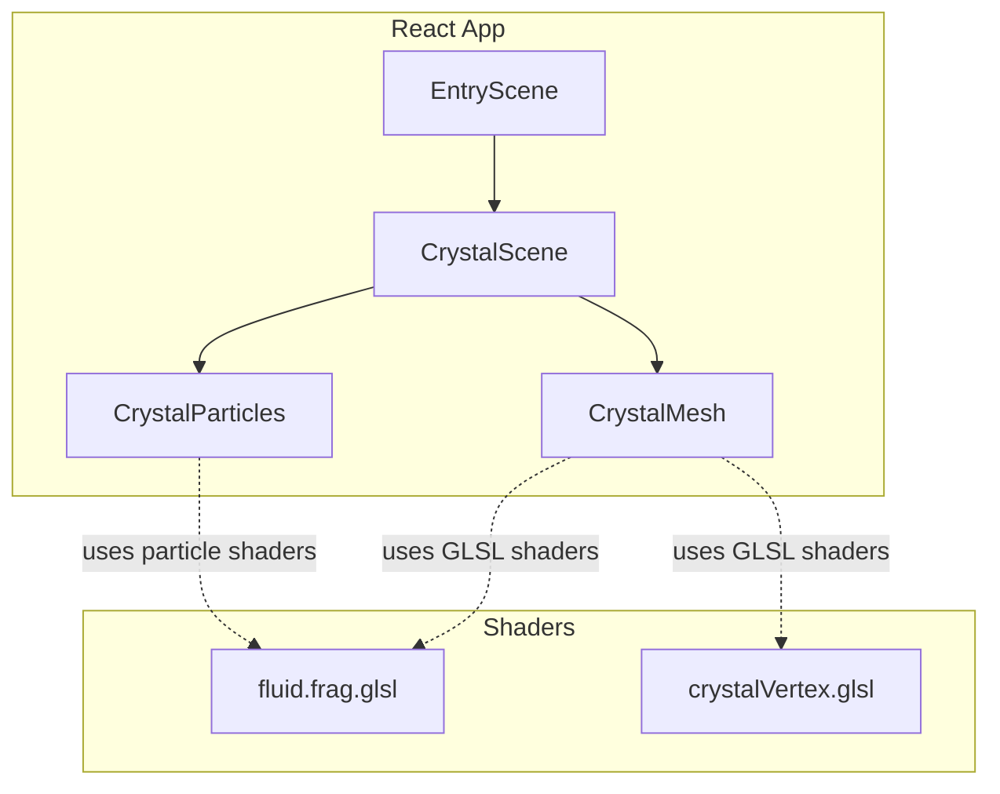
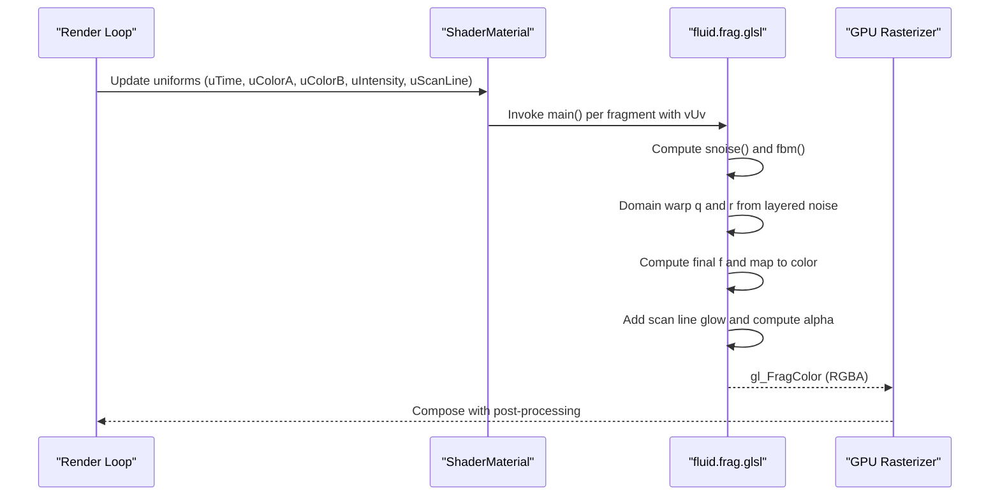
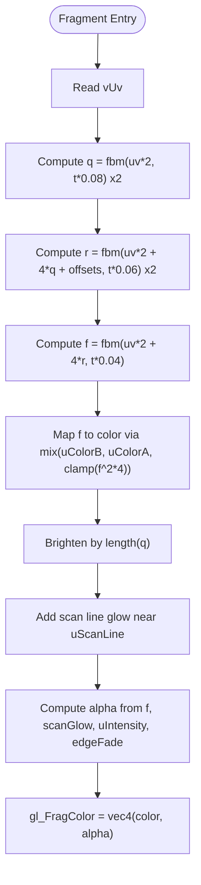
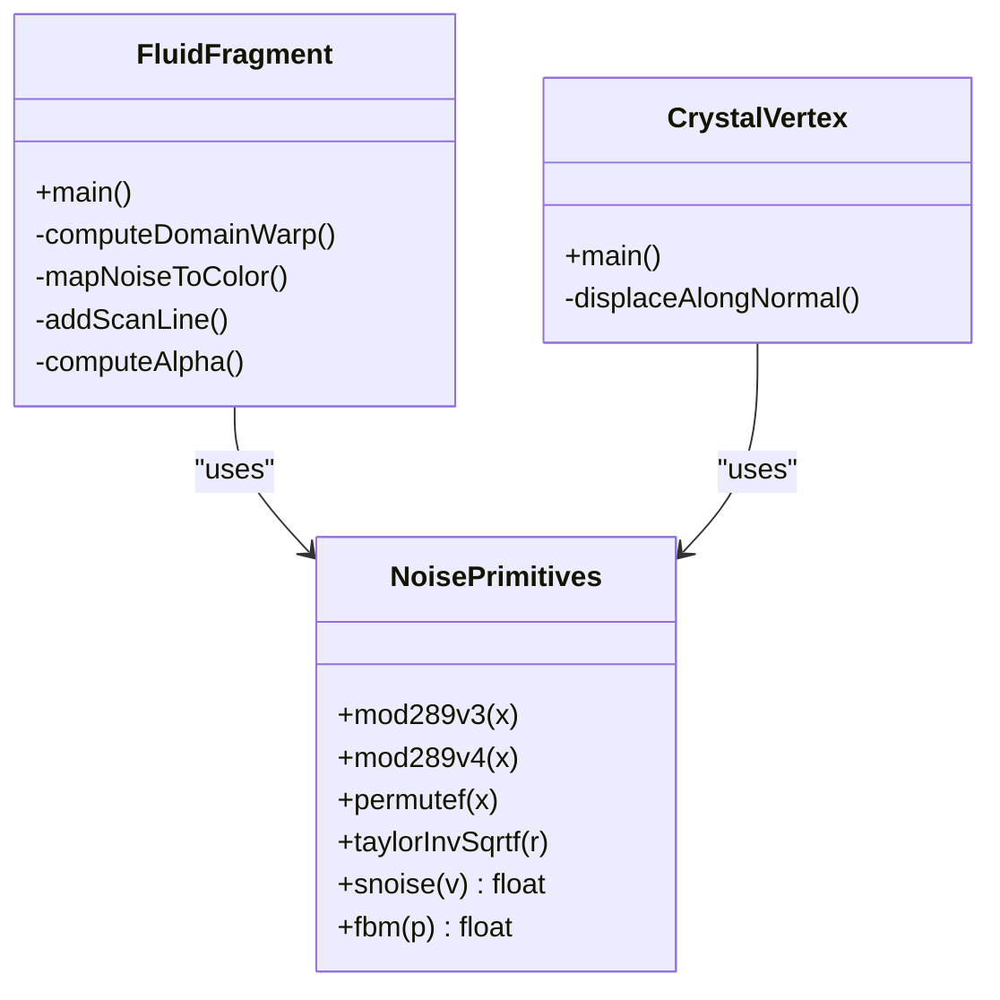
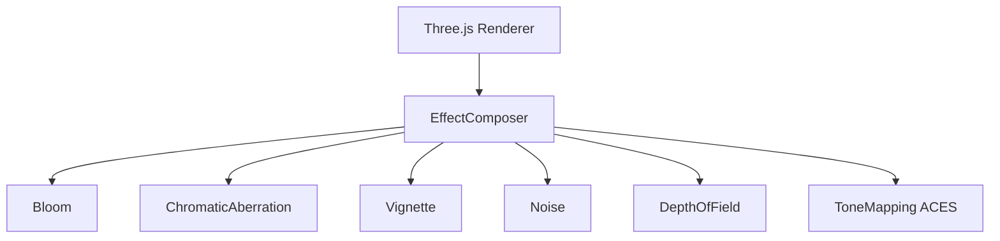
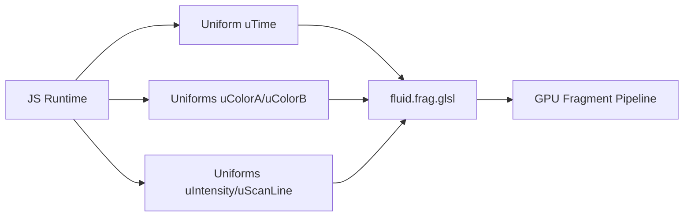

# Fluid Fragment Shader

<cite>
**Referenced Files in This Document**
- [fluid.frag.glsl](file://frontend/src/components/crystal/shaders/fluid.frag.glsl)
- [crystalVertex.glsl](file://frontend/src/components/crystal/shaders/crystalVertex.glsl)
- [CrystalParticles.jsx](file://frontend/src/components/crystal/CrystalParticles.jsx)
- [CrystalScene.jsx](file://frontend/src/components/crystal/CrystalScene.jsx)
- [CrystalMesh.jsx](file://frontend/src/components/crystal/CrystalMesh.jsx)
</cite>

## Table of Contents
1. [Introduction](#introduction)
2. [Project Structure](#project-structure)
3. [Core Components](#core-components)
4. [Architecture Overview](#architecture-overview)
5. [Detailed Component Analysis](#detailed-component-analysis)
6. [Dependency Analysis](#dependency-analysis)
7. [Performance Considerations](#performance-considerations)
8. [Troubleshooting Guide](#troubleshooting-guide)
9. [Conclusion](#conclusion)
10. [Appendices](#appendices)

## Introduction
This document explains the fluid fragment shader that simulates turbulent, time-driven liquid effects for Gatherer zone shaft walls. It focuses on how the shader creates flowing liquid visuals through domain-warped noise, color blending, and a sweeping scan-line effect. It also details the mathematical models used (Perlin noise, fractal Brownian motion), the uniform parameters controlling behavior, and practical guidance for performance optimization, debugging, and customization.

## Project Structure
The fluid shader is part of a React Three Fiber scene. The shader file defines the fragment logic; related vertex displacement uses a separate vertex shader. The surrounding components manage rendering, uniforms, and post-processing.

**Diagram sources**
- [fluid.frag.glsl:1-106](file://frontend/src/components/crystal/shaders/fluid.frag.glsl#L1-L106)
- [crystalVertex.glsl:1-87](file://frontend/src/components/crystal/shaders/crystalVertex.glsl#L1-L87)
- [CrystalParticles.jsx:1-130](file://frontend/src/components/crystal/CrystalParticles.jsx#L1-L130)
- [CrystalScene.jsx:1-116](file://frontend/src/components/crystal/CrystalScene.jsx#L1-L116)
- [CrystalMesh.jsx:1-103](file://frontend/src/components/crystal/CrystalMesh.jsx#L1-L103)

**Section sources**
- [fluid.frag.glsl:1-106](file://frontend/src/components/crystal/shaders/fluid.frag.glsl#L1-L106)
- [crystalVertex.glsl:1-87](file://frontend/src/components/crystal/shaders/crystalVertex.glsl#L1-L87)
- [CrystalParticles.jsx:1-130](file://frontend/src/components/crystal/CrystalParticles.jsx#L1-L130)
- [CrystalScene.jsx:1-116](file://frontend/src/components/crystal/CrystalScene.jsx#L1-L116)
- [CrystalMesh.jsx:1-103](file://frontend/src/components/crystal/CrystalMesh.jsx#L1-L103)

## Core Components
- Fluid fragment shader: Implements domain-warped turbulence using layered Perlin noise and fractal Brownian motion to produce organic flow patterns. It blends two colors based on noise amplitude, adds a moving scan line glow, and computes alpha with edge vignetting.
- Vertex shader: Displaces geometry with FBM noise to create irregular crystalline surfaces. While not the fluid shader itself, it shares the same noise primitives and demonstrates the project’s approach to procedural animation.
- Particle system: Updates positions per frame and passes time uniforms to its own shaders, illustrating the pattern used to animate GPU-side visuals over time.
- Scene composition: Sets up lighting, environment, and post-processing effects that influence perceived fluid brightness and contrast.

Key responsibilities:
- Procedural noise generation and layering (snoise + fbm).
- Domain warping to simulate wave propagation and turbulence.
- Color interpolation and alpha compositing for depth-like shading.
- Time-based animation via uTime and other uniforms.

**Section sources**
- [fluid.frag.glsl:1-106](file://frontend/src/components/crystal/shaders/fluid.frag.glsl#L1-L106)
- [crystalVertex.glsl:1-87](file://frontend/src/components/crystal/shaders/crystalVertex.glsl#L1-L87)
- [CrystalParticles.jsx:1-130](file://frontend/src/components/crystal/CrystalParticles.jsx#L1-L130)
- [CrystalScene.jsx:1-116](file://frontend/src/components/crystal/CrystalScene.jsx#L1-L116)

## Architecture Overview
The fluid effect is computed entirely in the fragment shader. Inputs include UV coordinates, time, and several uniforms. Outputs are an RGBA color suitable for blending into the scene.

**Diagram sources**
- [fluid.frag.glsl:1-106](file://frontend/src/components/crystal/shaders/fluid.frag.glsl#L1-L106)

## Detailed Component Analysis

### Fluid Fragment Shader: Mathematical Model and Flow
- Noise primitives: A classic 3D Perlin noise implementation is provided, including permutation and gradient helpers.
- Fractal Brownian Motion (FBM): Six octaves of noise are summed with decreasing amplitude and increasing frequency to generate multi-scale detail.
- Domain Warping: Two layers of warped noise (q and r) distort the sampling space before computing the final field f, producing organic, swirling flow.
- Color Mapping: The scalar field f is squared and scaled to control intensity, then blended between two base colors. An additional blend uses the magnitude of q to brighten regions where distortion is high.
- Scan Line Effect: A horizontal band sweeps vertically based on uScanLine, adding a bright streak that enhances the “liquid data” feel.
- Alpha and Edge Vignette: Alpha combines noise contribution, scan glow, and a vertical vignette to emphasize top/bottom edges, creating depth cues.

**Diagram sources**
- [fluid.frag.glsl:75-105](file://frontend/src/components/crystal/shaders/fluid.frag.glsl#L75-L105)

**Section sources**
- [fluid.frag.glsl:16-73](file://frontend/src/components/crystal/shaders/fluid.frag.glsl#L16-L73)
- [fluid.frag.glsl:75-105](file://frontend/src/components/crystal/shaders/fluid.frag.glsl#L75-L105)

### Uniform Parameters and Controls
- uTime: Global time in seconds driving animation speed and phase shifts across noise layers.
- uColorA: Primary highlight/glow color.
- uColorB: Base dark color for deep regions.
- uIntensity: Master opacity/visibility control (0.0 off, 1.0 full).
- uScanLine: Vertical position (0–1) of the sweeping bright band.

These parameters allow tuning flow speed (via uTime scaling inside noise calls), visual intensity (uIntensity), color schemes (uColorA/uColorB), and dynamic scanning effects (uScanLine).

**Section sources**
- [fluid.frag.glsl:5-9](file://frontend/src/components/crystal/shaders/fluid.frag.glsl#L5-L9)

### Shared Noise Primitives and Vertex Displacement
The vertex shader demonstrates the same noise building blocks used in the fragment shader, showing how FBM can displace geometry over time. This establishes consistency across surface deformation and fluid appearance.

**Diagram sources**
- [fluid.frag.glsl:16-73](file://frontend/src/components/crystal/shaders/fluid.frag.glsl#L16-L73)
- [crystalVertex.glsl:14-73](file://frontend/src/components/crystal/shaders/crystalVertex.glsl#L14-L73)

**Section sources**
- [crystalVertex.glsl:1-87](file://frontend/src/components/crystal/shaders/crystalVertex.glsl#L1-L87)

### Integration with Scene and Post-Processing
The scene sets tone mapping, bloom, chromatic aberration, vignette, noise, and optional depth of field. These effects interact with the fluid shader’s output to enhance perceived luminance and realism.

**Diagram sources**
- [CrystalScene.jsx:55-86](file://frontend/src/components/crystal/CrystalScene.jsx#L55-L86)

**Section sources**
- [CrystalScene.jsx:1-116](file://frontend/src/components/crystal/CrystalScene.jsx#L1-L116)

## Dependency Analysis
- The fluid shader depends only on GLSL built-ins and its internal noise functions. No external textures or buffers are required.
- Animation is driven by uTime, typically updated each frame by the host application loop.
- Color and intensity are controlled via uniforms passed from JavaScript materials.

**Diagram sources**
- [fluid.frag.glsl:5-9](file://frontend/src/components/crystal/shaders/fluid.frag.glsl#L5-L9)

**Section sources**
- [fluid.frag.glsl:5-9](file://frontend/src/components/crystal/shaders/fluid.frag.glsl#L5-L9)

## Performance Considerations
- Reduce FBM octaves: Lowering the number of noise iterations reduces arithmetic cost.
- Scale time slower: Smaller time multipliers reduce oscillation frequency without changing complexity.
- Limit resolution: Use lower render targets or DPR when targeting low-end devices.
- Avoid expensive operations: Keep math minimal; avoid branching inside tight loops.
- Batch updates: Update uniforms once per frame rather than per object if possible.
- Post-processing balance: Tune bloom and DOF intensities to avoid overdraw and extra passes.

[No sources needed since this section provides general guidance]

## Troubleshooting Guide
- No visible fluid: Verify uIntensity is non-zero and uColorA differs from uColorB. Ensure the material is attached to a visible mesh and blending is enabled.
- Too fast/slow animation: Adjust uTime scaling factors within the shader or update rate from JS.
- Flat or static look: Increase domain warp strength by modifying coefficients in the noise sampling paths.
- Banding or artifacts: Increase precision or reduce contrast in color mapping; ensure proper tone mapping and exposure settings.
- Low FPS: Reduce FBM octaves, lower resolution/DPR, and simplify post-processing effects.

**Section sources**
- [fluid.frag.glsl:5-9](file://frontend/src/components/crystal/shaders/fluid.frag.glsl#L5-L9)
- [CrystalScene.jsx:55-86](file://frontend/src/components/crystal/CrystalScene.jsx#L55-L86)

## Conclusion
The fluid fragment shader delivers a compelling, time-driven liquid effect using domain-warped Perlin noise and FBM. Its simplicity and reliance on procedural math make it efficient and highly customizable. By adjusting uniforms and post-processing, you can tailor the fluid’s appearance and performance to different environments and device capabilities.

[No sources needed since this section summarizes without analyzing specific files]

## Appendices

### Customization Options
- Change color scheme: Modify uColorA and uColorB to match different liquids (e.g., bioluminescent vs. metallic).
- Control viscosity: Slow down time multipliers to simulate thicker fluids; increase them for faster flow.
- Adjust scan line: Move uScanLine to target specific wall regions; tune smoothstep thresholds for softer/harder bands.
- Depth shading: Tweak the alpha formula to emphasize thickness or translucency.

**Section sources**
- [fluid.frag.glsl:5-9](file://frontend/src/components/crystal/shaders/fluid.frag.glsl#L5-L9)
- [fluid.frag.glsl:75-105](file://frontend/src/components/crystal/shaders/fluid.frag.glsl#L75-L105)