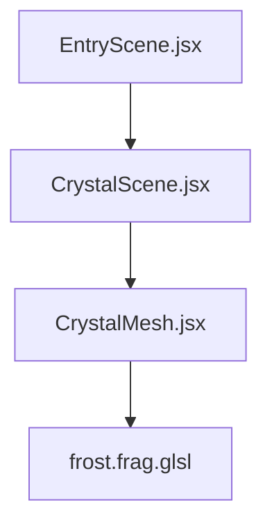
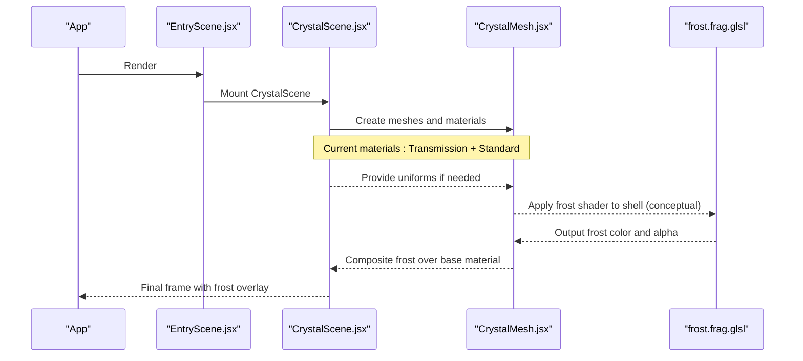
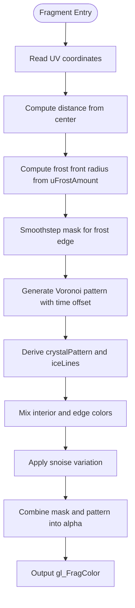
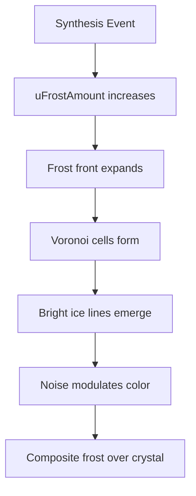
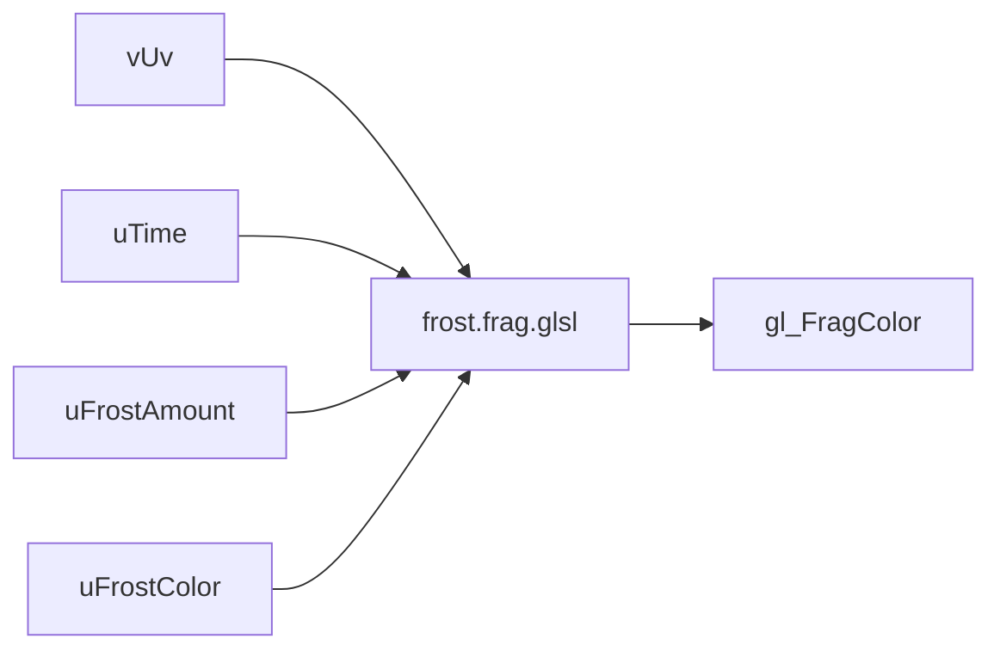

# Frost Fragment Shader

<cite>
**Referenced Files in This Document**
- [frost.frag.glsl](file://frontend/src/components/crystal/shaders/frost.frag.glsl)
- [CrystalMesh.jsx](file://frontend/src/components/crystal/CrystalMesh.jsx)
- [CrystalScene.jsx](file://frontend/src/components/crystal/CrystalScene.jsx)
- [EntryScene.jsx](file://frontend/src/scenes/EntryScene.jsx)
- [ATLASRESEARCH_MASTER.md](file://ATLASRESEARCH_MASTER.md)
</cite>

## Table of Contents
1. [Introduction](#introduction)
2. [Project Structure](#project-structure)
3. [Core Components](#core-components)
4. [Architecture Overview](#architecture-overview)
5. [Detailed Component Analysis](#detailed-component-analysis)
6. [Dependency Analysis](#dependency-analysis)
7. [Performance Considerations](#performance-considerations)
8. [Troubleshooting Guide](#troubleshooting-guide)
9. [Conclusion](#conclusion)
10. [Appendices](#appendices)

## Introduction
This document explains the frost fragment shader that renders natural-looking frost spread effects for synthesis events on a crystal surface. It covers the growth algorithms (Voronoi-based patterns and noise-driven variation), opacity transitions, uniform parameters, optimization techniques, debugging strategies, and customization options for different synthesis stages and environmental conditions.

## Project Structure
The frost effect is implemented as a GLSL fragment shader and intended to be applied to a mesh material within the React Three Fiber scene. The relevant files include:
- The fragment shader implementing frost pattern generation and opacity transitions
- The 3D scene components that host the crystal geometry and materials
- The entry scene wiring the rendering pipeline

**Diagram sources**
- [EntryScene.jsx:1-8](file://frontend/src/scenes/EntryScene.jsx#L1-L8)
- [CrystalScene.jsx:1-116](file://frontend/src/components/crystal/CrystalScene.jsx#L1-L116)
- [CrystalMesh.jsx:1-103](file://frontend/src/components/crystal/CrystalMesh.jsx#L1-L103)
- [frost.frag.glsl:1-110](file://frontend/src/components/crystal/shaders/frost.frag.glsl#L1-L110)

**Section sources**
- [EntryScene.jsx:1-8](file://frontend/src/scenes/EntryScene.jsx#L1-L8)
- [CrystalScene.jsx:1-116](file://frontend/src/components/crystal/CrystalScene.jsx#L1-L116)
- [CrystalMesh.jsx:1-103](file://frontend/src/components/crystal/CrystalMesh.jsx#L1-L103)

## Core Components
- Frost Fragment Shader: Generates frost patterns using Voronoi cells and Perlin-like noise, with smooth opacity transitions controlled by uniforms.
- Crystal Scene: Provides lighting, environment, and post-processing; currently uses MeshTransmissionMaterial for the shell and standard material for the core.
- Crystal Mesh: Extracts geometry from a loaded GLTF model and applies materials to shell and core parts.

Key responsibilities:
- The shader computes per-pixel frost color and alpha based on UV coordinates, time, and frost coverage amount.
- The scene sets up rendering context and effects.
- The mesh prepares geometry and assigns materials.

**Section sources**
- [frost.frag.glsl:1-110](file://frontend/src/components/crystal/shaders/frost.frag.glsl#L1-L110)
- [CrystalScene.jsx:1-116](file://frontend/src/components/crystal/CrystalScene.jsx#L1-L116)
- [CrystalMesh.jsx:1-103](file://frontend/src/components/crystal/CrystalMesh.jsx#L1-L103)

## Architecture Overview
The frost shader is designed to overlay frost onto the crystal shell during synthesis events. While the current mesh uses MeshTransmissionMaterial, the shader can be integrated by switching to a custom shader material or by compositing the frost output over the existing material.

**Diagram sources**
- [EntryScene.jsx:1-8](file://frontend/src/scenes/EntryScene.jsx#L1-L8)
- [CrystalScene.jsx:1-116](file://frontend/src/components/crystal/CrystalScene.jsx#L1-L116)
- [CrystalMesh.jsx:1-103](file://frontend/src/components/crystal/CrystalMesh.jsx#L1-L103)
- [frost.frag.glsl:1-110](file://frontend/src/components/crystal/shaders/frost.frag.glsl#L1-L110)

## Detailed Component Analysis

### Frost Fragment Shader Analysis
The shader implements:
- A 3D simplex noise function for subtle variation
- A 2D Voronoi function to generate cell structures resembling ice crystals
- A radial frost front driven by uFrostAmount to simulate outward growth
- Opacity blending combining cell interiors, bright edges, and noise variation

Uniforms:
- uTime: Controls slow drift in the Voronoi pattern and noise variation
- uFrostAmount: Animated 0→1 to drive frost spread across the surface
- uFrostColor: Base color tint for frost (cold blue-white)

Processing steps:
- Compute distance from center to establish a circular frost front
- Generate Voronoi pattern scaled and offset by time
- Derive ice lines at cell boundaries
- Mix interior and edge colors
- Modulate color with noise variation
- Combine mask and pattern into final alpha

**Diagram sources**
- [frost.frag.glsl:1-110](file://frontend/src/components/crystal/shaders/frost.frag.glsl#L1-L110)

Mathematical models:
- Voronoi-based growth: Uses nearest neighbor distances in a tiled grid to create branching cell structures. The minimum distance field approximates diffusion-limited aggregation behavior where growth propagates along paths of least resistance.
- Random walk analogy: The noise function introduces stochastic variation simulating random walks of vapor molecules depositing on crystal surfaces.
- Opacity transition: Smoothstep creates a soft front that advances with uFrostAmount, enabling smooth spreading animations.

Complexity considerations:
- Voronoi loop runs over a 3x3 neighborhood per pixel (constant cost).
- Noise evaluation involves permutation and dot products; constant per-pixel cost.
- Overall complexity is O(1) per fragment with moderate arithmetic intensity.

Optimization opportunities:
- Reduce Voronoi search radius or scale factor for lower-end devices.
- Cache or precompute noise lookups via textures if GPU supports it.
- Use fewer precision operations or simplify smoothstep ranges.

Error handling:
- No explicit error handling; ensure valid UV range and non-negative uniforms.

**Section sources**
- [frost.frag.glsl:1-110](file://frontend/src/components/crystal/shaders/frost.frag.glsl#L1-L110)

### Integration Points and Uniform Control
Current integration:
- The scene uses MeshTransmissionMaterial for the shell and a standard material for the core.
- The frost shader is not yet bound to these materials; integration requires creating a custom shader material or compositing the frost pass.

Suggested uniform control:
- uFrostAmount: Animate from 0 to 1 on synthesis completion to trigger frost spread.
- uTime: Increment each frame for subtle motion in patterns.
- uFrostColor: Adjust per synthesis stage or environmental condition (e.g., warmer tones for partial frost).

Customization examples:
- Faster growth: Increase multiplier on uFrostAmount when computing frostFront.
- Finer details: Increase Voronoi scale factor.
- Softer edges: Adjust smoothstep thresholds.

**Section sources**
- [CrystalScene.jsx:1-116](file://frontend/src/components/crystal/CrystalScene.jsx#L1-L116)
- [CrystalMesh.jsx:1-103](file://frontend/src/components/crystal/CrystalMesh.jsx#L1-L103)
- [frost.frag.glsl:1-110](file://frontend/src/components/crystal/shaders/frost.frag.glsl#L1-L110)

### Conceptual Overview
Conceptually, the frost shader simulates natural frost formation through:
- Diffusion-limited aggregation modeled by Voronoi cells
- Stochastic deposition represented by noise variation
- Smooth temporal progression via animated opacity masks

[No sources needed since this diagram shows conceptual workflow, not actual code structure]

## Dependency Analysis
The frost shader depends on:
- UV coordinates passed from the vertex stage
- Uniforms provided by the application runtime
- Optional time updates for animation

The scene and mesh provide the rendering context but do not directly bind the frost shader in the current implementation.

**Diagram sources**
- [frost.frag.glsl:1-110](file://frontend/src/components/crystal/shaders/frost.frag.glsl#L1-L110)

**Section sources**
- [frost.frag.glsl:1-110](file://frontend/src/components/crystal/shaders/frost.frag.glsl#L1-L110)

## Performance Considerations
- Voronoi computation is constant-time per pixel but involves multiple dot products and comparisons.
- Noise evaluation adds arithmetic overhead; consider texture-based noise for mobile GPUs.
- Post-processing effects (Bloom, ChromaticAberration, Vignette, Noise, DepthOfField) are enabled in the scene; disable or reduce quality on low-end devices.
- Resolution and samples for transmission material impact performance; adjust based on GPU capability detection.

Recommendations:
- Detect GPU capabilities and scale shader complexity accordingly.
- Use lower-resolution textures for noise if available.
- Limit animation frequency or use frame skipping for uTime updates.

**Section sources**
- [CrystalScene.jsx:1-116](file://frontend/src/components/crystal/CrystalScene.jsx#L1-L116)

## Troubleshooting Guide
Common issues and resolutions:
- Frost not visible: Ensure the shader is bound to a material and rendered on the correct geometry.
- Incorrect coverage: Verify uFrostAmount values and smoothstep thresholds.
- Performance drops: Reduce Voronoi scale, simplify noise, or disable post-processing effects.
- Visual artifacts: Check UV mapping and ensure proper normalization.

Debugging tips:
- Temporarily set uFrostColor to high-contrast values to visualize coverage.
- Log uFrostAmount changes to confirm animation timing.
- Isolate the frost pass by rendering to a separate render target.

**Section sources**
- [frost.frag.glsl:1-110](file://frontend/src/components/crystal/shaders/frost.frag.glsl#L1-L110)
- [CrystalScene.jsx:1-116](file://frontend/src/components/crystal/CrystalScene.jsx#L1-L116)

## Conclusion
The frost fragment shader provides a visually rich frost spread effect using Voronoi patterns and noise-driven variation. While not yet integrated into the current material setup, it offers a solid foundation for simulating natural frost formation. With proper integration and parameter tuning, it can enhance synthesis event visuals across different environments and stages.

## Appendices
- Uniform reference:
  - uTime: float, controls pattern drift
  - uFrostAmount: float, 0–1 coverage animation
  - uFrostColor: vec3, base frost color

- Algorithm references:
  - Voronoi-based growth for branching patterns
  - Simplex noise for stochastic variation
  - Smoothstep for opacity transitions

**Section sources**
- [frost.frag.glsl:1-110](file://frontend/src/components/crystal/shaders/frost.frag.glsl#L1-L110)
- [ATLASRESEARCH_MASTER.md:556-629](file://ATLASRESEARCH_MASTER.md#L556-L629)