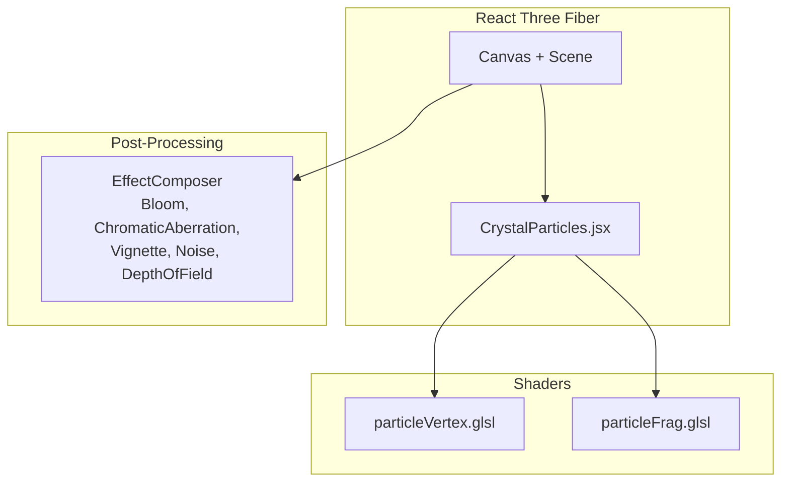
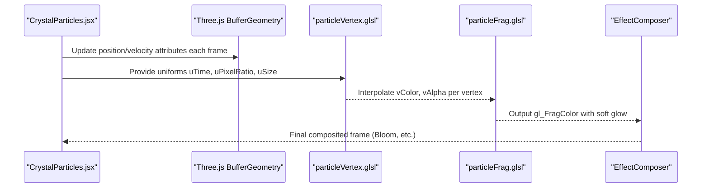
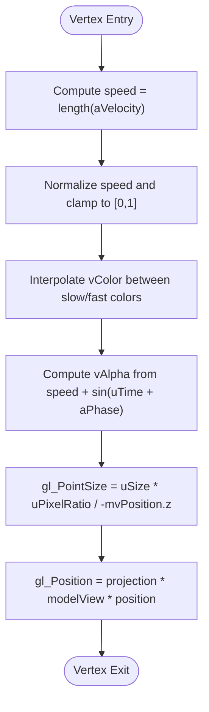
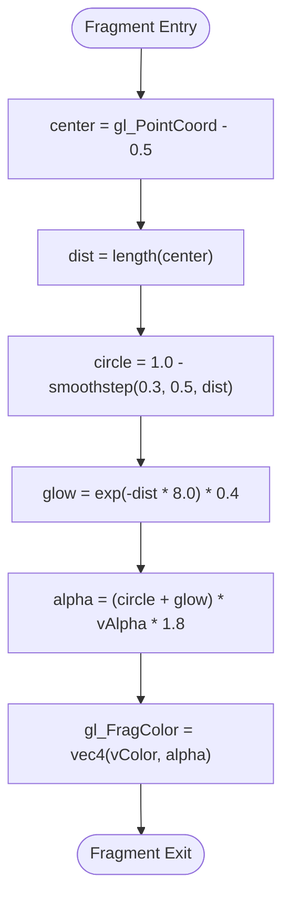
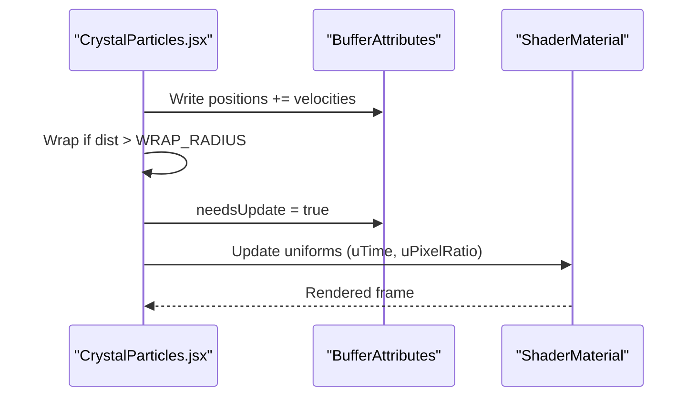
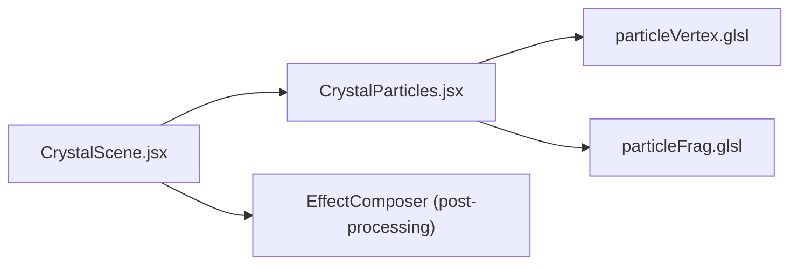

# Particle Shaders

<cite>
**Referenced Files in This Document**
- [particleVertex.glsl](file://frontend/src/components/crystal/shaders/particleVertex.glsl)
- [particleFrag.glsl](file://frontend/src/components/crystal/shaders/particleFrag.glsl)
- [CrystalParticles.jsx](file://frontend/src/components/crystal/CrystalParticles.jsx)
- [CrystalScene.jsx](file://frontend/src/components/crystal/CrystalScene.jsx)
- [ATLASRESEARCH_MASTER.md](file://ATLASRESEARCH_MASTER.md)
</cite>

## Table of Contents
1. [Introduction](#introduction)
2. [Project Structure](#project-structure)
3. [Core Components](#core-components)
4. [Architecture Overview](#architecture-overview)
5. [Detailed Component Analysis](#detailed-component-analysis)
6. [Dependency Analysis](#dependency-analysis)
7. [Performance Considerations](#performance-considerations)
8. [Troubleshooting Guide](#troubleshooting-guide)
9. [Conclusion](#conclusion)
10. [Appendices](#appendices)

## Introduction
This document explains the particle shader system used to render realistic, velocity-driven particles around the crystal in Atlas Research. It covers how positions and sizes are computed on the GPU, how color and alpha are derived from velocity and time, and how the JavaScript layer updates particle positions each frame. It also provides guidance for extending the system with physics-like behaviors (gravity, damping, collision), managing uniforms (lifetime, emission rates), and optimizing performance for large particle counts using instancing strategies and efficient buffer management.

## Project Structure
The particle system is implemented as a React Three Fiber component that creates a single BufferGeometry Points object and renders it with custom GLSL shaders. The scene integrates post-processing effects and adaptive quality settings based on GPU capability.

**Diagram sources**
- [CrystalScene.jsx:1-116](file://frontend/src/components/crystal/CrystalScene.jsx#L1-L116)
- [CrystalParticles.jsx:1-130](file://frontend/src/components/crystal/CrystalParticles.jsx#L1-L130)
- [particleVertex.glsl:1-33](file://frontend/src/components/crystal/shaders/particleVertex.glsl#L1-L33)
- [particleFrag.glsl:1-19](file://frontend/src/components/crystal/shaders/particleFrag.glsl#L1-L19)

**Section sources**
- [CrystalScene.jsx:1-116](file://frontend/src/components/crystal/CrystalScene.jsx#L1-L116)
- [CrystalParticles.jsx:1-130](file://frontend/src/components/crystal/CrystalParticles.jsx#L1-L130)

## Core Components
- CrystalParticles.jsx: Initializes particle buffers (positions, per-particle velocity, phase), updates positions each frame, and binds attributes to a Points geometry rendered by a ShaderMaterial.
- particleVertex.glsl: Computes per-particle color and alpha from velocity magnitude and time, and sets point size with distance attenuation.
- particleFrag.glsl: Renders soft glowing points with smooth falloff and additive blending.

Key responsibilities:
- Data layout: Float32 arrays for position, velocity, and phase; exposed via buffer attributes.
- Animation loop: useFrame updates positions and marks attributes dirty for GPU upload.
- Rendering: ShaderMaterial with transparent, depthWrite disabled, and additive blending for glow.

**Section sources**
- [CrystalParticles.jsx:14-86](file://frontend/src/components/crystal/CrystalParticles.jsx#L14-L86)
- [particleVertex.glsl:5-32](file://frontend/src/components/crystal/shaders/particleVertex.glsl#L5-L32)
- [particleFrag.glsl:4-18](file://frontend/src/components/crystal/shaders/particleFrag.glsl#L4-L18)

## Architecture Overview
The rendering pipeline combines CPU-side particle updates with GPU-side shading and post-processing.

**Diagram sources**
- [CrystalParticles.jsx:53-86](file://frontend/src/components/crystal/CrystalParticles.jsx#L53-L86)
- [particleVertex.glsl:15-32](file://frontend/src/components/crystal/shaders/particleVertex.glsl#L15-L32)
- [particleFrag.glsl:7-18](file://frontend/src/components/crystal/shaders/particleFrag.glsl#L7-L18)
- [CrystalScene.jsx:55-86](file://frontend/src/components/crystal/CrystalScene.jsx#L55-L86)

## Detailed Component Analysis

### Vertex Shader: Positioning, Size Attenuation, Velocity-Based Transformations
- Inputs:
  - Uniforms: uTime, uPixelRatio, uSize
  - Attributes: aVelocity (vec3), aPhase (float)
- Processing:
  - Compute speed from aVelocity magnitude.
  - Normalize speed and map to a color gradient between slow and fast colors.
  - Compute alpha using speed and a sinusoidal pulse modulated by aPhase and uTime.
  - Billboard point sizing: gl_PointSize scales with uSize, uPixelRatio, and inverse view-space z-distance.
  - Set gl_Position from modelViewMatrix and projectionMatrix.

**Diagram sources**
- [particleVertex.glsl:15-32](file://frontend/src/components/crystal/shaders/particleVertex.glsl#L15-L32)

**Section sources**
- [particleVertex.glsl:5-32](file://frontend/src/components/crystal/shaders/particleVertex.glsl#L5-L32)

### Fragment Shader: Color Interpolation, Alpha Blending, Lighting
- Inputs:
  - Varyings: vColor (vec3), vAlpha (float)
- Processing:
  - Compute radial distance from point center using gl_PointCoord.
  - Create a soft circle mask using smoothstep.
  - Add an exponential glow falloff beyond the circle edge.
  - Combine circle and glow into final alpha; output gl_FragColor with vColor and alpha.

**Diagram sources**
- [particleFrag.glsl:7-18](file://frontend/src/components/crystal/shaders/particleFrag.glsl#L7-L18)

**Section sources**
- [particleFrag.glsl:4-18](file://frontend/src/components/crystal/shaders/particleFrag.glsl#L4-L18)

### JavaScript Layer: Particle Data Flow and Updates
- Initialization:
  - Allocate Float32Array buffers for positions, velocities, and phases.
  - Initialize positions within a spherical region and velocities as normalized outward vectors scaled by a small factor.
  - Assign random phase offsets per particle.
- Per-frame update:
  - Advance positions by adding velocities.
  - Wrap particles outside a radius back toward the center with a scaling factor.
  - Mark geometry attributes as needing update.
- Material setup:
  - Use ShaderMaterial with transparent, depthWrite false, and additive blending.
  - Pass uniforms uTime, uPixelRatio, uSize.

**Diagram sources**
- [CrystalParticles.jsx:14-42](file://frontend/src/components/crystal/CrystalParticles.jsx#L14-L42)
- [CrystalParticles.jsx:53-86](file://frontend/src/components/crystal/CrystalParticles.jsx#L53-L86)
- [CrystalParticles.jsx:96-127](file://frontend/src/components/crystal/CrystalParticles.jsx#L96-L127)

**Section sources**
- [CrystalParticles.jsx:14-86](file://frontend/src/components/crystal/CrystalParticles.jsx#L14-L86)
- [CrystalParticles.jsx:96-127](file://frontend/src/components/crystal/CrystalParticles.jsx#L96-L127)

### Scene Integration and Post-Processing
- Canvas configuration: antialias, alpha false, powerPreference high-performance, tone mapping ACES Filmic.
- Post-processing: Bloom, ChromaticAberration, Vignette, Noise, DepthOfField (conditionally enabled).
- GPU detection: Adjust samples/resolution based on MAX_TEXTURE_SIZE.

**Section sources**
- [CrystalScene.jsx:1-116](file://frontend/src/components/crystal/CrystalScene.jsx#L1-L116)

## Dependency Analysis
- CrystalParticles.jsx imports both GLSL shaders and uses Three.js primitives for Points and ShaderMaterial.
- CrystalScene.jsx composes the scene, adds lighting, environment, and post-processing effects.
- Performance rules emphasize single BufferGeometry Points usage and strict limits on particle count.

**Diagram sources**
- [CrystalParticles.jsx:1-130](file://frontend/src/components/crystal/CrystalParticles.jsx#L1-L130)
- [CrystalScene.jsx:1-116](file://frontend/src/components/crystal/CrystalScene.jsx#L1-L116)

**Section sources**
- [ATLASRESEARCH_MASTER.md:1417-1440](file://ATLASRESEARCH_MASTER.md#L1417-L1440)

## Performance Considerations
- Single BufferGeometry Points: Avoid per-particle meshes; keep all particles in one draw call.
- Attribute updates: Only mark attributes dirty when necessary; batch updates in useFrame.
- Uniform updates: Mutate refs directly without triggering React re-renders.
- Adaptive quality: Reduce transmission samples and disable heavy effects on low-end GPUs.
- Memory management: Dispose geometries and materials on unmount to prevent leaks.
- GPU instancing strategy: For very large counts, consider moving more logic into compute shaders or using instanced meshes where appropriate; however, current implementation uses Points which is already highly optimized for large counts.
- Debugging tools: Visualize velocity magnitudes via color mapping, toggle bloom intensity, and inspect gl_PointSize behavior across distances.

[No sources needed since this section provides general guidance]

## Troubleshooting Guide
- Particles not visible:
  - Ensure blending mode is additive and depthWrite is disabled.
  - Verify uSize and uPixelRatio are set correctly.
- Incorrect color or alpha:
  - Check normalization of velocity magnitude and clamping range.
  - Confirm uTime is advancing and aPhase values are distributed.
- Poor performance:
  - Reduce PARTICLE_COUNT if exceeding recommended limits.
  - Disable or reduce post-processing effects on low-end devices.
- Wrapping behavior looks abrupt:
  - Tune WRAP_RADIUS and scaling factor to create smoother transitions.

**Section sources**
- [CrystalParticles.jsx:96-127](file://frontend/src/components/crystal/CrystalParticles.jsx#L96-L127)
- [particleVertex.glsl:15-32](file://frontend/src/components/crystal/shaders/particleVertex.glsl#L15-L32)
- [particleFrag.glsl:7-18](file://frontend/src/components/crystal/shaders/particleFrag.glsl#L7-L18)

## Conclusion
The particle system leverages simple yet effective techniques: velocity-driven coloring, distance-based point sizing, and soft glow blending. The JavaScript layer handles straightforward physics-like updates while the shaders focus on visual fidelity. With careful attention to performance rules and memory management, the system scales well for the intended visualization goals.

[No sources needed since this section summarizes without analyzing specific files]

## Appendices

### Mathematical Concepts Behind Particle Physics
- Gravitational effects: Extend velocity updates with acceleration proportional to inverse square of distance to attractors.
- Collision detection: Implement sphere-sphere checks or spatial hashing for efficient broad/narrow phases.
- Momentum conservation: Apply impulse responses during collisions to conserve momentum and energy.

[No sources needed since this section discusses conceptual extensions]

### Uniform Parameters Reference
- uTime: Global animation time for pulsing and motion.
- uPixelRatio: Device pixel ratio for crisp rendering on high-DPI displays.
- uSize: Base point size before distance attenuation.

[No sources needed since this section lists parameters defined in code]

### Example Effects
- Data flow visualization: Map velocity magnitude to data throughput; faster particles represent higher activity.
- Atmospheric phenomena: Increase uSize and adjust glow exponent to simulate mist or dust clouds.

[No sources needed since this section provides conceptual examples]