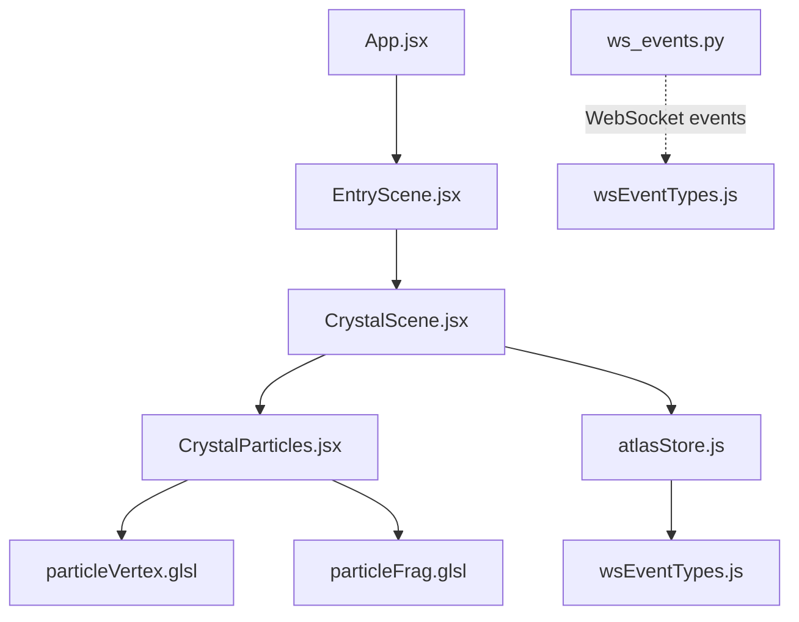
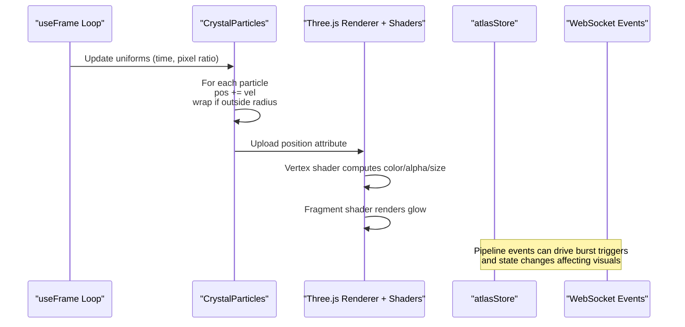
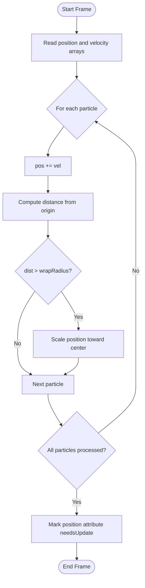
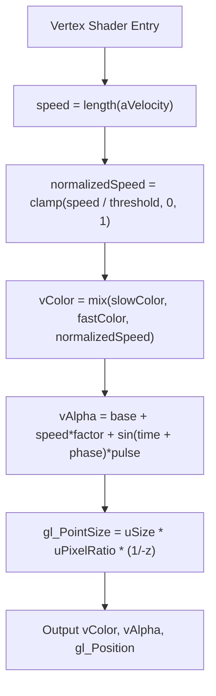
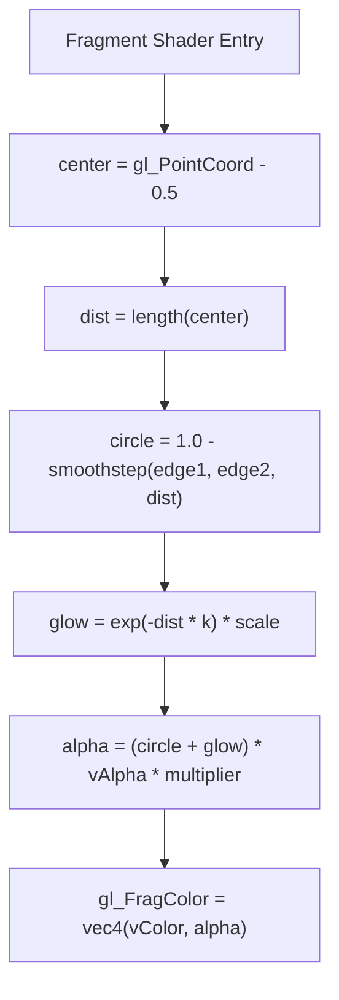
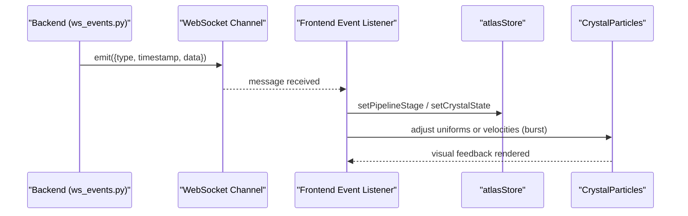
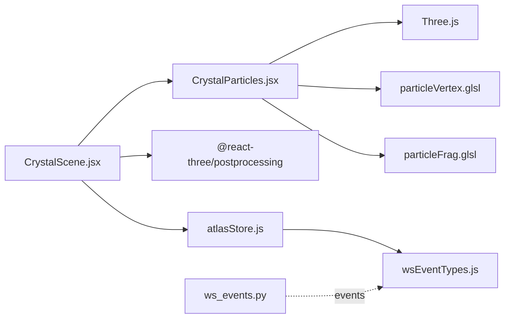

# Particle System

<cite>
**Referenced Files in This Document**
- [CrystalParticles.jsx](file://frontend/src/components/crystal/CrystalParticles.jsx)
- [particleVertex.glsl](file://frontend/src/components/crystal/shaders/particleVertex.glsl)
- [particleFrag.glsl](file://frontend/src/components/crystal/shaders/particleFrag.glsl)
- [CrystalScene.jsx](file://frontend/src/components/crystal/CrystalScene.jsx)
- [atlasStore.js](file://frontend/src/store/atlasStore.js)
- [wsEventTypes.js](file://frontend/src/utils/wsEventTypes.js)
- [ws_events.py](file://backend/ws_events.py)
</cite>

## Table of Contents
1. [Introduction](#introduction)
2. [Project Structure](#project-structure)
3. [Core Components](#core-components)
4. [Architecture Overview](#architecture-overview)
5. [Detailed Component Analysis](#detailed-component-analysis)
6. [Dependency Analysis](#dependency-analysis)
7. [Performance Considerations](#performance-considerations)
8. [Troubleshooting Guide](#troubleshooting-guide)
9. [Conclusion](#conclusion)
10. [Appendices](#appendices)

## Introduction
This document explains the particle system component that visualizes data flow and research progress through animated particles. It covers the physics simulation (velocity, position updates, lifecycle), velocity-based coloring, custom GLSL shaders for vertex displacement and fragment effects, and how WebSocket events can trigger particle bursts during pipeline stages. It also documents performance techniques such as batch rendering and GPU acceleration, and provides guidance on configuring emission behavior and appearance via shader parameters.

## Project Structure
The particle system is implemented as a React Three Fiber component with custom GLSL shaders. The scene composes the particle system alongside other 3D elements and post-processing effects.

**Diagram sources**
- [CrystalScene.jsx:1-116](file://frontend/src/components/crystal/CrystalScene.jsx#L1-L116)
- [CrystalParticles.jsx:1-130](file://frontend/src/components/crystal/CrystalParticles.jsx#L1-L130)
- [particleVertex.glsl:1-33](file://frontend/src/components/crystal/shaders/particleVertex.glsl#L1-L33)
- [particleFrag.glsl:1-19](file://frontend/src/components/crystal/shaders/particleFrag.glsl#L1-L19)
- [atlasStore.js:1-84](file://frontend/src/store/atlasStore.js#L1-L84)
- [wsEventTypes.js:1-45](file://frontend/src/utils/wsEventTypes.js#L1-L45)
- [ws_events.py:1-14](file://backend/ws_events.py#L1-L14)

**Section sources**
- [CrystalScene.jsx:1-116](file://frontend/src/components/crystal/CrystalScene.jsx#L1-L116)
- [CrystalParticles.jsx:1-130](file://frontend/src/components/crystal/CrystalParticles.jsx#L1-L130)

## Core Components
- CrystalParticles: Manages particle buffers, per-frame updates, and shader uniforms.
- Shaders:
  - Vertex shader: Computes color from velocity magnitude, alpha pulsing, and billboard sizing.
  - Fragment shader: Renders soft glowing points with feathered edges.
- Scene composition: CrystalScene integrates the particle system into the 3D canvas and applies post-processing.
- State and events: atlasStore holds pipeline state; wsEventTypes defines event names; backend emits structured events.

**Section sources**
- [CrystalParticles.jsx:1-130](file://frontend/src/components/crystal/CrystalParticles.jsx#L1-L130)
- [particleVertex.glsl:1-33](file://frontend/src/components/crystal/shaders/particleVertex.glsl#L1-L33)
- [particleFrag.glsl:1-19](file://frontend/src/components/crystal/shaders/particleFrag.glsl#L1-L19)
- [CrystalScene.jsx:1-116](file://frontend/src/components/crystal/CrystalScene.jsx#L1-L116)
- [atlasStore.js:1-84](file://frontend/src/store/atlasStore.js#L1-L84)
- [wsEventTypes.js:1-45](file://frontend/src/utils/wsEventTypes.js#L1-L45)
- [ws_events.py:1-14](file://backend/ws_events.py#L1-L14)

## Architecture Overview
The particle system runs on the GPU using Three.js BufferGeometry and ShaderMaterial. Each frame, positions are updated on the CPU and uploaded to the GPU attributes. The vertex shader computes per-particle color and size based on velocity and time, while the fragment shader renders soft glowing circles. Post-processing adds bloom and other effects.

**Diagram sources**
- [CrystalParticles.jsx:53-86](file://frontend/src/components/crystal/CrystalParticles.jsx#L53-L86)
- [particleVertex.glsl:15-32](file://frontend/src/components/crystal/shaders/particleVertex.glsl#L15-L32)
- [particleFrag.glsl:7-18](file://frontend/src/components/crystal/shaders/particleFrag.glsl#L7-L18)
- [atlasStore.js:1-84](file://frontend/src/store/atlasStore.js#L1-L84)
- [wsEventTypes.js:1-45](file://frontend/src/utils/wsEventTypes.js#L1-L45)

## Detailed Component Analysis

### Physics and Lifecycle
- Initialization:
  - A fixed number of particles are created with random spherical positions and normalized outward velocities scaled by a small factor.
  - Per-particle phase offsets are stored for temporal variation.
- Per-frame update:
  - Positions are advanced by their velocity vectors.
  - Particles exceeding a wrap radius are scaled back toward the center with randomized scaling to maintain density.
  - Position attribute is marked for upload to the GPU.
- Lifecycle:
  - On unmount, geometry and material are disposed to prevent memory leaks.

**Diagram sources**
- [CrystalParticles.jsx:67-86](file://frontend/src/components/crystal/CrystalParticles.jsx#L67-L86)

**Section sources**
- [CrystalParticles.jsx:14-42](file://frontend/src/components/crystal/CrystalParticles.jsx#L14-L42)
- [CrystalParticles.jsx:53-86](file://frontend/src/components/crystal/CrystalParticles.jsx#L53-L86)
- [CrystalParticles.jsx:88-94](file://frontend/src/components/crystal/CrystalParticles.jsx#L88-L94)

### Velocity-Based Coloring
- Speed calculation:
  - The vertex shader computes speed as the length of the per-particle velocity vector.
- Color mapping:
  - Speed is normalized against a threshold and clamped to [0,1].
  - Colors interpolate between a slow dark blue-grey and a faster light blue tone.
- Alpha modulation:
  - Alpha combines base intensity, speed influence, and a sinusoidal pulse modulated by per-particle phase and time.

**Diagram sources**
- [particleVertex.glsl:15-32](file://frontend/src/components/crystal/shaders/particleVertex.glsl#L15-L32)

**Section sources**
- [particleVertex.glsl:1-33](file://frontend/src/components/crystal/shaders/particleVertex.glsl#L1-L33)

### Fragment Effects
- Soft circle:
  - Distance from point center is computed; smoothstep creates a soft edge.
- Glow:
  - Exponential falloff extends beyond the circle boundary for a glow effect.
- Final color:
  - Combines circle and glow contributions with vAlpha and a multiplier for brightness.

**Diagram sources**
- [particleFrag.glsl:7-18](file://frontend/src/components/crystal/shaders/particleFrag.glsl#L7-L18)

**Section sources**
- [particleFrag.glsl:1-19](file://frontend/src/components/crystal/shaders/particleFrag.glsl#L1-L19)

### Integration with WebSocket Events
- Event types:
  - wsEventTypes enumerates pipeline and agent events used across the application.
- Backend emission:
  - ws_events provides a helper to emit structured events with type, timestamp, and data payload.
- Frontend integration pattern:
  - While not shown in the current files, typical usage would listen to WebSocket messages, map event types to actions, and update atlasStore or directly adjust particle parameters (e.g., temporary velocity boosts or emission rate changes).
- Burst trigger concept:
  - On receiving an event like PIPELINE_STARTED or SEARCH_COMPLETED, the frontend could temporarily increase particle velocities or spawn additional particles to visualize activity spikes.

**Diagram sources**
- [ws_events.py:3-14](file://backend/ws_events.py#L3-L14)
- [wsEventTypes.js:1-45](file://frontend/src/utils/wsEventTypes.js#L1-L45)
- [atlasStore.js:1-84](file://frontend/src/store/atlasStore.js#L1-L84)

**Section sources**
- [wsEventTypes.js:1-45](file://frontend/src/utils/wsEventTypes.js#L1-L45)
- [ws_events.py:1-14](file://backend/ws_events.py#L1-L14)
- [atlasStore.js:1-84](file://frontend/src/store/atlasStore.js#L1-L84)

### Scene Composition and Rendering
- CrystalScene sets up the Three.js Canvas, lighting, environment, and post-processing.
- CrystalParticles is included as a child element within the scene.
- Post-processing includes Bloom, Chromatic Aberration, Vignette, Noise, DepthOfField, and ToneMapping.

**Section sources**
- [CrystalScene.jsx:1-116](file://frontend/src/components/crystal/CrystalScene.jsx#L1-L116)

## Dependency Analysis
- CrystalParticles depends on:
  - Three.js primitives and BufferAttribute for GPU buffers.
  - Custom GLSL shaders for rendering.
  - useFrame for per-frame updates.
- CrystalScene depends on:
  - React Three Fiber Canvas and post-processing stack.
  - atlasStore for shared state.
- WebSocket integration depends on:
  - wsEventTypes for consistent event naming.
  - Backend ws_events for structured event payloads.

**Diagram sources**
- [CrystalParticles.jsx:1-130](file://frontend/src/components/crystal/CrystalParticles.jsx#L1-L130)
- [CrystalScene.jsx:1-116](file://frontend/src/components/crystal/CrystalScene.jsx#L1-L116)
- [atlasStore.js:1-84](file://frontend/src/store/atlasStore.js#L1-L84)
- [wsEventTypes.js:1-45](file://frontend/src/utils/wsEventTypes.js#L1-L45)
- [ws_events.py:1-14](file://backend/ws_events.py#L1-L14)

**Section sources**
- [CrystalParticles.jsx:1-130](file://frontend/src/components/crystal/CrystalParticles.jsx#L1-L130)
- [CrystalScene.jsx:1-116](file://frontend/src/components/crystal/CrystalScene.jsx#L1-L116)
- [atlasStore.js:1-84](file://frontend/src/store/atlasStore.js#L1-L84)
- [wsEventTypes.js:1-45](file://frontend/src/utils/wsEventTypes.js#L1-L45)
- [ws_events.py:1-14](file://backend/ws_events.py#L1-L14)

## Performance Considerations
- Batch rendering:
  - All particles are drawn in a single draw call using BufferGeometry and ShaderMaterial, minimizing CPU-GPU synchronization overhead.
- GPU acceleration:
  - Vertex shader computes per-particle color and size; fragment shader renders soft circles efficiently on the GPU.
- Memory management:
  - Geometry and material are disposed on component unmount to avoid leaks.
- Pixel ratio handling:
  - uPixelRatio ensures correct point sizes across devices.
- Emission control:
  - PARTICLE_COUNT is fixed; to implement dynamic emission, consider object pooling and reusing particle slots rather than reallocating arrays.
- Update strategy:
  - Current implementation updates positions on the CPU; for large-scale systems, consider moving more logic into compute shaders or instanced rendering.

[No sources needed since this section provides general guidance]

## Troubleshooting Guide
- Particles not visible:
  - Verify blending mode and depthWrite settings; additive blending with depthWrite disabled is used to achieve transparency.
- Incorrect colors or alpha:
  - Check uTime and uPixelRatio uniforms; ensure they are updated every frame.
- Poor performance:
  - Reduce PARTICLE_COUNT or disable heavy post-processing on low-end GPUs.
- Memory leaks:
  - Ensure geometry and material disposal on unmount.

**Section sources**
- [CrystalParticles.jsx:118-126](file://frontend/src/components/crystal/CrystalParticles.jsx#L118-L126)
- [CrystalParticles.jsx:88-94](file://frontend/src/components/crystal/CrystalParticles.jsx#L88-L94)

## Conclusion
The particle system provides a performant, visually rich visualization of data flow and research progress. Its design leverages GPU-accelerated shaders, efficient buffer updates, and clear separation of concerns. With WebSocket integration patterns, it can respond to pipeline events to create meaningful visual feedback. Further enhancements can include object pooling, dynamic emission rates, and more complex shader-driven behaviors.

[No sources needed since this section summarizes without analyzing specific files]

## Appendices

### Configuration Examples
- Adjusting particle count:
  - Modify the constant controlling the number of particles to balance performance and visual density.
- Tuning velocity magnitude:
  - Change the scaling factor applied to initial velocity vectors to affect motion speed.
- Shader parameters:
  - uTime: Drives temporal effects like pulsing.
  - uPixelRatio: Ensures correct point sizes across devices.
  - uSize: Controls base point size before perspective scaling.
- Emission bursts:
  - On WebSocket events, temporarily boost velocities or add new particles to simulate bursts.

**Section sources**
- [CrystalParticles.jsx:44-51](file://frontend/src/components/crystal/CrystalParticles.jsx#L44-L51)
- [particleVertex.glsl:5-7](file://frontend/src/components/crystal/shaders/particleVertex.glsl#L5-L7)
- [wsEventTypes.js:1-45](file://frontend/src/utils/wsEventTypes.js#L1-L45)