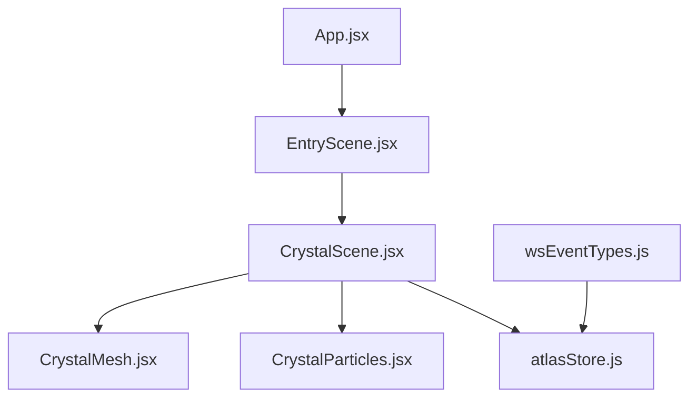
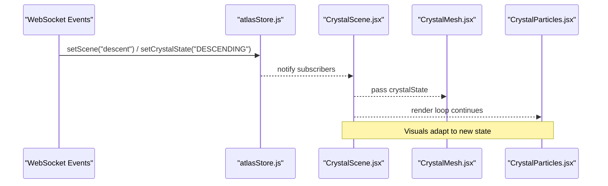
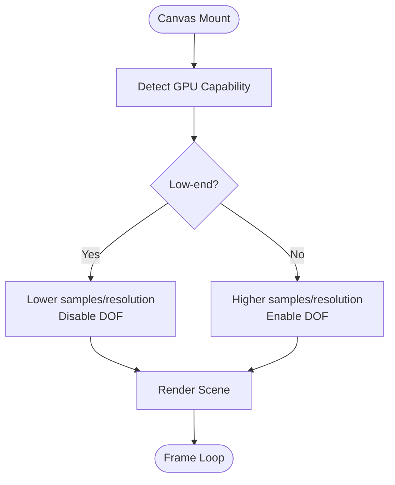
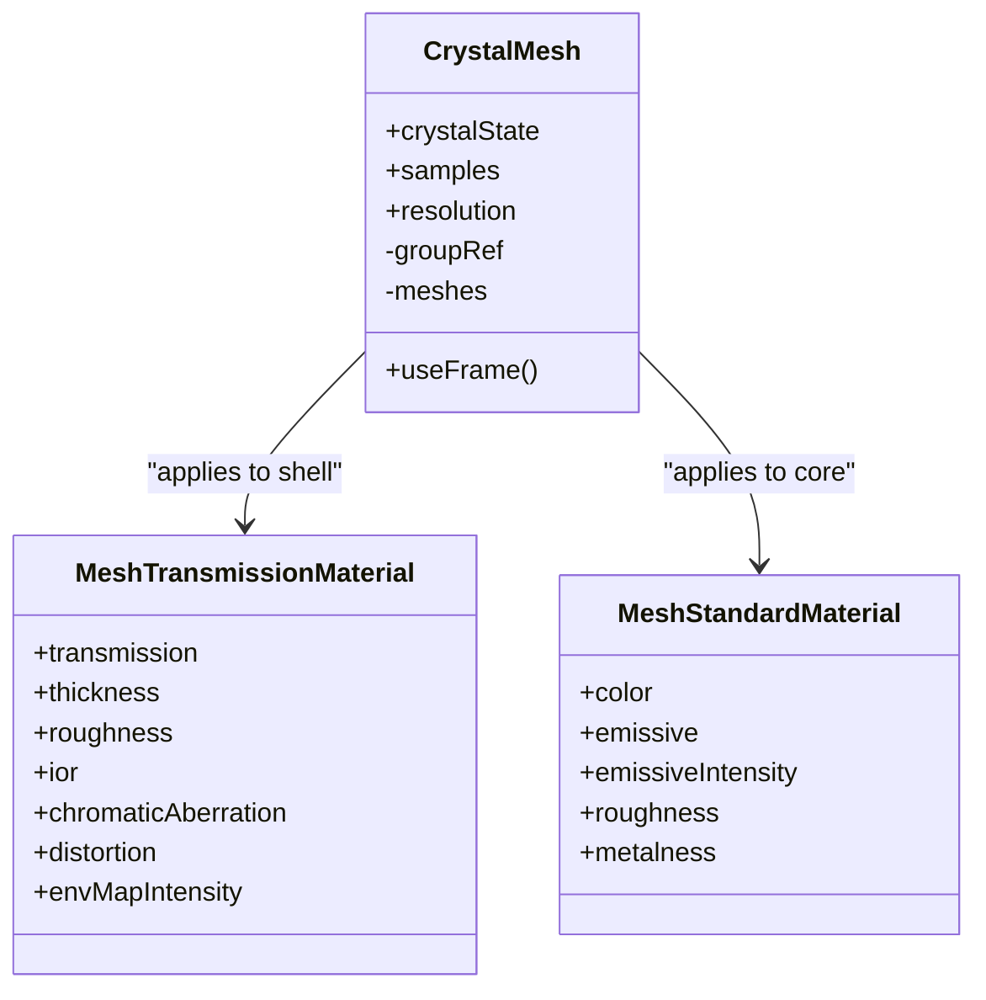
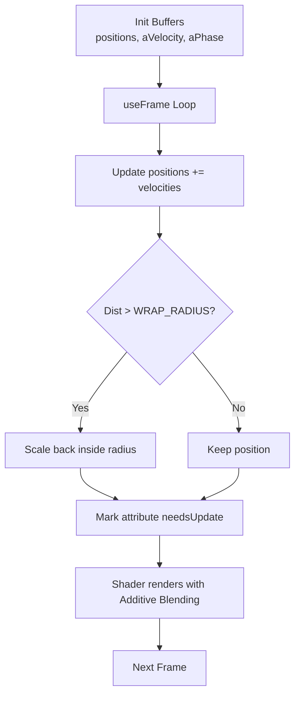
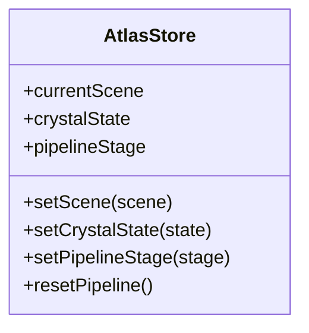
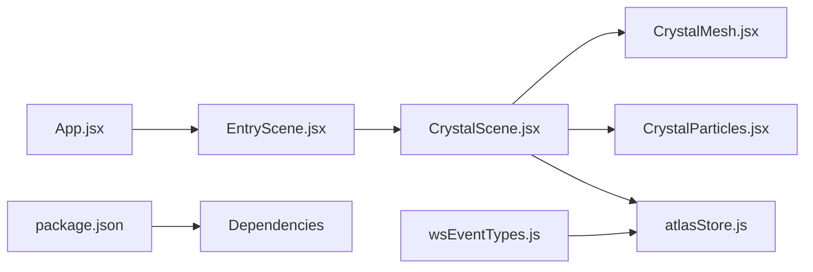

# Scene Management & Transitions

<cite>
**Referenced Files in This Document**
- [App.jsx](file://frontend/src/App.jsx)
- [EntryScene.jsx](file://frontend/src/scenes/EntryScene.jsx)
- [CrystalScene.jsx](file://frontend/src/components/crystal/CrystalScene.jsx)
- [CrystalMesh.jsx](file://frontend/src/components/crystal/CrystalMesh.jsx)
- [CrystalParticles.jsx](file://frontend/src/components/crystal/CrystalParticles.jsx)
- [atlasStore.js](file://frontend/src/store/atlasStore.js)
- [wsEventTypes.js](file://frontend/src/utils/wsEventTypes.js)
- [package.json](file://frontend/package.json)
</cite>

## Table of Contents
1. [Introduction](#introduction)
2. [Project Structure](#project-structure)
3. [Core Components](#core-components)
4. [Architecture Overview](#architecture-overview)
5. [Detailed Component Analysis](#detailed-component-analysis)
6. [Dependency Analysis](#dependency-analysis)
7. [Performance Considerations](#performance-considerations)
8. [Troubleshooting Guide](#troubleshooting-guide)
9. [Conclusion](#conclusion)
10. [Appendices](#appendices)

## Introduction
This document explains the scene management system that orchestrates transitions between Entry, Descent, Emergence, and Chat phases. It focuses on the CrystalScene component as the main container for Three.js rendering, camera configuration, lighting, HDRI environment maps, and post-processing effects. It also outlines how GSAP-based animations drive smooth transitions and how WebSocket events from the research pipeline trigger state changes across scenes. Guidance is provided for adding new scenes, customizing transition animations, and troubleshooting common rendering issues.

## Project Structure
The frontend organizes 3D content under React components with a central store for shared state:
- App mounts the entry scene and a custom cursor overlay.
- EntryScene renders the 3D canvas via CrystalScene.
- CrystalScene configures the renderer, camera, lights, environment map, and post-processing.
- CrystalMesh and CrystalParticles provide visual assets and GPU-driven animation.
- atlasStore holds current scene, crystal state, and pipeline stage.
- wsEventTypes enumerates WebSocket event names used by the backend to drive state changes.

**Diagram sources**
- [App.jsx:1-42](file://frontend/src/App.jsx#L1-L42)
- [EntryScene.jsx:1-8](file://frontend/src/scenes/EntryScene.jsx#L1-L8)
- [CrystalScene.jsx:1-116](file://frontend/src/components/crystal/CrystalScene.jsx#L1-L116)
- [CrystalMesh.jsx:1-103](file://frontend/src/components/crystal/CrystalMesh.jsx#L1-L103)
- [CrystalParticles.jsx:1-130](file://frontend/src/components/crystal/CrystalParticles.jsx#L1-L130)
- [atlasStore.js:1-84](file://frontend/src/store/atlasStore.js#L1-L84)
- [wsEventTypes.js:1-45](file://frontend/src/utils/wsEventTypes.js#L1-L45)

**Section sources**
- [App.jsx:1-42](file://frontend/src/App.jsx#L1-L42)
- [EntryScene.jsx:1-8](file://frontend/src/scenes/EntryScene.jsx#L1-L8)
- [CrystalScene.jsx:1-116](file://frontend/src/components/crystal/CrystalScene.jsx#L1-L116)
- [atlasStore.js:1-84](file://frontend/src/store/atlasStore.js#L1-L84)
- [wsEventTypes.js:1-45](file://frontend/src/utils/wsEventTypes.js#L1-L45)

## Core Components
- CrystalScene: Main container for the Three.js Canvas, camera setup, lighting, HDRI environment, and post-processing (Bloom, Chromatic Aberration, Vignette, Noise, Depth of Field, Tone Mapping). It adapts quality based on GPU capability.
- CrystalMesh: Loads and renders a crystal model with two parts (shell and core), applying transmission materials and subtle rotation per crystal state.
- CrystalParticles: A GPU-accelerated particle field with custom shaders, additive blending, and wrap-around behavior.
- atlasStore: Centralized state for currentScene, crystalState, pipelineStage, and other UI/pipeline data. Provides setters used by components and event handlers.
- wsEventTypes: Enumerates all WebSocket event strings used to synchronize frontend state with backend pipeline progress.

Key responsibilities:
- Rendering pipeline: Canvas initialization, renderer options, camera, lights, environment, post-processing.
- State-driven visuals: CrystalMesh and particles react to crystalState; scene-specific features toggle based on currentScene.
- Performance: Low-end GPU detection reduces samples/resolution and disables certain effects.

**Section sources**
- [CrystalScene.jsx:1-116](file://frontend/src/components/crystal/CrystalScene.jsx#L1-L116)
- [CrystalMesh.jsx:1-103](file://frontend/src/components/crystal/CrystalMesh.jsx#L1-L103)
- [CrystalParticles.jsx:1-130](file://frontend/src/components/crystal/CrystalParticles.jsx#L1-L130)
- [atlasStore.js:1-84](file://frontend/src/store/atlasStore.js#L1-L84)
- [wsEventTypes.js:1-45](file://frontend/src/utils/wsEventTypes.js#L1-L45)

## Architecture Overview
The scene system uses a state-driven architecture:
- The store defines currentScene and crystalState.
- Components subscribe to store values and update visuals accordingly.
- WebSocket events (not implemented here yet) will call store setters to change currentScene and crystalState, which triggers re-renders and animations.
- GSAP can be used to animate camera movements and effect parameters when states change.

**Diagram sources**
- [atlasStore.js:1-84](file://frontend/src/store/atlasStore.js#L1-L84)
- [CrystalScene.jsx:1-116](file://frontend/src/components/crystal/CrystalScene.jsx#L1-L116)
- [CrystalMesh.jsx:1-103](file://frontend/src/components/crystal/CrystalMesh.jsx#L1-L103)
- [CrystalParticles.jsx:1-130](file://frontend/src/components/crystal/CrystalParticles.jsx#L1-L130)
- [wsEventTypes.js:1-45](file://frontend/src/utils/wsEventTypes.js#L1-L45)

## Detailed Component Analysis

### CrystalScene: Renderer, Camera, Lighting, Environment, Post-Processing
- Renderer and Canvas: Configured with antialiasing, tone mapping, exposure, and DPR range. Cursor is hidden for immersive experience.
- Camera: FOV and position are set for a centered view; Depth of Field is enabled conditionally for descent phase on capable devices.
- Lighting: Ambient light plus two directional lights create balanced illumination.
- Environment: HDRI map loaded from public path for realistic reflections.
- Post-processing: Bloom, Chromatic Aberration, Vignette, Noise, Depth of Field, and ACES Filmic Tone Mapping applied through EffectComposer.
- Quality adaptation: GpuQualityDetector checks MAX_TEXTURE_SIZE to decide lower sample counts and resolution for transmission and DOF.

**Diagram sources**
- [CrystalScene.jsx:19-27](file://frontend/src/components/crystal/CrystalScene.jsx#L19-L27)
- [CrystalScene.jsx:29-89](file://frontend/src/components/crystal/CrystalScene.jsx#L29-L89)
- [CrystalScene.jsx:91-113](file://frontend/src/components/crystal/CrystalScene.jsx#L91-L113)

**Section sources**
- [CrystalScene.jsx:1-116](file://frontend/src/components/crystal/CrystalScene.jsx#L1-L116)

### CrystalMesh: Model Loading, Materials, Rotation Behavior
- Loads a GLTF model and splits geometry into shell and core parts.
- Applies MeshTransmissionMaterial to shell with tuned optical properties and standard material to core with emissive glow.
- Rotates slowly in SEED state; increases rotation speed during CHARGING; slows down in EMERGED state.

**Diagram sources**
- [CrystalMesh.jsx:1-103](file://frontend/src/components/crystal/CrystalMesh.jsx#L1-L103)

**Section sources**
- [CrystalMesh.jsx:1-103](file://frontend/src/components/crystal/CrystalMesh.jsx#L1-L103)

### CrystalParticles: GPU-driven Particle System
- Initializes positions, velocities, and phases for a fixed number of particles.
- Updates positions each frame using velocity attributes and wraps particles beyond a radius.
- Uses custom vertex and fragment shaders with additive blending and depth write disabled for a soft glow effect.

**Diagram sources**
- [CrystalParticles.jsx:1-130](file://frontend/src/components/crystal/CrystalParticles.jsx#L1-L130)

**Section sources**
- [CrystalParticles.jsx:1-130](file://frontend/src/components/crystal/CrystalParticles.jsx#L1-L130)

### State Management: atlasStore
- Defines currentScene, crystalState, and pipelineStage along with setters.
- Provides resetPipeline to return to initial state.
- Used by components to read reactive values and by event handlers to update state.

**Diagram sources**
- [atlasStore.js:1-84](file://frontend/src/store/atlasStore.js#L1-L84)

**Section sources**
- [atlasStore.js:1-84](file://frontend/src/store/atlasStore.js#L1-L84)

### WebSocket Event Types: wsEventTypes
- Enumerates event names for pipeline lifecycle, agent activities, gatherer/synthesizer/critic stages, memory writes, and VRAM operations.
- These strings should be matched by a WebSocket handler to call store setters and trigger scene transitions.

**Section sources**
- [wsEventTypes.js:1-45](file://frontend/src/utils/wsEventTypes.js#L1-L45)

## Dependency Analysis
- App mounts EntryScene, which renders CrystalScene.
- CrystalScene depends on CrystalMesh and CrystalParticles for visuals.
- All components read from atlasStore; future WebSocket integration will write to it.
- package.json lists dependencies including GSAP, React Three Fiber/Drei, Postprocessing, and Zustand.

**Diagram sources**
- [App.jsx:1-42](file://frontend/src/App.jsx#L1-L42)
- [EntryScene.jsx:1-8](file://frontend/src/scenes/EntryScene.jsx#L1-L8)
- [CrystalScene.jsx:1-116](file://frontend/src/components/crystal/CrystalScene.jsx#L1-L116)
- [CrystalMesh.jsx:1-103](file://frontend/src/components/crystal/CrystalMesh.jsx#L1-L103)
- [CrystalParticles.jsx:1-130](file://frontend/src/components/crystal/CrystalParticles.jsx#L1-L130)
- [atlasStore.js:1-84](file://frontend/src/store/atlasStore.js#L1-L84)
- [wsEventTypes.js:1-45](file://frontend/src/utils/wsEventTypes.js#L1-L45)
- [package.json:1-35](file://frontend/package.json#L1-L35)

**Section sources**
- [package.json:1-35](file://frontend/package.json#L1-L35)

## Performance Considerations
- Frustum culling: Particles disable frustum culling to ensure consistent coverage; consider enabling culling for large meshes if needed.
- LOD management: Not implemented in current code; could be added for complex models or heavy scenes.
- Transmission quality: Samples and resolution are reduced on low-end GPUs to maintain performance.
- Post-processing: Effects like Bloom and DOF are expensive; DOF is disabled on low-end devices.
- DPR scaling: DPR range [1, 2] balances clarity and performance.
- Memory: GLTF materials are disposed before cloning to avoid leaks.

[No sources needed since this section provides general guidance]

## Troubleshooting Guide
Common rendering issues and resolutions:
- Black screen or missing textures: Ensure HDRI file exists at the expected path and GLTF model loads successfully.
- Poor performance on low-end devices: Verify GpuQualityDetector sets lower samples/resolution and disables DOF.
- Incorrect lighting or reflections: Confirm ambient and directional light intensities and HDRI environment map loading.
- Excessive blur or bloom artifacts: Adjust Bloom intensity and luminance thresholds; check ToneMapping mode.
- Camera not moving as expected: Implement GSAP-based camera transitions driven by store.currentScene changes.

**Section sources**
- [CrystalScene.jsx:19-89](file://frontend/src/components/crystal/CrystalScene.jsx#L19-L89)
- [CrystalMesh.jsx:1-103](file://frontend/src/components/crystal/CrystalMesh.jsx#L1-L103)
- [CrystalParticles.jsx:1-130](file://frontend/src/components/crystal/CrystalParticles.jsx#L1-L130)

## Conclusion
The scene management system centers around CrystalScene, which configures the Three.js renderer, camera, lighting, environment, and post-processing. State-driven visuals respond to crystalState and currentScene managed by atlasStore. Future integration with WebSocket events will trigger transitions between Entry, Descent, Emergence, and Chat phases. GSAP can animate camera movements and effect parameters for smooth transitions. Performance is optimized via GPU detection and selective effect disabling. Adding new scenes involves extending currentScene values, updating store setters, and wiring WebSocket handlers to drive state changes.

[No sources needed since this section summarizes without analyzing specific files]

## Appendices

### How to Add a New Scene
- Extend currentScene values in atlasStore to include the new scene name.
- In CrystalScene, add conditional logic to enable/disable features (e.g., DOF, fog, background color) based on the new scene.
- Wire WebSocket events to call setScene with the new value.
- Optionally add GSAP animations to transition camera and effects when entering/exiting the scene.

**Section sources**
- [atlasStore.js:1-84](file://frontend/src/store/atlasStore.js#L1-L84)
- [CrystalScene.jsx:29-89](file://frontend/src/components/crystal/CrystalScene.jsx#L29-L89)
- [wsEventTypes.js:1-45](file://frontend/src/utils/wsEventTypes.js#L1-L45)

### Customizing Transition Animations with GSAP
- Install GSAP and @gsap/react (already listed in package.json).
- Create a hook or effect that listens to store.currentScene and crystalState changes.
- Use GSAP timelines to animate camera position, focus distance, bloom intensity, and chromatic aberration offset.
- Trigger these animations when WebSocket events update the store.

**Section sources**
- [package.json:1-35](file://frontend/package.json#L1-L35)
- [atlasStore.js:1-84](file://frontend/src/store/atlasStore.js#L1-L84)

### WebSocket Integration Blueprint
- Implement a useWebSocket hook to connect to the backend endpoint.
- On connection, send initial request payload (question, project tag, deep research flag).
- Parse incoming events using wsEventTypes and map them to store setters (setScene, setCrystalState, setPipelineStage).
- Ensure error handling and reconnection logic for robustness.

**Section sources**
- [wsEventTypes.js:1-45](file://frontend/src/utils/wsEventTypes.js#L1-L45)
- [atlasStore.js:1-84](file://frontend/src/store/atlasStore.js#L1-L84)