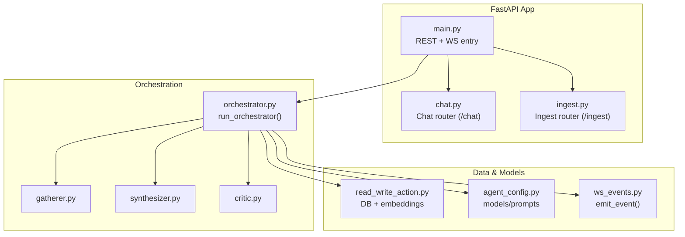
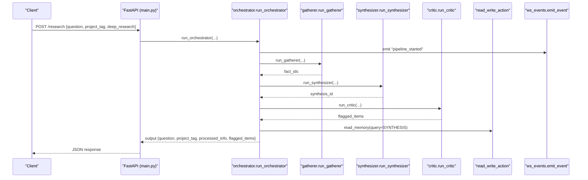
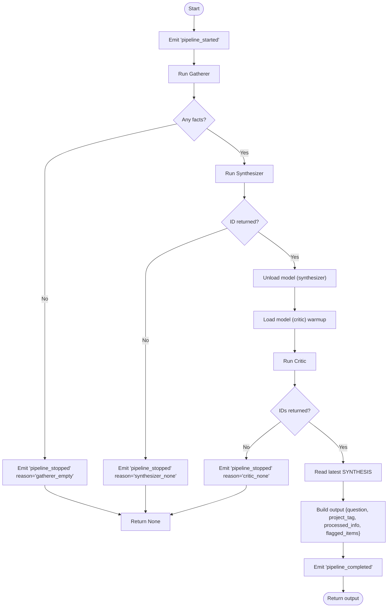
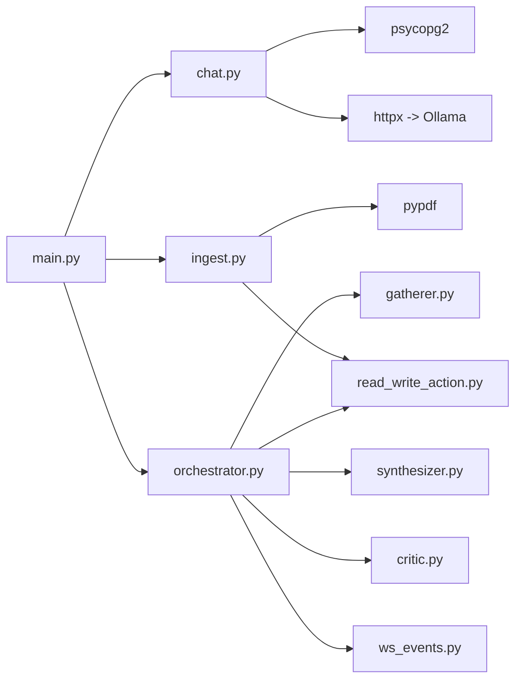

# API Reference

<cite>
**Referenced Files in This Document**
- [main.py](file://backend/main.py)
- [chat.py](file://backend/chat.py)
- [ingest.py](file://backend/ingest.py)
- [orchestrator.py](file://backend/orchestrator.py)
- [ws_events.py](file://backend/ws_events.py)
- [agent_config.py](file://backend/agent_config.py)
- [read_write_action.py](file://backend/read_write_action.py)
- [wsEventTypes.js](file://frontend/src/utils/wsEventTypes.js)
</cite>

## Table of Contents
1. Introduction
2. Project Structure
3. Core Components
4. Architecture Overview
5. Detailed Component Analysis
6. Dependency Analysis
7. Performance Considerations
8. Troubleshooting Guide
9. Conclusion
10. Appendices

## Introduction
This document provides a complete API reference for the Atlas Research backend, covering REST endpoints and WebSocket streams used to initiate research pipelines, chat with synthesized results, and ingest external data sources. It includes endpoint specifications, request/response schemas, authentication notes, error handling, rate limiting considerations, versioning guidance, and practical client examples using curl and JavaScript fetch. It also documents the full WebSocket event catalog and real-time interaction patterns used by the frontend.

## Project Structure
The backend is implemented as a FastAPI application that exposes:
- A synchronous REST endpoint to start a research pipeline
- A WebSocket stream for real-time pipeline events
- REST routers for chat and ingestion under /chat and /ingest

**Diagram sources**
- [main.py:11-13](file://backend/main.py#L11-L13)
- [orchestrator.py:12-94](file://backend/orchestrator.py#L12-L94)
- [read_write_action.py:14-51](file://backend/read_write_action.py#L14-L51)
- [agent_config.py:80-111](file://backend/agent_config.py#L80-L111)
- [ws_events.py:3-14](file://backend/ws_events.py#L3-L14)

**Section sources**
- [main.py:11-20](file://backend/main.py#L11-L20)
- [chat.py:11-21](file://backend/chat.py#L11-L21)
- [ingest.py:6-84](file://backend/ingest.py#L6-L84)
- [orchestrator.py:12-94](file://backend/orchestrator.py#L12-L94)

## Core Components
- REST Research Endpoint: POST /research starts a synchronous research run via the orchestrator and returns the final output or an error.
- WebSocket Research Stream: GET ws://.../ws/research accepts a JSON payload and streams structured events until completion or error.
- Chat Endpoint: POST /chat processes follow-up questions against stored synthesis context and optionally saves corrections.
- Ingest Endpoint: POST /ingest accepts files (.pdf, .md, .txt), extracts text, chunks it, and persists each chunk as a memory row.

Key behaviors:
- CORS configured for local development (http://localhost:5173).
- Request validation via Pydantic models.
- Orchestrator emits typed events through a helper for consistent structure.

**Section sources**
- [main.py:23-46](file://backend/main.py#L23-L46)
- [main.py:71-110](file://backend/main.py#L71-L110)
- [chat.py:13-72](file://backend/chat.py#L13-L72)
- [ingest.py:68-140](file://backend/ingest.py#L68-L140)
- [orchestrator.py:12-94](file://backend/orchestrator.py#L12-L94)
- [ws_events.py:3-14](file://backend/ws_events.py#L3-L14)

## Architecture Overview
The system coordinates multiple agents (Gatherer, Synthesizer, Critic) orchestrated by a central function. The orchestrator emits lifecycle and agent-level events, manages model loading/unloading, and returns a consolidated result.

**Diagram sources**
- [main.py:34-46](file://backend/main.py#L34-L46)
- [orchestrator.py:12-94](file://backend/orchestrator.py#L12-L94)
- [read_write_action.py:33-51](file://backend/read_write_action.py#L33-L51)

## Detailed Component Analysis

### REST: Research Pipeline (POST /research)
- Method: POST
- Path: /research
- Authentication: None (development; add auth in production)
- Request body schema:
  - question: string
  - project_tag: string
  - deep_research: boolean (default false)
- Response schema:
  - question: string
  - project_tag: string
  - processed_info: string (synthesis content)
  - flagged_items: array or null
- Error responses:
  - 404 with detail when orchestrator returns None
- Notes:
  - Synchronous call; long-running operations should use the WebSocket endpoint instead.

Example curl:
- curl -X POST http://localhost:8000/research -H "Content-Type: application/json" -d '{"question":"How does load balancing work?","project_tag":"demo","deep_research":false}'

Example JavaScript fetch:
- fetch("http://localhost:8000/research", { method:"POST", headers:{"Content-Type":"application/json"}, body:JSON.stringify({question:"...", project_tag:"...", deep_research:false}) })

**Section sources**
- [main.py:23-46](file://backend/main.py#L23-L46)
- [orchestrator.py:83-94](file://backend/orchestrator.py#L83-L94)

### WebSocket: Research Stream (GET /ws/research)
- Protocol: WebSocket
- Path: /ws/research
- Authentication: None (development; add auth in production)
- Connection flow:
  - Client connects and sends a single JSON message with fields: question, project_tag, deep_research.
  - Server validates the payload and starts the orchestrator on a worker thread.
  - Server streams structured events until completion or error.
  - On disconnect, server closes the connection after draining.
- Event structure:
  - type: string (event name)
  - timestamp: number (epoch seconds)
  - data: object (payload varies by event)
- Common event types:
  - pipeline_started, pipeline_completed, pipeline_stopped, pipeline_error
  - agent_started, agent_completed
  - search_started, search_completed, source_started, source_fetch_completed, source_generation_completed, source_replaced, source_exhausted, gatherer_completed
  - synthesizer_started, synthesizer_skipped, synthesizer_completed, findings_retrieved, synthesizer_generation_completed, synthesis_superseded
  - critic_started, critic_skipped, critic_completed, critic_generation_completed
  - memory_written
  - model_unload_started, model_unload_completed, model_load_started, model_load_completed
- Frontend constants are defined in wsEventTypes.js for mapping.

Example WebSocket connection (JavaScript):
- const ws = new WebSocket("ws://localhost:8000/ws/research");
- ws.onopen = () => ws.send(JSON.stringify({question:"...", project_tag:"...", deep_research:false}));
- ws.onmessage = (e) => console.log(JSON.parse(e.data));

Error handling:
- Invalid request JSON triggers a pipeline_error event and immediate close.
- Client disconnects early; pipeline continues in background.

**Section sources**
- [main.py:49-110](file://backend/main.py#L49-L110)
- [ws_events.py:3-14](file://backend/ws_events.py#L3-L14)
- [wsEventTypes.js:1-45](file://frontend/src/utils/wsEventTypes.js#L1-L45)

### REST: Chat (POST /chat)
- Method: POST
- Path: /chat
- Authentication: None (development; add auth in production)
- Request body schema:
  - messages: array of objects with role and content
  - project_tag: string
  - synthesis_id: integer
  - save_correction: boolean (optional, default false)
  - correction_content: string (optional)
- Response schema:
  - reply: string
  - correction_id: integer (present only if save_correction is true and correction_content provided)
- Behavior:
  - Retrieves synthesis content from database by synthesis_id and type SYNTHESIS.
  - Calls Ollama chat endpoint with system prompts and user messages.
  - Optionally inserts a CORRECTION memory row and returns its id.

Example curl:
- curl -X POST http://localhost:8000/chat -H "Content-Type: application/json" -d '{"messages":[{"role":"user","content":"Summarize key points"}],"project_tag":"demo","synthesis_id":1,"save_correction":false}'

Example JavaScript fetch:
- fetch("http://localhost:8000/chat", { method:"POST", headers:{"Content-Type":"application/json"}, body:JSON.stringify({messages:[{role:"user",content:"..."}], project_tag:"demo", synthesis_id:1}) })

**Section sources**
- [chat.py:13-72](file://backend/chat.py#L13-L72)

### REST: Data Ingestion (POST /ingest)
- Method: POST
- Path: /ingest
- Authentication: None (development; add auth in production)
- Content-Type: multipart/form-data
- Form fields:
  - file: required (UploadFile)
  - project_tag: optional string (default "untagged")
  - source_name: optional string (defaults to filename if not provided)
- Supported file types:
  - .pdf: text extracted via pypdf
  - .md: split by H1/H2/H3 headers into sections
  - .txt: word-count chunking with overlap
- Response schema:
  - chunks_written: integer
  - source: string
  - project_tag: string
- Errors:
  - 400 for unsupported file type, encoding issues, empty extraction, or no chunks produced.

Example curl:
- curl -X POST http://localhost:8000/ingest -F "file=@document.pdf" -F "project_tag=demo" -F "source_name=PDF Doc"

Example JavaScript fetch:
- const fd = new FormData(); fd.append("file", fileInput.files[0]); fd.append("project_tag","demo");
- fetch("http://localhost:8000/ingest", { method:"POST", body:fd })

**Section sources**
- [ingest.py:68-140](file://backend/ingest.py#L68-L140)

### Orchestrator Flow and Model Management
- Coordinates Gatherer → Synthesizer → Critic stages.
- Emits detailed events at each stage boundary and during model load/unload.
- Returns a consolidated output including synthesis text and flagged items.

**Diagram sources**
- [orchestrator.py:12-94](file://backend/orchestrator.py#L12-L94)

**Section sources**
- [orchestrator.py:12-94](file://backend/orchestrator.py#L12-L94)

## Dependency Analysis
- main.py includes routers for /chat and /ingest and defines the research REST and WebSocket endpoints.
- orchestrator.py depends on gatherer, synthesizer, critic modules and uses read_write_action for DB operations and ws_events for emitting events.
- chat.py depends on psycopg2 for DB access and httpx for calling Ollama.
- ingest.py depends on read_write_action for persisting chunks and uses pypdf for PDF extraction.
- agent_config.py provides model names, system prompts, and token limits.

**Diagram sources**
- [main.py:11-13](file://backend/main.py#L11-L13)
- [orchestrator.py:1-9](file://backend/orchestrator.py#L1-L9)
- [chat.py:1-7](file://backend/chat.py#L1-L7)
- [ingest.py:1-5](file://backend/ingest.py#L1-L5)

**Section sources**
- [main.py:11-13](file://backend/main.py#L11-L13)
- [orchestrator.py:1-9](file://backend/orchestrator.py#L1-L9)
- [chat.py:1-7](file://backend/chat.py#L1-L7)
- [ingest.py:1-5](file://backend/ingest.py#L1-L5)

## Performance Considerations
- Use the WebSocket endpoint for long-running research tasks to avoid blocking HTTP requests.
- The orchestrator offloads the blocking pipeline to a worker thread and drains events asynchronously.
- Embedding model loads once per process; reuse connections where possible.
- Chunk sizes and overlaps are tuned for embedding windows; adjust based on content characteristics.
- Model swapping (unload/load) isolates VRAM usage between stages.

[No sources needed since this section provides general guidance]

## Troubleshooting Guide
Common issues and resolutions:
- Invalid WebSocket request:
  - Symptom: Immediate pipeline_error followed by close.
  - Cause: Missing or invalid fields in initial JSON.
  - Resolution: Ensure payload contains question, project_tag, deep_research.
- No text extracted from file:
  - Symptom: 400 error with detail about extraction failure or empty content.
  - Cause: Unsupported format, encoding issues, or unreadable PDF.
  - Resolution: Provide UTF-8 encoded .md/.txt or valid .pdf.
- Database connectivity:
  - Symptom: Errors connecting to PostgreSQL or vector extension.
  - Resolution: Verify credentials and pgvector availability.
- CORS errors in browser:
  - Symptom: Blocked requests from localhost:5173.
  - Resolution: Ensure CORS allows origin http://localhost:5173.

**Section sources**
- [main.py:75-81](file://backend/main.py#L75-L81)
- [ingest.py:90-122](file://backend/ingest.py#L90-L122)
- [read_write_action.py:14-31](file://backend/read_write_action.py#L14-L31)

## Conclusion
Atlas Research provides a cohesive set of REST and WebSocket APIs to drive multi-agent research workflows, chat over synthesized outputs, and ingest diverse document formats. For interactive experiences, prefer the WebSocket stream to observe real-time progress and handle errors gracefully. Secure and scale the service by adding authentication, rate limiting, and environment-specific configuration before deployment.

[No sources needed since this section summarizes without analyzing specific files]

## Appendices

### WebSocket Event Catalog
All event types emitted by the orchestrator and agents are enumerated in the frontend constants. Each event follows the structure:
- type: string
- timestamp: number
- data: object (context-specific)

Event categories include:
- Pipeline lifecycle: pipeline_started, pipeline_completed, pipeline_stopped, pipeline_error
- Agent lifecycle: agent_started, agent_completed
- Gatherer: search_started, search_completed, source_started, source_fetch_completed, source_generation_completed, source_replaced, source_exhausted, gatherer_completed
- Synthesizer: synthesizer_started, synthesizer_skipped, synthesizer_completed, findings_retrieved, synthesizer_generation_completed, synthesis_superseded
- Critic: critic_started, critic_skipped, critic_completed, critic_generation_completed
- Memory: memory_written
- Model management: model_unload_started, model_unload_completed, model_load_started, model_load_completed

Use these constants to map incoming events to UI actions and state updates.

**Section sources**
- [wsEventTypes.js:1-45](file://frontend/src/utils/wsEventTypes.js#L1-L45)
- [ws_events.py:3-14](file://backend/ws_events.py#L3-L14)

### Security and Versioning Notes
- Authentication: Not implemented in current codebase; add middleware (e.g., JWT) before production.
- Rate limiting: Not implemented; consider FastAPI middleware or reverse proxy limits.
- CORS: Configured for localhost development; restrict origins in production.
- Versioning: Not present; consider URL prefixing (e.g., /api/v1) for future compatibility.

[No sources needed since this section provides general guidance]

### Practical Usage Examples

Initiate research via REST:
- curl -X POST http://localhost:8000/research -H "Content-Type: application/json" -d '{"question":"Explain microservices trade-offs","project_tag":"microservices","deep_research":true}'

Connect to WebSocket and stream events:
- const ws = new WebSocket("ws://localhost:8000/ws/research");
- ws.onopen = () => ws.send(JSON.stringify({question:"Explain microservices trade-offs", project_tag:"microservices", deep_research:true}));
- ws.onmessage = (e) => console.log(JSON.parse(e.data));

Send a follow-up chat message:
- curl -X POST http://localhost:8000/chat -H "Content-Type: application/json" -d '{"messages":[{"role":"user","content":"What are the downsides?"}],"project_tag":"microservices","synthesis_id":123}'

Ingest a document:
- curl -X POST http://localhost:8000/ingest -F "file=@report.md" -F "project_tag=microservices" -F "source_name=Report"

[No sources needed since this section provides general guidance]