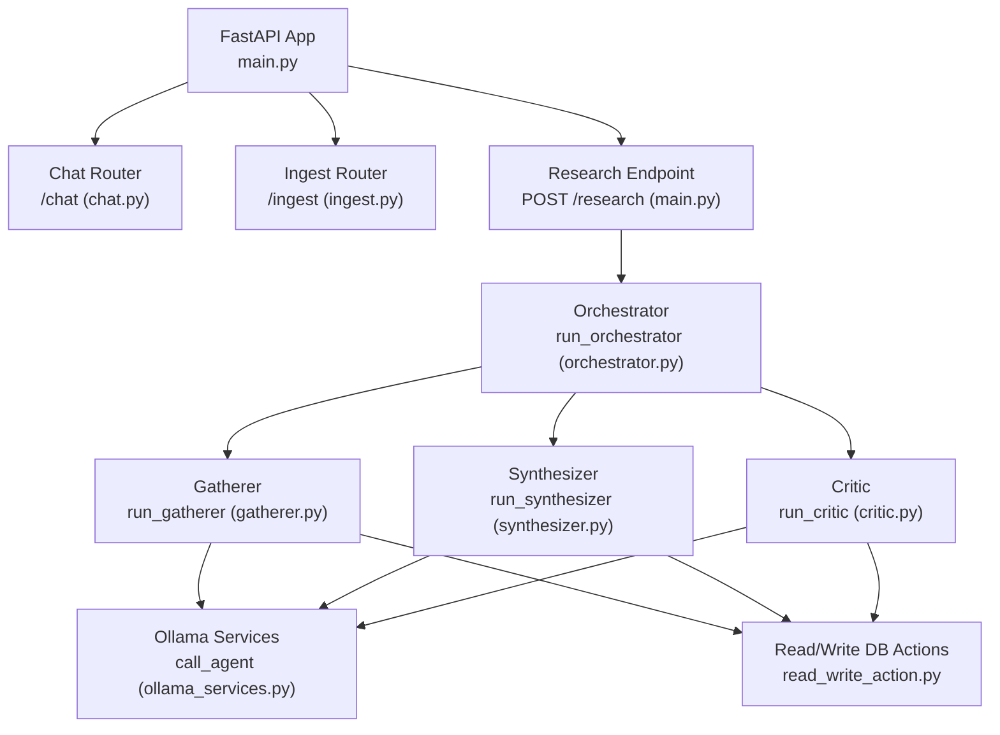
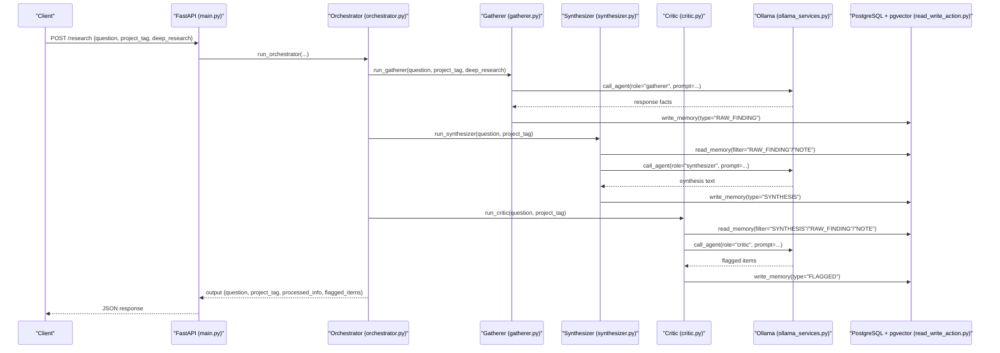
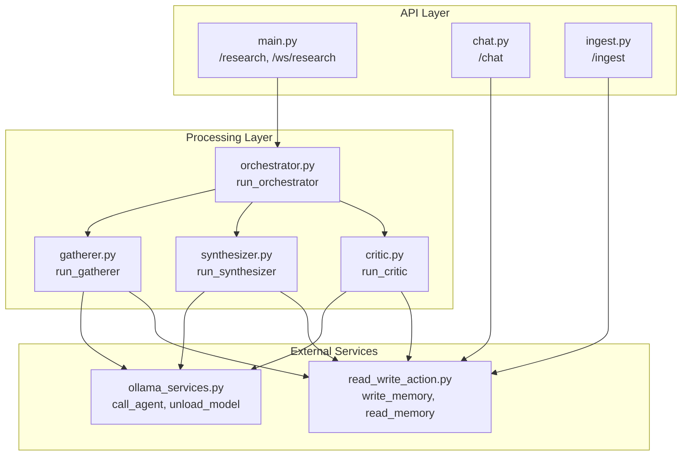

# REST API Endpoints

<cite>
**Referenced Files in This Document**
- [main.py](file://backend/main.py)
- [chat.py](file://backend/chat.py)
- [ingest.py](file://backend/ingest.py)
- [orchestrator.py](file://backend/orchestrator.py)
- [gatherer.py](file://backend/gatherer.py)
- [synthesizer.py](file://backend/synthesizer.py)
- [critic.py](file://backend/critic.py)
- [ollama_services.py](file://backend/ollama_services.py)
- [agent_config.py](file://backend/agent_config.py)
- [read_write_action.py](file://backend/read_write_action.py)
- [ws_events.py](file://backend/ws_events.py)
</cite>

## Table of Contents
1. [Introduction](#introduction)
2. [Project Structure](#project-structure)
3. [Core Components](#core-components)
4. [Architecture Overview](#architecture-overview)
5. [Detailed Component Analysis](#detailed-component-analysis)
6. [Dependency Analysis](#dependency-analysis)
7. [Performance Considerations](#performance-considerations)
8. [Troubleshooting Guide](#troubleshooting-guide)
9. [Conclusion](#conclusion)
10. [Appendices](#appendices)

## Introduction
This document provides comprehensive REST API documentation for Atlas Research endpoints, focusing on:
- POST /research: request schema, response structure, and error handling patterns
- /chat router: conversation endpoints with request/response schemas and authentication notes
- /ingest router: data ingestion endpoints including supported formats, validation rules, and processing workflows
It also includes HTTP method specifications, URL patterns, status codes, error responses, practical curl examples, JavaScript fetch implementations, rate limiting policies, CORS configuration, security considerations, common integration patterns, and troubleshooting guidance.

## Project Structure
The FastAPI application registers routers for chat and ingest under their respective prefixes and exposes a research endpoint at the root path. It also configures CORS to allow requests from the local frontend development server.

**Diagram sources**
- [main.py:11-13](file://backend/main.py#L11-L13)
- [orchestrator.py:12-94](file://backend/orchestrator.py#L12-L94)
- [gatherer.py:91-149](file://backend/gatherer.py#L91-L149)
- [synthesizer.py:31-101](file://backend/synthesizer.py#L31-L101)
- [critic.py:33-122](file://backend/critic.py#L33-L122)
- [ollama_services.py:4-17](file://backend/ollama_services.py#L4-L17)
- [read_write_action.py:14-31](file://backend/read_write_action.py#L14-L31)

**Section sources**
- [main.py:11-20](file://backend/main.py#L11-L20)

## Core Components
- Research endpoint: Validates input via Pydantic model and invokes the orchestrator pipeline. Returns structured output or raises an HTTP 404 when the pipeline returns None.
- Chat router: Provides a POST endpoint that queries a PostgreSQL database for synthesis context, calls Ollama for follow-up generation, and optionally persists user corrections back to the database.
- Ingest router: Accepts multipart uploads (.pdf, .md, .txt), extracts text, chunks content, and writes each chunk as a NOTE memory row with project tagging.

Key behaviors:
- Input validation is enforced by Pydantic models.
- Errors are returned as standard FastAPI HTTPException responses with JSON detail fields.
- The orchestrator emits structured events via WebSocket for real-time progress; the synchronous POST endpoint returns final results only.

**Section sources**
- [main.py:23-46](file://backend/main.py#L23-L46)
- [chat.py:13-72](file://backend/chat.py#L13-L72)
- [ingest.py:68-140](file://backend/ingest.py#L68-L140)
- [orchestrator.py:12-94](file://backend/orchestrator.py#L12-L94)

## Architecture Overview
The system integrates FastAPI endpoints with an internal multi-agent pipeline orchestrated by run_orchestrator. Agents interact with Ollama for LLM inference and use PostgreSQL with pgvector for semantic memory storage.

**Diagram sources**
- [main.py:34-46](file://backend/main.py#L34-L46)
- [orchestrator.py:12-94](file://backend/orchestrator.py#L12-L94)
- [gatherer.py:91-149](file://backend/gatherer.py#L91-L149)
- [synthesizer.py:31-101](file://backend/synthesizer.py#L31-L101)
- [critic.py:33-122](file://backend/critic.py#L33-L122)
- [ollama_services.py:4-17](file://backend/ollama_services.py#L4-L17)
- [read_write_action.py:14-31](file://backend/read_write_action.py#L14-L31)

## Detailed Component Analysis

### POST /research
- Method: POST
- URL: /research
- Request Body Schema:
  - question: string (required)
  - project_tag: string (required)
  - deep_research: boolean (optional, default false)
- Response:
  - question: string
  - project_tag: string
  - processed_info: string (synthesis text)
  - flagged_items: array (IDs of flagged items)
- Error Handling:
  - HTTP 404 with detail "Something went wrong" if the orchestrator returns None
  - Validation errors handled by FastAPI/Pydantic automatically return appropriate error responses

Practical usage:
- curl example:
  - curl -X POST http://localhost:8000/research -H "Content-Type: application/json" -d '{"question":"How does load balancing work?","project_tag":"demo","deep_research":true}'
- JavaScript fetch example:
  - fetch("http://localhost:8000/research", { method: "POST", headers: {"Content-Type":"application/json"}, body: JSON.stringify({question:"How does load balancing work?", project_tag:"demo", deep_research:true}) }).then(r=>r.json()).then(console.log)

Notes:
- For real-time progress, use the WebSocket endpoint /ws/research which streams structured events during pipeline execution.

**Section sources**
- [main.py:23-46](file://backend/main.py#L23-L46)
- [orchestrator.py:83-94](file://backend/orchestrator.py#L83-L94)

### /chat Router
- Base Path: /chat
- Endpoint: POST /chat
- Request Body Schema:
  - messages: array of objects with role and content fields
  - project_tag: string (required)
  - synthesis_id: integer (required)
  - save_correction: boolean (optional, default false)
  - correction_content: string (optional, default null)
- Authentication:
  - No explicit authentication middleware is implemented in the provided code. Access control should be added at the gateway or reverse proxy layer if required.
- Processing Flow:
  - Retrieves synthesis content from PostgreSQL using synthesis_id
  - Constructs a payload for Ollama with system prompts and messages
  - Calls Ollama to generate a reply
  - Optionally saves user corrections into the memories table
- Response:
  - If save_correction is true and correction_content is provided: { reply: string, correction_id: integer }
  - Otherwise: { reply: string }
- Error Handling:
  - HTTP 404 with detail "Not Found" if synthesis_id is not found
  - Database connection errors will raise HTTP exceptions from psycopg2

Practical usage:
- curl example:
  - curl -X POST http://localhost:8000/chat -H "Content-Type: application/json" -d '{"messages":[{"role":"user","content":"Can you clarify point 3?"}],"project_tag":"demo","synthesis_id":123,"save_correction":false}'
- JavaScript fetch example:
  - fetch("http://localhost:8000/chat", { method: "POST", headers: {"Content-Type":"application/json"}, body: JSON.stringify({messages:[{role:"user",content:"Can you clarify point 3?"}], project_tag:"demo", synthesis_id:123, save_correction:false}) }).then(r=>r.json()).then(console.log)

**Section sources**
- [chat.py:13-72](file://backend/chat.py#L13-L72)

### /ingest Router
- Base Path: /ingest
- Endpoint: POST /ingest
- Content Type: multipart/form-data
- Form Fields:
  - file: UploadFile (required) — supports .pdf, .md, .txt
  - project_tag: string (optional, default "untagged")
  - source_name: string (optional, defaults to filename if not provided)
- Supported Data Formats:
  - PDF: Text extracted using pypdf
  - Markdown: Split by H1/H2/H3 headers into sections
  - Plain Text: Chunked by word count with overlap
- Validation Rules:
  - File must be one of the supported types
  - UTF-8 encoding required for .md and .txt files
  - Extracted text must contain non-empty content
  - After processing, at least one chunk must be produced
- Processing Workflow:
  - Extract text based on file type
  - Chunk content appropriately
  - Write each chunk as a NOTE memory row with project_tag and source metadata
- Response:
  - chunks_written: integer (number of chunks written)
  - source: string (display name or filename)
  - project_tag: string (tag used for filtering)
- Error Handling:
  - HTTP 400 with detailed messages for unsupported file types, encoding issues, empty extraction, or no chunks produced

Practical usage:
- curl example:
  - curl -X POST http://localhost:8000/ingest -F "file=@document.pdf" -F "project_tag=demo" -F "source_name=My Document"
- JavaScript fetch example:
  - const formData = new FormData(); formData.append("file", fileInput.files[0]); formData.append("project_tag", "demo"); formData.append("source_name", "My Document"); fetch("http://localhost:8000/ingest", { method: "POST", body: formData }).then(r=>r.json()).then(console.log)

**Section sources**
- [ingest.py:68-140](file://backend/ingest.py#L68-L140)

## Dependency Analysis
The API endpoints depend on several core components:
- FastAPI for routing and request/response handling
- Pydantic for request validation
- PostgreSQL with pgvector for semantic memory storage
- Ollama for LLM inference
- Internal agents (Gatherer, Synthesizer, Critic) orchestrated by the main orchestrator

**Diagram sources**
- [main.py:11-13](file://backend/main.py#L11-L13)
- [orchestrator.py:12-94](file://backend/orchestrator.py#L12-L94)
- [gatherer.py:91-149](file://backend/gatherer.py#L91-L149)
- [synthesizer.py:31-101](file://backend/synthesizer.py#L31-L101)
- [critic.py:33-122](file://backend/critic.py#L33-L122)
- [ollama_services.py:4-17](file://backend/ollama_services.py#L4-L17)
- [read_write_action.py:14-31](file://backend/read_write_action.py#L14-L31)

**Section sources**
- [main.py:11-20](file://backend/main.py#L11-L20)
- [orchestrator.py:12-94](file://backend/orchestrator.py#L12-L94)

## Performance Considerations
- The research pipeline processes multiple stages sequentially: gathering, synthesizing, and critiquing. Each stage involves external API calls to Ollama and database operations.
- Model loading/unloading is optimized by pre-warming the critic model and unloading models between stages to manage memory usage.
- WebSocket streaming allows clients to receive real-time updates without blocking the HTTP request-response cycle.
- Database operations use vector embeddings for semantic search, which may impact query performance depending on dataset size.
- Consider implementing rate limiting at the API gateway level to prevent abuse and ensure fair resource allocation.

## Troubleshooting Guide
Common issues and resolutions:
- Research endpoint returns 404: This occurs when the orchestrator returns None, typically due to failures in any pipeline stage. Check logs for specific agent failures.
- Chat endpoint returns 404: Indicates the specified synthesis_id was not found in the database. Verify the synthesis was created successfully before attempting follow-up conversations.
- Ingest endpoint returns 400: Check file format support, encoding issues (UTF-8 required for text files), and ensure the file contains extractable content.
- Database connection errors: Ensure PostgreSQL is running and accessible with the correct credentials configured in the backend.
- Ollama service unavailable: Verify Ollama is running on localhost:11434 and responding to requests.

**Section sources**
- [main.py:43-46](file://backend/main.py#L43-L46)
- [chat.py:31-35](file://backend/chat.py#L31-L35)
- [ingest.py:90-122](file://backend/ingest.py#L90-L122)

## Conclusion
The Atlas Research API provides a comprehensive set of endpoints for research automation, conversational follow-ups, and data ingestion. The architecture leverages FastAPI for robust API handling, integrates with Ollama for AI capabilities, and uses PostgreSQL with pgvector for semantic memory management. The system supports real-time progress tracking through WebSocket connections and provides structured error handling for reliable integration.

## Appendices

### CORS Configuration
The application is configured to allow cross-origin requests from the local frontend development server:
- Allow origins: ["http://localhost:5173"]
- Allow methods: ["*"]
- Allow headers: ["*"]

### Rate Limiting Policies
No explicit rate limiting is implemented in the current codebase. Consider adding rate limiting at the API gateway or using FastAPI middleware to protect against excessive requests.

### Security Considerations
- No authentication middleware is currently implemented. Add authentication at the gateway or implement JWT-based authentication for production deployments.
- Database credentials are hardcoded in the backend. Use environment variables or secure configuration management for production.
- Validate and sanitize all user inputs to prevent injection attacks.
- Implement proper error handling to avoid exposing sensitive information in error responses.

### WebSocket Events
The WebSocket endpoint /ws/research streams structured events during pipeline execution. Event types include:
- pipeline_started, agent_started, agent_completed
- search_started, search_completed, source_started, source_fetch_completed
- memory_written, synthesizer_started, synthesizer_completed
- critic_started, critic_completed, pipeline_completed
- pipeline_error, pipeline_stopped

Each event contains a type, timestamp, and data object with relevant details about the pipeline state and progress.

**Section sources**
- [main.py:15-20](file://backend/main.py#L15-L20)
- [ws_events.py:3-14](file://backend/ws_events.py#L3-L14)