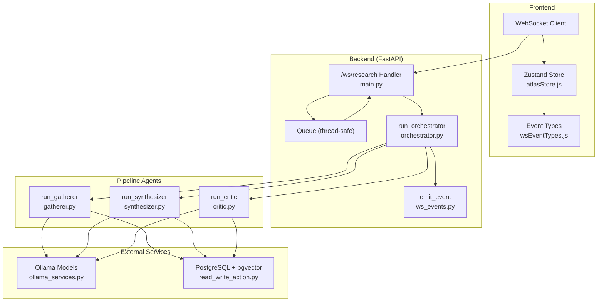
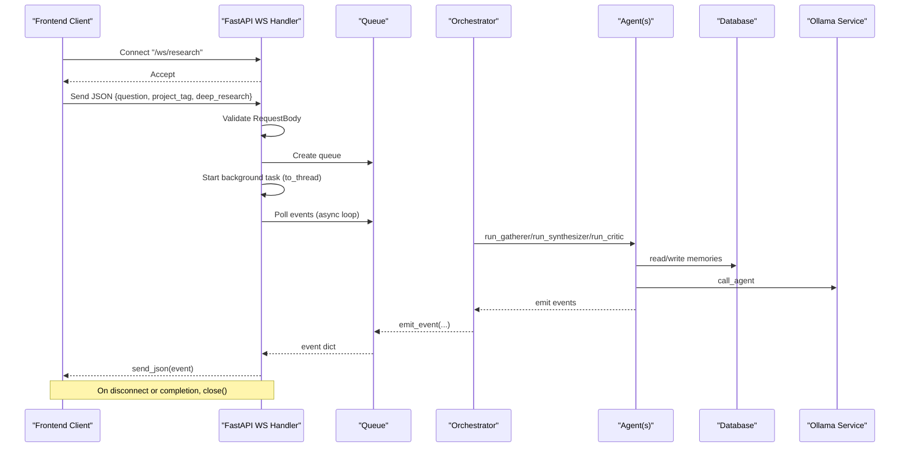
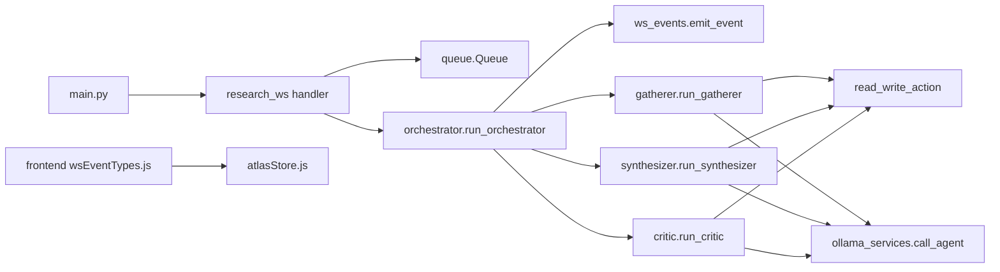

# WebSocket API

<cite>
**Referenced Files in This Document**
- [main.py](file://backend/main.py)
- [ws_events.py](file://backend/ws_events.py)
- [orchestrator.py](file://backend/orchestrator.py)
- [gatherer.py](file://backend/gatherer.py)
- [synthesizer.py](file://backend/synthesizer.py)
- [critic.py](file://backend/critic.py)
- [ollama_services.py](file://backend/ollama_services.py)
- [read_write_action.py](file://backend/read_write_action.py)
- [wsEventTypes.js](file://frontend/src/utils/wsEventTypes.js)
- [atlasStore.js](file://frontend/src/store/atlasStore.js)
</cite>

## Table of Contents
1. Introduction
2. Project Structure
3. Core Components
4. Architecture Overview
5. Detailed Component Analysis
6. Dependency Analysis
7. Performance Considerations
8. Troubleshooting Guide
9. Conclusion

## Introduction
This document provides a comprehensive guide to the real-time communication layer used by Atlas Research, centered on the WebSocket endpoint /ws/research. It explains how connections are established, how messages flow between the frontend and backend, and how the event-driven pipeline emits continuous updates for research progress, agent activity, synthesis results, and errors. It also covers connection management patterns, reconnection strategies, error handling, payload schemas, performance considerations, and debugging techniques.

## Project Structure
The WebSocket implementation spans both backend and frontend:
- Backend: FastAPI application defines the /ws/research endpoint, orchestrates the research pipeline via a thread-safe queue, and emits structured events through a helper function.
- Frontend: A centralized event type catalog ensures consistent handling of all incoming WebSocket events.

**Diagram sources**
- [main.py:71-110](file://backend/main.py#L71-L110)
- [orchestrator.py:12-94](file://backend/orchestrator.py#L12-L94)
- [gatherer.py:91-149](file://backend/gatherer.py#L91-L149)
- [synthesizer.py:31-100](file://backend/synthesizer.py#L31-L100)
- [critic.py:33-119](file://backend/critic.py#L33-L119)
- [ws_events.py:3-13](file://backend/ws_events.py#L3-L13)
- [ollama_services.py:4-17](file://backend/ollama_services.py#L4-L17)
- [read_write_action.py:14-31](file://backend/read_write_action.py#L14-L31)
- [wsEventTypes.js:1-44](file://frontend/src/utils/wsEventTypes.js#L1-L44)
- [atlasStore.js:12-34](file://frontend/src/store/atlasStore.js#L12-L34)

**Section sources**
- [main.py:71-110](file://backend/main.py#L71-L110)
- [wsEventTypes.js:1-44](file://frontend/src/utils/wsEventTypes.js#L1-L44)
- [atlasStore.js:12-34](file://frontend/src/store/atlasStore.js#L12-L34)

## Core Components
- WebSocket Endpoint (/ws/research): Accepts a JSON request body, validates it, starts the pipeline in a background thread, and streams events back to the client over the WebSocket.
- Event Emission Helper: Normalizes all emitted events into a consistent structure with type, timestamp, and data fields.
- Orchestrator: Coordinates the pipeline stages (Gatherer, Synthesizer, Critic), emitting lifecycle and progress events.
- Pipeline Agents: Each agent emits detailed events about its work, including search, source processing, synthesis generation, and critique outcomes.
- Frontend Event Catalog: Centralized constants for event types ensure consistent handling across the UI.

Key responsibilities:
- Connection lifecycle: accept, validate, stream, close.
- Message schema: uniform event envelope with type, timestamp, data.
- Error signaling: pipeline_error and per-agent failure indicators.
- State synchronization: frontend updates store based on events.

**Section sources**
- [main.py:23-27](file://backend/main.py#L23-L27)
- [main.py:71-110](file://backend/main.py#L71-L110)
- [ws_events.py:3-13](file://backend/ws_events.py#L3-L13)
- [orchestrator.py:12-94](file://backend/orchestrator.py#L12-L94)
- [gatherer.py:91-149](file://backend/gatherer.py#L91-L149)
- [synthesizer.py:31-100](file://backend/synthesizer.py#L31-L100)
- [critic.py:33-119](file://backend/critic.py#L33-L119)
- [wsEventTypes.js:1-44](file://frontend/src/utils/wsEventTypes.js#L1-L44)

## Architecture Overview
The WebSocket architecture is event-driven and asynchronous:
- The client connects to /ws/research and sends an initialization message containing the research parameters.
- The server validates the request and spawns a background task that runs the orchestrator on a worker thread.
- The orchestrator calls each agent sequentially, emitting structured events via the emit helper.
- Events are queued and streamed back to the client as they become available.
- On completion or error, the server closes the connection gracefully.

**Diagram sources**
- [main.py:71-110](file://backend/main.py#L71-L110)
- [orchestrator.py:12-94](file://backend/orchestrator.py#L12-L94)
- [gatherer.py:91-149](file://backend/gatherer.py#L91-L149)
- [synthesizer.py:31-100](file://backend/synthesizer.py#L31-L100)
- [critic.py:33-119](file://backend/critic.py#L33-L119)
- [ollama_services.py:4-17](file://backend/ollama_services.py#L4-L17)
- [read_write_action.py:14-31](file://backend/read_write_action.py#L14-L31)

## Detailed Component Analysis

### WebSocket Endpoint: /ws/research
- Accepts a WebSocket connection and reads a single JSON message.
- Validates the request using a Pydantic model with fields question, project_tag, and deep_research.
- Spawns a background thread to run the orchestrator without blocking the event loop.
- Streams events from a queue until completion or client disconnect.
- Handles validation errors by sending a pipeline_error event and closing the connection.

Connection lifecycle:
- Establish: accept()
- Initialize: receive_json() and validate
- Stream: poll queue and send_json(event)
- Terminate: break on sentinel None or handle WebSocketDisconnect; then close()

Error handling:
- Validation failures produce a structured pipeline_error event with details.
- Unexpected exceptions during pipeline execution are captured and emitted as pipeline_error before termination.

**Section sources**
- [main.py:23-27](file://backend/main.py#L23-L27)
- [main.py:71-110](file://backend/main.py#L71-L110)

### Event Emission Helper: ws_events.emit_event
- Ensures every event follows a consistent envelope: {type, timestamp, data}.
- If emit is None (e.g., CLI mode), it becomes a no-op, enabling reuse outside WebSocket contexts.

Payload structure:
- type: string identifying the event kind
- timestamp: numeric time when the event was created
- data: object containing event-specific fields

**Section sources**
- [ws_events.py:3-13](file://backend/ws_events.py#L3-L13)

### Orchestrator: run_orchestrator
- Emits pipeline_started with initial parameters.
- Runs Gatherer, Synthesizer, and Critic in sequence, emitting agent lifecycle events and durations.
- Manages VRAM swapping by unloading and loading models between stages.
- Reads synthesized output from memory and returns final output.
- Emits pipeline_completed with aggregated results and total duration.

Key events:
- pipeline_started, agent_started, agent_completed
- model_unload_started/completed, model_load_started/completed
- pipeline_stopped (early termination reasons)
- pipeline_completed (final output and timing)

**Section sources**
- [orchestrator.py:12-94](file://backend/orchestrator.py#L12-L94)

### Gatherer: run_gatherer
- Performs web search and processes multiple sources.
- For each source, emits start, fetch, generation, and write events.
- Implements fallback logic with reserve URLs and reports exhaustion.
- Emits gatherer_completed with fact counts and duration.

Important events:
- search_started, search_completed
- source_started, source_fetch_completed, source_generation_completed
- source_replaced, source_exhausted
- memory_written (RAW_FINDING)
- gatherer_completed

**Section sources**
- [gatherer.py:91-149](file://backend/gatherer.py#L91-L149)

### Synthesizer: run_synthesizer
- Retrieves RAW_FINDINGs and NOTEs according to adaptive limits.
- Builds prompts and generates synthesis content via Ollama.
- Marks previous SYNTHESIS entries as superseded before writing new ones.
- Emits findings retrieval, generation, and memory write events.

Important events:
- synthesizer_started, synthesizer_skipped
- findings_retrieved, notes_retrieved
- synthesizer_generation_completed
- synthesis_superseded
- memory_written (SYNTHESIS)
- synthesizer_completed

**Section sources**
- [synthesizer.py:31-100](file://backend/synthesizer.py#L31-L100)

### Critic: run_critic
- Reviews synthesis against raw findings and notes.
- Emits generation outcomes and writes flagged items to memory.
- Supports early skip conditions if no findings or synthesis exist.

Important events:
- critic_started, critic_skipped
- findings_retrieved, notes_retrieved
- critic_generation_completed
- memory_written (FLAGGED)
- critic_completed

**Section sources**
- [critic.py:33-119](file://backend/critic.py#L33-L119)

### External Integrations: Ollama and Database
- Ollama integration handles model calls and VRAM management (unload/load).
- Database operations use PostgreSQL with pgvector for semantic search and memory persistence.

**Section sources**
- [ollama_services.py:4-17](file://backend/ollama_services.py#L4-L17)
- [read_write_action.py:14-31](file://backend/read_write_action.py#L14-L31)

### Frontend Event Catalog and Store
- wsEventTypes.js centralizes all event type strings for consistent handling.
- atlasStore.js maintains UI state such as pipeline stage, errors, synthesis results, and data shards.

Usage patterns:
- Subscribe to events and update store fields accordingly.
- Use event types from wsEventTypes.js to avoid typos and maintain consistency.

**Section sources**
- [wsEventTypes.js:1-44](file://frontend/src/utils/wsEventTypes.js#L1-L44)
- [atlasStore.js:12-34](file://frontend/src/store/atlasStore.js#L12-L34)

## Dependency Analysis
The WebSocket system has clear separation of concerns:
- main.py wires the endpoint and manages the queue-based streaming.
- orchestrator.py coordinates agents and emits lifecycle events.
- Each agent module focuses on its domain and emits granular progress events.
- ws_events.py standardizes event envelopes.
- Frontend uses wsEventTypes.js for event mapping and atlasStore.js for state synchronization.

**Diagram sources**
- [main.py:71-110](file://backend/main.py#L71-L110)
- [orchestrator.py:12-94](file://backend/orchestrator.py#L12-L94)
- [gatherer.py:91-149](file://backend/gatherer.py#L91-L149)
- [synthesizer.py:31-100](file://backend/synthesizer.py#L31-L100)
- [critic.py:33-119](file://backend/critic.py#L33-L119)
- [ws_events.py:3-13](file://backend/ws_events.py#L3-L13)
- [ollama_services.py:4-17](file://backend/ollama_services.py#L4-L17)
- [read_write_action.py:14-31](file://backend/read_write_action.py#L14-L31)
- [wsEventTypes.js:1-44](file://frontend/src/utils/wsEventTypes.js#L1-L44)
- [atlasStore.js:12-34](file://frontend/src/store/atlasStore.js#L12-L34)

**Section sources**
- [main.py:71-110](file://backend/main.py#L71-L110)
- [orchestrator.py:12-94](file://backend/orchestrator.py#L12-L94)
- [wsEventTypes.js:1-44](file://frontend/src/utils/wsEventTypes.js#L1-L44)
- [atlasStore.js:12-34](file://frontend/src/store/atlasStore.js#L12-L34)

## Performance Considerations
- Asynchronous streaming: The endpoint polls the queue asynchronously to avoid blocking the event loop while waiting for events.
- Background pipeline execution: The orchestrator runs on a worker thread to keep the WebSocket coroutine responsive.
- Memory management: VRAM swapping events indicate model unload/load phases; clients can reflect these states to users.
- Data shard limits: The frontend caps stored shards to prevent unbounded growth.
- Adaptive limits: Synthesizer and Critic compute limits based on available findings to balance workload and response quality.

Recommendations:
- Implement client-side message queuing to buffer high-frequency events and render them efficiently.
- Debounce UI updates to reduce re-renders during rapid event bursts.
- Monitor queue sizes and event throughput to detect bottlenecks.
- Use connection pooling and efficient serialization on the backend where applicable.

[No sources needed since this section provides general guidance]

## Troubleshooting Guide
Common issues and approaches:
- Invalid request payload: The endpoint sends a pipeline_error event with details and closes the connection. Verify the RequestBody schema and field values.
- Early client disconnect: The backend catches WebSocketDisconnect and exits gracefully; ensure the client reconnects if needed.
- Pipeline errors: Exceptions during orchestration are captured and emitted as pipeline_error before termination. Inspect the error message in the data field.
- Model load/unload delays: Observe model_* events to understand VRAM swapping behavior; adjust client UI accordingly.
- Database connectivity: Errors in memory operations may surface as pipeline_error; verify database credentials and availability.

Debugging techniques:
- Log event types and timestamps on both sides to correlate flows.
- Use browser DevTools Network tab to inspect WebSocket frames.
- Add client-side counters for received events per type to detect drops or duplicates.
- Monitor backend logs for timing annotations and warnings.

**Section sources**
- [main.py:71-110](file://backend/main.py#L71-L110)
- [ws_events.py:3-13](file://backend/ws_events.py#L3-L13)
- [orchestrator.py:12-94](file://backend/orchestrator.py#L12-L94)

## Conclusion
The Atlas Research WebSocket API provides a robust, event-driven interface for real-time research pipeline updates. By standardizing event envelopes, separating concerns across modules, and leveraging asynchronous streaming, the system delivers timely feedback to the frontend while maintaining responsiveness. Following the documented connection lifecycle, event catalog, and best practices will help implement resilient clients and effective monitoring.

[No sources needed since this section summarizes without analyzing specific files]