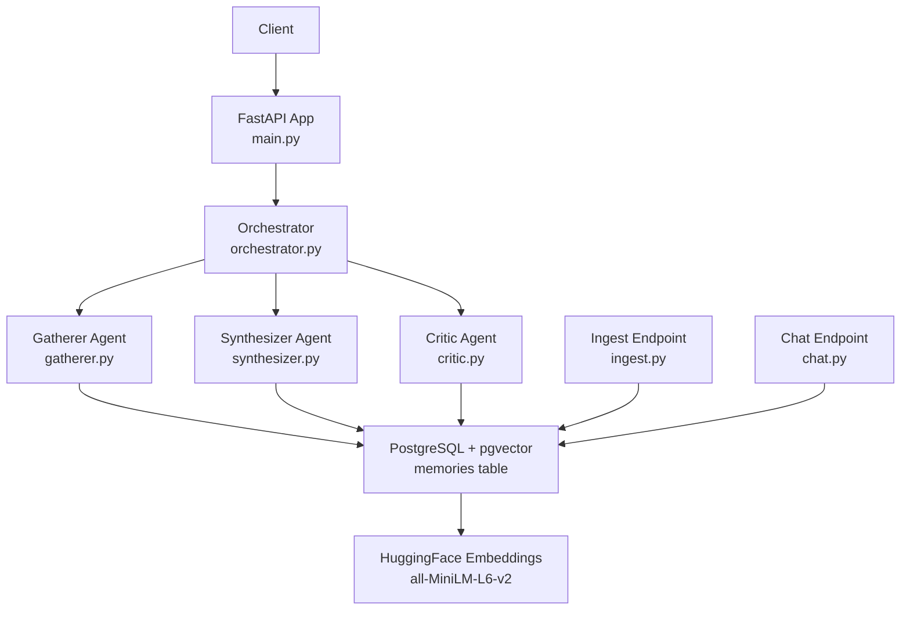
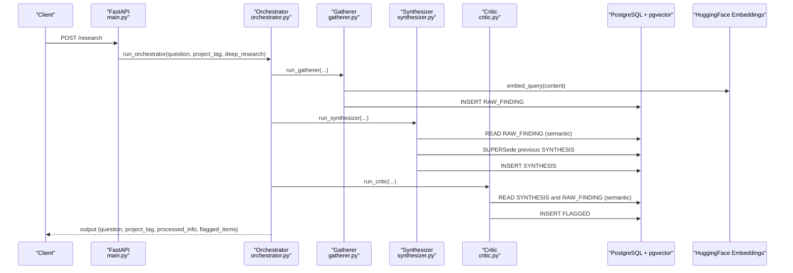
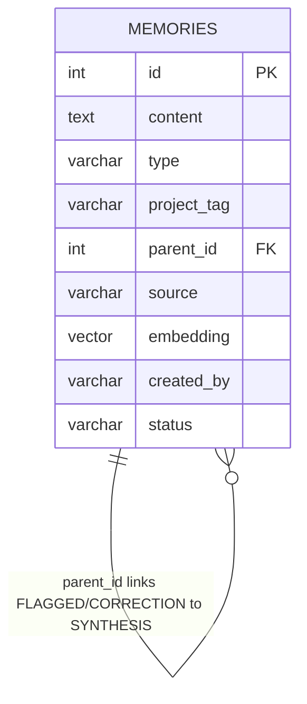
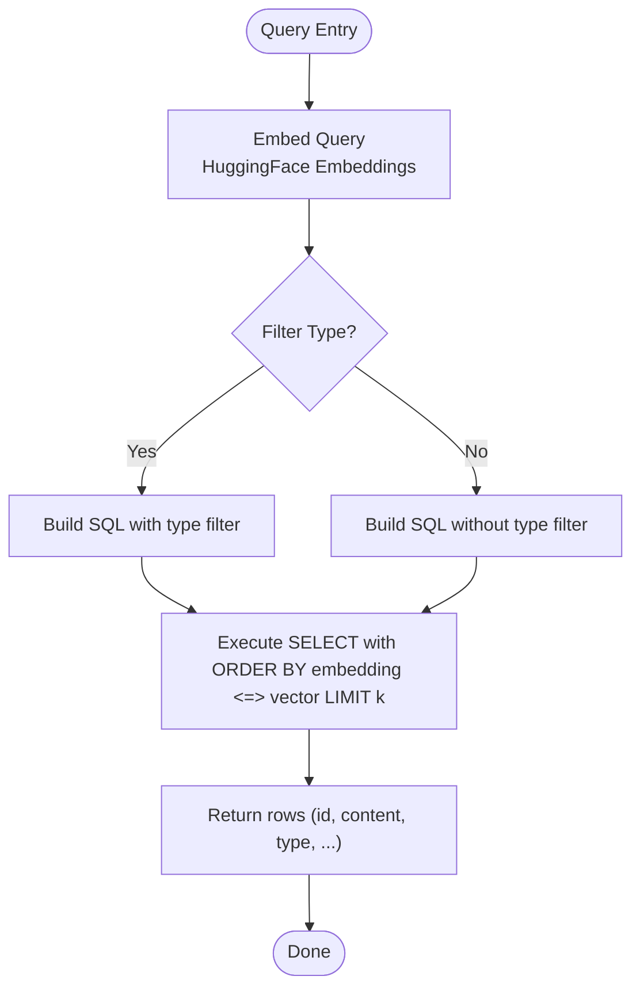
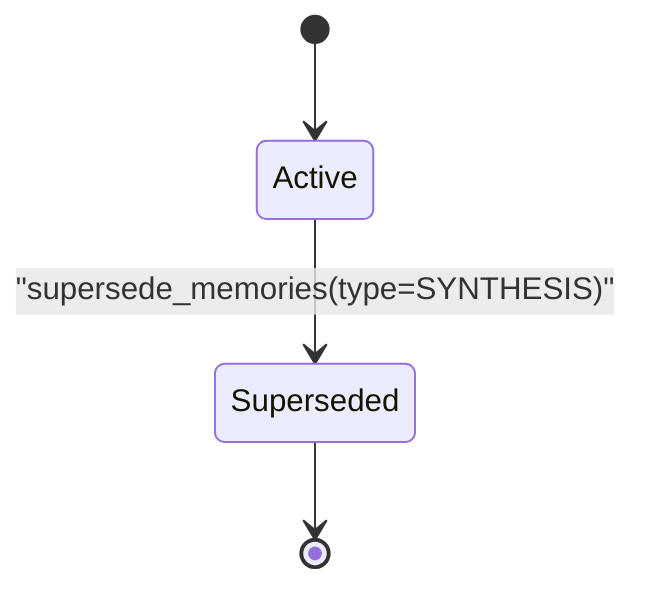
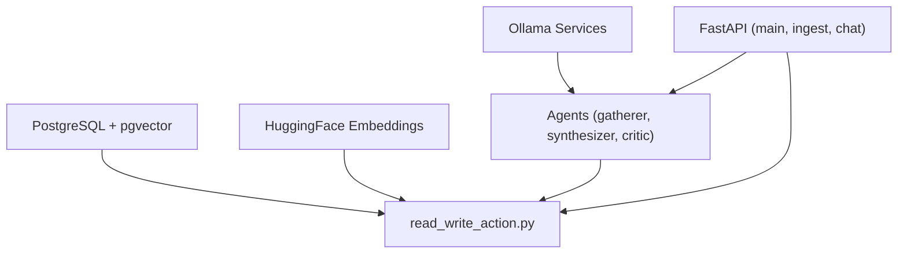

# Data Management & Memory System

<cite>
**Referenced Files in This Document**
- [main.py](file://backend/main.py)
- [orchestrator.py](file://backend/orchestrator.py)
- [gatherer.py](file://backend/gatherer.py)
- [synthesizer.py](file://backend/synthesizer.py)
- [critic.py](file://backend/critic.py)
- [read_write_action.py](file://backend/read_write_action.py)
- [ingest.py](file://backend/ingest.py)
- [chat.py](file://backend/chat.py)
- [ollama_services.py](file://backend/ollama_services.py)
- [agent_config.py](file://backend/agent_config.py)
</cite>

## Table of Contents
1. [Introduction](#introduction)
2. [Project Structure](#project-structure)
3. [Core Components](#core-components)
4. [Architecture Overview](#architecture-overview)
5. [Detailed Component Analysis](#detailed-component-analysis)
6. [Dependency Analysis](#dependency-analysis)
7. [Performance Considerations](#performance-considerations)
8. [Troubleshooting Guide](#troubleshooting-guide)
9. [Conclusion](#conclusion)
10. [Appendices](#appendices)

## Introduction
This document provides comprehensive data model documentation for the Atlas Research memory system built on PostgreSQL with pgvector. It details the entity relationships among RAW_FINDING, SYNTHESIS, and FLAGGED memory records that persist across a three-agent pipeline (Gatherer → Synthesizer → Critic). It explains semantic search using HuggingFace embeddings for similarity matching between research queries and stored facts, documents schema fields and constraints inferred from code, outlines data access patterns, caching strategies, query optimization techniques, lifecycle management, security considerations, backup strategies, migration paths, and common integration patterns for extending the memory system with new data types.

## Project Structure
The backend exposes FastAPI endpoints and orchestrates a multi-agent pipeline that writes and reads memories from PostgreSQL via psycopg2 and pgvector. The key modules are:
- API entrypoints: main.py, ingest.py, chat.py
- Pipeline orchestration: orchestrator.py
- Agents: gatherer.py, synthesizer.py, critic.py
- Database layer: read_write_action.py
- LLM integration: ollama_services.py, agent_config.py

**Diagram sources**
- [main.py:1-110](file://backend/main.py#L1-L110)
- [orchestrator.py:1-98](file://backend/orchestrator.py#L1-L98)
- [gatherer.py:1-152](file://backend/gatherer.py#L1-L152)
- [synthesizer.py:1-101](file://backend/synthesizer.py#L1-L101)
- [critic.py:1-122](file://backend/critic.py#L1-L122)
- [ingest.py:1-140](file://backend/ingest.py#L1-L140)
- [chat.py:1-72](file://backend/chat.py#L1-L72)
- [read_write_action.py:1-100](file://backend/read_write_action.py#L1-L100)

**Section sources**
- [main.py:1-110](file://backend/main.py#L1-L110)
- [orchestrator.py:1-98](file://backend/orchestrator.py#L1-L98)

## Core Components
- memories table: Central store for all memory rows including RAW_FINDING, SYNTHESIS, NOTE, FLAGGED, and CORRECTION. Fields include id, content, type, project_tag, parent_id, source, embedding, created_by, and status. Status values used include ACTIVE and SUPERSEDED.
- Semantic search: Implemented by computing embeddings for queries and performing vector similarity ordering using the <=> operator against the embedding column.
- Lifecycle management:
  - Creation: Gatherer writes RAW_FINDING; Ingest writes NOTE; Synthesizer writes SYNTHESIS; Critic writes FLAGGED; Chat can write CORRECTION.
  - Updates: Synthesis superseding marks prior SYNTHESIS rows as SUPERSEDED before writing a new one.
  - Archival: Rows are not deleted but marked SUPERSEDED to avoid competing in future searches.

Key operations:
- write_memory(content, type, created_by, parent_id, source, project_tag): Inserts a row and returns its id.
- read_memory(query, filter, limit, project_tag): Performs semantic search with optional type filter.
- count_memories(type, project_tag): Counts ACTIVE rows by type and project_tag.
- supersede_memories(type, project_tag): Marks existing ACTIVE rows as SUPERSEDED.

**Section sources**
- [read_write_action.py:14-31](file://backend/read_write_action.py#L14-L31)
- [read_write_action.py:33-51](file://backend/read_write_action.py#L33-L51)
- [read_write_action.py:54-73](file://backend/read_write_action.py#L54-L73)
- [read_write_action.py:76-97](file://backend/read_write_action.py#L76-L97)
- [gatherer.py:68-86](file://backend/gatherer.py#L68-L86)
- [synthesizer.py:79-95](file://backend/synthesizer.py#L79-L95)
- [critic.py:106-113](file://backend/critic.py#L106-L113)
- [ingest.py:123-134](file://backend/ingest.py#L123-L134)
- [chat.py:57-67](file://backend/chat.py#L57-L67)

## Architecture Overview
The memory system integrates with the three-agent pipeline through shared database operations and semantic search. Each agent writes specific memory types and uses the same embedding model to ensure consistent similarity semantics.

**Diagram sources**
- [main.py:34-46](file://backend/main.py#L34-L46)
- [orchestrator.py:12-94](file://backend/orchestrator.py#L12-L94)
- [gatherer.py:91-149](file://backend/gatherer.py#L91-L149)
- [synthesizer.py:31-100](file://backend/synthesizer.py#L31-L100)
- [critic.py:33-119](file://backend/critic.py#L33-L119)
- [read_write_action.py:14-31](file://backend/read_write_action.py#L14-L31)
- [read_write_action.py:33-51](file://backend/read_write_action.py#L33-L51)

## Detailed Component Analysis

### Schema and Entity Relationships
The memories table stores heterogeneous memory types. Relationships are primarily logical via type and parent_id:
- RAW_FINDING: Atomic facts extracted by the Gatherer.
- NOTE: Chunks ingested from user documents.
- SYNTHESIS: Aggregated synthesis per project_tag; superseded versions are marked SUPERSEDED.
- FLAGGED: Issues identified by the Critic, linked to a SYNTHESIS via parent_id.
- CORRECTION: User corrections saved during follow-up chat, linked to a SYNTHESIS via parent_id.

**Diagram sources**
- [read_write_action.py:22](file://backend/read_write_action.py#L22)
- [read_write_action.py:42-44](file://backend/read_write_action.py#L42-L44)
- [read_write_action.py:87-90](file://backend/read_write_action.py#L87-L90)
- [chat.py:59](file://backend/chat.py#L59)

Field definitions and constraints inferred from usage:
- id: integer primary key (auto-incremented via returning id).
- content: text storing the memory payload.
- type: string discriminator (RAW_FINDING, NOTE, SYNTHESIS, FLAGGED, CORRECTION).
- project_tag: string for partitioning scope across projects.
- parent_id: nullable integer linking child records (FLAGGED, CORRECTION) to parent SYNTHESIS.
- source: string indicating origin (e.g., URL, "synthesizer", "critic", "user", "followup").
- embedding: vector column for semantic similarity (pgvector).
- created_by: string identifying the producer (gatherer, user, critic, followup).
- status: string state (ACTIVE, SUPERSEDED).

Constraints and integrity:
- No explicit foreign keys defined in code; parent_id is used logically.
- Status filtering ensures only ACTIVE rows participate in semantic search.
- Superseding prevents stale SYNTHESIS rows from competing in retrieval.

**Section sources**
- [read_write_action.py:22](file://backend/read_write_action.py#L22)
- [read_write_action.py:42-44](file://backend/read_write_action.py#L42-L44)
- [read_write_action.py:87-90](file://backend/read_write_action.py#L87-L90)
- [gatherer.py:70-73](file://backend/gatherer.py#L70-L73)
- [synthesizer.py:82-95](file://backend/synthesizer.py#L82-L95)
- [critic.py:108-113](file://backend/critic.py#L108-L113)
- [ingest.py:126-133](file://backend/ingest.py#L126-L133)
- [chat.py:59](file://backend/chat.py#L59)

### Semantic Search Implementation
Semantic search is implemented by embedding both content and queries using HuggingFace's all-MiniLM-L6-v2 model. Queries are embedded and compared to stored vectors using the cosine-like distance operator (<=>) to retrieve top-k results filtered by project_tag and optionally type.

**Diagram sources**
- [read_write_action.py:33-51](file://backend/read_write_action.py#L33-L51)

Data access patterns:
- Write path: content → embed_query → INSERT into memories → return id.
- Read path: query → embed_query → SELECT with WHERE project_tag AND status='ACTIVE' AND (optional type) ORDER BY embedding <=> vector LIMIT k.
- Count path: SELECT COUNT(*) WHERE status='ACTIVE' AND project_tag AND type.
- Supersede path: UPDATE SET status='SUPERSEDED' WHERE status='ACTIVE' AND type AND project_tag.

Optimization techniques:
- Use of pgvector index (recommended) on embedding column for faster nearest neighbor search.
- Filtering by project_tag and status reduces result set size before vector comparison.
- Adaptive limits based on available counts prevent excessive retrieval.

**Section sources**
- [read_write_action.py:14-31](file://backend/read_write_action.py#L14-L31)
- [read_write_action.py:33-51](file://backend/read_write_action.py#L33-L51)
- [read_write_action.py:54-73](file://backend/read_write_action.py#L54-L73)
- [read_write_action.py:76-97](file://backend/read_write_action.py#L76-L97)

### Data Lifecycle Management
Creation:
- RAW_FINDING: Created by Gatherer when extracting facts from web sources.
- NOTE: Created by Ingest endpoint when chunking uploaded documents.
- SYNTHESIS: Created by Synthesizer after aggregating findings and notes.
- FLAGGED: Created by Critic when issues are found in synthesis.
- CORRECTION: Created by Chat endpoint when users save corrections.

Updates:
- SYNTHESIS superseding: Prior ACTIVE SYNTHESIS rows are marked SUPERSEDED before writing a new one.

Archival policies:
- Rows are not deleted; instead, they are marked SUPERSEDED to maintain history while excluding them from active search.

**Diagram sources**
- [read_write_action.py:76-97](file://backend/read_write_action.py#L76-L97)

**Section sources**
- [gatherer.py:68-86](file://backend/gatherer.py#L68-L86)
- [ingest.py:123-134](file://backend/ingest.py#L123-L134)
- [synthesizer.py:79-95](file://backend/synthesizer.py#L79-L95)
- [critic.py:106-113](file://backend/critic.py#L106-L113)
- [chat.py:57-67](file://backend/chat.py#L57-L67)
- [read_write_action.py:76-97](file://backend/read_write_action.py#L76-L97)

### Integration Patterns and Extension Points
Extending the memory system with new data types involves:
- Defining a new type string (e.g., "ANNOTATION").
- Writing rows via write_memory with appropriate metadata (source, created_by, parent_id if applicable).
- Optionally reading with read_memory using filter="ANNOTATION".
- If needed, implement superseding logic similar to SYNTHESIS.

Example extension pattern:
- Create ANNOTATION rows during post-processing or user feedback loops.
- Link to SYNTHESIS via parent_id for traceability.
- Include project_tag to scope retrieval.

**Section sources**
- [read_write_action.py:14-31](file://backend/read_write_action.py#L14-L31)
- [read_write_action.py:33-51](file://backend/read_write_action.py#L33-L51)
- [synthesizer.py:82-95](file://backend/synthesizer.py#L82-L95)

## Dependency Analysis
The memory system depends on several components:
- PostgreSQL with pgvector for storage and vector similarity.
- HuggingFace embeddings for generating vector representations.
- Ollama for LLM generation used by agents.
- FastAPI for HTTP/WebSocket endpoints.

**Diagram sources**
- [read_write_action.py:1-12](file://backend/read_write_action.py#L1-L12)
- [ollama_services.py:1-26](file://backend/ollama_services.py#L1-L26)
- [main.py:1-110](file://backend/main.py#L1-L110)
- [gatherer.py:1-152](file://backend/gatherer.py#L1-L152)
- [synthesizer.py:1-101](file://backend/synthesizer.py#L1-L101)
- [critic.py:1-122](file://backend/critic.py#L1-L122)

**Section sources**
- [read_write_action.py:1-12](file://backend/read_write_action.py#L1-L12)
- [ollama_services.py:1-26](file://backend/ollama_services.py#L1-L26)
- [main.py:1-110](file://backend/main.py#L1-L110)

## Performance Considerations
- Vector indexing: Implement a pgvector index on the embedding column to accelerate nearest neighbor searches.
- Connection pooling: Replace per-call connections with a connection pool to reduce overhead.
- Embedding cache: Cache embeddings for repeated content to avoid recomputation.
- Batch operations: Batch inserts where possible to reduce transaction overhead.
- Adaptive limits: Continue using adaptive retrieval limits to control payload sizes for LLM prompts.
- Model warm-up: Pre-warm models as done in orchestrator to reduce latency.

[No sources needed since this section provides general guidance]

## Troubleshooting Guide
Common issues and resolutions:
- No results returned: Ensure project_tag matches and status is ACTIVE. Verify embeddings are generated correctly.
- Format failures: Agents must adhere to expected formats (FACT:, FLAG:). Check logs for format warnings.
- Stale synthesis results: Ensure supersede_memories is called before writing new SYNTHESIS.
- Connection errors: Validate database credentials and pgvector registration.

**Section sources**
- [gatherer.py:56-63](file://backend/gatherer.py#L56-L63)
- [critic.py:97-101](file://backend/critic.py#L97-L101)
- [synthesizer.py:79-83](file://backend/synthesizer.py#L79-L83)
- [read_write_action.py:16-17](file://backend/read_write_action.py#L16-L17)

## Conclusion
The Atlas Research memory system leverages PostgreSQL with pgvector to enable semantic search across heterogeneous memory types. The three-agent pipeline writes and reads memories consistently using HuggingFace embeddings, with clear lifecycle management through status transitions. Extensibility is supported through simple type-based patterns. Performance can be improved with indexing, connection pooling, and embedding caching. Security and operational concerns should be addressed through credential management, backups, and migration strategies.

[No sources needed since this section summarizes without analyzing specific files]

## Appendices

### Example Queries
- Retrieve top 5 RAW_FINDINGs for a project:
  - read_memory(query="...", filter="RAW_FINDING", limit=5, project_tag="...")
- Retrieve latest SYNTHESIS:
  - read_memory(query="...", filter="SYNTHESIS", limit=1, project_tag="...")
- Count available RAW_FINDINGs:
  - count_memories(type="RAW_FINDING", project_tag="...")

**Section sources**
- [read_write_action.py:33-51](file://backend/read_write_action.py#L33-L51)
- [read_write_action.py:54-73](file://backend/read_write_action.py#L54-L73)

### Security and Backup Strategies
- Security:
  - Store database credentials securely (environment variables, secret managers).
  - Restrict database access to application service accounts.
  - Validate inputs to prevent injection attacks.
- Backup:
  - Regularly back up PostgreSQL databases including pgvector extensions.
  - Version control schema migrations.
- Migration:
  - Use migration scripts to evolve schema safely.
  - Test migrations in staging environments.

[No sources needed since this section provides general guidance]