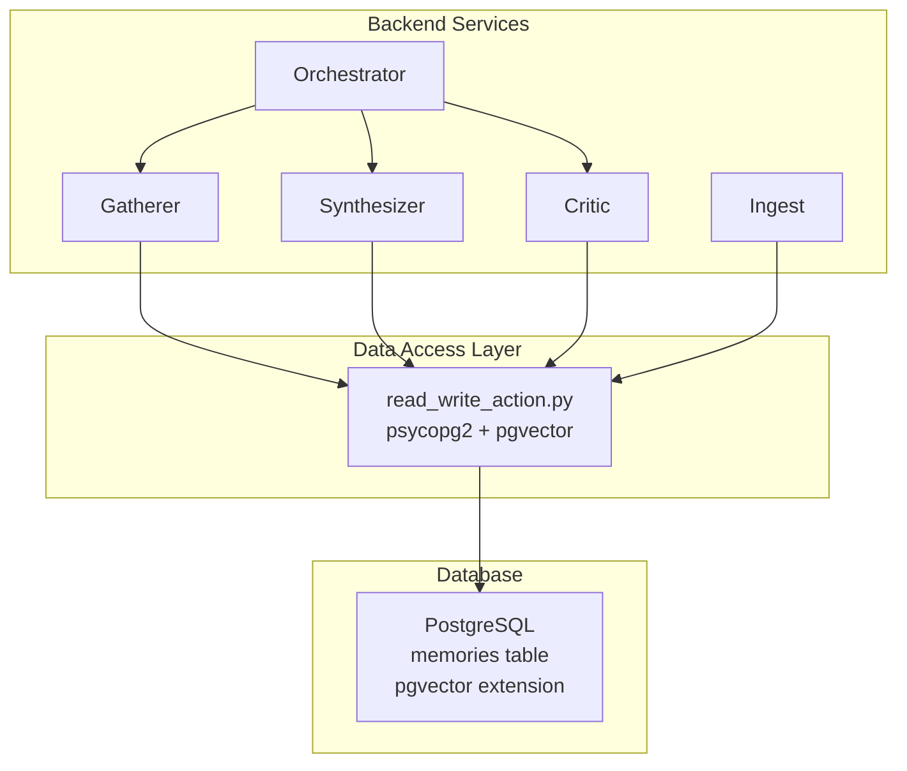
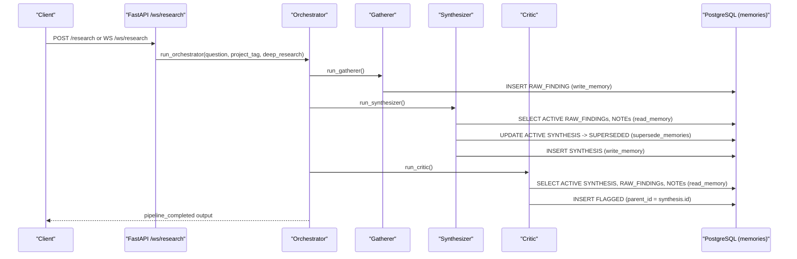
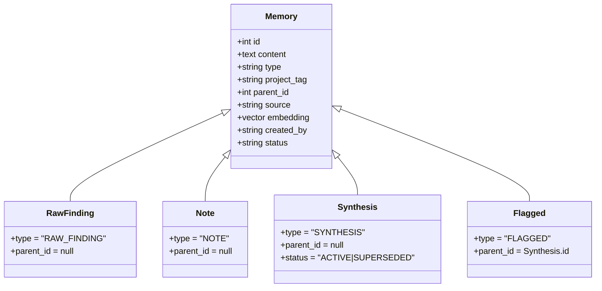
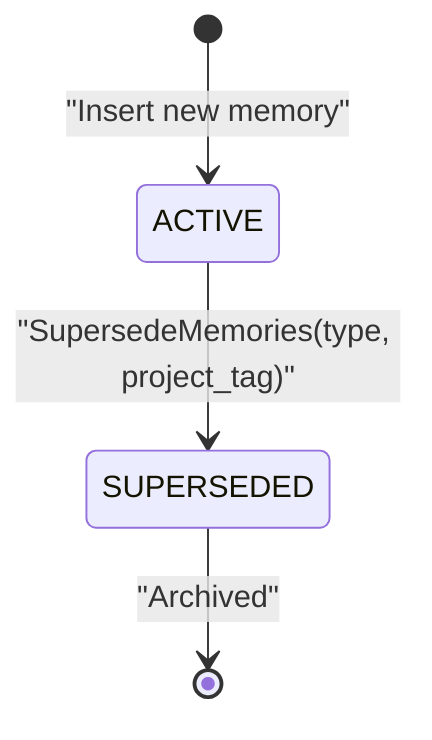
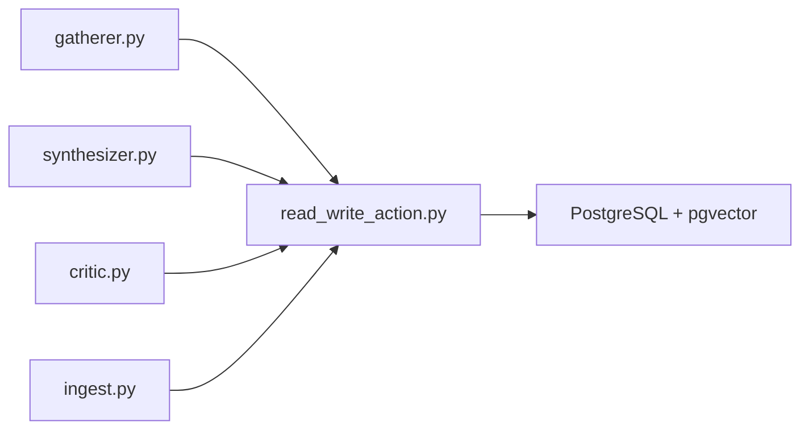

# Database Schema & Memory Tables

<cite>
**Referenced Files in This Document**
- [read_write_action.py](file://backend/read_write_action.py)
- [gatherer.py](file://backend/gatherer.py)
- [synthesizer.py](file://backend/synthesizer.py)
- [critic.py](file://backend/critic.py)
- [ingest.py](file://backend/ingest.py)
- [orchestrator.py](file://backend/orchestrator.py)
- [ATLASRESEARCH_MASTER.md](file://ATLASRESEARCH_MASTER.md)
</cite>

## Table of Contents
1. [Introduction](#introduction)
2. [Project Structure](#project-structure)
3. [Core Components](#core-components)
4. [Architecture Overview](#architecture-overview)
5. [Detailed Component Analysis](#detailed-component-analysis)
6. [Dependency Analysis](#dependency-analysis)
7. [Performance Considerations](#performance-considerations)
8. [Troubleshooting Guide](#troubleshooting-guide)
9. [Conclusion](#conclusion)

## Introduction
This document provides comprehensive data model documentation for the Atlas Research PostgreSQL database schema, focusing on the memories table and its role in the research pipeline. It explains memory types (RAW_FINDING, SYNTHESIS, FLAGGED, NOTE), project isolation via project_tag, hierarchical relationships through parent_id, origin tracking via source, vector storage with pgvector for semantic search, user attribution via created_by, and status lifecycle (ACTIVE/SUPERSEDED). It also covers connection management, transaction handling, error recovery patterns, constraints, indexes, and example operations derived from the application code.

## Project Structure
The backend orchestrates a three-agent pipeline that persists all intermediate and final artifacts into a shared PostgreSQL database using the memories table:
- Gatherer writes RAW_FINDING rows from web sources.
- Synthesizer reads findings and notes, then writes a new SYNTHESIS row while superseding previous syntheses for the same project_tag.
- Critic reviews the synthesis against findings and notes, writing FLAGGED rows linked to the synthesis via parent_id.
- Ingest writes NOTE rows from uploaded documents.

**Diagram sources**
- [gatherer.py](file://backend/gatherer.py)
- [synthesizer.py](file://backend/synthesizer.py)
- [critic.py](file://backend/critic.py)
- [ingest.py](file://backend/ingest.py)
- [orchestrator.py](file://backend/orchestrator.py)
- [read_write_action.py](file://backend/read_write_action.py)

**Section sources**
- [ATLASRESEARCH_MASTER.md](file://ATLASRESEARCH_MASTER.md)
- [orchestrator.py](file://backend/orchestrator.py)

## Core Components
- memories table: Stores content, type, project_tag, parent_id, source, embedding (vector), created_by, and status.
- Vector column configuration: Uses pgvector extension; embeddings are generated client-side and stored as vectors; similarity search uses cosine distance operator.
- Status lifecycle: Rows start as ACTIVE; when superseded (e.g., new SYNTHESIS), they become SUPERSEDED and are excluded from queries that filter by ACTIVE.
- Hierarchical relationships: FLAGGED rows link to their parent SYNTHESIS via parent_id; other types may be unlinked or form future hierarchies.
- Project isolation: project_tag partitions data across projects; queries and updates scope by project_tag.

Key behaviors observed in code:
- write_memory generates an embedding for content and inserts a new memory row.
- read_memory performs semantic search over ACTIVE rows filtered by project_tag and optionally type.
- count_memories counts ACTIVE rows by type and project_tag.
- supersede_memories marks existing ACTIVE rows of a given type/project_tag as SUPERSEDED.

**Section sources**
- [read_write_action.py](file://backend/read_write_action.py)
- [gatherer.py](file://backend/gatherer.py)
- [synthesizer.py](file://backend/synthesizer.py)
- [critic.py](file://backend/critic.py)
- [ingest.py](file://backend/ingest.py)

## Architecture Overview
The data architecture centers on a single memories table used by all agents. The orchestrator coordinates agent execution and ensures proper sequencing and state transitions.

**Diagram sources**
- [orchestrator.py](file://backend/orchestrator.py)
- [gatherer.py](file://backend/gatherer.py)
- [synthesizer.py](file://backend/synthesizer.py)
- [critic.py](file://backend/critic.py)
- [read_write_action.py](file://backend/read_write_action.py)

## Detailed Component Analysis

### Data Model: memories table
- Fields inferred from usage:
  - id: Primary key (auto-incremented, returned by insert returning id).
  - content: Text payload of the memory.
  - type: Enum-like string values: RAW_FINDING, SYNTHESIS, FLAGGED, NOTE.
  - project_tag: String used to isolate data per project; default 'untagged'.
  - parent_id: Nullable foreign-key-like reference to another memory (used by FLAGGED to point to SYNTHESIS).
  - source: Origin tracking (URL, filename, or agent name).
  - embedding: Vector column (pgvector) storing embeddings for semantic search.
  - created_by: Attribution (user, gatherer, synthesizer, critic).
  - status: Lifecycle state ACTIVE or SUPERSEDED; queries typically filter by ACTIVE.

- Constraints and validation inferred from code:
  - Non-null fields: content, type, project_tag, created_by, status (default ACTIVE implied by queries).
  - Type validation: type must be one of RAW_FINDING, SYNTHESIS, FLAGGED, NOTE.
  - Status rules: New rows inserted as ACTIVE; superseded rows updated to SUPERSEDED before new versions are written.
  - Parent-child relationship: FLAGGED.parent_id references SYNTHESIS.id.

- Indexes and performance:
  - Semantic search uses ORDER BY embedding <=> vector; an IVFFlat or HNSW index on embedding is recommended for performance.
  - Frequent filters on status='ACTIVE' and project_tag suggest composite indexes on (status, project_tag) and possibly (type, project_tag).
  - COUNT queries filter by status, project_tag, type; consider index on (status, project_tag, type).

- Example operations (described without code):
  - Insert a RAW_FINDING: call write_memory with content, type=RAW_FINDING, created_by=gatherer, parent_id=None, source=url, project_tag.
  - Insert a NOTE: call write_memory with content, type=NOTE, created_by=user, parent_id=None, source=filename, project_tag.
  - Insert a SYNTHESIS: after superseding prior syntheses, call write_memory with content, type=SYNTHESIS, created_by=synthesizer, parent_id=None, source=synthesizer, project_tag.
  - Insert a FLAGGED: call write_memory with content, type=FLAGGED, created_by=critic, parent_id=synthesis_id, source=critic, project_tag.
  - Update status: supersede_memories sets status=SUPERSEDED for matching type and project_tag.
  - Delete: not used in current code; if needed, soft-delete via status=SUPERSEDED or hard-delete by id.

**Section sources**
- [read_write_action.py](file://backend/read_write_action.py)
- [gatherer.py](file://backend/gatherer.py)
- [synthesizer.py](file://backend/synthesizer.py)
- [critic.py](file://backend/critic.py)
- [ingest.py](file://backend/ingest.py)

### Vector Column Configuration (pgvector)
- Extension: pgvector is required; register_vector(conn) enables vector support in psycopg2.
- Embedding generation: LangChain HuggingFace embeddings (all-MiniLM-L6-v2) generate vectors client-side; vectors are passed as Python lists/arrays to psycopg2.
- Similarity search: ORDER BY embedding <=> query_vector computes cosine distance; LIMIT controls top-k results.
- Performance tips:
  - Create an IVFFlat or HNSW index on embedding for large datasets.
  - Tune ivfflat_lists or hnsw.m/ef_construction based on workload.
  - Ensure consistent vector dimensionality across rows.

**Section sources**
- [read_write_action.py](file://backend/read_write_action.py)

### Entity Relationships and Workflow
- RAW_FINDING: Standalone facts extracted from web sources; no parent_id.
- NOTE: User-ingested document chunks; standalone; no parent_id.
- SYNTHESIS: Aggregated result; standalone; no parent_id; superseded by new syntheses for same project_tag.
- FLAGGED: Issues identified by Critic; parent_id points to the SYNTHESIS being reviewed.

**Diagram sources**
- [gatherer.py](file://backend/gatherer.py)
- [synthesizer.py](file://backend/synthesizer.py)
- [critic.py](file://backend/critic.py)
- [read_write_action.py](file://backend/read_write_action.py)

**Section sources**
- [gatherer.py](file://backend/gatherer.py)
- [synthesizer.py](file://backend/synthesizer.py)
- [critic.py](file://backend/critic.py)

### Status Lifecycle: ACTIVE to SUPERSEDED
- New memories are inserted with status ACTIVE (implied by queries filtering by ACTIVE).
- Before writing a new SYNTHESIS, supersede_memories updates all ACTIVE SYNTHESIS rows for the same project_tag to SUPERSEDED.
- Queries for retrieval consistently filter by status='ACTIVE', ensuring only current versions participate in semantic search and aggregation.

**Diagram sources**
- [synthesizer.py](file://backend/synthesizer.py)
- [read_write_action.py](file://backend/read_write_action.py)

**Section sources**
- [synthesizer.py](file://backend/synthesizer.py)
- [read_write_action.py](file://backend/read_write_action.py)

### Connection Management, Transactions, and Error Recovery
- Connections: Each function opens a new psycopg2 connection, registers vector support, executes SQL, and closes the connection.
- Transactions: write_memory commits after insert; supersede_memories commits after update; read_memory and count_memories do not commit.
- Error handling: No explicit try/except around DB calls; errors propagate to callers. Orchestrator and FastAPI handle higher-level exceptions and emit events.
- Recommendations:
  - Use a connection pool (e.g., psycopg2.pool or SQLAlchemy) to reduce overhead.
  - Wrap DB calls in try/except blocks to catch and log errors, and implement retry logic where appropriate.
  - Consider short-lived transactions and explicit rollback on failure.

**Section sources**
- [read_write_action.py](file://backend/read_write_action.py)
- [orchestrator.py](file://backend/orchestrator.py)

## Dependency Analysis
The data layer depends on psycopg2 and pgvector; agents depend on read_write_action for persistence and retrieval.

**Diagram sources**
- [gatherer.py](file://backend/gatherer.py)
- [synthesizer.py](file://backend/synthesizer.py)
- [critic.py](file://backend/critic.py)
- [ingest.py](file://backend/ingest.py)
- [read_write_action.py](file://backend/read_write_action.py)

**Section sources**
- [gatherer.py](file://backend/gatherer.py)
- [synthesizer.py](file://backend/synthesizer.py)
- [critic.py](file://backend/critic.py)
- [ingest.py](file://backend/ingest.py)
- [read_write_action.py](file://backend/read_write_action.py)

## Performance Considerations
- Vector indexing: Add an IVFFlat or HNSW index on embedding to accelerate ORDER BY embedding <=> query_vector.
- Composite indexes: On (status, project_tag) and (status, project_tag, type) to optimize frequent filters and counts.
- Embedding model load time: The embedding model is loaded once at module import; reuse across requests to avoid repeated initialization costs.
- Connection pooling: Replace per-call connections with a pooled approach to reduce latency and resource usage.
- Query limits: Use LIMIT judiciously; adaptive limits in synthesizer and critic prevent excessive retrieval.

[No sources needed since this section provides general guidance]

## Troubleshooting Guide
Common issues and remedies:
- Stale syntheses appearing in search: Ensure supersede_memories runs before writing a new SYNTHESIS; verify status updates to SUPERSEDED.
- Missing ACTIVE rows: Check that new inserts set status ACTIVE and that queries filter by status='ACTIVE'.
- Vector search performance: Verify pgvector extension is enabled and indexes exist; confirm vector dimensions match model output.
- Connection errors: Validate database credentials and ensure pgvector is registered per connection.
- Orphaned FLAGGED rows: Confirm parent_id points to a valid SYNTHESIS.id; validate referential integrity at application level.

**Section sources**
- [synthesizer.py](file://backend/synthesizer.py)
- [read_write_action.py](file://backend/read_write_action.py)
- [critic.py](file://backend/critic.py)

## Conclusion
The memories table serves as the central artifact store for Atlas Research, enabling semantic search, hierarchical linking, and project isolation. The status lifecycle ensures only current versions participate in retrieval, while pgvector powers efficient similarity searches. Improvements such as connection pooling, robust error handling, and optimized indexes will enhance reliability and performance.

[No sources needed since this section summarizes without analyzing specific files]