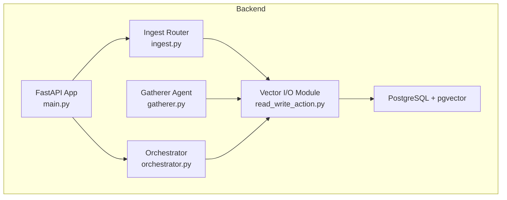
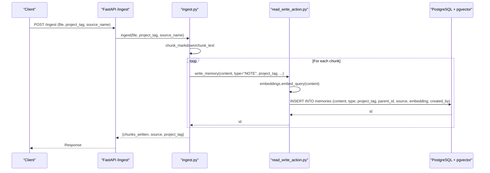
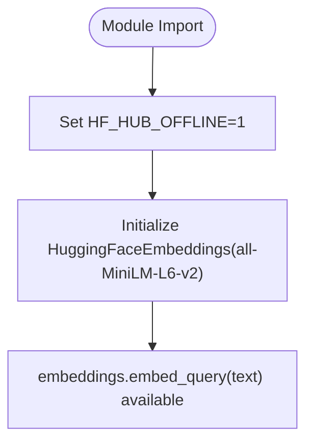
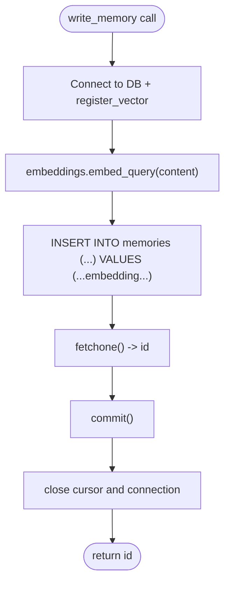
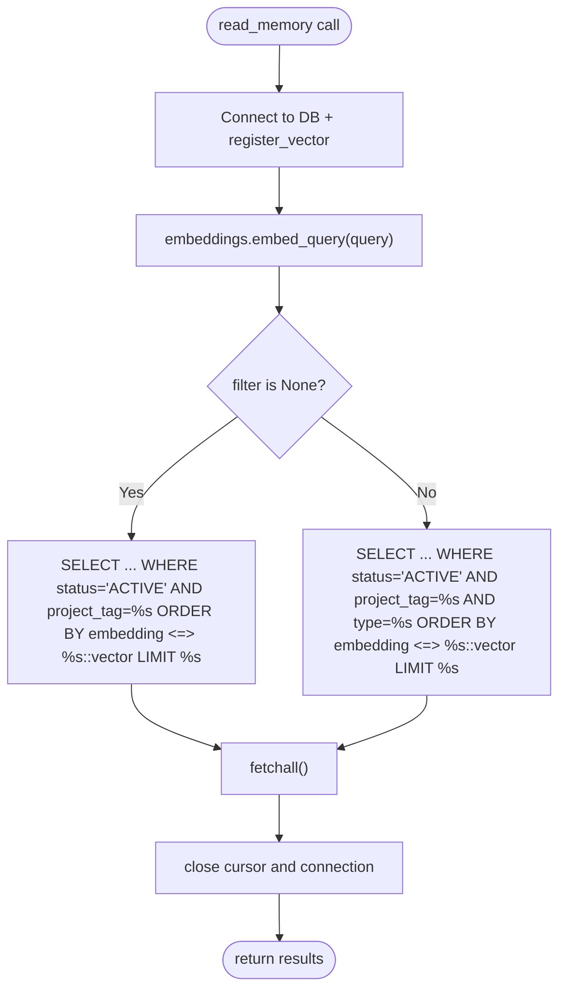
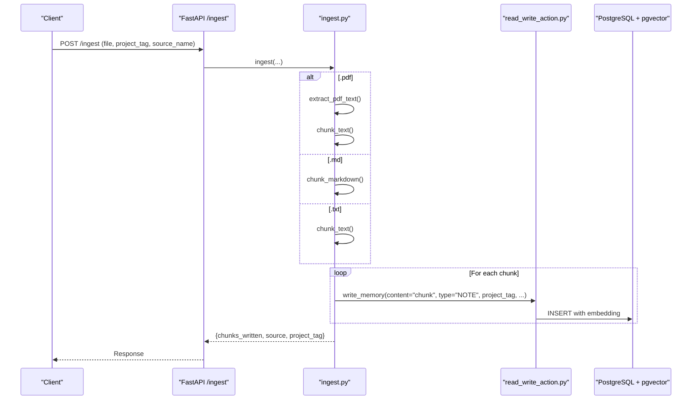
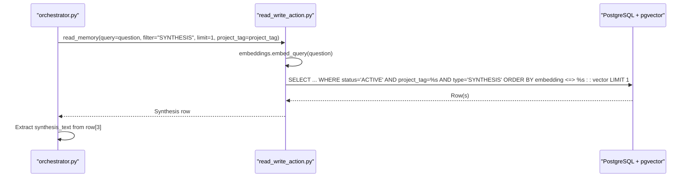
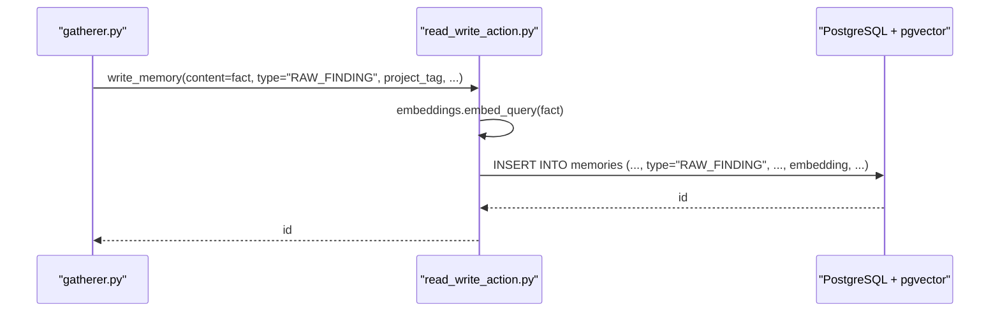
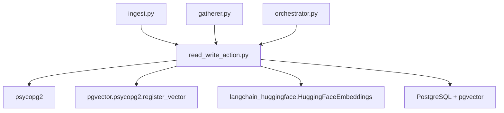

# Semantic Search & Vector Embeddings

<cite>
**Referenced Files in This Document**
- [read_write_action.py](file://backend/read_write_action.py)
- [ingest.py](file://backend/ingest.py)
- [orchestrator.py](file://backend/orchestrator.py)
- [gatherer.py](file://backend/gatherer.py)
- [main.py](file://backend/main.py)
- [ATLASRESEARCH_MASTER.md](file://ATLASRESEARCH_MASTER.md)
- [gatherer-performance-trace.md](file://Documentation/gatherer-performance-trace.md)
</cite>

## Table of Contents
1. [Introduction](#introduction)
2. [Project Structure](#project-structure)
3. [Core Components](#core-components)
4. [Architecture Overview](#architecture-overview)
5. [Detailed Component Analysis](#detailed-component-analysis)
6. [Dependency Analysis](#dependency-analysis)
7. [Performance Considerations](#performance-considerations)
8. [Troubleshooting Guide](#troubleshooting-guide)
9. [Conclusion](#conclusion)

## Introduction
This document explains the semantic search implementation that combines HuggingFace embeddings with PostgreSQL’s pgvector extension. It covers how text is converted into vector representations using the all-MiniLM-L6-v2 model, how similarity search is performed via the cosine distance operator (<=>), and how the system integrates LangChain’s HuggingFaceEmbeddings with pgvector for efficient retrieval. It also documents the read_memory and write_memory functions, performance considerations, example queries, and troubleshooting guidance.

## Project Structure
The semantic search functionality is implemented in the backend Python services:
- Embedding generation and vector storage are handled by a dedicated module that initializes the embedding model once and exposes functions to insert and query memories.
- Ingestion endpoints chunk and persist content as memories with embedded vectors.
- The orchestrator coordinates agents and uses semantic search to retrieve synthesized outputs.
- The FastAPI application wires HTTP and WebSocket routes that trigger these flows.

**Diagram sources**
- [main.py:11-13](file://backend/main.py#L11-L13)
- [ingest.py:68-140](file://backend/ingest.py#L68-L140)
- [read_write_action.py:14-51](file://backend/read_write_action.py#L14-L51)
- [gatherer.py:68-86](file://backend/gatherer.py#L68-L86)
- [orchestrator.py:80-88](file://backend/orchestrator.py#L80-L88)

**Section sources**
- [main.py:11-13](file://backend/main.py#L11-L13)
- [ingest.py:68-140](file://backend/ingest.py#L68-L140)
- [read_write_action.py:14-51](file://backend/read_write_action.py#L14-L51)
- [gatherer.py:68-86](file://backend/gatherer.py#L68-L86)
- [orchestrator.py:80-88](file://backend/orchestrator.py#L80-L88)

## Core Components
- Embedding Model Initialization: The embedding model is loaded once at module level to avoid repeated initialization overhead. Offline mode is enabled to skip network checks.
- write_memory: Converts input text into an embedding vector and inserts it into the memories table with metadata (type, project_tag, source, created_by).
- read_memory: Converts a query into an embedding vector and performs a similarity search using the cosine distance operator, filtering by status and project_tag, optionally by type, and limiting results.
- count_memories and supersede_memories: Utility functions to count active memories and mark previous synthesis rows as superseded to avoid stale results competing in search.

Key responsibilities:
- Embedding generation: all-MiniLM-L6-v2 via LangChain’s HuggingFaceEmbeddings.
- Vector storage: PostgreSQL with pgvector extension; vectors stored in an embedding column.
- Similarity search: ORDER BY embedding <=> query_vector::vector with LIMIT.

**Section sources**
- [read_write_action.py:9-12](file://backend/read_write_action.py#L9-L12)
- [read_write_action.py:14-30](file://backend/read_write_action.py#L14-L30)
- [read_write_action.py:33-51](file://backend/read_write_action.py#L33-L51)
- [read_write_action.py:54-73](file://backend/read_write_action.py#L54-L73)
- [read_write_action.py:76-97](file://backend/read_write_action.py#L76-L97)

## Architecture Overview
The semantic search pipeline integrates ingestion, embedding generation, vector storage, and similarity search across multiple components:

**Diagram sources**
- [main.py:11-13](file://backend/main.py#L11-L13)
- [ingest.py:68-140](file://backend/ingest.py#L68-L140)
- [read_write_action.py:14-30](file://backend/read_write_action.py#L14-L30)

## Detailed Component Analysis

### Embedding Generation with all-MiniLM-L6-v2
- Model loading: The embedding model is instantiated once at module import time, reducing startup latency on subsequent calls.
- Offline mode: HF_HUB_OFFLINE is set to disable network checks against Hugging Face Hub, ensuring local cached models load quickly.
- Integration: LangChain’s HuggingFaceEmbeddings wraps the model, providing embed_query for consistent vector generation.

**Diagram sources**
- [read_write_action.py:7-12](file://backend/read_write_action.py#L7-L12)

**Section sources**
- [read_write_action.py:7-12](file://backend/read_write_action.py#L7-L12)

### write_memory Function
Purpose: Insert new memory rows with generated embeddings.

Parameters:
- content: Text to embed and store.
- type: Memory type (e.g., NOTE, RAW_FINDING, SYNTHESIS).
- created_by: Identifier of the creator or agent.
- parent_id: Optional parent reference.
- source: Source identifier (e.g., URL or filename).
- project_tag: Scoping tag to filter results per project.

Processing steps:
- Connect to PostgreSQL and register pgvector types.
- Generate embedding vector from content using embeddings.embed_query.
- Insert row into memories table with metadata and embedding.
- Return inserted id.

**Diagram sources**
- [read_write_action.py:14-30](file://backend/read_write_action.py#L14-L30)

**Section sources**
- [read_write_action.py:14-30](file://backend/read_write_action.py#L14-L30)

### read_memory Function
Purpose: Perform semantic similarity search over memories.

Parameters:
- query: Text to convert into a vector for similarity comparison.
- filter: Optional memory type filter (e.g., "RAW_FINDING", "SYNTHESIS").
- limit: Maximum number of results to return.
- project_tag: Scoping tag to restrict search within a project.

Processing steps:
- Connect to PostgreSQL and register pgvector types.
- Generate embedding vector from query using embeddings.embed_query.
- Build SQL query:
  - Without filter: SELECT * FROM memories WHERE status='ACTIVE' AND project_tag=%s ORDER BY embedding <=> %s::vector LIMIT %s
  - With filter: SELECT * FROM memories WHERE status='ACTIVE' AND project_tag=%s AND type=%s ORDER BY embedding <=> %s::vector LIMIT %s
- Execute query and fetch results.

**Diagram sources**
- [read_write_action.py:33-51](file://backend/read_write_action.py#L33-L51)

**Section sources**
- [read_write_action.py:33-51](file://backend/read_write_action.py#L33-L51)

### Ingestion Pipeline and Chunking
The ingestion endpoint supports PDF, Markdown, and TXT files:
- PDF: Extract text via pypdf, then chunk using word-count chunks with overlap.
- Markdown: Split by headers into sections, skipping short sections.
- TXT: Split into word-count chunks with overlap.

Each chunk is persisted as a NOTE memory with its embedding.

**Diagram sources**
- [ingest.py:68-140](file://backend/ingest.py#L68-L140)
- [read_write_action.py:14-30](file://backend/read_write_action.py#L14-L30)

**Section sources**
- [ingest.py:68-140](file://backend/ingest.py#L68-L140)

### Orchestrator Usage of Semantic Search
After the gatherer and synthesizer stages, the orchestrator retrieves the latest synthesis using semantic search filtered by type and project_tag.

**Diagram sources**
- [orchestrator.py:80-88](file://backend/orchestrator.py#L80-L88)
- [read_write_action.py:33-51](file://backend/read_write_action.py#L33-L51)

**Section sources**
- [orchestrator.py:80-88](file://backend/orchestrator.py#L80-L88)

### Gatherer Writes RAW_FINDING Memories
The gatherer writes raw findings as memories with type "RAW_FINDING". Each fact extracted from web sources is embedded and stored.

**Diagram sources**
- [gatherer.py:68-86](file://backend/gatherer.py#L68-L86)
- [read_write_action.py:14-30](file://backend/read_write_action.py#L14-L30)

**Section sources**
- [gatherer.py:68-86](file://backend/gatherer.py#L68-L86)

## Dependency Analysis
The semantic search subsystem depends on:
- psycopg2 for database connectivity.
- pgvector.psycopg2.register_vector to enable vector operations.
- langchain_huggingface.HuggingFaceEmbeddings for embedding generation.
- PostgreSQL with pgvector extension for vector storage and similarity search.

**Diagram sources**
- [read_write_action.py:1-12](file://backend/read_write_action.py#L1-L12)
- [ingest.py:1-5](file://backend/ingest.py#L1-L5)
- [gatherer.py:1-7](file://backend/gatherer.py#L1-L7)
- [orchestrator.py:1-9](file://backend/orchestrator.py#L1-L9)

**Section sources**
- [read_write_action.py:1-12](file://backend/read_write_action.py#L1-L12)
- [ingest.py:1-5](file://backend/ingest.py#L1-L5)
- [gatherer.py:1-7](file://backend/gatherer.py#L1-L7)
- [orchestrator.py:1-9](file://backend/orchestrator.py#L1-L9)

## Performance Considerations
- Embedding model loading:
  - The model is initialized once at module level to avoid repeated instantiation costs.
  - HF_HUB_OFFLINE is set to 1 to prevent network round-trips during model loading.
- Query optimization:
  - Use project_tag scoping to reduce result sets.
  - Apply type filters when possible to narrow search space.
  - Keep LIMIT reasonable to minimize data transfer and processing.
- Database indexing:
  - Consider adding indexes on project_tag and type columns to speed up filtering.
  - Evaluate pgvector index types (e.g., IVFFlat) for large datasets to improve similarity search performance.
- Connection management:
  - Current implementation opens and closes connections per function call; consider connection pooling for high-throughput scenarios.

Evidence from performance trace:
- Disabling Hugging Face Hub network check and ensuring single model load significantly reduced runtime.
- Measured improvements across test cases demonstrate the impact of these optimizations.

**Section sources**
- [read_write_action.py:7-12](file://backend/read_write_action.py#L7-L12)
- [gatherer-performance-trace.md:42-43](file://Documentation/gatherer-performance-trace.md#L42-L43)
- [gatherer-performance-trace.md:100-120](file://Documentation/gatherer-performance-trace.md#L100-L120)

## Troubleshooting Guide
Common issues and resolutions:
- Embedding dimension mismatches:
  - Ensure the embedding model matches the expected vector dimension used by pgvector.
  - Verify that the same model is used consistently across write and read operations.
- Query performance bottlenecks:
  - Add appropriate indexes on project_tag and type.
  - Consider pgvector index strategies (IVFFlat/HNSW) for large tables.
  - Reduce LIMIT and apply filters to minimize result sets.
- Model loading failures in offline mode:
  - Confirm HF_HUB_OFFLINE is set before importing the embedding module.
  - Ensure the model cache exists locally; otherwise, initialize in online mode first.
- Connection errors:
  - Validate PostgreSQL credentials and pgvector extension availability.
  - Check that register_vector is called on each connection.

Additional context:
- The master document describes the overall architecture where PostgreSQL + pgvector serve as shared memory between agents.

**Section sources**
- [read_write_action.py:14-51](file://backend/read_write_action.py#L14-L51)
- [ATLASRESEARCH_MASTER.md:28](file://ATLASRESEARCH_MASTER.md#L28)

## Conclusion
The semantic search implementation leverages HuggingFace embeddings and pgvector to provide efficient, project-scoped similarity retrieval. By initializing the embedding model once, enabling offline mode, and using targeted filters and limits, the system achieves responsive performance. Proper indexing and connection management can further optimize throughput. The integration points across ingestion, gathering, synthesis, and orchestration ensure consistent use of vectorized memories throughout the pipeline.