# Backend Development

<cite>
**Referenced Files in This Document**
- [main.py](file://backend/main.py)
- [orchestrator.py](file://backend/orchestrator.py)
- [gatherer.py](file://backend/gatherer.py)
- [synthesizer.py](file://backend/synthesizer.py)
- [critic.py](file://backend/critic.py)
- [ollama_services.py](file://backend/ollama_services.py)
- [agent_config.py](file://backend/agent_config.py)
- [read_write_action.py](file://backend/read_write_action.py)
- [chat.py](file://backend/chat.py)
- [ingest.py](file://backend/ingest.py)
- [ws_events.py](file://backend/ws_events.py)
</cite>

## Table of Contents
1. Introduction
2. Project Structure
3. Core Components
4. Architecture Overview
5. Detailed Component Analysis
6. Dependency Analysis
7. Performance Considerations
8. Troubleshooting Guide
9. Conclusion
10. Appendices

## Introduction
This document provides comprehensive backend development documentation for the Python/FastAPI application that implements a multi-agent research pipeline. It covers the FastAPI application structure, async/await patterns, WebSocket streaming, agent orchestration (orchestrator pattern), agent lifecycle management, error handling strategies, Ollama integration for local LLM execution, PostgreSQL database integration with psycopg2 and pgvector, and development workflows including prompt engineering best practices and testing procedures. It also includes debugging techniques, database inspection tools, and performance profiling methods.

## Project Structure
The backend is organized into modular components:
- Application entrypoint and routing: main.py
- Orchestrator coordinating agents: orchestrator.py
- Agent implementations: gatherer.py, synthesizer.py, critic.py
- Ollama integration helpers: ollama_services.py
- Model and prompt configuration: agent_config.py
- Database access layer: read_write_action.py
- Chat endpoint using Ollama directly: chat.py
- File ingestion endpoint: ingest.py
- WebSocket event emission helper: ws_events.py

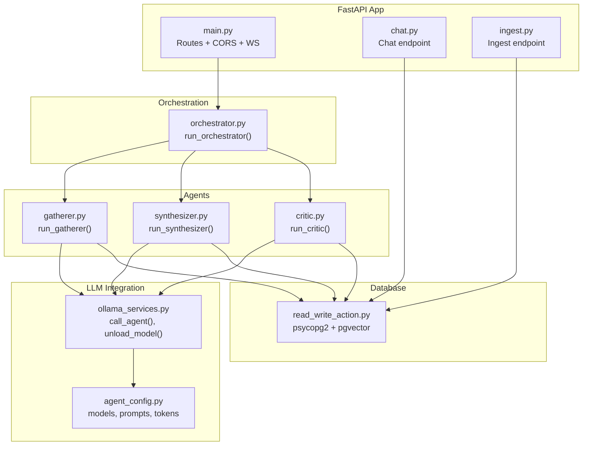

**Diagram sources**
- [main.py:1-110](file://backend/main.py#L1-L110)
- [orchestrator.py:1-98](file://backend/orchestrator.py#L1-L98)
- [gatherer.py:1-152](file://backend/gatherer.py#L1-L152)
- [synthesizer.py:1-101](file://backend/synthesizer.py#L1-L101)
- [critic.py:1-122](file://backend/critic.py#L1-L122)
- [ollama_services.py:1-26](file://backend/ollama_services.py#L1-L26)
- [agent_config.py:1-111](file://backend/agent_config.py#L1-L111)
- [read_write_action.py:1-100](file://backend/read_write_action.py#L1-L100)
- [chat.py:1-72](file://backend/chat.py#L1-L72)
- [ingest.py:1-140](file://backend/ingest.py#L1-L140)

**Section sources**
- [main.py:1-110](file://backend/main.py#L1-L110)
- [orchestrator.py:1-98](file://backend/orchestrator.py#L1-L98)
- [gatherer.py:1-152](file://backend/gatherer.py#L1-L152)
- [synthesizer.py:1-101](file://backend/synthesizer.py#L1-L101)
- [critic.py:1-122](file://backend/critic.py#L1-L122)
- [ollama_services.py:1-26](file://backend/ollama_services.py#L1-L26)
- [agent_config.py:1-111](file://backend/agent_config.py#L1-L111)
- [read_write_action.py:1-100](file://backend/read_write_action.py#L1-L100)
- [chat.py:1-72](file://backend/chat.py#L1-L72)
- [ingest.py:1-140](file://backend/ingest.py#L1-L140)

## Core Components
- FastAPI app and middleware:
  - Defines routes for research, chat, and ingest.
  - Configures CORS for frontend origin.
  - Implements synchronous POST /research and asynchronous WebSocket /ws/research.
- Orchestrator:
  - Coordinates sequential execution of Gatherer → Synthesizer → Critic.
  - Emits structured events via emit callback or None (CLI).
  - Manages model lifecycle (unload/load) to optimize VRAM usage.
- Agents:
  - Gatherer: searches web, extracts text, calls LLM to extract facts, writes RAW_FINDING rows.
  - Synthesizer: reads findings and notes, generates synthesis, writes SYNTHESIS row.
  - Critic: reviews synthesis against raw findings and notes, writes FLAGGED rows if issues found.
- Ollama services:
  - call_agent(role, prompt) uses configured model, system prompt, and token limits.
  - unload_model(role) forces immediate model unload from memory.
- Database layer:
  - psycopg2 connections per operation, pgvector embeddings, semantic search queries.
  - Functions for write_memory, read_memory, count_memories, supersede_memories.
- Chat endpoint:
  - Uses Ollama chat API with followup role and optional correction saving.
- Ingest endpoint:
  - Accepts PDF, MD, TXT files; chunks content; writes NOTE rows.

**Section sources**
- [main.py:1-110](file://backend/main.py#L1-L110)
- [orchestrator.py:1-98](file://backend/orchestrator.py#L1-L98)
- [gatherer.py:1-152](file://backend/gatherer.py#L1-L152)
- [synthesizer.py:1-101](file://backend/synthesizer.py#L1-L101)
- [critic.py:1-122](file://backend/critic.py#L1-L122)
- [ollama_services.py:1-26](file://backend/ollama_services.py#L1-L26)
- [agent_config.py:1-111](file://backend/agent_config.py#L1-L111)
- [read_write_action.py:1-100](file://backend/read_write_action.py#L1-L100)
- [chat.py:1-72](file://backend/chat.py#L1-L72)
- [ingest.py:1-140](file://backend/ingest.py#L1-L140)

## Architecture Overview
The system follows an orchestrator pattern where a central coordinator sequences agent execution and manages external service interactions. The FastAPI layer exposes REST endpoints and a WebSocket stream for real-time progress updates. Agents interact with Ollama for LLM inference and PostgreSQL for persistent memory.

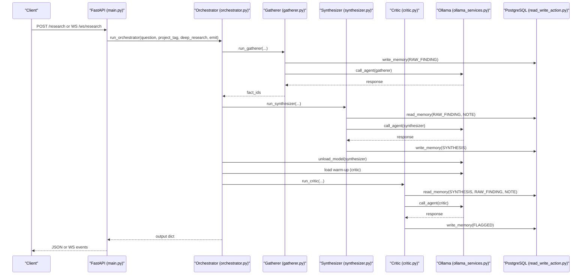

**Diagram sources**
- [main.py:1-110](file://backend/main.py#L1-L110)
- [orchestrator.py:1-98](file://backend/orchestrator.py#L1-L98)
- [gatherer.py:1-152](file://backend/gatherer.py#L1-L152)
- [synthesizer.py:1-101](file://backend/synthesizer.py#L1-L101)
- [critic.py:1-122](file://backend/critic.py#L1-L122)
- [ollama_services.py:1-26](file://backend/ollama_services.py#L1-L26)
- [read_write_action.py:1-100](file://backend/read_write_action.py#L1-L100)

## Detailed Component Analysis

### FastAPI Application and WebSocket Streaming
- Routes:
  - GET "/" returns intro string.
  - POST "/research" triggers synchronous orchestrator run and returns result or HTTP 404 on failure.
  - WebSocket "/ws/research" accepts JSON request, validates with Pydantic, runs orchestrator in background thread, streams events via queue.
- Async/await patterns:
  - WebSocket loop uses asyncio.to_thread for blocking operations (queue.get) to avoid event loop stalls.
  - Background task created with asyncio.create_task to run orchestrator without blocking the coroutine.
- Error handling:
  - Validation errors send pipeline_error and close connection.
  - WebSocketDisconnect handled gracefully; background pipeline continues until sentinel None.

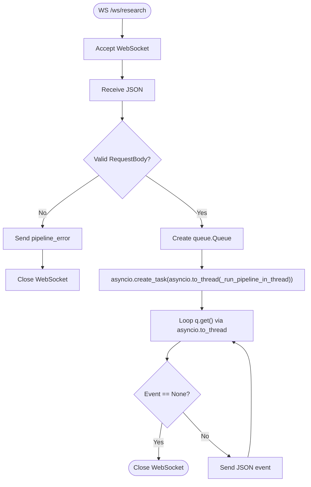

**Diagram sources**
- [main.py:71-110](file://backend/main.py#L71-L110)
- [main.py:49-69](file://backend/main.py#L49-L69)

**Section sources**
- [main.py:1-110](file://backend/main.py#L1-L110)

### Orchestrator Pattern and Agent Lifecycle Management
- Orchestrator coordinates three agents sequentially:
  - Gatherer: collects facts, writes RAW_FINDINGs.
  - Synthesizer: builds synthesis from findings and notes, writes SYNTHESIS.
  - Critic: evaluates synthesis against findings and notes, writes FLAGGED items.
- Model lifecycle:
  - Unloads synthesizer model after use.
  - Warms up critic model before generation to measure pure generation time.
  - Unloads critic model after completion.
- Emit strategy:
  - Structured events emitted at each stage with timestamps and durations.
  - If emit is None (CLI), events are no-op.

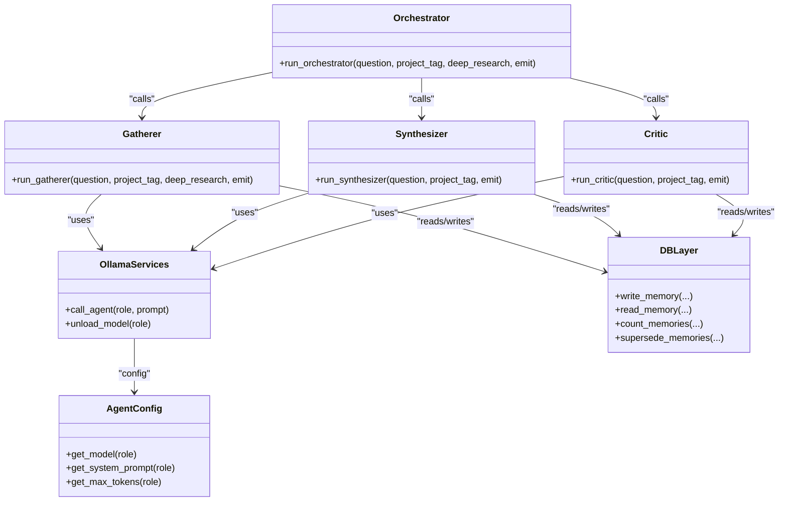

**Diagram sources**
- [orchestrator.py:1-98](file://backend/orchestrator.py#L1-L98)
- [gatherer.py:1-152](file://backend/gatherer.py#L1-L152)
- [synthesizer.py:1-101](file://backend/synthesizer.py#L1-L101)
- [critic.py:1-122](file://backend/critic.py#L1-L122)
- [ollama_services.py:1-26](file://backend/ollama_services.py#L1-L26)
- [agent_config.py:1-111](file://backend/agent_config.py#L1-L111)
- [read_write_action.py:1-100](file://backend/read_write_action.py#L1-L100)

**Section sources**
- [orchestrator.py:1-98](file://backend/orchestrator.py#L1-L98)

### Gatherer Agent
- Workflow:
  - Search engine query with reserve pool for fallback URLs.
  - For each URL: fetch, extract text, call LLM to extract FACT lines.
  - Write each fact as RAW_FINDING with metadata.
  - Emit events for search, fetch, generation, and memory writes.
- Error handling:
  - Hard failures (extract failed or format check failed) trigger replacement from reserve pool.
  - Clean skips when NO_RELEVANT_INFO returned.

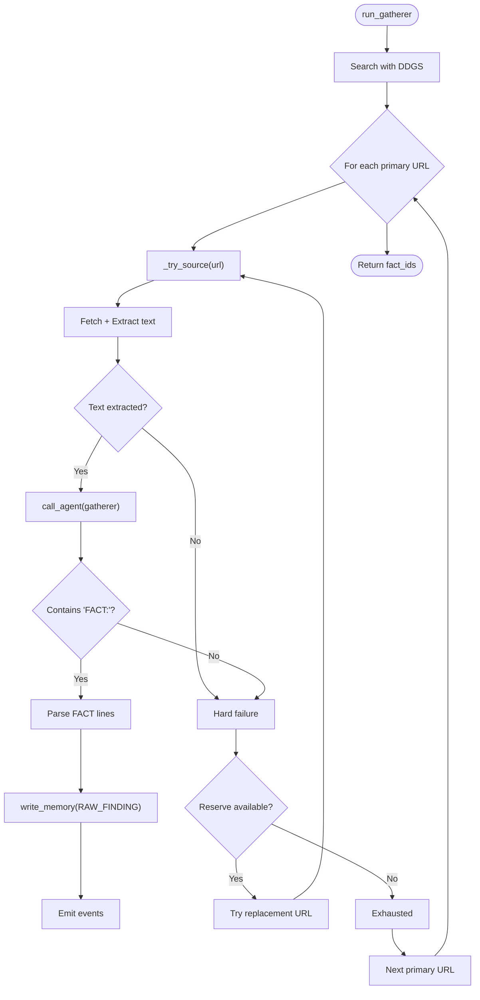

**Diagram sources**
- [gatherer.py:91-152](file://backend/gatherer.py#L91-L152)
- [gatherer.py:12-89](file://backend/gatherer.py#L12-L89)

**Section sources**
- [gatherer.py:1-152](file://backend/gatherer.py#L1-L152)

### Synthesizer Agent
- Workflow:
  - Count available RAW_FINDINGs and compute adaptive limit (40% bounded by min/max).
  - Retrieve findings and notes (fixed budget for notes).
  - Build prompt combining question, findings, and notes.
  - Call LLM to generate synthesis text.
  - Supersede existing SYNTHESIS rows to prevent stale results.
  - Write new SYNTHESIS with metadata.

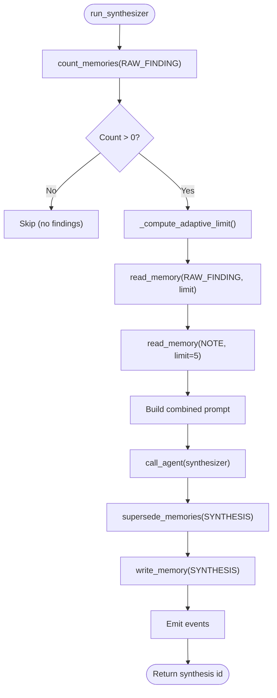

**Diagram sources**
- [synthesizer.py:31-101](file://backend/synthesizer.py#L31-L101)

**Section sources**
- [synthesizer.py:1-101](file://backend/synthesizer.py#L1-L101)

### Critic Agent
- Workflow:
  - Count RAW_FINDINGs and compute adaptive limit.
  - Read latest SYNTHESIS and associated findings/notes.
  - Build prompt to evaluate synthesis against source material.
  - Parse FLAG: lines to identify issues.
  - Write FLAGGED rows linked to synthesis parent_id.

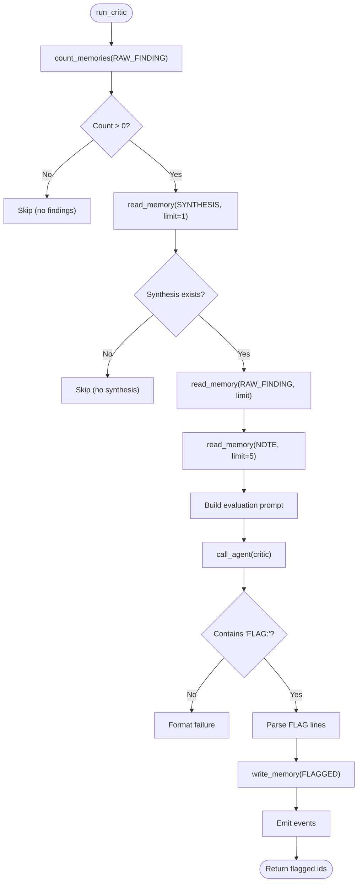

**Diagram sources**
- [critic.py:33-122](file://backend/critic.py#L33-L122)

**Section sources**
- [critic.py:1-122](file://backend/critic.py#L1-L122)

### Ollama Integration
- call_agent:
  - Retrieves model, system prompt, and token limits from agent_config.
  - Calls ollama.generate with keep_alive="6m" and options.num_predict.
- unload_model:
  - Forces immediate model unload by calling ollama.generate with keep_alive=0.

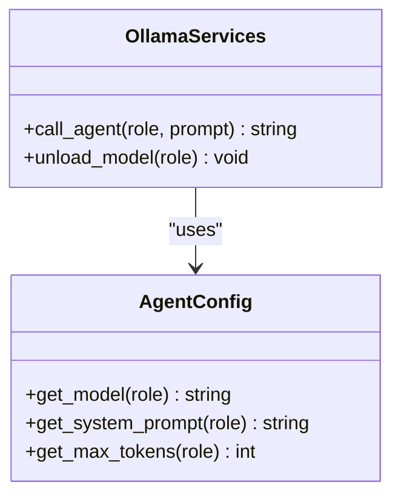

**Diagram sources**
- [ollama_services.py:1-26](file://backend/ollama_services.py#L1-L26)
- [agent_config.py:104-111](file://backend/agent_config.py#L104-L111)

**Section sources**
- [ollama_services.py:1-26](file://backend/ollama_services.py#L1-L26)
- [agent_config.py:1-111](file://backend/agent_config.py#L1-L111)

### PostgreSQL Database Integration
- Connection management:
  - Each function creates a new psycopg2 connection, registers pgvector, executes queries, and closes connection.
- Embeddings:
  - Uses langchain_huggingface HuggingFaceEmbeddings for vector generation.
- Operations:
  - write_memory: inserts memory with embedding vector.
  - read_memory: semantic search using pgvector <=> operator with optional filter.
  - count_memories: counts ACTIVE memories by type and project_tag.
  - supersede_memories: marks ACTIVE memories as SUPERSEDED.

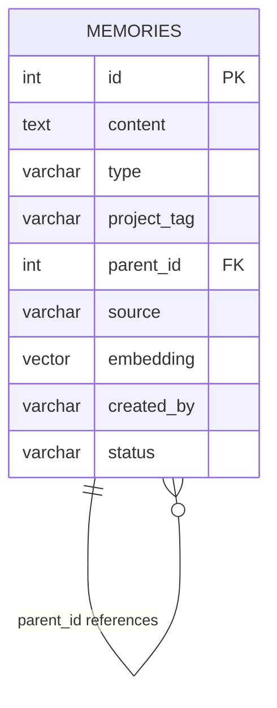

**Diagram sources**
- [read_write_action.py:14-31](file://backend/read_write_action.py#L14-L31)
- [read_write_action.py:33-52](file://backend/read_write_action.py#L33-L52)
- [read_write_action.py:54-74](file://backend/read_write_action.py#L54-L74)
- [read_write_action.py:76-97](file://backend/read_write_action.py#L76-L97)

**Section sources**
- [read_write_action.py:1-100](file://backend/read_write_action.py#L1-L100)

### Chat Endpoint
- Purpose:
  - Provides conversational interface using followup role with context from synthesis.
- Flow:
  - Retrieves synthesis content by ID.
  - Constructs Ollama chat payload with system messages and user messages.
  - Optionally saves corrections as CORRECTION rows.

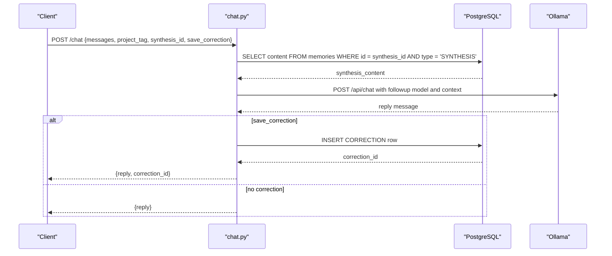

**Diagram sources**
- [chat.py:21-72](file://backend/chat.py#L21-L72)

**Section sources**
- [chat.py:1-72](file://backend/chat.py#L1-L72)

### Ingest Endpoint
- Purpose:
  - Accepts PDF, MD, TXT files and stores content as NOTE rows.
- Processing:
  - Extracts text based on file type.
  - Chunks content using header-based splitting for MD or word-count chunks for plain text.
  - Writes each chunk with metadata.

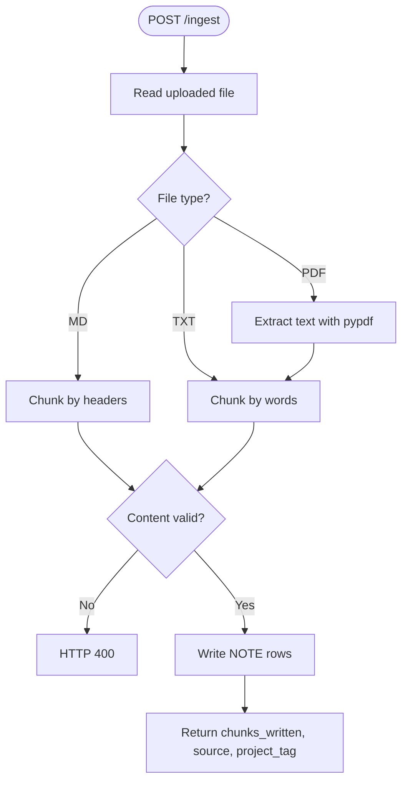

**Diagram sources**
- [ingest.py:68-140](file://backend/ingest.py#L68-L140)

**Section sources**
- [ingest.py:1-140](file://backend/ingest.py#L1-L140)

## Dependency Analysis
The backend exhibits clear separation of concerns with minimal coupling:
- FastAPI layer depends on orchestrator and routers.
- Orchestrator depends on agents and Ollama services.
- Agents depend on Ollama services and database layer.
- Database layer is independent except for embedding model initialization.

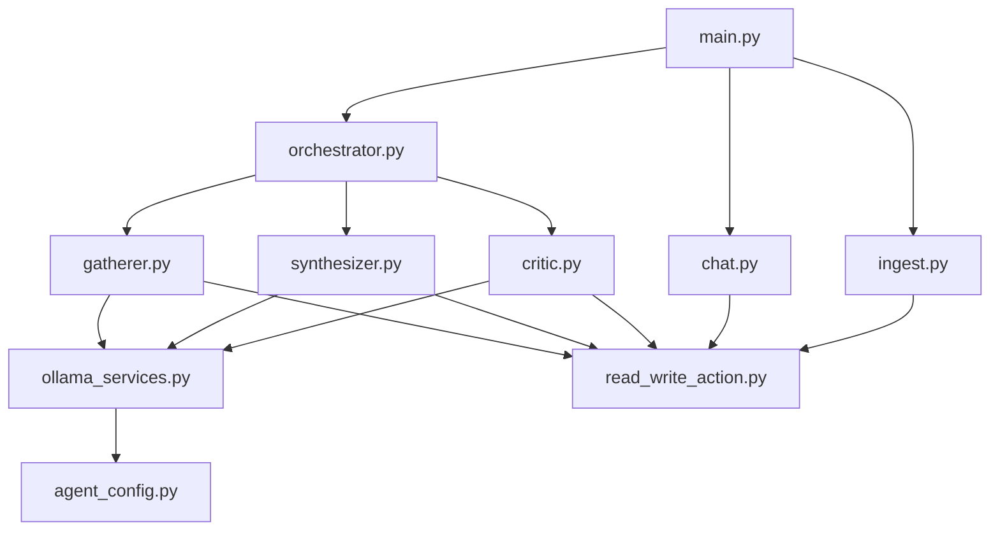

**Diagram sources**
- [main.py:1-110](file://backend/main.py#L1-L110)
- [orchestrator.py:1-98](file://backend/orchestrator.py#L1-L98)
- [gatherer.py:1-152](file://backend/gatherer.py#L1-L152)
- [synthesizer.py:1-101](file://backend/synthesizer.py#L1-L101)
- [critic.py:1-122](file://backend/critic.py#L1-L122)
- [ollama_services.py:1-26](file://backend/ollama_services.py#L1-L26)
- [agent_config.py:1-111](file://backend/agent_config.py#L1-L111)
- [read_write_action.py:1-100](file://backend/read_write_action.py#L1-L100)
- [chat.py:1-72](file://backend/chat.py#L1-L72)
- [ingest.py:1-140](file://backend/ingest.py#L1-L140)

**Section sources**
- [main.py:1-110](file://backend/main.py#L1-L110)
- [orchestrator.py:1-98](file://backend/orchestrator.py#L1-L98)

## Performance Considerations
- WebSocket streaming:
  - Uses asyncio.to_thread for blocking operations to prevent event loop stalls.
  - Queue-based communication between background thread and async reader.
- Model lifecycle:
  - Strategic model unloading and warming to balance VRAM usage and latency.
- Database operations:
  - New connections per operation may become a bottleneck under high concurrency.
  - Consider connection pooling with psycopg2.pool for improved throughput.
- Embedding model:
  - HuggingFace embeddings loaded once at module import; ensure offline mode is configured.
- Search and extraction:
  - Web scraping and text extraction can be slow; consider caching and timeout tuning.

[No sources needed since this section provides general guidance]

## Troubleshooting Guide
- WebSocket disconnections:
  - Background pipeline continues running; events are discarded when client disconnects.
  - Ensure proper cleanup and monitoring of orphaned tasks.
- Database connection issues:
  - Verify PostgreSQL credentials and network connectivity.
  - Check for connection leaks and ensure proper closing of cursors and connections.
- Ollama service availability:
  - Confirm Ollama is running on localhost:11434.
  - Monitor model loading/unloading times and VRAM usage.
- Prompt formatting issues:
  - Validate agent responses match expected formats (FACT:, FLAG:, NO_ISSUES).
  - Add retry logic for format failures if needed.
- Performance profiling:
  - Use Python's cProfile or line_profiler to identify bottlenecks.
  - Monitor database query performance with EXPLAIN ANALYZE.

**Section sources**
- [main.py:71-110](file://backend/main.py#L71-L110)
- [read_write_action.py:1-100](file://backend/read_write_action.py#L1-L100)
- [gatherer.py:1-152](file://backend/gatherer.py#L1-L152)
- [synthesizer.py:1-101](file://backend/synthesizer.py#L1-L101)
- [critic.py:1-122](file://backend/critic.py#L1-L122)

## Conclusion
The backend implements a robust multi-agent research pipeline using FastAPI, WebSocket streaming, and PostgreSQL with pgvector. The orchestrator pattern ensures coordinated execution of specialized agents, while Ollama integration provides flexible local LLM capabilities. The architecture balances performance through strategic resource management and provides comprehensive event streaming for real-time feedback. Future improvements could include connection pooling, enhanced error recovery, and additional monitoring capabilities.

[No sources needed since this section summarizes without analyzing specific files]

## Appendices

### Development Workflow for Creating New Agents
1. Define agent role and system prompt in agent_config.py
2. Implement agent function following existing patterns (gatherer.py, synthesizer.py, critic.py)
3. Add agent to orchestrator workflow
4. Implement appropriate database operations
5. Add WebSocket event emissions throughout the process
6. Test with sample data and monitor timing logs

### Prompt Engineering Best Practices
- Use clear, specific instructions with examples
- Define strict output formats (FACT:, FLAG:, etc.)
- Include validation rules and edge case handling
- Keep prompts focused on single responsibilities
- Test prompts with various input types and edge cases

### Testing Procedures
- Unit tests for individual agent functions
- Integration tests for orchestrator workflow
- Mock external dependencies (Ollama, database)
- Test WebSocket event streaming with test clients
- Validate database operations with test fixtures

### Debugging Techniques
- Enable detailed logging with timestamps
- Use print statements for critical path monitoring
- Implement health check endpoints for service status
- Use browser developer tools for WebSocket inspection
- Monitor database query performance with explain plans

### Database Inspection Tools
- Use psql command-line tool for direct queries
- Implement admin endpoints for memory inspection
- Use pgAdmin or similar GUI tools for visualization
- Monitor vector similarity search performance
- Track memory lifecycle and status changes

### Performance Profiling Methods
- Use Python's built-in profiling tools (cProfile, profile)
- Implement custom timing decorators for functions
- Monitor Ollama model loading/unloading times
- Profile database query performance
- Use system-level profilers for CPU and memory analysis

[No sources needed since this section provides general guidance]