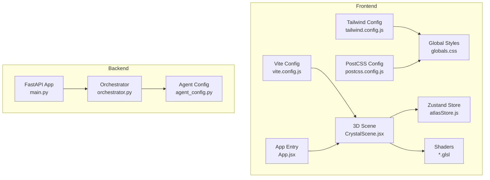
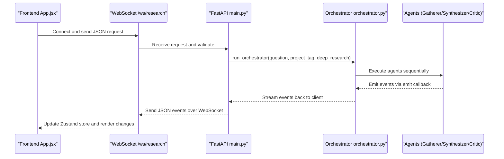
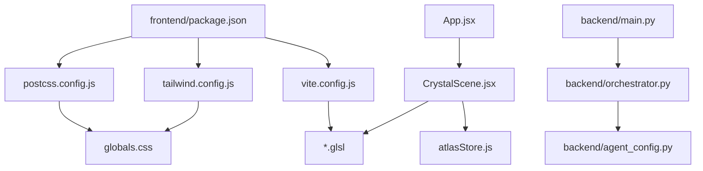

# Development Guide

<cite>
**Referenced Files in This Document**
- [package.json](file://frontend/package.json)
- [vite.config.js](file://frontend/vite.config.js)
- [tailwind.config.js](file://frontend/tailwind.config.js)
- [postcss.config.js](file://frontend/postcss.config.js)
- [globals.css](file://frontend/src/styles/globals.css)
- [App.jsx](file://frontend/src/App.jsx)
- [CrystalScene.jsx](file://frontend/src/components/crystal/CrystalScene.jsx)
- [atlasStore.js](file://frontend/src/store/atlasStore.js)
- [crystalVertex.glsl](file://frontend/src/components/crystal/shaders/crystalVertex.glsl)
- [frost.frag.glsl](file://frontend/src/components/crystal/shaders/frost.frag.glsl)
- [main.py](file://backend/main.py)
- [orchestrator.py](file://backend/orchestrator.py)
- [agent_config.py](file://backend/agent_config.py)
</cite>

## Table of Contents
1. Introduction
2. Project Structure
3. Core Components
4. Architecture Overview
5. Detailed Component Analysis
6. Dependency Analysis
7. Performance Considerations
8. Troubleshooting Guide
9. Conclusion
10. Appendices

## Introduction
This guide explains how to extend and modify the Atlas Research codebase with a focus on:
- Frontend development setup using Vite, TailwindCSS, and GLSL shader compilation
- React/Three.js component architecture patterns (custom hooks, context providers, Zustand store)
- Shader development workflow for custom GLSL effects, testing, and optimization
- Backend agent development process (prompt engineering, model configuration, orchestrator integration)
- Debugging tools for frontend and backend
- Code standards, testing procedures, contribution workflows
- Production deployment considerations including environment variables, performance tuning, and monitoring

Atlas Research is a spatial, cinematic, real-time research experience where the 3D scene visualizes the pipeline’s progress. The frontend runs on Vite and uses Three.js via React Three Fiber. The backend is a FastAPI service that orchestrates multi-agent research tasks and streams events over WebSockets.

## Project Structure
The repository is split into two main parts:
- Frontend: React + R3F + Three.js application built with Vite, styled with TailwindCSS, and shaders compiled via vite-plugin-glsl
- Backend: FastAPI server exposing REST and WebSocket endpoints, orchestrating Gatherer, Synthesizer, and Critic agents

**Diagram sources**
- [vite.config.js:1-8](file://frontend/vite.config.js#L1-L8)
- [tailwind.config.js:1-9](file://frontend/tailwind.config.js#L1-L9)
- [postcss.config.js:1-7](file://frontend/postcss.config.js#L1-L7)
- [globals.css:1-87](file://frontend/src/styles/globals.css#L1-L87)
- [App.jsx:1-42](file://frontend/src/App.jsx#L1-L42)
- [CrystalScene.jsx:1-116](file://frontend/src/components/crystal/CrystalScene.jsx#L1-L116)
- [atlasStore.js:1-84](file://frontend/src/store/atlasStore.js#L1-L84)
- [crystalVertex.glsl:1-87](file://frontend/src/components/crystal/shaders/crystalVertex.glsl#L1-L87)
- [frost.frag.glsl:1-110](file://frontend/src/components/crystal/shaders/frost.frag.glsl#L1-L110)
- [main.py:1-110](file://backend/main.py#L1-L110)
- [orchestrator.py:1-98](file://backend/orchestrator.py#L1-L98)
- [agent_config.py:1-111](file://backend/agent_config.py#L1-L111)

**Section sources**
- [package.json:1-35](file://frontend/package.json#L1-L35)
- [vite.config.js:1-8](file://frontend/vite.config.js#L1-L8)
- [tailwind.config.js:1-9](file://frontend/tailwind.config.js#L1-L9)
- [postcss.config.js:1-7](file://frontend/postcss.config.js#L1-L7)
- [globals.css:1-87](file://frontend/src/styles/globals.css#L1-L87)
- [App.jsx:1-42](file://frontend/src/App.jsx#L1-L42)
- [CrystalScene.jsx:1-116](file://frontend/src/components/crystal/CrystalScene.jsx#L1-L116)
- [atlasStore.js:1-84](file://frontend/src/store/atlasStore.js#L1-L84)
- [crystalVertex.glsl:1-87](file://frontend/src/components/crystal/shaders/crystalVertex.glsl#L1-L87)
- [frost.frag.glsl:1-110](file://frontend/src/components/crystal/shaders/frost.frag.glsl#L1-L110)
- [main.py:1-110](file://backend/main.py#L1-L110)
- [orchestrator.py:1-98](file://backend/orchestrator.py#L1-L98)
- [agent_config.py:1-111](file://backend/agent_config.py#L1-L111)

## Core Components
- Vite build system configured with React and GLSL plugin for shader imports
- TailwindCSS integrated via PostCSS for utility-first styling
- Global CSS design tokens define colors, typography, spacing, and z-layers
- React app entry renders a custom cursor and mounts the 3D scene
- CrystalScene sets up the Three.js Canvas, lighting, post-processing, and GPU quality detection
- Zustand store manages global state for scenes, crystal states, pipeline stages, chat messages, and data shards
- Shaders implement vertex displacement and frost spread effects used by the crystal and particles

Key responsibilities:
- Build and asset pipeline: Vite config, Tailwind, PostCSS
- UI layer: App.jsx, globals.css
- 3D rendering: CrystalScene.jsx and GLSL shaders
- State management: atlasStore.js
- Backend orchestration: main.py and orchestrator.py

**Section sources**
- [vite.config.js:1-8](file://frontend/vite.config.js#L1-L8)
- [tailwind.config.js:1-9](file://frontend/tailwind.config.js#L1-L9)
- [postcss.config.js:1-7](file://frontend/postcss.config.js#L1-L7)
- [globals.css:1-87](file://frontend/src/styles/globals.css#L1-L87)
- [App.jsx:1-42](file://frontend/src/App.jsx#L1-L42)
- [CrystalScene.jsx:1-116](file://frontend/src/components/crystal/CrystalScene.jsx#L1-L116)
- [atlasStore.js:1-84](file://frontend/src/store/atlasStore.js#L1-L84)
- [crystalVertex.glsl:1-87](file://frontend/src/components/crystal/shaders/crystalVertex.glsl#L1-L87)
- [frost.frag.glsl:1-110](file://frontend/src/components/crystal/shaders/frost.frag.glsl#L1-L110)
- [main.py:1-110](file://backend/main.py#L1-L110)
- [orchestrator.py:1-98](file://backend/orchestrator.py#L1-L98)

## Architecture Overview
The system integrates a React/Three.js frontend with a FastAPI backend. The frontend renders a 3D scene that reflects the research pipeline’s state through animations and shaders. The backend exposes REST and WebSocket endpoints to start research tasks and stream events.

**Diagram sources**
- [main.py:1-110](file://backend/main.py#L1-L110)
- [orchestrator.py:1-98](file://backend/orchestrator.py#L1-L98)

## Detailed Component Analysis

### Vite Build Configuration and GLSL Compilation
- Vite config enables React and GLSL plugins, allowing direct import of .glsl files
- Scripts provide dev, build, and preview commands
- Dependencies include React, Three.js, R3F, postprocessing, GSAP, Zustand, and Tailwind tooling

Development workflow:
- Run dev server for hot reloading
- Build production bundle optimized for assets and shaders
- Preview production build locally

Shader compilation:
- Import GLSL files directly in JSX components
- Use uniforms and varyings to pass runtime values from JS to shaders

**Section sources**
- [package.json:1-35](file://frontend/package.json#L1-L35)
- [vite.config.js:1-8](file://frontend/vite.config.js#L1-L8)

### TailwindCSS Styling Framework
- Tailwind config scans index.html and src/**/*.{js,jsx} for class usage
- PostCSS config chains Tailwind and Autoprefixer
- Global styles define design tokens and reset rules

Styling approach:
- Utility-first classes for layout and typography
- CSS variables for consistent color palette and spacing
- Custom cursor styles for immersive UX

**Section sources**
- [tailwind.config.js:1-9](file://frontend/tailwind.config.js#L1-L9)
- [postcss.config.js:1-7](file://frontend/postcss.config.js#L1-L7)
- [globals.css:1-87](file://frontend/src/styles/globals.css#L1-L87)

### React/Three.js Frontend Architecture
- App.jsx initializes a custom cursor and mounts EntryScene
- CrystalScene.jsx sets up the Three.js Canvas, lighting, Environment, post-processing effects, and GPU quality detection
- Zustand store centralizes state for scenes, crystal states, pipeline stages, chat messages, and data shards

Component patterns:
- Functional components with forwardRef for canvas refs
- Hooks for event handling and animation orchestration
- Context providers can be added for WebSocket and pipeline state if needed

State management:
- Zustand store actions update scene transitions, crystal morphing, and pipeline events
- Data shard lifecycle managed via add/update/remove operations

**Section sources**
- [App.jsx:1-42](file://frontend/src/App.jsx#L1-L42)
- [CrystalScene.jsx:1-116](file://frontend/src/components/crystal/CrystalScene.jsx#L1-L116)
- [atlasStore.js:1-84](file://frontend/src/store/atlasStore.js#L1-L84)

### GLSL Shader Development Workflow
- Vertex shader applies FBM noise displacement to create organic crystal shapes
- Fragment shader implements frost spread pattern for synthesis visualization
- Particle shaders compute velocity-based coloring and soft point rendering

Testing procedures:
- Use Leva debug panel during development to tweak uniforms
- Monitor GPU performance via browser DevTools and Three.js inspector
- Validate shader behavior across different GPU capabilities

Optimization techniques:
- Reduce octaves and complexity in noise functions
- Use lower resolution for transmission materials on low-end GPUs
- Enable/disable expensive post-processing effects based on device capability

**Section sources**
- [crystalVertex.glsl:1-87](file://frontend/src/components/crystal/shaders/crystalVertex.glsl#L1-L87)
- [frost.frag.glsl:1-110](file://frontend/src/components/crystal/shaders/frost.frag.glsl#L1-L110)

### Backend Agent Development Process
- Orchestrator coordinates three agents: Gatherer, Synthesizer, Critic
- Agent prompts are defined in agent_config.py with strict formatting rules
- Model configuration supports different tiers (cpu-low, cpu-high, gpu) with specific model assignments

Prompt engineering strategies:
- Clear role definitions and output format constraints
- Examples of valid and invalid responses to guide model behavior
- Token limits per role to control response length

Integration with orchestrator:
- Sequential execution with event emission at each stage
- Model loading/unloading for memory optimization
- Error handling and pipeline termination conditions

**Section sources**
- [orchestrator.py:1-98](file://backend/orchestrator.py#L1-L98)
- [agent_config.py:1-111](file://backend/agent_config.py#L1-L111)

### WebSocket Communication Flow
- FastAPI endpoint handles WebSocket connections for real-time updates
- Request validation ensures proper input format
- Background thread runs orchestrator while streaming events to client

Error handling:
- Validation errors return structured error responses
- Pipeline errors captured and sent as events
- Graceful cleanup when client disconnects

**Section sources**
- [main.py:1-110](file://backend/main.py#L1-L110)

## Dependency Analysis
The frontend depends on React ecosystem libraries for 3D rendering and state management. The backend relies on FastAPI for HTTP/WebSocket handling and Ollama for local LLM inference.

**Diagram sources**
- [package.json:1-35](file://frontend/package.json#L1-L35)
- [vite.config.js:1-8](file://frontend/vite.config.js#L1-L8)
- [tailwind.config.js:1-9](file://frontend/tailwind.config.js#L1-L9)
- [postcss.config.js:1-7](file://frontend/postcss.config.js#L1-L7)
- [globals.css:1-87](file://frontend/src/styles/globals.css#L1-L87)
- [App.jsx:1-42](file://frontend/src/App.jsx#L1-L42)
- [CrystalScene.jsx:1-116](file://frontend/src/components/crystal/CrystalScene.jsx#L1-L116)
- [atlasStore.js:1-84](file://frontend/src/store/atlasStore.js#L1-L84)
- [crystalVertex.glsl:1-87](file://frontend/src/components/crystal/shaders/crystalVertex.glsl#L1-L87)
- [frost.frag.glsl:1-110](file://frontend/src/components/crystal/shaders/frost.frag.glsl#L1-L110)
- [main.py:1-110](file://backend/main.py#L1-L110)
- [orchestrator.py:1-98](file://backend/orchestrator.py#L1-L98)
- [agent_config.py:1-111](file://backend/agent_config.py#L1-L111)

**Section sources**
- [package.json:1-35](file://frontend/package.json#L1-L35)
- [main.py:1-110](file://backend/main.py#L1-L110)
- [orchestrator.py:1-98](file://backend/orchestrator.py#L1-L98)
- [agent_config.py:1-111](file://backend/agent_config.py#L1-L111)

## Performance Considerations
Frontend optimizations:
- GPU quality detection adjusts post-processing settings and material samples
- Conditional effect enabling based on device capability
- Efficient state updates through Zustand selectors
- Optimized shader implementations with reduced computational complexity

Backend optimizations:
- Model loading/unloading to manage memory usage
- Background threading for non-blocking WebSocket handling
- Structured event emission for efficient client updates

Monitoring recommendations:
- Track WebSocket connection lifecycle and error rates
- Monitor GPU utilization and frame times in browser DevTools
- Log orchestrator timing metrics for pipeline performance analysis

## Troubleshooting Guide
Frontend debugging:
- Use React DevTools to inspect component state and props
- Three.js Inspector for 3D scene debugging and performance profiling
- Browser Network tab to monitor WebSocket connections and API requests
- Console logs for JavaScript errors and warnings

Backend debugging:
- Python debugger (pdb or IDE breakpoints) for orchestrator flow
- Database inspection tools for PostgreSQL data verification
- Log analysis for agent execution timing and error tracking
- WebSocket message validation and error response inspection

Common issues:
- Shader compilation errors due to syntax mistakes
- WebSocket connection failures from CORS or network issues
- Memory leaks from improper cleanup of Three.js resources
- Model loading timeouts from Ollama service unavailability

**Section sources**
- [main.py:1-110](file://backend/main.py#L1-L110)
- [orchestrator.py:1-98](file://backend/orchestrator.py#L1-L98)

## Conclusion
Atlas Research provides a comprehensive framework for building interactive, real-time research experiences. The modular architecture separates concerns between frontend rendering, state management, and backend orchestration. By following the development guidelines outlined in this document, contributors can extend functionality, optimize performance, and maintain code quality across both frontend and backend components.

## Appendices

### Development Environment Setup
- Install Node.js dependencies using package manager
- Configure environment variables for backend services
- Set up PostgreSQL database and Ollama service
- Run development servers for both frontend and backend

### Code Standards
- Follow React best practices for component structure and hooks usage
- Maintain consistent naming conventions for files and variables
- Write meaningful comments for complex shader logic
- Implement proper error handling and logging throughout the codebase

### Testing Procedures
- Unit tests for Zustand store actions and utility functions
- Integration tests for WebSocket communication flows
- Visual regression testing for shader effects and animations
- Load testing for backend orchestrator performance

### Contribution Workflows
- Fork repository and create feature branches
- Follow commit message conventions and PR templates
- Run linting and formatting checks before submitting changes
- Include documentation updates for new features or modifications

### Deployment Considerations
- Configure production environment variables for all services
- Optimize build artifacts for production deployment
- Set up monitoring and alerting for production environments
- Implement proper security measures for API endpoints and file access