# Frontend Development

<cite>
**Referenced Files in This Document**
- [vite.config.js](file://frontend/vite.config.js)
- [tailwind.config.js](file://frontend/tailwind.config.js)
- [postcss.config.js](file://frontend/postcss.config.js)
- [package.json](file://frontend/package.json)
- [index.html](file://frontend/index.html)
- [src/main.jsx](file://frontend/src/main.jsx)
- [src/App.jsx](file://frontend/src/App.jsx)
- [src/scenes/EntryScene.jsx](file://frontend/src/scenes/EntryScene.jsx)
- [src/components/crystal/CrystalScene.jsx](file://frontend/src/components/crystal/CrystalScene.jsx)
- [src/components/crystal/CrystalMesh.jsx](file://frontend/src/components/crystal/CrystalMesh.jsx)
- [src/components/crystal/shaders/crystalVertex.glsl](file://frontend/src/components/crystal/shaders/crystalVertex.glsl)
- [src/components/crystal/shaders/fluid.frag.glsl](file://frontend/src/components/crystal/shaders/fluid.frag.glsl)
- [src/store/atlasStore.js](file://frontend/src/store/atlasStore.js)
- [src/utils/wsEventTypes.js](file://frontend/src/utils/wsEventTypes.js)
- [src/styles/globals.css](file://frontend/src/styles/globals.css)
</cite>

## Table of Contents
1. [Introduction](#introduction)
2. [Project Structure](#project-structure)
3. [Core Components](#core-components)
4. [Architecture Overview](#architecture-overview)
5. [Detailed Component Analysis](#detailed-component-analysis)
6. [Dependency Analysis](#dependency-analysis)
7. [Performance Considerations](#performance-considerations)
8. [Troubleshooting Guide](#troubleshooting-guide)
9. [Conclusion](#conclusion)
10. [Appendices](#appendices)

## Introduction
This document provides comprehensive frontend development guidance for the Atlas Research React/Three.js application. It covers Vite build configuration with GLSL shader compilation, React plugin setup, and development server optimization. It also explains TailwindCSS integration, custom theme variables, responsive patterns, component architecture using React 18 (functional components, hooks, context), Three.js scene management, WebGL rendering pipeline, performance optimizations, development workflow, debugging with React DevTools, testing procedures, state management with Zustand, WebSocket event types, and asset management for textures and HDRI environments.

## Project Structure
The frontend is a Vite + React project with Three.js via @react-three/fiber and @react-three/drei. TailwindCSS and PostCSS are configured to generate styles from JSX files. The entry point renders the root App component, which hosts a full-screen Three.js Canvas for the Entry Scene. State is centralized in a Zustand store. Shader assets are compiled by vite-plugin-glsl.

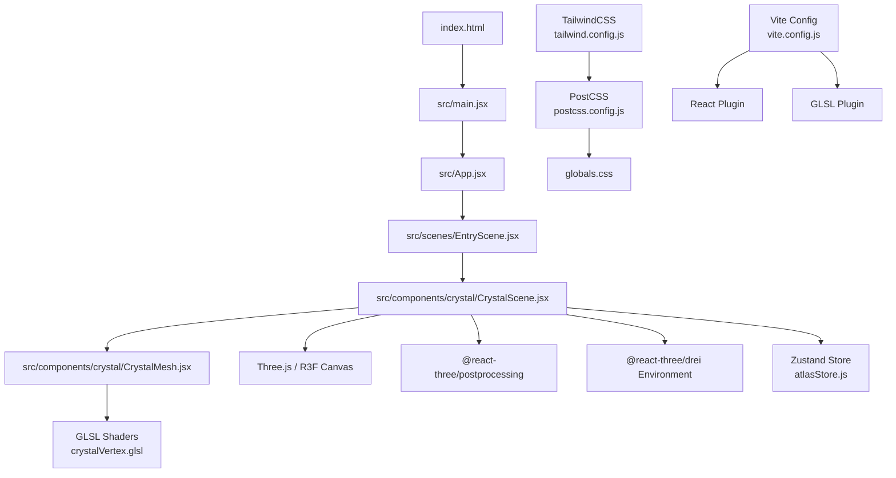

**Diagram sources**
- [index.html](file://frontend/index.html)
- [src/main.jsx](file://frontend/src/main.jsx)
- [src/App.jsx](file://frontend/src/App.jsx)
- [src/scenes/EntryScene.jsx](file://frontend/src/scenes/EntryScene.jsx)
- [src/components/crystal/CrystalScene.jsx](file://frontend/src/components/crystal/CrystalScene.jsx)
- [src/components/crystal/CrystalMesh.jsx](file://frontend/src/components/crystal/CrystalMesh.jsx)
- [src/components/crystal/shaders/crystalVertex.glsl](file://frontend/src/components/crystal/shaders/crystalVertex.glsl)
- [tailwind.config.js](file://frontend/tailwind.config.js)
- [postcss.config.js](file://frontend/postcss.config.js)
- [vite.config.js](file://frontend/vite.config.js)

**Section sources**
- [package.json](file://frontend/package.json)
- [vite.config.js](file://frontend/vite.config.js)
- [tailwind.config.js](file://frontend/tailwind.config.js)
- [postcss.config.js](file://frontend/postcss.config.js)
- [src/main.jsx](file://frontend/src/main.jsx)
- [src/App.jsx](file://frontend/src/App.jsx)
- [src/scenes/EntryScene.jsx](file://frontend/src/scenes/EntryScene.jsx)
- [src/components/crystal/CrystalScene.jsx](file://frontend/src/components/crystal/CrystalScene.jsx)
- [src/components/crystal/CrystalMesh.jsx](file://frontend/src/components/crystal/CrystalMesh.jsx)
- [src/components/crystal/shaders/crystalVertex.glsl](file://frontend/src/components/crystal/shaders/crystalVertex.glsl)
- [src/components/crystal/shaders/fluid.frag.glsl](file://frontend/src/components/crystal/shaders/fluid.frag.glsl)
- [src/store/atlasStore.js](file://frontend/src/store/atlasStore.js)
- [src/utils/wsEventTypes.js](file://frontend/src/utils/wsEventTypes.js)
- [src/styles/globals.css](file://frontend/src/styles/globals.css)

## Core Components
- Vite Configuration: Enables React and GLSL plugins for fast builds and shader imports.
- TailwindCSS: Scans index.html and src/**/*.{js,jsx} for class usage; PostCSS applies Tailwind and Autoprefixer.
- Entry Points: main.jsx bootstraps React 18 with StrictMode and mounts App.
- App: Provides a custom cursor overlay and renders the EntryScene.
- EntryScene: Currently renders the CrystalScene as the initial 3D experience.
- CrystalScene: Full-screen Canvas with lighting, environment map, post-processing effects, GPU quality detection, and state-driven behavior.
- CrystalMesh: Loads and clones a GLTF crystal model, splits shell/core meshes, applies transmission material, and rotates based on state.
- Zustand Store: Centralized state for scenes, crystal lifecycle, pipeline stages, chat messages, data shards, VRAM flags, and scan line visuals.
- WebSocket Event Types: Enumerates backend events for pipeline, agents, gatherer, synthesizer, critic, memory, and VRAM operations.

**Section sources**
- [vite.config.js](file://frontend/vite.config.js)
- [tailwind.config.js](file://frontend/tailwind.config.js)
- [postcss.config.js](file://frontend/postcss.config.js)
- [src/main.jsx](file://frontend/src/main.jsx)
- [src/App.jsx](file://frontend/src/App.jsx)
- [src/scenes/EntryScene.jsx](file://frontend/src/scenes/EntryScene.jsx)
- [src/components/crystal/CrystalScene.jsx](file://frontend/src/components/crystal/CrystalScene.jsx)
- [src/components/crystal/CrystalMesh.jsx](file://frontend/src/components/crystal/CrystalMesh.jsx)
- [src/store/atlasStore.js](file://frontend/src/store/atlasStore.js)
- [src/utils/wsEventTypes.js](file://frontend/src/utils/wsEventTypes.js)

## Architecture Overview
The application uses a layered architecture:
- Build Layer: Vite orchestrates React and GLSL processing.
- UI Layer: React components render HTML overlays and manage interactions.
- 3D Layer: Three.js via React Three Fiber manages scene graph, materials, lighting, and post-processing.
- State Layer: Zustand store holds global app state consumed by components.
- Integration Layer: WebSocket event types define communication contracts with the backend.

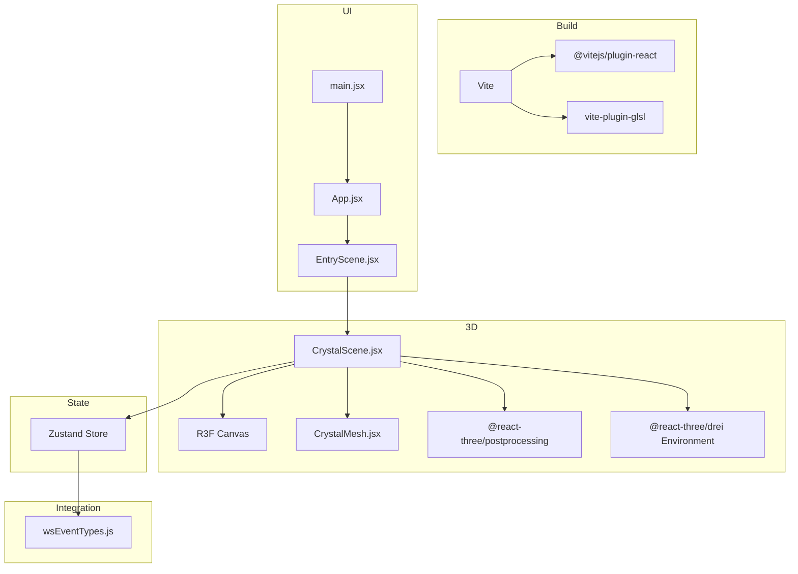

**Diagram sources**
- [vite.config.js](file://frontend/vite.config.js)
- [src/main.jsx](file://frontend/src/main.jsx)
- [src/App.jsx](file://frontend/src/App.jsx)
- [src/scenes/EntryScene.jsx](file://frontend/src/scenes/EntryScene.jsx)
- [src/components/crystal/CrystalScene.jsx](file://frontend/src/components/crystal/CrystalScene.jsx)
- [src/components/crystal/CrystalMesh.jsx](file://frontend/src/components/crystal/CrystalMesh.jsx)
- [src/store/atlasStore.js](file://frontend/src/store/atlasStore.js)
- [src/utils/wsEventTypes.js](file://frontend/src/utils/wsEventTypes.js)

## Detailed Component Analysis

### Vite Build Configuration and GLSL Shader Compilation
- Plugins: React and GLSL are enabled to compile shaders and transform JSX.
- Scripts: dev/build/preview commands use Vite for development and production builds.
- Shader Pipeline: GLSL files under src/components/crystal/shaders are imported and processed into JS modules at build time.

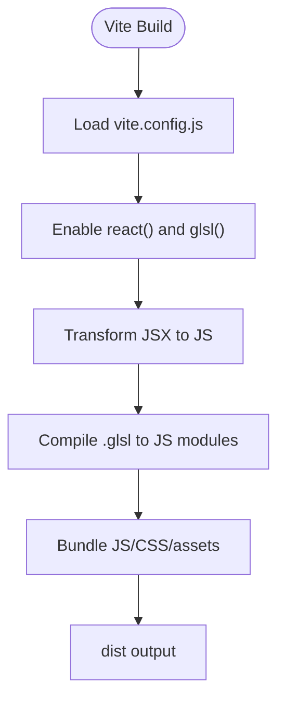

**Diagram sources**
- [vite.config.js](file://frontend/vite.config.js)
- [package.json](file://frontend/package.json)

**Section sources**
- [vite.config.js](file://frontend/vite.config.js)
- [package.json](file://frontend/package.json)

### TailwindCSS Styling Framework and Custom Theme
- Content scanning: Tailwind scans index.html and all JSX files for class names.
- PostCSS: Applies Tailwind and Autoprefixer to generated CSS.
- Global Styles: CSS variables define color palette, typography, spacing, z-layers, and transitions. Custom cursor styling included.

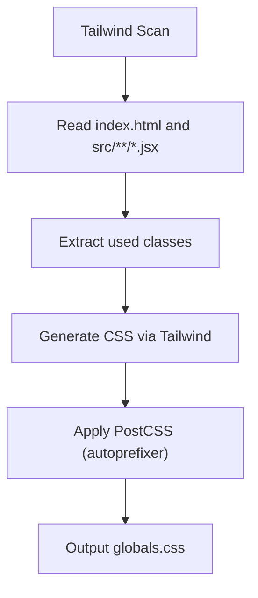

**Diagram sources**
- [tailwind.config.js](file://frontend/tailwind.config.js)
- [postcss.config.js](file://frontend/postcss.config.js)
- [src/styles/globals.css](file://frontend/src/styles/globals.css)

**Section sources**
- [tailwind.config.js](file://frontend/tailwind.config.js)
- [postcss.config.js](file://frontend/postcss.config.js)
- [src/styles/globals.css](file://frontend/src/styles/globals.css)

### React Application Bootstrap and App Shell
- main.jsx initializes React 18 root and mounts App within StrictMode.
- App.jsx sets up a custom cursor overlay and renders EntryScene.

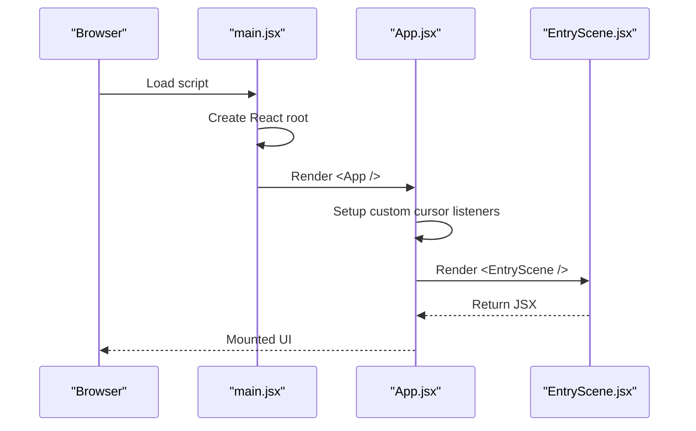

**Diagram sources**
- [src/main.jsx](file://frontend/src/main.jsx)
- [src/App.jsx](file://frontend/src/App.jsx)
- [src/scenes/EntryScene.jsx](file://frontend/src/scenes/EntryScene.jsx)

**Section sources**
- [src/main.jsx](file://frontend/src/main.jsx)
- [src/App.jsx](file://frontend/src/App.jsx)
- [src/scenes/EntryScene.jsx](file://frontend/src/scenes/EntryScene.jsx)

### Three.js Scene Management and Rendering Pipeline
- Canvas: Full-screen fixed canvas with DPR range [1,2], ACES tone mapping, and high-performance GPU preference.
- Lighting: Ambient and directional lights provide base illumination.
- Environment: HDR environment loaded from public/hdri for realistic reflections.
- Post-processing: Bloom, Chromatic Aberration, Vignette, Noise, Depth of Field, and Tone Mapping applied via EffectComposer.
- GPU Quality Detection: Detects low-end GPUs and adjusts DOF and effect parameters.

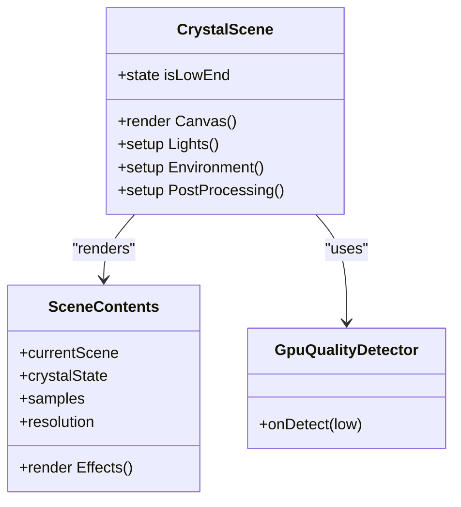

**Diagram sources**
- [src/components/crystal/CrystalScene.jsx](file://frontend/src/components/crystal/CrystalScene.jsx)

**Section sources**
- [src/components/crystal/CrystalScene.jsx](file://frontend/src/components/crystal/CrystalScene.jsx)

### CrystalMesh Component and GLTF Model Handling
- Loads a GLTF model and clones it to avoid shared geometry/material issues.
- Splits mesh parts into shell and core based on node names.
- Applies MeshTransmissionMaterial to shell and emissive standard material to core.
- Rotates group based on crystal state and user input length.

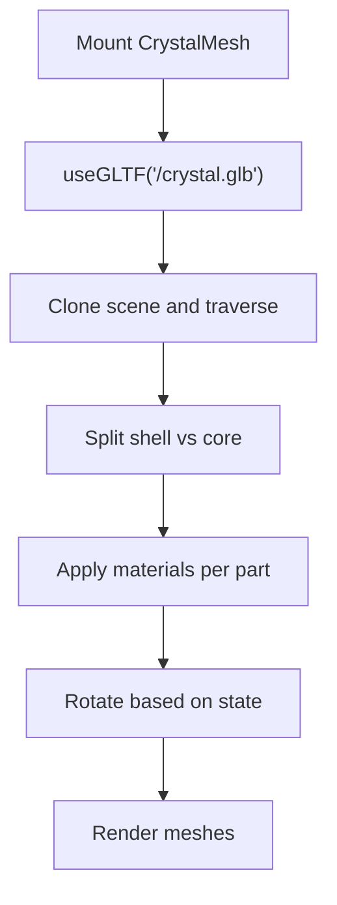

**Diagram sources**
- [src/components/crystal/CrystalMesh.jsx](file://frontend/src/components/crystal/CrystalMesh.jsx)

**Section sources**
- [src/components/crystal/CrystalMesh.jsx](file://frontend/src/components/crystal/CrystalMesh.jsx)

### GLSL Shaders: Vertex Displacement and Fluid Fragment
- crystalVertex.glsl: Implements Perlin noise and FBM to displace vertices along normals, controlled by uDisplacementAmount and uTime.
- fluid.frag.glsl: Domain-warped fluid simulation for shaft walls with scan line effect and edge vignette.

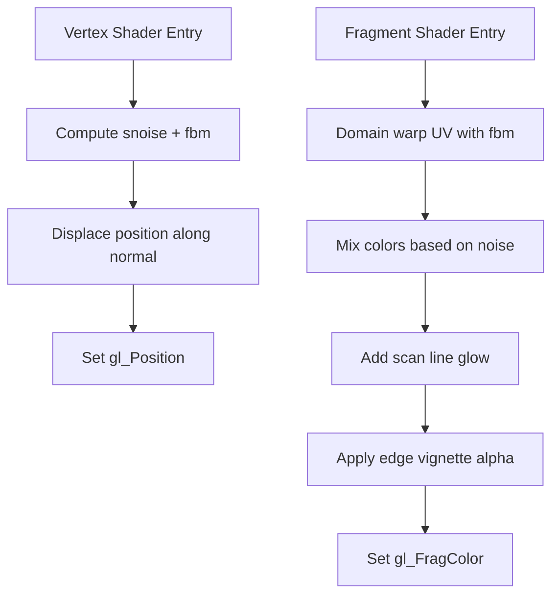

**Diagram sources**
- [src/components/crystal/shaders/crystalVertex.glsl](file://frontend/src/components/crystal/shaders/crystalVertex.glsl)
- [src/components/crystal/shaders/fluid.frag.glsl](file://frontend/src/components/crystal/shaders/fluid.frag.glsl)

**Section sources**
- [src/components/crystal/shaders/crystalVertex.glsl](file://frontend/src/components/crystal/shaders/crystalVertex.glsl)
- [src/components/crystal/shaders/fluid.frag.glsl](file://frontend/src/components/crystal/shaders/fluid.frag.glsl)

### Zustand State Management
- Stores current scene, crystal lifecycle, pipeline stage/error, inputs, results, data shards, scan line, VRAM swapping, and chat messages.
- Provides setters and reset functionality to clear state across pipeline runs.

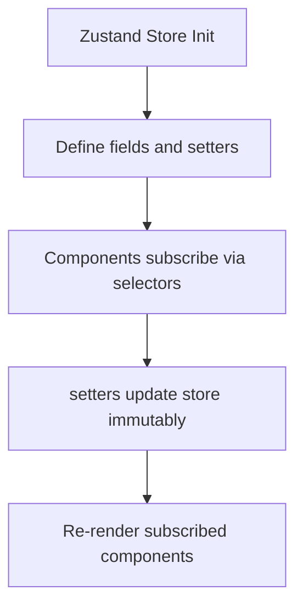

**Diagram sources**
- [src/store/atlasStore.js](file://frontend/src/store/atlasStore.js)

**Section sources**
- [src/store/atlasStore.js](file://frontend/src/store/atlasStore.js)

### WebSocket Integration and Event Types
- wsEventTypes.js enumerates backend events for pipeline, agents, gatherer, synthesizer, critic, memory, and VRAM operations.
- These constants should be used when subscribing to WebSocket messages to drive UI updates and state changes.

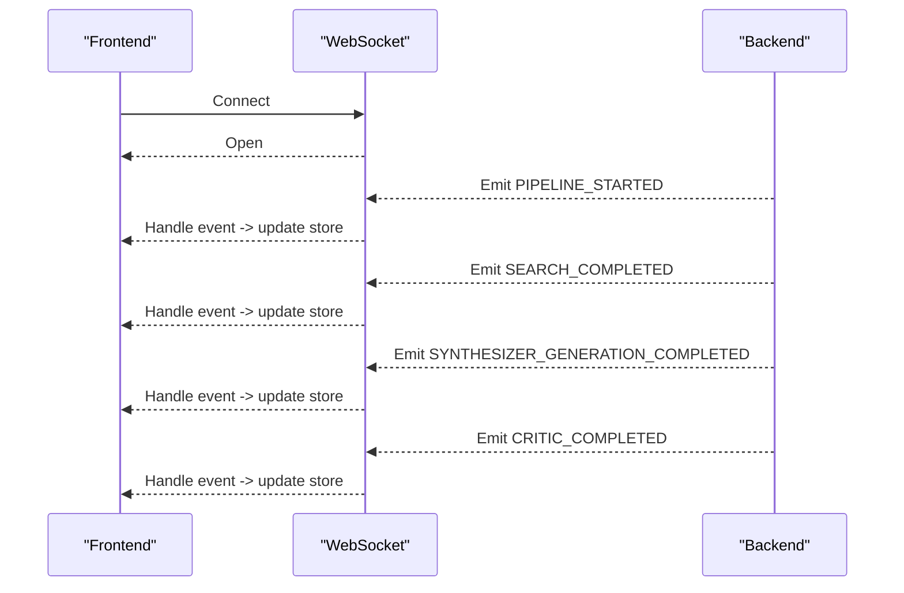

**Diagram sources**
- [src/utils/wsEventTypes.js](file://frontend/src/utils/wsEventTypes.js)

**Section sources**
- [src/utils/wsEventTypes.js](file://frontend/src/utils/wsEventTypes.js)

## Dependency Analysis
Key dependencies include React 18, Three.js, React Three Fiber/Drei/Postprocessing, Zustand, GSAP, Leva, and Vite ecosystem tools. TailwindCSS and PostCSS handle styling.

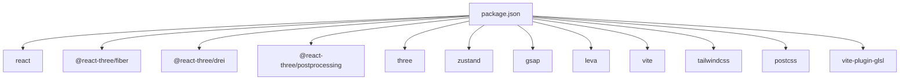

**Diagram sources**
- [package.json](file://frontend/package.json)

**Section sources**
- [package.json](file://frontend/package.json)

## Performance Considerations
- GPU Quality Detection: Adjusts multisampling, DOF, and effect resolution based on MAX_TEXTURE_SIZE.
- DPR Range: Limits pixel ratio to [1,2] to balance clarity and performance.
- Material Optimization: Uses MeshTransmissionMaterial with tuned samples/resolution; preloads GLTF model.
- Post-processing: Selectively enables Depth of Field only in specific scenes and on capable devices.
- Asset Loading: Preload GLTF and ensure efficient texture/HDR usage; consider texture atlases and compressed formats.
- State Updates: Use fine-grained Zustand selectors to minimize re-renders.

[No sources needed since this section provides general guidance]

## Troubleshooting Guide
- Shader Compilation Errors: Ensure GLSL files are correctly imported and syntax is valid; check browser console for compilation logs.
- Missing Assets: Verify paths for GLTF models and HDRIs under public/; confirm preload calls.
- Tailwind Classes Not Applied: Confirm content paths in tailwind.config.js include all relevant directories and file extensions.
- PostCSS Issues: Validate postcss.config.js includes tailwindcss and autoprefixer plugins.
- State Not Updating: Inspect Zustand store subscriptions and ensure setters are called with correct payloads.
- WebSocket Events: Match event strings exactly with wsEventTypes.js; log incoming messages to verify payload structure.

**Section sources**
- [tailwind.config.js](file://frontend/tailwind.config.js)
- [postcss.config.js](file://frontend/postcss.config.js)
- [src/components/crystal/CrystalMesh.jsx](file://frontend/src/components/crystal/CrystalMesh.jsx)
- [src/utils/wsEventTypes.js](file://frontend/src/utils/wsEventTypes.js)

## Conclusion
The Atlas Research frontend combines Vite, React 18, and Three.js to deliver an interactive 3D experience with robust state management and real-time updates. Proper configuration of GLSL shaders, TailwindCSS, and post-processing ensures both visual fidelity and performance. Following the documented workflows and best practices will streamline development, debugging, and testing.

[No sources needed since this section summarizes without analyzing specific files]

## Appendices

### Development Workflow
- Start development server: npm run dev
- Build production bundle: npm run build
- Preview production build: npm run preview
- Debugging: Use React DevTools to inspect component tree and Zustand store state.
- Testing: Integrate unit tests for Zustand slices and utility functions; consider snapshot tests for static components.

**Section sources**
- [package.json](file://frontend/package.json)

### Asset Management
- Textures and HDRIs: Place assets under public/ and reference absolute paths (e.g., /hdri/kloofendal_puresky.hdr).
- GLTF Models: Preload models to reduce load latency and ensure consistent initialization.

**Section sources**
- [src/components/crystal/CrystalScene.jsx](file://frontend/src/components/crystal/CrystalScene.jsx)
- [src/components/crystal/CrystalMesh.jsx](file://frontend/src/components/crystal/CrystalMesh.jsx)