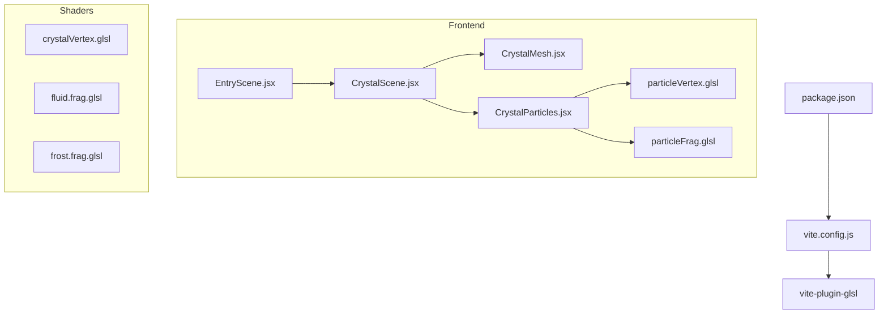
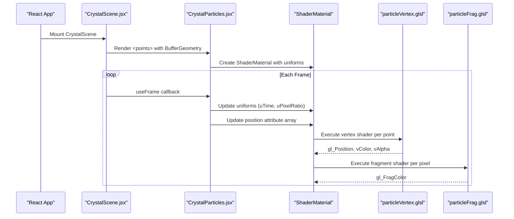
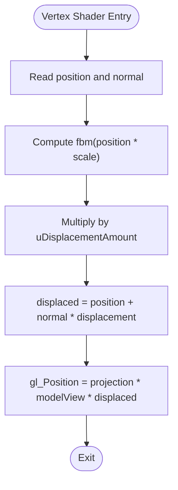
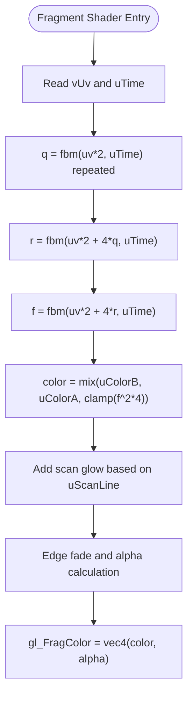
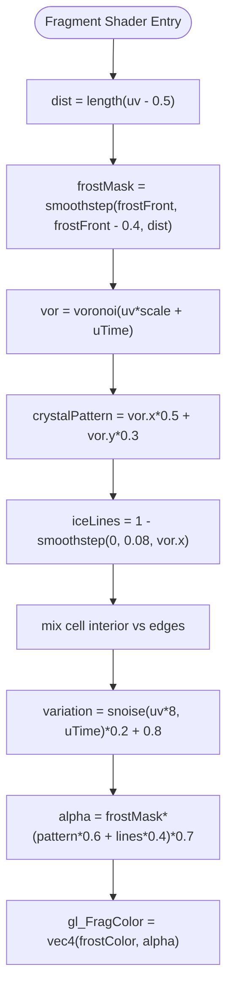
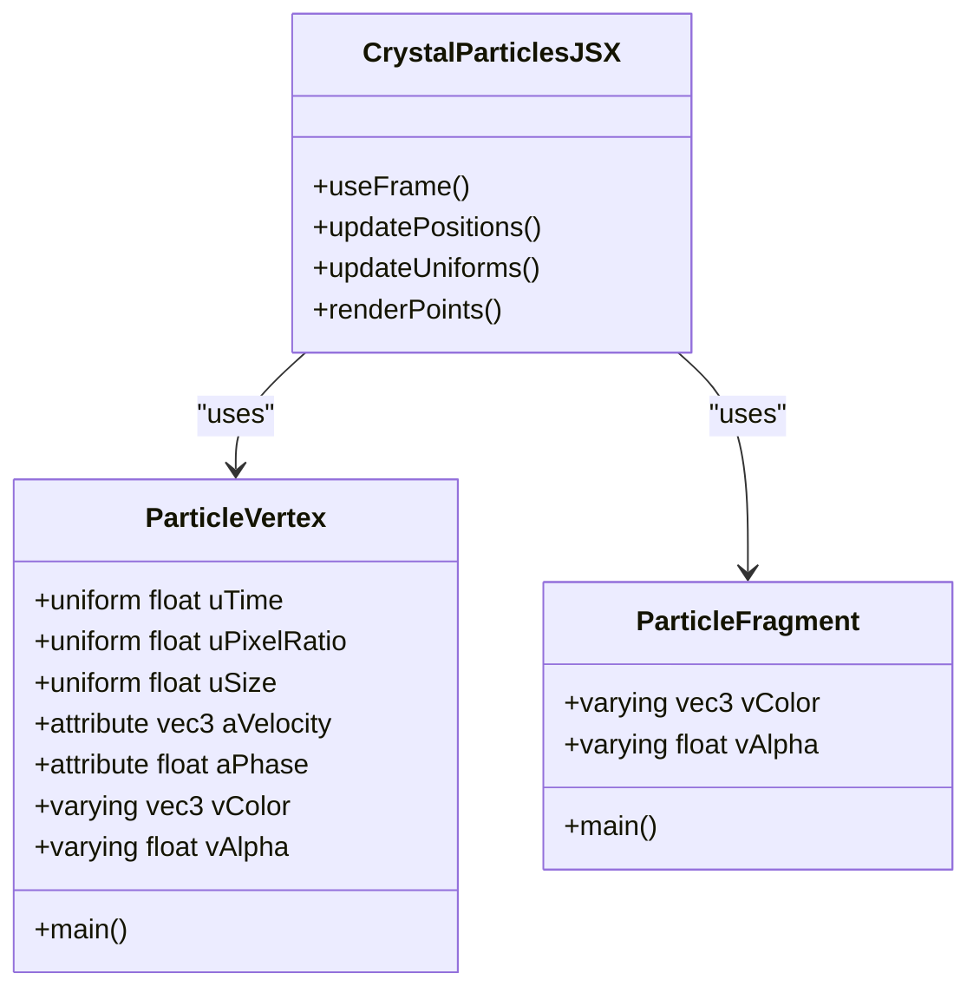
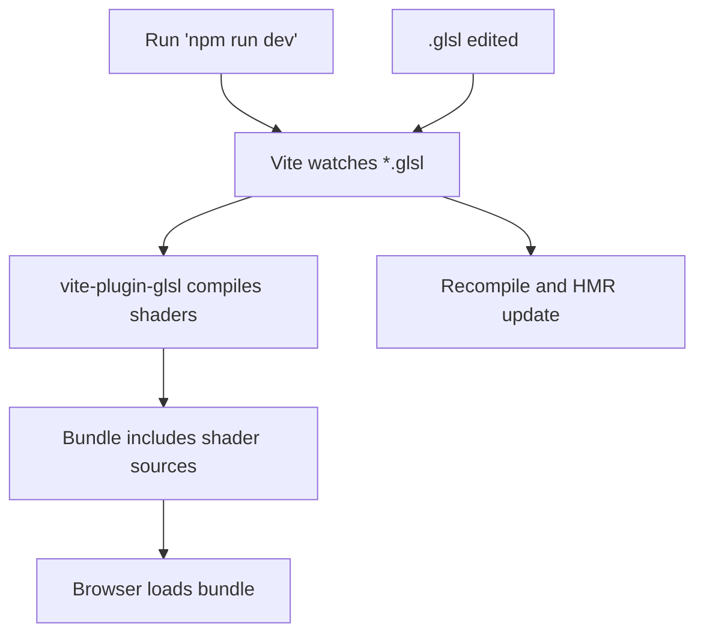
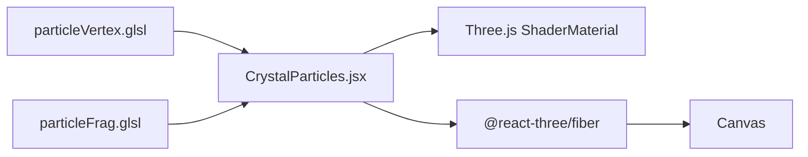

# Shader Development

<cite>
**Referenced Files in This Document**
- [crystalVertex.glsl](file://frontend/src/components/crystal/shaders/crystalVertex.glsl)
- [fluid.frag.glsl](file://frontend/src/components/crystal/shaders/fluid.frag.glsl)
- [frost.frag.glsl](file://frontend/src/components/crystal/shaders/frost.frag.glsl)
- [particleFrag.glsl](file://frontend/src/components/crystal/shaders/particleFrag.glsl)
- [particleVertex.glsl](file://frontend/src/components/crystal/shaders/particleVertex.glsl)
- [CrystalParticles.jsx](file://frontend/src/components/crystal/CrystalParticles.jsx)
- [CrystalMesh.jsx](file://frontend/src/components/crystal/CrystalMesh.jsx)
- [CrystalScene.jsx](file://frontend/src/components/crystal/CrystalScene.jsx)
- [vite.config.js](file://frontend/vite.config.js)
- [package.json](file://frontend/package.json)
</cite>

## Table of Contents
1. [Introduction](#introduction)
2. [Project Structure](#project-structure)
3. [Core Components](#core-components)
4. [Architecture Overview](#architecture-overview)
5. [Detailed Component Analysis](#detailed-component-analysis)
6. [Dependency Analysis](#dependency-analysis)
7. [Performance Considerations](#performance-considerations)
8. [Troubleshooting Guide](#troubleshooting-guide)
9. [Conclusion](#conclusion)

## Introduction
This document provides comprehensive shader development guidance for the Atlas Research GLSL effects system. It covers vertex and fragment shader techniques used to create crystal mesh deformation, particle positioning, fluid simulations, frost effects, and soft particle rendering. It also explains how shaders are compiled via vite-plugin-glsl, how hot reloading works during development, and how to debug common issues. Performance optimization strategies, texture sampling best practices, memory management, and integration with Three.js materials and animation systems are included. Mathematical foundations for noise-based effects and practical troubleshooting tips round out the guide.

## Project Structure
The shader assets live under a dedicated directory and are consumed by React components using @react-three/fiber and Three.js. The build pipeline is configured through Vite with the GLSL plugin enabled.

**Diagram sources**
- [CrystalScene.jsx:1-116](file://frontend/src/components/crystal/CrystalScene.jsx#L1-L116)
- [CrystalMesh.jsx:1-103](file://frontend/src/components/crystal/CrystalMesh.jsx#L1-L103)
- [CrystalParticles.jsx:1-130](file://frontend/src/components/crystal/CrystalParticles.jsx#L1-L130)
- [crystalVertex.glsl:1-87](file://frontend/src/components/crystal/shaders/crystalVertex.glsl#L1-L87)
- [fluid.frag.glsl:1-106](file://frontend/src/components/crystal/shaders/fluid.frag.glsl#L1-L106)
- [frost.frag.glsl:1-110](file://frontend/src/components/crystal/shaders/frost.frag.glsl#L1-L110)
- [particleFrag.glsl:1-19](file://frontend/src/components/crystal/shaders/particleFrag.glsl#L1-L19)
- [particleVertex.glsl:1-33](file://frontend/src/components/crystal/shaders/particleVertex.glsl#L1-L33)
- [vite.config.js:1-8](file://frontend/vite.config.js#L1-L8)
- [package.json:1-35](file://frontend/package.json#L1-L35)

**Section sources**
- [vite.config.js:1-8](file://frontend/vite.config.js#L1-L8)
- [package.json:1-35](file://frontend/package.json#L1-L35)
- [CrystalScene.jsx:1-116](file://frontend/src/components/crystal/CrystalScene.jsx#L1-L116)
- [CrystalMesh.jsx:1-103](file://frontend/src/components/crystal/CrystalMesh.jsx#L1-L103)
- [CrystalParticles.jsx:1-130](file://frontend/src/components/crystal/CrystalParticles.jsx#L1-L130)

## Core Components
- Crystal Mesh Deformation (vertex shader): Uses fractal Brownian motion (FBM) noise to displace vertices along normals, controlled by time and displacement amount uniforms.
- Fluid Simulation (fragment shader): Domain-warped noise creates turbulent, animated textures suitable for wall surfaces or data-like visuals.
- Frost Effects (fragment shader): Voronoi-based crystalline patterns grow outward over time, driven by an animated uniform.
- Particle System (vertex + fragment shaders): Velocity-driven coloring and alpha pulsing; billboarding ensures particles face the camera.

Key responsibilities:
- Vertex shaders compute positions and pass per-vertex attributes to fragment shaders.
- Fragment shaders compute color and alpha based on UVs, time, and uniforms.
- React components manage geometry, attributes, uniforms, and update loops.

**Section sources**
- [crystalVertex.glsl:1-87](file://frontend/src/components/crystal/shaders/crystalVertex.glsl#L1-L87)
- [fluid.frag.glsl:1-106](file://frontend/src/components/crystal/shaders/fluid.frag.glsl#L1-L106)
- [frost.frag.glsl:1-110](file://frontend/src/components/crystal/shaders/frost.frag.glsl#L1-L110)
- [particleVertex.glsl:1-33](file://frontend/src/components/crystal/shaders/particleVertex.glsl#L1-L33)
- [particleFrag.glsl:1-19](file://frontend/src/components/crystal/shaders/particleFrag.glsl#L1-L19)

## Architecture Overview
The runtime architecture integrates Three.js rendering with React state and animation frames. Shaders are imported as modules and bound to ShaderMaterial instances. Uniforms are updated each frame to drive animations.

**Diagram sources**
- [CrystalScene.jsx:1-116](file://frontend/src/components/crystal/CrystalScene.jsx#L1-L116)
- [CrystalParticles.jsx:1-130](file://frontend/src/components/crystal/CrystalParticles.jsx#L1-L130)
- [particleVertex.glsl:1-33](file://frontend/src/components/crystal/shaders/particleVertex.glsl#L1-L33)
- [particleFrag.glsl:1-19](file://frontend/src/components/crystal/shaders/particleFrag.glsl#L1-L19)

## Detailed Component Analysis

### Crystal Mesh Deformation (Vertex Shader)
The vertex shader displaces vertices using FBM noise to simulate raw crystalline irregularity. Displacement magnitude is controlled by a uniform, allowing transitions between states like SEED and EMERGED.

**Diagram sources**
- [crystalVertex.glsl:1-87](file://frontend/src/components/crystal/shaders/crystalVertex.glsl#L1-L87)

Integration notes:
- The component uses a pre-baked GLTF model and applies MeshTransmissionMaterial for glass-like refraction. While this material does not directly reference the custom vertex shader, the same noise principles can be applied to custom materials or post-processing passes.
- Rotation animation is driven by state (SEED/CHARGING/EMERGED), which can influence uDisplacementAmount if integrated into a custom shader.

**Section sources**
- [crystalVertex.glsl:1-87](file://frontend/src/components/crystal/shaders/crystalVertex.glsl#L1-L87)
- [CrystalMesh.jsx:1-103](file://frontend/src/components/crystal/CrystalMesh.jsx#L1-L103)

### Fluid Simulation (Fragment Shader)
The fragment shader implements domain-warped noise to produce a turbulent, liquid-like appearance. It mixes two colors based on noise intensity and adds a sweeping scan line effect.

**Diagram sources**
- [fluid.frag.glsl:1-106](file://frontend/src/components/crystal/shaders/fluid.frag.glsl#L1-L106)

Usage patterns:
- Suitable for background walls or overlay layers where animated turbulence enhances immersion.
- Can be combined with screen-space effects or projected onto curved geometry.

**Section sources**
- [fluid.frag.glsl:1-106](file://frontend/src/components/crystal/shaders/fluid.frag.glsl#L1-L106)

### Frost Effects (Fragment Shader)
The frost shader generates ice crystal growth patterns using Voronoi cells and noise variation. An animated uniform controls the spread from center outward.

**Diagram sources**
- [frost.frag.glsl:1-110](file://frontend/src/components/crystal/shaders/frost.frag.glsl#L1-L110)

Animation integration:
- Drive uFrostAmount with GSAP or Zustand store updates when synthesis completes.
- Combine with bloom and tone mapping for icy highlights.

**Section sources**
- [frost.frag.glsl:1-110](file://frontend/src/components/crystal/shaders/frost.frag.glsl#L1-L110)

### Particle System (Vertex + Fragment Shaders)
The particle system uses velocity attributes to color and animate points. The vertex shader computes per-particle color and alpha, while the fragment shader renders soft glowing circles.

**Diagram sources**
- [particleVertex.glsl:1-33](file://frontend/src/components/crystal/shaders/particleVertex.glsl#L1-L33)
- [particleFrag.glsl:1-19](file://frontend/src/components/crystal/shaders/particleFrag.glsl#L1-L19)
- [CrystalParticles.jsx:1-130](file://frontend/src/components/crystal/CrystalParticles.jsx#L1-L130)

Data flow:
- Positions and velocities are stored in Float32Array buffers.
- Each frame, positions are updated and marked needsUpdate.
- Uniforms (time, pixel ratio, size) are refreshed every frame.

**Section sources**
- [particleVertex.glsl:1-33](file://frontend/src/components/crystal/shaders/particleVertex.glsl#L1-L33)
- [particleFrag.glsl:1-19](file://frontend/src/components/crystal/shaders/particleFrag.glsl#L1-L19)
- [CrystalParticles.jsx:1-130](file://frontend/src/components/crystal/CrystalParticles.jsx#L1-L130)

### Shader Compilation and Hot Reloading
- vite-plugin-glsl compiles .glsl files into JS modules that export shader source strings.
- Vite’s dev server watches file changes and triggers hot module replacement, updating ShaderMaterial without full reloads.
- Ensure imports match file paths exactly; errors will surface in the browser console during compilation.

**Diagram sources**
- [vite.config.js:1-8](file://frontend/vite.config.js#L1-L8)
- [package.json:1-35](file://frontend/package.json#L1-L35)

**Section sources**
- [vite.config.js:1-8](file://frontend/vite.config.js#L1-L8)
- [package.json:1-35](file://frontend/package.json#L1-L35)

## Dependency Analysis
Shaders are imported directly into React components and bound to ShaderMaterial. The scene orchestrates rendering and updates uniforms each frame.

**Diagram sources**
- [particleVertex.glsl:1-33](file://frontend/src/components/crystal/shaders/particleVertex.glsl#L1-L33)
- [particleFrag.glsl:1-19](file://frontend/src/components/crystal/shaders/particleFrag.glsl#L1-L19)
- [CrystalParticles.jsx:1-130](file://frontend/src/components/crystal/CrystalParticles.jsx#L1-L130)

**Section sources**
- [CrystalParticles.jsx:1-130](file://frontend/src/components/crystal/CrystalParticles.jsx#L1-L130)

## Performance Considerations
- Noise complexity: Limit FBM octaves and avoid excessive branching in fragment shaders. Prefer lower octave counts for real-time performance.
- Texture sampling: If integrating textures, use mipmaps and appropriate filtering. Avoid redundant sampling in tight loops.
- Memory management: Dispose of geometries and materials on unmount to prevent leaks. Reuse buffers where possible.
- GPU quality detection: Adjust samples/resolution dynamically based on device capabilities.
- Blending and depth: Use additive blending for particles and disable depth writes to reduce overdraw costs.
- Animation updates: Batch attribute updates and minimize CPU-side computations inside loops.

[No sources needed since this section provides general guidance]

## Troubleshooting Guide
Common issues and resolutions:
- Shader compilation errors: Check syntax and uniform names. Errors appear in the browser console during HMR. Verify imports and file paths.
- Missing uniforms: Ensure all uniforms referenced in shaders are provided in ShaderMaterial uniforms object.
- Incorrect attribute sizes: Match bufferAttribute itemSize with shader attributes (e.g., vec3 requires itemSize=3).
- Performance drops: Reduce noise iterations, simplify fragment logic, and enable low-end mode flags.
- Visual artifacts: Validate UV ranges, ensure proper normalization of vectors, and check blending modes.

Debugging tips:
- Log varying values in fragment shaders by outputting to color channels temporarily.
- Use simple test patterns (gradients, checkerboards) to isolate shader logic.
- Monitor frame times and GPU memory usage via browser developer tools.

**Section sources**
- [CrystalParticles.jsx:1-130](file://frontend/src/components/crystal/CrystalParticles.jsx#L1-L130)
- [vite.config.js:1-8](file://frontend/vite.config.js#L1-L8)

## Conclusion
The Atlas Research GLSL effects system leverages noise-based vertex displacement, domain-warped fluid simulation, Voronoi frost patterns, and velocity-driven particles to create immersive visual experiences. Integration with Three.js and React enables dynamic updates and efficient rendering. By following the optimization strategies and troubleshooting steps outlined here, developers can maintain high performance while iterating on complex shader effects.

[No sources needed since this section summarizes without analyzing specific files]