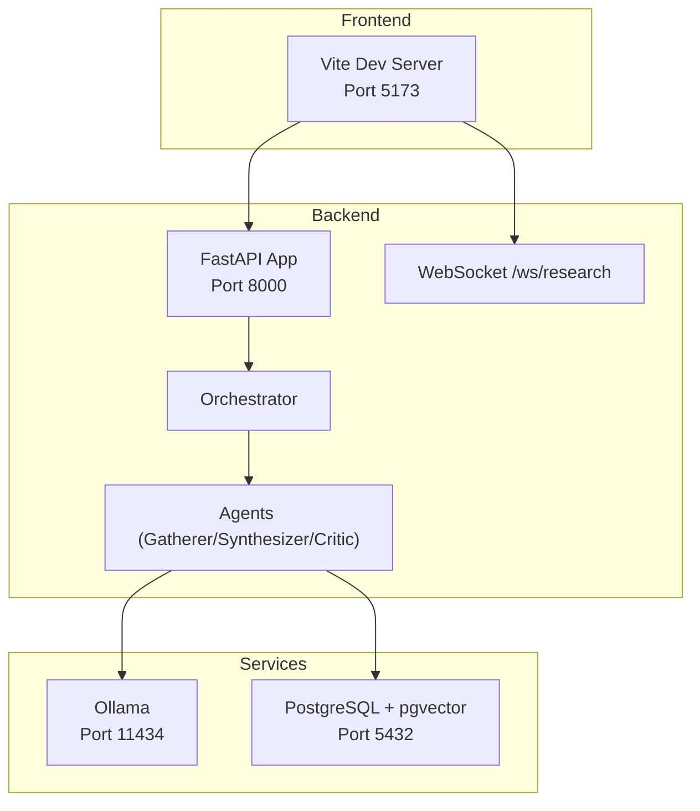
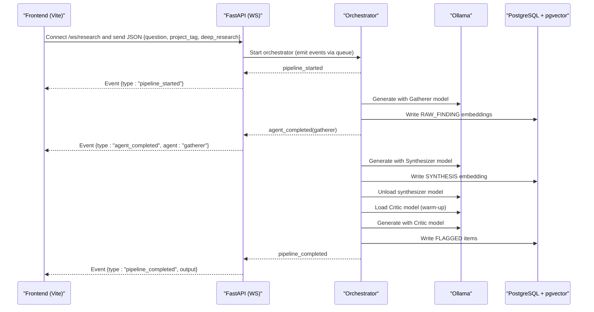
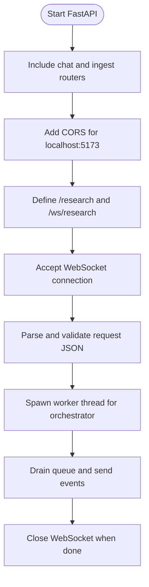
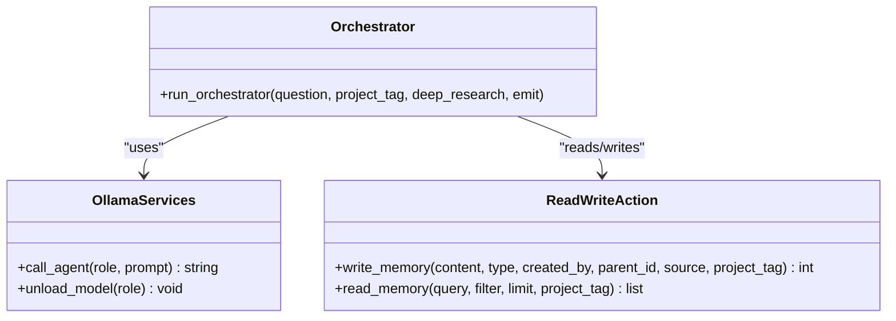
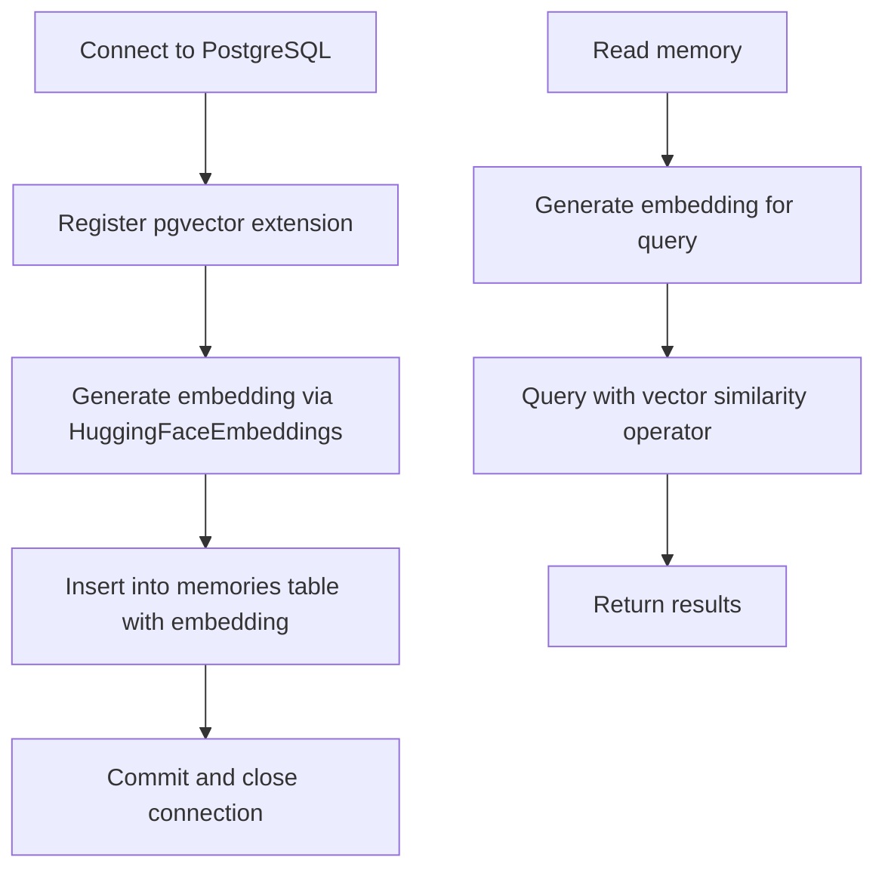
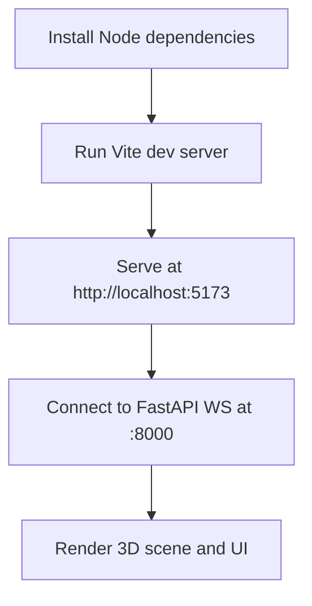
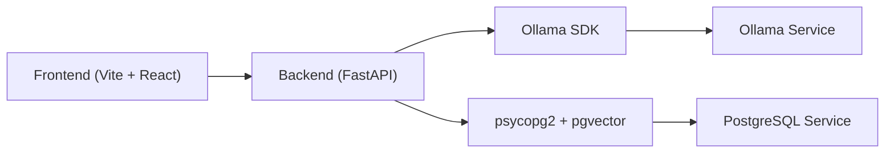

# Getting Started Guide

<cite>
**Referenced Files in This Document**
- [ATLASRESEARCH_MASTER.md](file://ATLASRESEARCH_MASTER.md)
- [main.py](file://backend/main.py)
- [orchestrator.py](file://backend/orchestrator.py)
- [ollama_services.py](file://backend/ollama_services.py)
- [read_write_action.py](file://backend/read_write_action.py)
- [package.json](file://frontend/package.json)
- [vite.config.js](file://frontend/vite.config.js)
- [wsEventTypes.js](file://frontend/src/utils/wsEventTypes.js)
</cite>

## Table of Contents
1. Introduction
2. Project Structure
3. Core Components
4. Architecture Overview
5. Detailed Component Analysis
6. Dependency Analysis
7. Performance Considerations
8. Troubleshooting Guide
9. Conclusion
10. Appendices

## Introduction
Atlas Research is a fully local, offline research application that runs three AI agents (Gatherer, Synthesizer, Critic) and persists findings in PostgreSQL with pgvector. The frontend is a real-time 3D experience built with React, Three.js, and Vite; the backend is a FastAPI service that orchestrates the pipeline and communicates via WebSocket. Ollama provides local LLM inference.

This guide helps you set up both development environments, configure services, and run your first research query.

## Project Structure
The project has two main parts:
- Backend (Python/FastAPI): API endpoints, WebSocket streaming, orchestration, and database operations.
- Frontend (React/Vite): 3D scene, UI, and WebSocket client.

**Diagram sources**
- [main.py:11-21](file://backend/main.py#L11-L21)
- [main.py:71-110](file://backend/main.py#L71-L110)
- [orchestrator.py:12-94](file://backend/orchestrator.py#L12-L94)
- [read_write_action.py:14-51](file://backend/read_write_action.py#L14-L51)
- [ATLASRESEARCH_MASTER.md:36-45](file://ATLASRESEARCH_MASTER.md#L36-L45)

**Section sources**
- [ATLASRESEARCH_MASTER.md:36-45](file://ATLASRESEARCH_MASTER.md#L36-L45)
- [package.json:1-35](file://frontend/package.json#L1-L35)
- [vite.config.js:1-8](file://frontend/vite.config.js#L1-L8)

## Core Components
- FastAPI backend exposes HTTP and WebSocket endpoints for research and chat/ingest routes. CORS is configured to allow the Vite dev server.
- Orchestrator coordinates agent execution, model loading/unloading, and emits events through a queue/WebSocket stream.
- Ollama integration calls local models based on configuration and unloads models between stages to free VRAM.
- PostgreSQL with pgvector stores embeddings and supports semantic search.

Key runtime ports:
- FastAPI: 8000
- Vite: 5173
- Ollama: 11434
- PostgreSQL: 5432

**Section sources**
- [main.py:11-21](file://backend/main.py#L11-L21)
- [main.py:34-46](file://backend/main.py#L34-L46)
- [main.py:71-110](file://backend/main.py#L71-L110)
- [orchestrator.py:12-94](file://backend/orchestrator.py#L12-L94)
- [ollama_services.py:4-17](file://backend/ollama_services.py#L4-L17)
- [read_write_action.py:14-51](file://backend/read_write_action.py#L14-L51)
- [ATLASRESEARCH_MASTER.md:36-45](file://ATLASRESEARCH_MASTER.md#L36-L45)

## Architecture Overview
The frontend initiates a research request over WebSocket. The backend streams pipeline events back to the frontend while running the multi-agent pipeline locally using Ollama and persisting results in PostgreSQL.

**Diagram sources**
- [main.py:71-110](file://backend/main.py#L71-L110)
- [orchestrator.py:12-94](file://backend/orchestrator.py#L12-L94)
- [ollama_services.py:4-17](file://backend/ollama_services.py#L4-L17)
- [read_write_action.py:14-51](file://backend/read_write_action.py#L14-L51)

## Detailed Component Analysis

### Backend Setup and Configuration
- FastAPI app includes routers and CORS allowing the Vite dev server at port 5173.
- WebSocket endpoint handles research requests, validates input, and streams events.
- Orchestrator drives the pipeline and emits typed events consumed by the frontend.

**Diagram sources**
- [main.py:11-21](file://backend/main.py#L11-L21)
- [main.py:34-46](file://backend/main.py#L34-L46)
- [main.py:71-110](file://backend/main.py#L71-L110)

**Section sources**
- [main.py:11-21](file://backend/main.py#L11-L21)
- [main.py:34-46](file://backend/main.py#L34-L46)
- [main.py:71-110](file://backend/main.py#L71-L110)

### Orchestration and Agent Flow
- Orchestrator emits lifecycle events for each agent and manages model load/unload to optimize VRAM usage.
- It writes intermediate results to PostgreSQL and returns final output upon completion.

**Diagram sources**
- [orchestrator.py:12-94](file://backend/orchestrator.py#L12-L94)
- [ollama_services.py:4-17](file://backend/ollama_services.py#L4-L17)
- [read_write_action.py:14-51](file://backend/read_write_action.py#L14-L51)

**Section sources**
- [orchestrator.py:12-94](file://backend/orchestrator.py#L12-L94)
- [ollama_services.py:4-17](file://backend/ollama_services.py#L4-L17)
- [read_write_action.py:14-51](file://backend/read_write_action.py#L14-L51)

### Database Integration (PostgreSQL + pgvector)
- Embeddings are generated and stored using psycopg2 and pgvector.
- Semantic queries use vector similarity operators.

**Diagram sources**
- [read_write_action.py:14-51](file://backend/read_write_action.py#L14-L51)

**Section sources**
- [read_write_action.py:14-51](file://backend/read_write_action.py#L14-L51)

### Frontend Development Environment
- Vite serves the React app with GLSL plugin support for shaders.
- Dependencies include React, Three.js ecosystem, GSAP, Zustand, and Postprocessing.

**Diagram sources**
- [package.json:1-35](file://frontend/package.json#L1-L35)
- [vite.config.js:1-8](file://frontend/vite.config.js#L1-L8)

**Section sources**
- [package.json:1-35](file://frontend/package.json#L1-L35)
- [vite.config.js:1-8](file://frontend/vite.config.js#L1-L8)

## Dependency Analysis
- Frontend depends on Vite, React, Three.js libraries, and GLSL plugin.
- Backend depends on FastAPI, Ollama Python SDK, psycopg2, pgvector, and HuggingFace embeddings.
- Services: PostgreSQL with pgvector extension and Ollama server must be running.

**Diagram sources**
- [package.json:1-35](file://frontend/package.json#L1-L35)
- [main.py:11-21](file://backend/main.py#L11-L21)
- [read_write_action.py:14-51](file://backend/read_write_action.py#L14-L51)

**Section sources**
- [package.json:1-35](file://frontend/package.json#L1-L35)
- [main.py:11-21](file://backend/main.py#L11-L21)
- [read_write_action.py:14-51](file://backend/read_write_action.py#L14-L51)

## Performance Considerations
- Model management: The orchestrator unloads and reloads models to balance VRAM usage across agents.
- Embedding model load time is logged; ensure environment variables are set to avoid network downloads during development.
- Frontend uses efficient shader-based visuals; keep GPU resources available for smooth rendering.

[No sources needed since this section provides general guidance]

## Troubleshooting Guide
Common setup issues and resolutions:
- Port conflicts: Ensure ports 8000, 5173, 11434, 5432 are free.
- CORS errors: Confirm FastAPI allows origin http://localhost:5173.
- WebSocket connection failures: Verify Ollama and PostgreSQL are running and reachable.
- Database connectivity: Check credentials and pgvector extension availability.
- Model loading errors: Ensure Ollama models are pulled and accessible.

**Section sources**
- [main.py:11-21](file://backend/main.py#L11-L21)
- [main.py:71-110](file://backend/main.py#L71-L110)
- [read_write_action.py:14-51](file://backend/read_write_action.py#L14-L51)
- [ATLASRESEARCH_MASTER.md:36-45](file://ATLASRESEARCH_MASTER.md#L36-L45)

## Conclusion
You now have the essential knowledge to install, configure, and run Atlas Research locally. Use the step-by-step instructions below to get your development environment up and running, then explore the interactive 3D research pipeline.

[No sources needed since this section summarizes without analyzing specific files]

## Appendices

### Installation Requirements
- Node.js (for frontend development)
- Python 3.x (for backend development)
- PostgreSQL with pgvector extension installed and running
- Ollama installed and running locally

### Environment Configuration
- FastAPI backend listens on port 8000
- Vite frontend dev server listens on port 5173
- Ollama service listens on port 11434
- PostgreSQL listens on port 5432

### Step-by-Step Setup Instructions

#### Backend Setup
1. Install Python dependencies using your preferred virtual environment tool.
2. Ensure PostgreSQL is running with pgvector extension enabled.
3. Start the FastAPI application.

**Section sources**
- [main.py:11-21](file://backend/main.py#L11-L21)
- [read_write_action.py:14-51](file://backend/read_write_action.py#L14-L51)

#### Frontend Setup
1. Install Node.js dependencies from the frontend directory.
2. Start the Vite development server.

**Section sources**
- [package.json:1-35](file://frontend/package.json#L1-L35)
- [vite.config.js:1-8](file://frontend/vite.config.js#L1-L8)

### First Run Instructions
1. Start PostgreSQL and Ollama services.
2. Launch the FastAPI backend.
3. Launch the Vite frontend.
4. Open the frontend in your browser and enter a research question.
5. Observe the WebSocket events and 3D visualization as the pipeline executes.

**Section sources**
- [main.py:71-110](file://backend/main.py#L71-L110)
- [orchestrator.py:12-94](file://backend/orchestrator.py#L12-L94)
- [wsEventTypes.js:1-44](file://frontend/src/utils/wsEventTypes.js#L1-L44)

### Common Setup Issues and Solutions
- If the frontend cannot connect to the backend, verify CORS settings and port availability.
- If database operations fail, check PostgreSQL credentials and pgvector extension status.
- If model generation fails, ensure Ollama is running and required models are available.

**Section sources**
- [main.py:11-21](file://backend/main.py#L11-L21)
- [read_write_action.py:14-51](file://backend/read_write_action.py#L14-L51)
- [ATLASRESEARCH_MASTER.md:36-45](file://ATLASRESEARCH_MASTER.md#L36-L45)