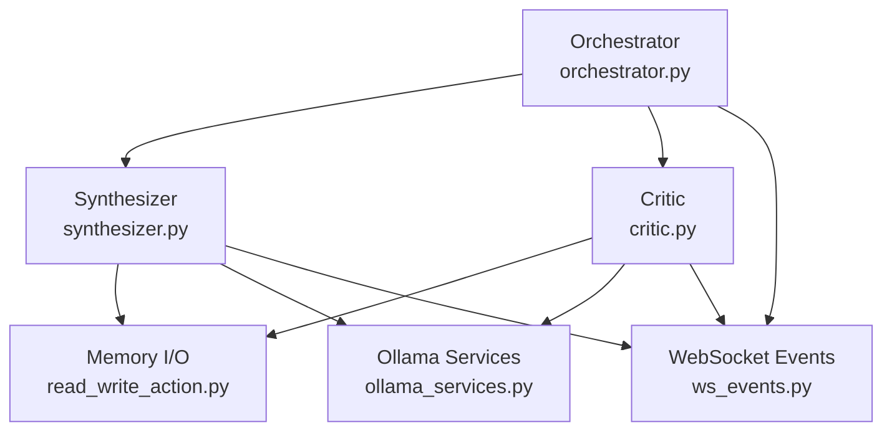
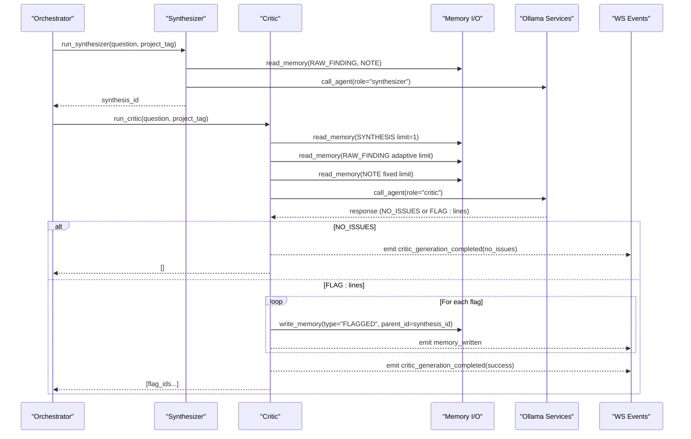
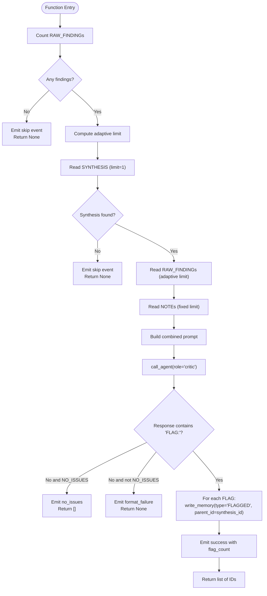
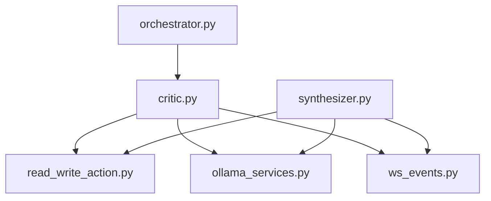

# Critic Agent

<cite>
**Referenced Files in This Document**
- [critic.py](file://backend/critic.py)
- [agent_config.py](file://backend/agent_config.py)
- [orchestrator.py](file://backend/orchestrator.py)
- [synthesizer.py](file://backend/synthesizer.py)
- [read_write_action.py](file://backend/read_write_action.py)
- [ollama_services.py](file://backend/ollama_services.py)
- [ws_events.py](file://backend/ws_events.py)
- [synthesizer-critic-trace.md](file://Documentation/synthesizer-critic-trace.md)
</cite>

## Table of Contents
1. [Introduction](#introduction)
2. [Project Structure](#project-structure)
3. [Core Components](#core-components)
4. [Architecture Overview](#architecture-overview)
5. [Detailed Component Analysis](#detailed-component-analysis)
6. [Dependency Analysis](#dependency-analysis)
7. [Performance Considerations](#performance-considerations)
8. [Troubleshooting Guide](#troubleshooting-guide)
9. [Conclusion](#conclusion)
10. [Appendices](#appendices)

## Introduction
The Critic agent is the quality assurance layer of the research pipeline. It evaluates the Synthesizer’s output against the original raw findings and user notes to ensure accuracy, consistency, and completeness. It flags unsupported claims, contradictions, and significant gaps, then persists each flagged item as a structured memory row linked to the synthesis under review. The agent integrates tightly with the memory system and orchestrator, emitting detailed events for observability and enabling downstream remediation workflows.

## Project Structure
The Critic agent resides in the backend module and participates in a three-agent pipeline: Gatherer → Synthesizer → Critic. It uses shared services for model calls, memory I/O, and event emission.

**Diagram sources**
- [orchestrator.py:12-98](file://backend/orchestrator.py#L12-L98)
- [synthesizer.py:31-101](file://backend/synthesizer.py#L31-L101)
- [critic.py:33-119](file://backend/critic.py#L33-L119)
- [read_write_action.py:14-51](file://backend/read_write_action.py#L14-L51)
- [ollama_services.py:4-17](file://backend/ollama_services.py#L4-L17)
- [ws_events.py:3-14](file://backend/ws_events.py#L3-L14)

**Section sources**
- [orchestrator.py:12-98](file://backend/orchestrator.py#L12-L98)
- [synthesizer.py:31-101](file://backend/synthesizer.py#L31-L101)
- [critic.py:33-119](file://backend/critic.py#L33-L119)

## Core Components
- Evaluation criteria: The Critic checks for claims not supported by raw findings or notes, contradictions among sources, and significant gaps where the synthesis implies completeness without source backing.
- Verification algorithm: Adaptive retrieval of relevant RAW_FINDINGs and NOTEs; prompt construction combining synthesis, findings, and notes; LLM-based evaluation via call_agent; parsing of structured FLAG: lines or NO_ISSUES response.
- Quality metrics: Outcome categories include no_issues, success (with flag count), and format_failure; durations are tracked for model calls and total runtime.
- Flagging mechanism: Each issue is persisted as a FLAGGED memory row with parent_id pointing to the synthesis being reviewed; IDs are returned to the orchestrator.
- Integration points: Uses read_memory/write_memory/count_memories for data access; emits structured WebSocket events at key steps; relies on ollama_services for model invocation with role-specific prompts and token limits.

**Section sources**
- [agent_config.py:48-61](file://backend/agent_config.py#L48-L61)
- [critic.py:33-119](file://backend/critic.py#L33-L119)
- [read_write_action.py:14-51](file://backend/read_write_action.py#L14-L51)
- [ollama_services.py:4-17](file://backend/ollama_services.py#L4-L17)
- [ws_events.py:3-14](file://backend/ws_events.py#L3-L14)

## Architecture Overview
The Critic runs after the Synthesizer completes. It retrieves the latest SYNTHESIS and an adaptive subset of RAW_FINDINGs and NOTEs, constructs a verification prompt, and asks the model to identify issues. Results are stored as FLAGGED entries and reported back through events and return values.

**Diagram sources**
- [orchestrator.py:31-78](file://backend/orchestrator.py#L31-L78)
- [synthesizer.py:31-101](file://backend/synthesizer.py#L31-L101)
- [critic.py:33-119](file://backend/critic.py#L33-L119)
- [read_write_action.py:14-51](file://backend/read_write_action.py#L14-L51)
- [ollama_services.py:4-17](file://backend/ollama_services.py#L4-L17)
- [ws_events.py:3-14](file://backend/ws_events.py#L3-L14)

## Detailed Component Analysis

### Critic Evaluation Criteria and Scoring System
- Criteria:
  - Unsupported claim: A statement in the synthesis not clearly backed by any RAW_FINDING or NOTE.
  - Contradiction: Two or more sources conflict; the synthesis must reconcile or acknowledge uncertainty.
  - Gap: The synthesis implies completeness but lacks coverage for a significant aspect implied by the question.
- Scoring and outcomes:
  - NO_ISSUES: No problems detected; returns empty list.
  - Success: One or more FLAG: lines parsed; each becomes a FLAGGED memory row; returns list of IDs.
  - Format failure: Response does not contain expected structure; treated as error path; returns None.
- Metrics:
  - Duration tracking for model calls and total runtime.
  - Event payloads include flag_count and outcome for observability.

**Section sources**
- [agent_config.py:48-61](file://backend/agent_config.py#L48-L61)
- [critic.py:91-119](file://backend/critic.py#L91-L119)

### Verification Algorithm and Data Flow
- Adaptive retrieval:
  - Computes finding_limit using 40% of available RAW_FINDINGs, bounded between 5 and 20, never exceeding actual availability.
  - Retrieves up to 5 NOTE rows to provide context from ingested documents.
- Prompt construction:
  - Combines synthesis content, raw findings, and optional notes into a single prompt tailored for verification.
- Model invocation:
  - Uses role-specific system prompt and token cap configured for the critic role.
- Parsing and persistence:
  - Splits response on "FLAG: " to extract individual issues; writes each as a FLAGGED memory row with parent_id linking to the synthesis.

**Diagram sources**
- [critic.py:20-31](file://backend/critic.py#L20-L31)
- [critic.py:33-119](file://backend/critic.py#L33-L119)

### Memory Integration and Flag Linking
- Reads:
  - SYNTHESIS: limit=1 to get the most relevant synthesis for the question/project.
  - RAW_FINDINGs: adaptive limit based on available count.
  - NOTEs: fixed budget to avoid crowding out web findings.
- Writes:
  - FLAGGED rows created per issue with parent_id set to the synthesis ID being evaluated.
  - Emits memory_written events including id, type, source, project_tag, and duration.

**Section sources**
- [critic.py:47-84](file://backend/critic.py#L47-L84)
- [critic.py:106-113](file://backend/critic.py#L106-L113)
- [read_write_action.py:14-31](file://backend/read_write_action.py#L14-L31)

### Configuration Options and Strictness Levels
- Role configuration:
  - System prompt defines evaluation rules and output format constraints.
  - Token caps constrain generation length per role; critic uses a smaller cap due to concise outputs.
- Model tier selection:
  - Different tiers map roles to specific models; critic typically uses a larger model in higher tiers for better verification.
- Strictness tuning:
  - Adjusting the system prompt can increase sensitivity to minor inconsistencies or relax thresholds for stylistic differences.
  - Changing max_tokens affects how much detail the critic can produce per flag.

**Section sources**
- [agent_config.py:80-102](file://backend/agent_config.py#L80-L102)
- [agent_config.py:48-61](file://backend/agent_config.py#L48-L61)

### Interaction with Other Agents and Pipeline Orchestration
- Orchestrator coordinates sequence:
  - Runs Gatherer, then Synthesizer, unloads synthesizer model, loads critic model, runs Critic, unloads critic model.
  - Emits lifecycle events for each stage and aggregates final output including flagged_items.
- Error handling:
  - If Synthesizer returns None or Critic returns None (format failure), orchestrator stops and reports reason.
  - If Critic returns empty list (no issues), pipeline continues with flagged_items as [].

**Section sources**
- [orchestrator.py:12-98](file://backend/orchestrator.py#L12-L98)

## Dependency Analysis
The Critic depends on shared modules for memory operations, model calls, and event emission. Its coupling is minimal and cohesive, focusing on retrieval, evaluation, and persistence.

**Diagram sources**
- [critic.py:1-4](file://backend/critic.py#L1-L4)
- [orchestrator.py:1-9](file://backend/orchestrator.py#L1-L9)
- [synthesizer.py:1-4](file://backend/synthesizer.py#L1-L4)

**Section sources**
- [critic.py:1-4](file://backend/critic.py#L1-L4)
- [orchestrator.py:1-9](file://backend/orchestrator.py#L1-L9)
- [synthesizer.py:1-4](file://backend/synthesizer.py#L1-L4)

## Performance Considerations
- Adaptive retrieval reduces unnecessary I/O and prompt size while ensuring sufficient context.
- Fixed note budget prevents large ingested documents from dominating the synthesis and critique.
- Disabling thinking mode significantly improves latency for comparison tasks like Critic and Synthesizer.
- Model warm-up strategy isolates load time from generation time for accurate timing.

**Section sources**
- [synthesizer-critic-trace.md:77-92](file://Documentation/synthesizer-critic-trace.md#L77-L92)
- [orchestrator.py:43-59](file://backend/orchestrator.py#L43-L59)

## Troubleshooting Guide
Common issues and resolutions:
- Empty model response: Caused by thinking mode consuming token budget; resolved by disabling think in service calls.
- Stale synthesis retrieval: Multiple SYNTHESIS rows can cause semantic search to pick outdated versions; supersede mechanism should mark old syntheses as SUPERSEDED before writing new ones.
- Format failures: Ensure model responses contain "FLAG:" lines or exactly "NO_ISSUES"; otherwise treat as error path.

Remediation workflow:
- Review FLAGGED items linked to the synthesis via parent_id.
- Use follow-up agent to refine synthesis incorporating corrections identified by Critic.
- Re-run pipeline if necessary to regenerate synthesis and re-evaluate.

**Section sources**
- [synthesizer-critic-trace.md:69-76](file://Documentation/synthesizer-critic-trace.md#L69-L76)
- [synthesizer-critic-trace.md:77-92](file://Documentation/synthesizer-critic-trace.md#L77-L92)
- [critic.py:97-101](file://backend/critic.py#L97-L101)

## Conclusion
The Critic agent provides essential quality assurance by systematically evaluating synthesized information against source material. Its adaptive retrieval, structured output parsing, and integration with memory and orchestration layers ensure robust fact-checking and traceability. Configurable prompts and token limits allow tuning strictness and performance. When combined with the rest of the pipeline, it significantly enhances research reliability and enables iterative refinement through explicit flagging and follow-up workflows.

## Appendices

### Example Evaluation Criteria and Scoring
- Unsupported claim: Flag when synthesis includes details absent from RAW_FINDINGs or NOTEs.
- Contradiction: Flag when synthesis presents conflicting statements without reconciliation.
- Gap: Flag when synthesis implies comprehensive coverage but omits key aspects evident from the question and sources.
- Scoring: NO_ISSUES yields empty list; success yields list of FLAGGED IDs; format_failure yields None.

### Remediation Workflow
- Inspect FLAGGED items and their parent synthesis.
- Engage follow-up agent to incorporate corrections and expand coverage.
- Optionally re-run Synthesizer and Critic to validate improvements.

[No sources needed since this section provides general guidance]