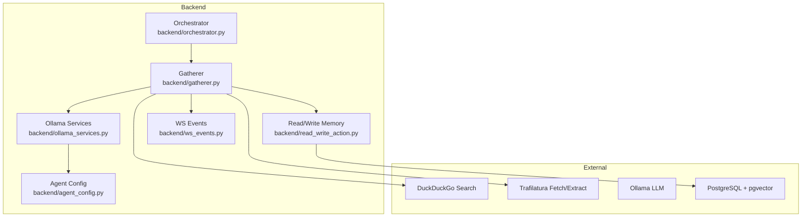
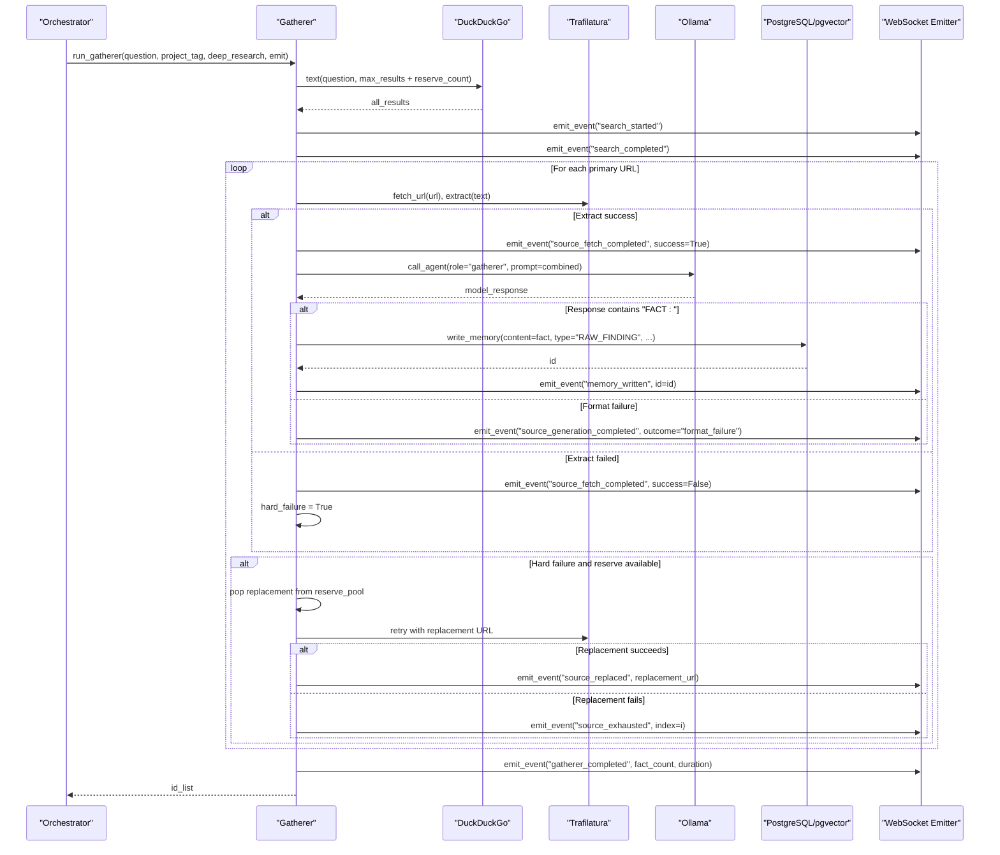
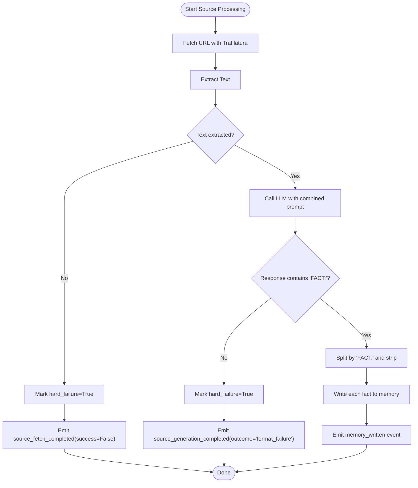
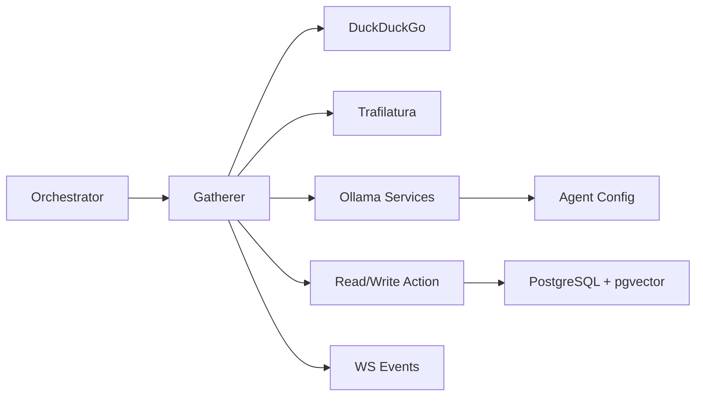

# Gatherer Agent

<cite>
**Referenced Files in This Document**
- [gatherer.py](file://backend/gatherer.py)
- [agent_config.py](file://backend/agent_config.py)
- [ollama_services.py](file://backend/ollama_services.py)
- [read_write_action.py](file://backend/read_write_action.py)
- [ws_events.py](file://backend/ws_events.py)
- [orchestrator.py](file://backend/orchestrator.py)
- [wsEventTypes.js](file://frontend/src/utils/wsEventTypes.js)
- [gatherer-performance-trace.md](file://Documentation/gatherer-performance-trace.md)
</cite>

## Table of Contents
1. [Introduction](#introduction)
2. [Project Structure](#project-structure)
3. [Core Components](#core-components)
4. [Architecture Overview](#architecture-overview)
5. [Detailed Component Analysis](#detailed-component-analysis)
6. [Dependency Analysis](#dependency-analysis)
7. [Performance Considerations](#performance-considerations)
8. [Troubleshooting Guide](#troubleshooting-guide)
9. [Conclusion](#conclusion)

## Introduction
The Gatherer agent is responsible for web search and fact extraction within the Atlas Research pipeline. It uses DuckDuckGo to find relevant sources, Trafilatura to fetch and extract text, an LLM via Ollama to generate structured facts, and a PostgreSQL + pgvector memory store to persist findings. The agent emits WebSocket events for real-time progress tracking and includes deep research mode configuration that adjusts result counts and reserve strategies.

## Project Structure
The Gatherer agent lives in the backend module and integrates with:
- Web search via DuckDuckGo (ddgs)
- Content fetching and extraction via Trafilatura
- LLM inference via Ollama
- Memory persistence via PostgreSQL/pgvector
- Real-time updates via WebSocket events

**Diagram sources**
- [gatherer.py:1-152](file://backend/gatherer.py#L1-L152)
- [agent_config.py:1-111](file://backend/agent_config.py#L1-L111)
- [ollama_services.py:1-26](file://backend/ollama_services.py#L1-L26)
- [read_write_action.py:1-100](file://backend/read_write_action.py#L1-L100)
- [ws_events.py:1-14](file://backend/ws_events.py#L1-L14)
- [orchestrator.py:1-98](file://backend/orchestrator.py#L1-L98)

**Section sources**
- [gatherer.py:1-152](file://backend/gatherer.py#L1-L152)
- [orchestrator.py:1-98](file://backend/orchestrator.py#L1-L98)

## Core Components
- DuckDuckGo search: Retrieves URLs based on the question; supports primary results plus a reserve pool.
- Trafilatura processing: Fetches and extracts text from URLs with configurable timeouts.
- LLM-based fact generation: Uses Ollama with role-specific prompts and token limits to produce FACT: lines or NO_RELEVANT_INFO.
- Memory persistence: Writes each extracted fact as a RAW_FINDING into PostgreSQL with vector embeddings.
- WebSocket events: Emits structured events for search lifecycle, source processing, and memory writes.

Key responsibilities:
- Orchestrating the search and source processing pipeline
- Handling failures and fallbacks using reserve pools
- Emitting timing and status events for observability
- Enforcing format validation for LLM outputs

**Section sources**
- [gatherer.py:12-88](file://backend/gatherer.py#L12-L88)
- [gatherer.py:91-149](file://backend/gatherer.py#L91-L149)
- [ws_events.py:1-14](file://backend/ws_events.py#L1-L14)
- [read_write_action.py:14-30](file://backend/read_write_action.py#L14-L30)

## Architecture Overview
The Gatherer agent follows a sequential pipeline per source with built-in resilience:

**Diagram sources**
- [gatherer.py:91-149](file://backend/gatherer.py#L91-L149)
- [gatherer.py:12-88](file://backend/gatherer.py#L12-L88)
- [ws_events.py:1-14](file://backend/ws_events.py#L1-L14)
- [read_write_action.py:14-30](file://backend/read_write_action.py#L14-L30)
- [ollama_services.py:4-17](file://backend/ollama_services.py#L4-L17)

## Detailed Component Analysis

### Search and Source Processing Pipeline
- Search configuration:
  - Deep research mode increases max_results and maintains a reserve pool for fallbacks.
  - Reserve count ensures backup URLs are available when primary sources fail.
- Per-source processing:
  - Fetch and extract with Trafilatura, including timeout configuration.
  - LLM invocation with role-specific system prompt and token limit.
  - Output validation requiring "FACT:" lines; otherwise treated as format failure.
  - Memory writes for each valid fact, emitting memory_written events.

**Diagram sources**
- [gatherer.py:12-88](file://backend/gatherer.py#L12-L88)

**Section sources**
- [gatherer.py:91-149](file://backend/gatherer.py#L91-L149)
- [gatherer.py:12-88](file://backend/gatherer.py#L12-L88)

### Deep Research Mode Configuration
- Result counts:
  - Default mode: max_results=3
  - Deep research mode: max_results=5
- Reserve pool:
  - Always requests extra results beyond max_results to serve as backups.
  - Used only when a primary source experiences a hard failure (extract failure or format validation failure).
- Timeout configuration:
  - Trafilatura DOWNLOAD_TIMEOUT and EXTRACTION_TIMEOUT set to 8 seconds to avoid stalls.

**Section sources**
- [gatherer.py:91-116](file://backend/gatherer.py#L91-L116)

### LLM-Based Fact Generation
- Role and prompt:
  - Role: "gatherer"
  - System prompt defines strict formatting rules and extraction criteria.
- Token limits:
  - Max tokens configured per role to bound output size.
- Keep-alive strategy:
  - Ollama keep_alive keeps the model resident across calls within a single run to reduce reload overhead.

**Section sources**
- [agent_config.py:3-31](file://backend/agent_config.py#L3-L31)
- [agent_config.py:97-102](file://backend/agent_config.py#L97-L102)
- [ollama_services.py:4-17](file://backend/ollama_services.py#L4-L17)

### Memory Integration Patterns
- Writing facts:
  - Each extracted fact is written as a RAW_FINDING with metadata (source URL, project tag, created_by).
  - Embeddings are generated using a preloaded HuggingFace embedding model.
- Read operations:
  - Semantic search queries against memories using pgvector.
- Counting and superseding:
  - Utility functions to count ACTIVE memories and mark previous SYNTHESIS rows as SUPERSEDED.

**Section sources**
- [read_write_action.py:14-30](file://backend/read_write_action.py#L14-L30)
- [read_write_action.py:33-51](file://backend/read_write_action.py#L33-L51)
- [read_write_action.py:54-73](file://backend/read_write_action.py#L54-L73)
- [read_write_action.py:76-97](file://backend/read_write_action.py#L76-L97)

### WebSocket Event Emission
- Event structure:
  - All events include type, timestamp, and data payload.
- Gatherer-related events:
  - search_started, search_completed
  - source_started, source_fetch_completed, source_generation_completed
  - source_replaced, source_exhausted
  - memory_written
  - gatherer_completed
- Frontend event types:
  - Centralized constants define event names used by the frontend.

**Section sources**
- [ws_events.py:1-14](file://backend/ws_events.py#L1-L14)
- [wsEventTypes.js:1-44](file://frontend/src/utils/wsEventTypes.js#L1-L44)

## Dependency Analysis
The Gatherer agent depends on several external services and internal modules:

**Diagram sources**
- [gatherer.py:1-152](file://backend/gatherer.py#L1-L152)
- [ollama_services.py:1-26](file://backend/ollama_services.py#L1-L26)
- [read_write_action.py:1-100](file://backend/read_write_action.py#L1-L100)
- [ws_events.py:1-14](file://backend/ws_events.py#L1-L14)
- [agent_config.py:1-111](file://backend/agent_config.py#L1-L111)
- [orchestrator.py:1-98](file://backend/orchestrator.py#L1-L98)

**Section sources**
- [gatherer.py:1-152](file://backend/gatherer.py#L1-L152)
- [orchestrator.py:1-98](file://backend/orchestrator.py#L1-L98)

## Performance Considerations
- Timing instrumentation:
  - Per-stage timing for search, fetch+extract, LLM calls, and memory writes.
- Optimization highlights:
  - Reduced source count (default 3 vs 5) significantly improves runtime.
  - Disabled Hugging Face Hub network checks to use cached models.
  - Kept embedding model loaded once at module level.
  - Ollama keep_alive reduces model reload overhead.
  - Trafilatura timeouts prevent stalls on slow/unresponsive sites.
- Measured performance:
  - Post-optimization runs consistently achieve 20–25 seconds total runtime across different questions.
  - LLM inference dominates runtime (67–84% of total time), while fetch+extract accounts for 7–16%.

**Section sources**
- [gatherer-performance-trace.md:1-121](file://Documentation/gatherer-performance-trace.md#L1-L121)
- [gatherer.py:21-25](file://backend/gatherer.py#L21-L25)
- [gatherer.py:42-45](file://backend/gatherer.py#L42-L45)
- [gatherer.py:69-75](file://backend/gatherer.py#L69-L75)
- [read_write_action.py:9-12](file://backend/read_write_action.py#L9-L12)
- [ollama_services.py:9-16](file://backend/ollama_services.py#L9-L16)

## Troubleshooting Guide
Common issues and resolution strategies:

- Network timeouts:
  - Symptom: Long stalls during web fetching.
  - Resolution: Trafilatura DOWNLOAD_TIMEOUT and EXTRACTION_TIMEOUT set to 8 seconds prevent indefinite waits.
  - Monitoring: Observe source_fetch_completed events with success=False.

- Extraction failures:
  - Symptom: Trafilatura.extract() returns None.
  - Resolution: Pipeline automatically skips failed sources and continues processing.
  - Fallback: If a primary source fails, attempt replacement from reserve pool.

- Format validation errors:
  - Symptom: LLM response does not contain "FACT:" lines.
  - Resolution: Treated as hard failure; triggers reserve pool usage if available.
  - Prevention: Ensure system prompt enforces strict formatting rules.

- Reserve pool exhaustion:
  - Symptom: No backup URLs available after primary failure.
  - Resolution: Pipeline marks source as exhausted and continues with remaining sources.
  - Mitigation: Increase max_results in deep research mode to provide more reserve URLs.

- Memory write failures:
  - Symptom: Database connection or insertion errors.
  - Resolution: Ensure PostgreSQL is running and credentials are correct.
  - Monitoring: Check memory_written events for successful writes.

**Section sources**
- [gatherer.py:27-33](file://backend/gatherer.py#L27-L33)
- [gatherer.py:56-63](file://backend/gatherer.py#L56-L63)
- [gatherer.py:127-144](file://backend/gatherer.py#L127-L144)
- [read_write_action.py:14-30](file://backend/read_write_action.py#L14-L30)

## Conclusion
The Gatherer agent provides a robust, observable, and resilient web search and fact extraction pipeline. By combining DuckDuckGo search, Trafilatura content extraction, LLM-based fact generation, and PostgreSQL memory storage, it delivers structured findings with real-time progress tracking. The deep research mode configuration optimizes result counts and backup strategies, while comprehensive error handling ensures reliability under various failure conditions. Performance optimizations have reduced runtime significantly, making the agent suitable for interactive research workflows.