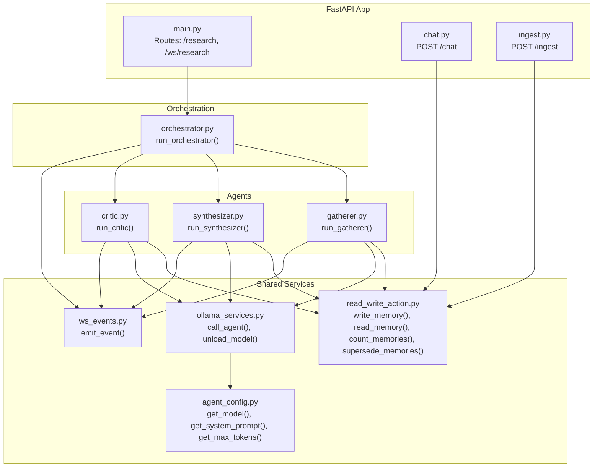
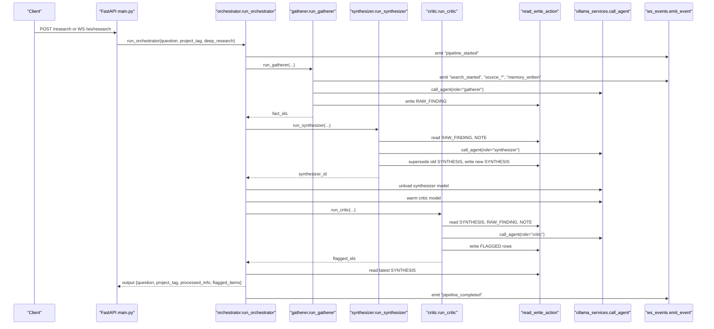
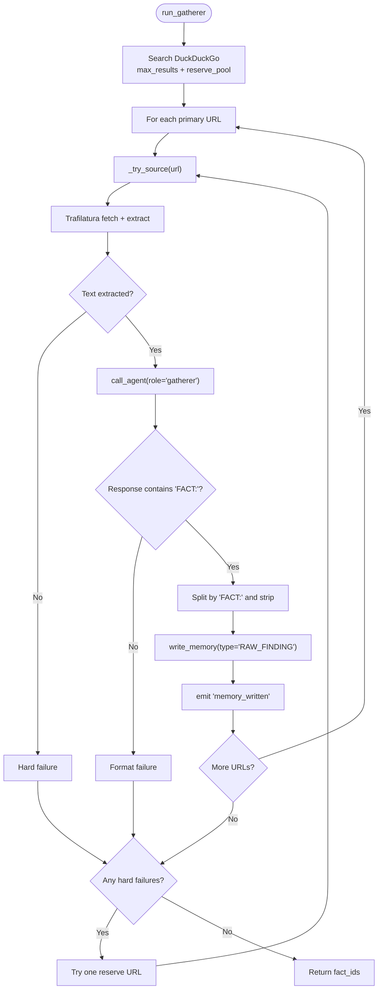
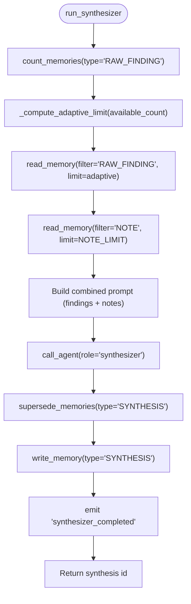
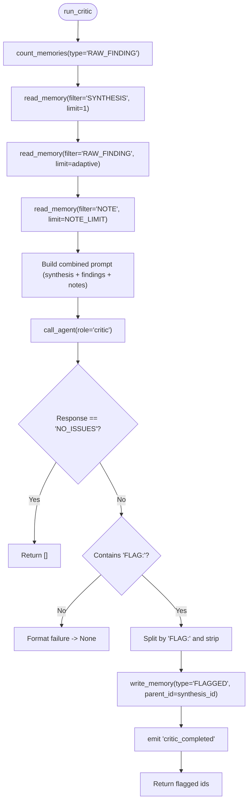
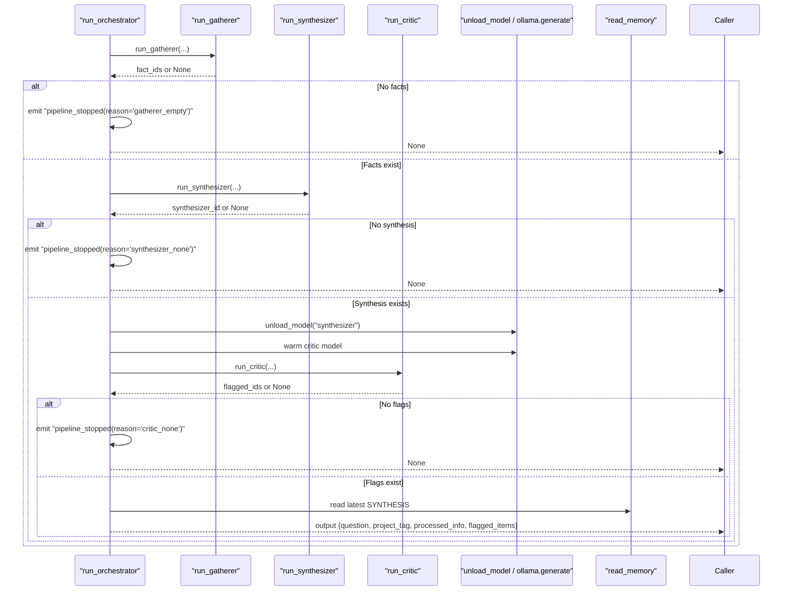
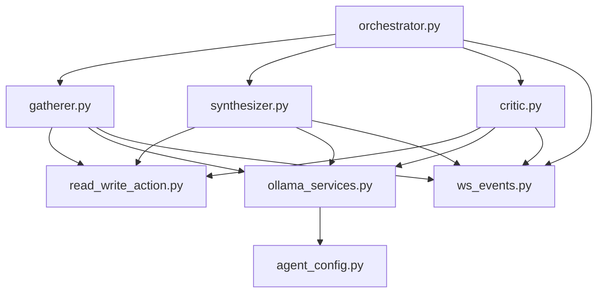

# Multi-Agent Research Pipeline

<cite>
**Referenced Files in This Document**
- [main.py](file://backend/main.py)
- [orchestrator.py](file://backend/orchestrator.py)
- [gatherer.py](file://backend/gatherer.py)
- [synthesizer.py](file://backend/synthesizer.py)
- [critic.py](file://backend/critic.py)
- [agent_config.py](file://backend/agent_config.py)
- [ollama_services.py](file://backend/ollama_services.py)
- [read_write_action.py](file://backend/read_write_action.py)
- [ws_events.py](file://backend/ws_events.py)
- [chat.py](file://backend/chat.py)
- [ingest.py](file://backend/ingest.py)
- [ATLASRESEARCH_MASTER.md](file://ATLASRESEARCH_MASTER.md)
</cite>

## Table of Contents
1. [Introduction](#introduction)
2. [Project Structure](#project-structure)
3. [Core Components](#core-components)
4. [Architecture Overview](#architecture-overview)
5. [Detailed Component Analysis](#detailed-component-analysis)
6. [Dependency Analysis](#dependency-analysis)
7. [Performance Considerations](#performance-considerations)
8. [Troubleshooting Guide](#troubleshooting-guide)
9. [Conclusion](#conclusion)
10. [Appendices](#appendices)

## Introduction
This document explains the multi-agent research pipeline that transforms a user’s research question into structured knowledge through three specialized AI agents: Gatherer, Synthesizer, and Critic. The system is orchestrated by a central orchestrator that manages lifecycle, timing, model loading/unloading, and error handling. Agents communicate via shared PostgreSQL memory with vector search (pgvector), enabling semantic retrieval across raw findings, notes, synthesis, and flagged items. The backend exposes REST endpoints for initiating research and ingesting documents, and a WebSocket endpoint for streaming real-time pipeline events to the frontend.

The pipeline is designed for local execution using Ollama-managed models and DuckDuckGo for web search. Trafilatura extracts readable text from web pages, which the Gatherer agent then processes to produce factual claims. The Synthesizer compresses these facts into a coherent synthesis, and the Critic validates the synthesis against the original evidence, flagging issues when present.

## Project Structure
At a high level, the backend is organized around FastAPI routes, an orchestrator that coordinates agent execution, and modular agent implementations. Shared services include PostgreSQL read/write operations, Ollama model invocation, and event emission utilities.

**Diagram sources**
- [main.py:1-110](file://backend/main.py#L1-L110)
- [orchestrator.py:1-98](file://backend/orchestrator.py#L1-L98)
- [gatherer.py:1-152](file://backend/gatherer.py#L1-L152)
- [synthesizer.py:1-101](file://backend/synthesizer.py#L1-L101)
- [critic.py:1-122](file://backend/critic.py#L1-L122)
- [read_write_action.py:1-100](file://backend/read_write_action.py#L1-L100)
- [ollama_services.py:1-26](file://backend/ollama_services.py#L1-L26)
- [agent_config.py:1-111](file://backend/agent_config.py#L1-L111)
- [ws_events.py:1-14](file://backend/ws_events.py#L1-L14)
- [chat.py:1-72](file://backend/chat.py#L1-L72)
- [ingest.py:1-140](file://backend/ingest.py#L1-L140)

**Section sources**
- [main.py:1-110](file://backend/main.py#L1-L110)
- [ATLASRESEARCH_MASTER.md:1-800](file://ATLASRESEARCH_MASTER.md#L1-L800)

## Core Components
- Orchestrator: Coordinates sequential execution of Gatherer → Synthesizer → Critic, emits lifecycle events, handles model swapping and timing metrics, and returns final output.
- Gatherer: Uses DuckDuckGo to search for relevant URLs, extracts text via Trafilatura, prompts the Gatherer agent to extract FACT lines, writes RAW_FINDING rows to PostgreSQL, and supports primary + reserve URL fallbacks.
- Synthesizer: Reads adaptive limits of RAW_FINDINGs and NOTEs, builds a prompt combining findings and notes, generates a synthesis, marks previous SYNTHESIS rows as SUPERSEDED, and writes a new SYNTHESIS row.
- Critic: Reads the latest SYNTHESIS and adaptive RAW_FINDINGs plus NOTEs, prompts the Critic agent to identify issues, writes FLAGGED rows linked to the synthesis, and reports outcomes.
- Memory layer: PostgreSQL with pgvector embeddings for semantic retrieval; functions support write, read with filters, counting, and superseding.
- Model service: Ollama integration with role-based model selection, system prompts, token limits, and keep-alive management; includes explicit model unloading to free VRAM.
- Event emission: Structured WebSocket events emitted throughout the pipeline for real-time UI updates.

**Section sources**
- [orchestrator.py:1-98](file://backend/orchestrator.py#L1-L98)
- [gatherer.py:1-152](file://backend/gatherer.py#L1-L152)
- [synthesizer.py:1-101](file://backend/synthesizer.py#L1-L101)
- [critic.py:1-122](file://backend/critic.py#L1-L122)
- [read_write_action.py:1-100](file://backend/read_write_action.py#L1-L100)
- [ollama_services.py:1-26](file://backend/ollama_services.py#L1-L26)
- [agent_config.py:1-111](file://backend/agent_config.py#L1-L111)
- [ws_events.py:1-14](file://backend/ws_events.py#L1-L14)

## Architecture Overview
The pipeline follows a strict sequential flow with clear handoffs between agents and shared memory. The orchestrator ensures robustness by emitting detailed events, timing each stage, and managing model lifecycles to optimize performance.

**Diagram sources**
- [main.py:34-46](file://backend/main.py#L34-L46)
- [orchestrator.py:12-94](file://backend/orchestrator.py#L12-L94)
- [gatherer.py:91-149](file://backend/gatherer.py#L91-L149)
- [synthesizer.py:31-100](file://backend/synthesizer.py#L31-L100)
- [critic.py:33-119](file://backend/critic.py#L33-L119)
- [read_write_action.py:14-51](file://backend/read_write_action.py#L14-L51)
- [ollama_services.py:4-17](file://backend/ollama_services.py#L4-L17)
- [ws_events.py:3-14](file://backend/ws_events.py#L3-L14)

## Detailed Component Analysis

### Gatherer Agent
Responsibilities:
- Search the web using DuckDuckGo with configurable result counts based on deep_research mode.
- Extract readable content from URLs using Trafilatura with timeout configuration.
- Prompt the Gatherer agent to decompose source text into specific, checkable FACT lines.
- Write extracted facts as RAW_FINDING rows with metadata (source URL, project tag).
- Implement resilience: if a primary source fails extraction or format validation, try one replacement from a reserve pool.

Key behaviors:
- Emits events for search start/completion, per-source fetch/generation, memory writes, and failures.
- Enforces strict formatting: only lines starting with "FACT:" are accepted; otherwise treated as format failure.
- Returns a list of IDs for successfully written facts.

Configuration and prompts:
- System prompt defines the Gatherer’s role and rules for extracting only specific, verifiable claims.
- Max tokens set to accommodate observed output shapes.

Model usage:
- Calls Ollama with role-specific model, system prompt, and token limit.

**Diagram sources**
- [gatherer.py:91-149](file://backend/gatherer.py#L91-L149)
- [gatherer.py:12-88](file://backend/gatherer.py#L12-L88)

**Section sources**
- [gatherer.py:1-152](file://backend/gatherer.py#L1-L152)
- [agent_config.py:3-31](file://backend/agent_config.py#L3-L31)
- [ollama_services.py:4-17](file://backend/ollama_services.py#L4-L17)

### Synthesizer Agent
Responsibilities:
- Read an adaptive number of RAW_FINDINGs based on available count (fractional rule with min/max bounds).
- Read a fixed budget of NOTEs from ingested documents.
- Build a combined prompt including findings and notes, generate a concise synthesis.
- Mark existing SYNTHESIS rows as SUPERSEDED before writing the new synthesis to avoid stale results.
- Write the new SYNTHESIS row and emit completion events.

Adaptive logic:
- Computes target count as 40% of available findings, bounded by minimum and maximum thresholds.
- Ensures the limit never exceeds available count.

Prompt engineering:
- System prompt instructs the Synthesizer to organize findings into a coherent answer without introducing unsupported claims.

**Diagram sources**
- [synthesizer.py:31-100](file://backend/synthesizer.py#L31-L100)
- [synthesizer.py:19-28](file://backend/synthesizer.py#L19-L28)

**Section sources**
- [synthesizer.py:1-101](file://backend/synthesizer.py#L1-L101)
- [agent_config.py:34-45](file://backend/agent_config.py#L34-L45)
- [ollama_services.py:4-17](file://backend/ollama_services.py#L4-L17)

### Critic Agent
Responsibilities:
- Read the latest SYNTHESIS and adaptive RAW_FINDINGs plus NOTEs.
- Prompt the Critic agent to identify unsupported claims, contradictions, or gaps.
- If no issues are found, return an empty list; otherwise parse FLAG: lines and write FLAGGED rows linked to the synthesis ID.
- Emit detailed events for generation outcomes and memory writes.

Validation logic:
- Expects either "NO_ISSUES" or multiple "FLAG:" lines; treats missing format as failure.
- Writes each flagged item as a separate memory row with parent_id pointing to the synthesis.

Prompt engineering:
- System prompt directs the Critic to focus solely on identifying problems without rewriting or adding information.

**Diagram sources**
- [critic.py:33-119](file://backend/critic.py#L33-L119)
- [critic.py:20-30](file://backend/critic.py#L20-L30)

**Section sources**
- [critic.py:1-122](file://backend/critic.py#L1-L122)
- [agent_config.py:48-61](file://backend/agent_config.py#L48-L61)
- [ollama_services.py:4-17](file://backend/ollama_services.py#L4-L17)

### Orchestrator
Responsibilities:
- Sequence the pipeline: Gatherer → Synthesizer → Critic.
- Emit lifecycle events at each stage start/completion.
- Manage model lifecycle: unload synthesizer model after use, pre-warm critic model to isolate load time from generation time.
- Collect timing metrics and handle early termination conditions (e.g., gatherer_empty, synthesizer_none, critic_none).
- Retrieve the latest synthesis and assemble the final output.

Error handling:
- Stops pipeline and emits reasons when any agent returns no results.
- Wraps exceptions in pipeline_error events for robust client handling.

**Diagram sources**
- [orchestrator.py:12-94](file://backend/orchestrator.py#L12-L94)
- [ollama_services.py:20-26](file://backend/ollama_services.py#L20-L26)

**Section sources**
- [orchestrator.py:1-98](file://backend/orchestrator.py#L1-L98)

### Memory Layer (PostgreSQL + pgvector)
Responsibilities:
- Provide vectorized semantic search over memories filtered by type and project tag.
- Support writing new memories with embeddings generated by a local embedding model.
- Enable superseding of older synthesis versions to ensure current synthesis dominates search results.

Key functions:
- write_memory: Embeds content and inserts into the memories table.
- read_memory: Performs vector similarity search with optional type filter.
- count_memories: Counts active memories by type and project tag.
- supersede_memories: Marks active memories of a given type/project_tag as SUPERSEDED.

Embedding model:
- Uses a local embedding model loaded once at startup; offline mode configured to avoid network calls.

**Section sources**
- [read_write_action.py:1-100](file://backend/read_write_action.py#L1-L100)

### Model Service (Ollama Integration)
Responsibilities:
- Invoke Ollama with role-specific model, system prompt, and token limits.
- Manage keep-alive behavior and model unloading to free VRAM.

Configuration:
- Role-based model selection via agent_config.get_model.
- System prompts defined per role in agent_config.
- Token limits tuned per role based on expected output sizes.

**Section sources**
- [ollama_services.py:1-26](file://backend/ollama_services.py#L1-L26)
- [agent_config.py:80-111](file://backend/agent_config.py#L80-L111)

### WebSocket Event Emission
Responsibilities:
- Emit structured events with timestamps and data payloads for real-time UI updates.
- Provide a no-op path when emit is None (e.g., synchronous CLI usage).

Event types:
- Pipeline-level: started, completed, stopped.
- Agent-level: started, completed.
- Source-level: search_started/completed, source_started/fetch_completed/generation_completed/exhausted/replaced.
- Memory-level: memory_written.
- Model-level: model_unload_started/completed, model_load_started/completed.

**Section sources**
- [ws_events.py:1-14](file://backend/ws_events.py#L1-L14)

### Chat and Ingest Modules
Chat module:
- Provides a follow-up conversation endpoint using the synthesized context.
- Supports saving corrections as CORRECTION rows linked to the synthesis.

Ingest module:
- Accepts PDF, Markdown, or TXT files, chunks them appropriately, and writes NOTE rows.
- Supports chunking strategies tailored to file types and embedding constraints.

**Section sources**
- [chat.py:1-72](file://backend/chat.py#L1-L72)
- [ingest.py:1-140](file://backend/ingest.py#L1-L140)

## Dependency Analysis
The system exhibits clear separation of concerns with minimal coupling:
- Orchestrator depends on agents and shared services but does not implement agent logic.
- Agents depend on memory and model services but remain independent of each other.
- Memory and model services are stateless from the perspective of agents, accessed via function calls.
- Event emission is decoupled via a helper function, allowing synchronous or asynchronous usage.

Potential circular dependencies:
- None detected; all imports are directional from orchestrator → agents → services.

External integrations:
- DuckDuckGo for web search.
- Trafilatura for web page extraction.
- Ollama for LLM inference.
- PostgreSQL with pgvector for semantic memory.

**Diagram sources**
- [orchestrator.py:1-98](file://backend/orchestrator.py#L1-L98)
- [gatherer.py:1-152](file://backend/gatherer.py#L1-L152)
- [synthesizer.py:1-101](file://backend/synthesizer.py#L1-L101)
- [critic.py:1-122](file://backend/critic.py#L1-L122)
- [read_write_action.py:1-100](file://backend/read_write_action.py#L1-L100)
- [ollama_services.py:1-26](file://backend/ollama_services.py#L1-L26)
- [agent_config.py:1-111](file://backend/agent_config.py#L1-L111)
- [ws_events.py:1-14](file://backend/ws_events.py#L1-L14)

**Section sources**
- [orchestrator.py:1-98](file://backend/orchestrator.py#L1-L98)
- [gatherer.py:1-152](file://backend/gatherer.py#L1-L152)
- [synthesizer.py:1-101](file://backend/synthesizer.py#L1-L101)
- [critic.py:1-122](file://backend/critic.py#L1-L122)

## Performance Considerations
- Model lifecycle management: Unloading the synthesizer model after use and warming the critic model isolates load times and reduces VRAM pressure.
- Adaptive limits: Both Synthesizer and Critic use fractional limits with min/max bounds to balance context size and relevance.
- Embedding model initialization: Loaded once at startup to avoid repeated overhead.
- Web scraping timeouts: Trafilatura configured with download and extraction timeouts to prevent hanging.
- WebSocket streaming: Real-time events allow responsive UI without blocking the event loop.
- Database queries: Vector similarity searches are efficient with pgvector; filtering by type and project tag narrows scope.

Recommendations:
- Monitor GPU memory usage during model swaps.
- Tune max_results and reserve pool sizes based on typical query complexity.
- Consider caching frequently used embeddings if patterns emerge.
- Profile database query performance under load and adjust indexes if needed.

[No sources needed since this section provides general guidance]

## Troubleshooting Guide
Common issues and resolutions:
- Gatherer returns no facts:
  - Check DuckDuckGo connectivity and result quality.
  - Verify Trafilatura extraction success and timeout settings.
  - Ensure Gatherer prompt produces valid "FACT:" formatted output.
- Synthesizer skipped:
  - Confirm RAW_FINDINGs exist for the project tag.
  - Review adaptive limit calculation and available count.
- Critic format failure:
  - Validate that the Critic prompt yields "NO_ISSUES" or "FLAG:" lines.
  - Inspect model response parsing logic.
- Model loading errors:
  - Ensure Ollama is running and accessible.
  - Verify model names in agent_config match installed models.
- Database connection issues:
  - Check PostgreSQL credentials and pgvector extension availability.
  - Confirm embeddings model can load in offline mode.

**Section sources**
- [gatherer.py:12-88](file://backend/gatherer.py#L12-L88)
- [synthesizer.py:31-100](file://backend/synthesizer.py#L31-L100)
- [critic.py:33-119](file://backend/critic.py#L33-L119)
- [read_write_action.py:1-100](file://backend/read_write_action.py#L1-L100)
- [ollama_services.py:4-17](file://backend/ollama_services.py#L4-L17)

## Conclusion
The multi-agent research pipeline delivers a robust, extensible architecture for transforming research questions into structured knowledge. Through careful orchestration, adaptive context management, and rigorous validation, the system balances accuracy, performance, and scalability. The modular design allows easy addition of new agents or enhancements to existing ones while maintaining clear interfaces and shared memory semantics.

[No sources needed since this section summarizes without analyzing specific files]

## Appendices

### Agent Configuration Patterns
- Role-based model selection via CURRENT_TIER and models dictionary.
- System prompts define agent responsibilities and output formats.
- Token limits tuned per role to constrain output size.

**Section sources**
- [agent_config.py:80-111](file://backend/agent_config.py#L80-L111)

### Model Selection Options
- CPU-low tier: Smaller models for resource-constrained environments.
- CPU-high tier: Balanced models for better quality with moderate resources.
- GPU tier: Larger models for highest quality when GPU is available.

**Section sources**
- [agent_config.py:80-84](file://backend/agent_config.py#L80-L84)

### Example Agent Communication via Shared Memory
- Gatherer writes RAW_FINDING rows with source URLs and project tags.
- Synthesizer reads findings and notes, writes SYNTHESIS rows, and supersedes previous versions.
- Critic reads synthesis and findings, writes FLAGGED rows linked to synthesis ID.
- Chat module retrieves synthesis for follow-up conversations and saves corrections.

**Section sources**
- [gatherer.py:68-86](file://backend/gatherer.py#L68-L86)
- [synthesizer.py:82-95](file://backend/synthesizer.py#L82-L95)
- [critic.py:106-113](file://backend/critic.py#L106-L113)
- [chat.py:24-36](file://backend/chat.py#L24-L36)