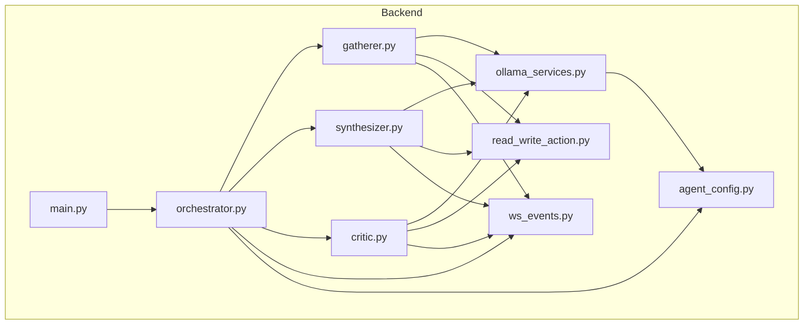
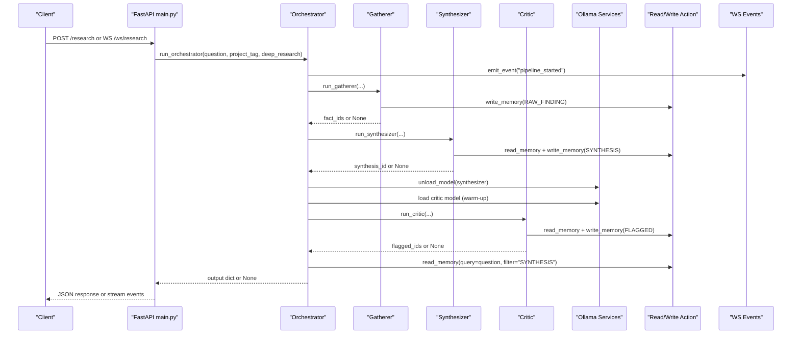
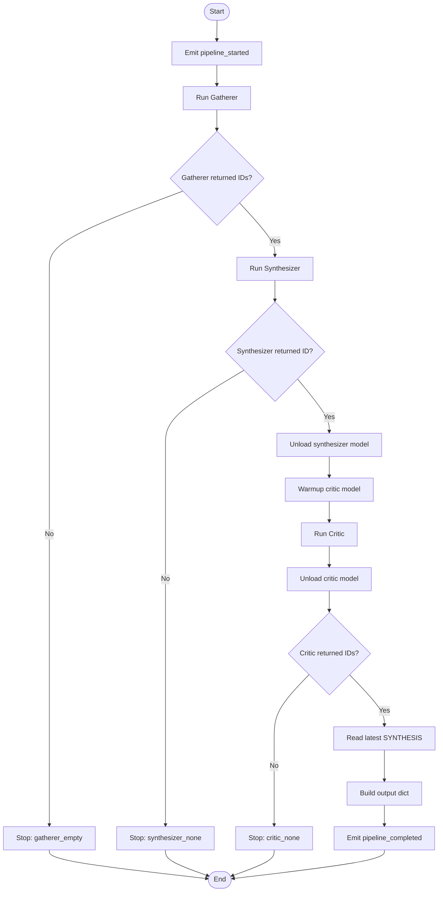
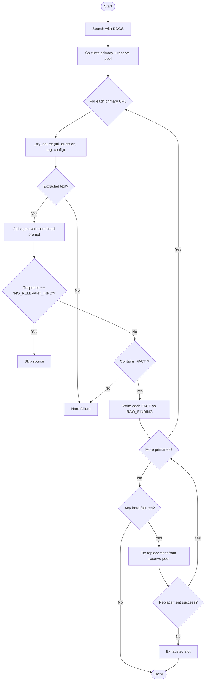
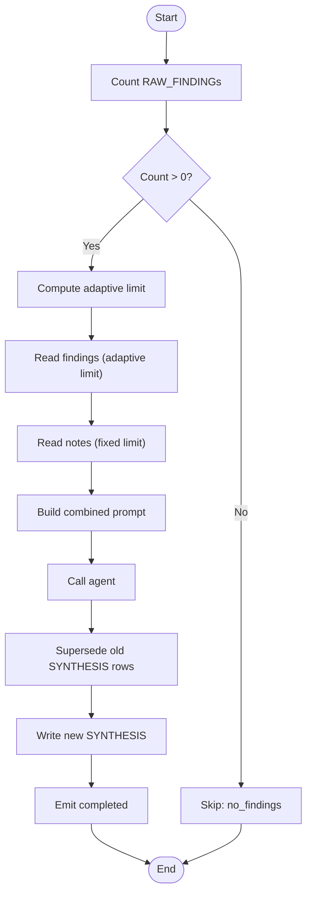
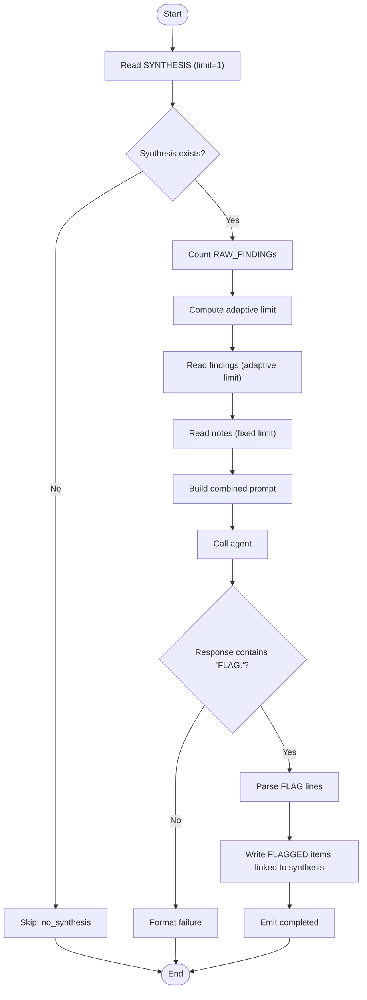
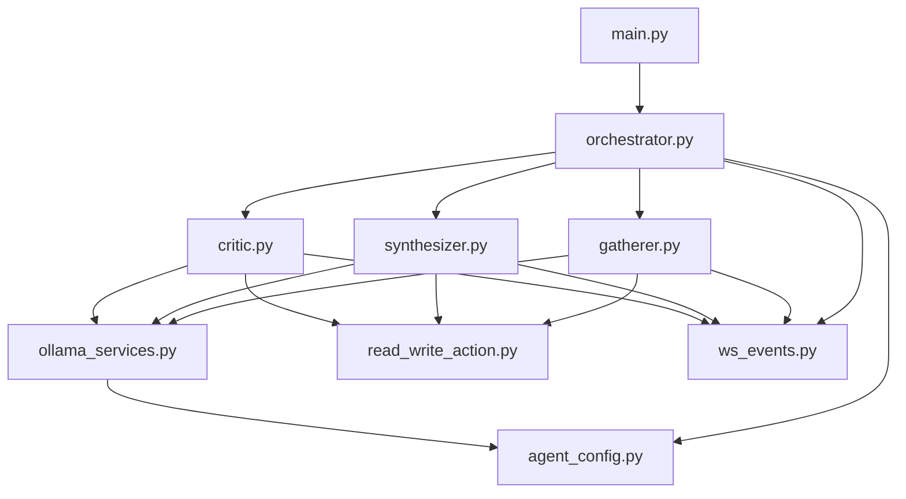

# Pipeline Orchestrator

<cite>
**Referenced Files in This Document**
- [orchestrator.py](file://backend/orchestrator.py)
- [gatherer.py](file://backend/gatherer.py)
- [synthesizer.py](file://backend/synthesizer.py)
- [critic.py](file://backend/critic.py)
- [agent_config.py](file://backend/agent_config.py)
- [ollama_services.py](file://backend/ollama_services.py)
- [read_write_action.py](file://backend/read_write_action.py)
- [ws_events.py](file://backend/ws_events.py)
- [main.py](file://backend/main.py)
- [pipeline-trace-proof-of-concept.md](file://Documentation/pipeline-trace-proof-of-concept.md)
- [gatherer-performance-trace.md](file://Documentation/gatherer-performance-trace.md)
- [synthesizer-critic-trace.md](file://Documentation/synthesizer-critic-trace.md)
</cite>

## Table of Contents
1. [Introduction](#introduction)
2. [Project Structure](#project-structure)
3. [Core Components](#core-components)
4. [Architecture Overview](#architecture-overview)
5. [Detailed Component Analysis](#detailed-component-analysis)
6. [Dependency Analysis](#dependency-analysis)
7. [Performance Considerations](#performance-considerations)
8. [Troubleshooting Guide](#troubleshooting-guide)
9. [Conclusion](#conclusion)
10. [Appendices](#appendices)

## Introduction
This document explains the Pipeline Orchestrator that coordinates a multi-agent research workflow composed of three specialized agents: Gatherer, Synthesizer, and Critic. The orchestrator enforces sequential execution with robust error handling, state management, model lifecycle control, and real-time event emission for monitoring. It also documents inter-agent communication via a shared memory layer, timing controls, resource allocation strategies (including GPU model loading/unloading), failure recovery patterns, configuration examples, custom agent integration guidance, and performance optimization techniques derived from measured traces.

## Project Structure
The backend implements the orchestration logic and agent implementations as separate modules, with FastAPI exposing both synchronous and WebSocket endpoints. Event emission is centralized to support real-time monitoring. Memory operations are handled through a vectorized database interface.

**Diagram sources**
- [main.py:1-110](file://backend/main.py#L1-L110)
- [orchestrator.py:1-98](file://backend/orchestrator.py#L1-L98)
- [gatherer.py:1-152](file://backend/gatherer.py#L1-L152)
- [synthesizer.py:1-101](file://backend/synthesizer.py#L1-L101)
- [critic.py:1-122](file://backend/critic.py#L1-L122)
- [agent_config.py:1-111](file://backend/agent_config.py#L1-L111)
- [ollama_services.py:1-26](file://backend/ollama_services.py#L1-L26)
- [read_write_action.py:1-100](file://backend/read_write_action.py#L1-L100)
- [ws_events.py:1-14](file://backend/ws_events.py#L1-L14)

**Section sources**
- [main.py:1-110](file://backend/main.py#L1-L110)
- [orchestrator.py:1-98](file://backend/orchestrator.py#L1-L98)

## Core Components
- Orchestrator: Coordinates the pipeline lifecycle, timing, model swaps, and emits events.
- Gatherer: Searches web sources, extracts facts, writes RAW_FINDING memories, and handles fallbacks.
- Synthesizer: Retrieves adaptive sets of findings and notes, generates a synthesis, and persists it.
- Critic: Validates synthesis against raw findings and notes, flags issues, and persists flagged items.
- Agent Configuration: Defines role-specific models, system prompts, and token limits.
- Ollama Services: Centralized LLM calls and model unload utilities.
- Read/Write Action: Vectorized memory operations with semantic search and status management.
- WebSocket Events: Structured event emission for real-time monitoring.

Key responsibilities:
- Sequential execution with early termination on failures.
- Model lifecycle management (unload/load) to optimize VRAM usage.
- Adaptive retrieval limits based on available data.
- Robust error handling and informative events for each stage.

**Section sources**
- [orchestrator.py:12-94](file://backend/orchestrator.py#L12-L94)
- [gatherer.py:91-149](file://backend/gatherer.py#L91-L149)
- [synthesizer.py:31-101](file://backend/synthesizer.py#L31-L101)
- [critic.py:33-122](file://backend/critic.py#L33-L122)
- [agent_config.py:80-111](file://backend/agent_config.py#L80-L111)
- [ollama_services.py:4-26](file://backend/ollama_services.py#L4-L26)
- [read_write_action.py:14-100](file://backend/read_write_action.py#L14-L100)
- [ws_events.py:1-14](file://backend/ws_events.py#L1-L14)

## Architecture Overview
The orchestrator drives a strict sequence: Gatherer → Synthesizer → Critic, with explicit model swap between Synthesizer and Critic to manage GPU memory efficiently. Each agent emits structured events for monitoring and returns results or None on failure. The FastAPI layer exposes both REST and WebSocket interfaces; the WebSocket path runs the orchestrator asynchronously on a worker thread and streams events back to clients.

**Diagram sources**
- [main.py:34-110](file://backend/main.py#L34-L110)
- [orchestrator.py:12-94](file://backend/orchestrator.py#L12-L94)
- [gatherer.py:91-149](file://backend/gatherer.py#L91-L149)
- [synthesizer.py:31-101](file://backend/synthesizer.py#L31-L101)
- [critic.py:33-122](file://backend/critic.py#L33-L122)
- [ollama_services.py:4-26](file://backend/ollama_services.py#L4-L26)
- [read_write_action.py:14-100](file://backend/read_write_action.py#L14-L100)
- [ws_events.py:1-14](file://backend/ws_events.py#L1-L14)

## Detailed Component Analysis

### Orchestrator
Responsibilities:
- Initialize pipeline timing and emit start event.
- Execute Gatherer; stop if no results.
- Execute Synthesizer; stop if no result.
- Manage model lifecycle: unload synthesizer model, warm-up critic model, then execute Critic.
- Unload critic model after completion.
- Retrieve final synthesis text and assemble output.
- Emit completion event with total duration and output.

Error handling:
- Early exit on empty gatherer results or missing synthesizer/critic outputs.
- Emits specific reasons for pipeline stops.

Timing controls:
- Tracks per-stage durations and logs them.
- Separates model load time from generation time for accurate profiling.

Inter-agent communication:
- Uses shared memory via read/write actions.
- Emits structured events for each stage.

**Diagram sources**
- [orchestrator.py:12-94](file://backend/orchestrator.py#L12-L94)

**Section sources**
- [orchestrator.py:12-94](file://backend/orchestrator.py#L12-L94)

### Gatherer
Responsibilities:
- Search for top results plus reserve pool.
- For each primary source, attempt fetch, extract, call_agent, format check, and write MEMORY.
- On hard failure, try one replacement from reserve pool.
- Emit detailed events for each step.

Adaptive behavior:
- Deep research toggle adjusts max_results and reserve pool size.
- Timeout configuration prevents stalls on slow sites.

Error handling:
- Skips sources where extraction fails.
- Handles NO_RELEVANT_INFO gracefully.
- Ensures format validation before persisting facts.

**Diagram sources**
- [gatherer.py:91-149](file://backend/gatherer.py#L91-L149)
- [gatherer.py:12-88](file://backend/gatherer.py#L12-L88)

**Section sources**
- [gatherer.py:91-149](file://backend/gatherer.py#L91-L149)
- [gatherer.py:12-88](file://backend/gatherer.py#L12-L88)

### Synthesizer
Responsibilities:
- Count available RAW_FINDING memories.
- Compute adaptive limit based on available count.
- Retrieve findings and notes, build prompt, call agent.
- Mark existing syntheses as superseded to avoid stale results.
- Persist new synthesis and emit events.

Adaptive logic:
- Uses 40% of available findings, bounded by min/max caps.
- Separate fixed budget for notes to prevent crowding out web findings.

Error handling:
- Skips if no findings exist.
- Emits skipped reason when applicable.

**Diagram sources**
- [synthesizer.py:31-101](file://backend/synthesizer.py#L31-L101)

**Section sources**
- [synthesizer.py:31-101](file://backend/synthesizer.py#L31-L101)

### Critic
Responsibilities:
- Retrieve latest SYNTHESIS for the project tag.
- If none exists, skip.
- Retrieve adaptive set of RAW_FINDINGs and notes.
- Build prompt combining synthesis and evidence, call agent.
- Parse FLAG lines or NO_ISSUES, persist flagged items linked to synthesis.
- Emit events for generation outcomes and completion.

Adaptive logic:
- Same adaptive limit rule as Synthesizer for consistency.

Error handling:
- Skips if no synthesis or no findings.
- Handles format failures gracefully.

**Diagram sources**
- [critic.py:33-122](file://backend/critic.py#L33-L122)

**Section sources**
- [critic.py:33-122](file://backend/critic.py#L33-L122)

### Agent Configuration
Defines:
- Role-specific system prompts for Gatherer, Synthesizer, Critic, and Followup.
- Model tiers (cpu-low, cpu-high, gpu) mapping roles to models.
- Per-role token limits aligned with expected output sizes.

Usage:
- Orchestrator and agents retrieve model names and prompts via get_model/get_system_prompt/get_max_tokens.
- Enables easy switching of model tiers without changing agent code.

**Section sources**
- [agent_config.py:1-111](file://backend/agent_config.py#L1-L111)

### Ollama Services
Centralizes:
- LLM calls with role-specific model, system prompt, and token limits.
- Model unloading utility to free VRAM between stages.

Configuration:
- keep_alive ensures models stay resident during bursts.
- think=False disables internal reasoning to reduce overhead and avoid truncated responses.

**Section sources**
- [ollama_services.py:4-26](file://backend/ollama_services.py#L4-L26)

### Read/Write Action
Provides:
- Vectorized memory operations using pgvector and HuggingFace embeddings.
- Functions for writing memories, reading with semantic filtering, counting records, and superseding old entries.

Embeddings:
- Loaded once at module level to avoid repeated initialization.
- Offline mode configured to prevent network checks.

**Section sources**
- [read_write_action.py:1-100](file://backend/read_write_action.py#L1-L100)

### WebSocket Events
Emits:
- Structured event dictionaries with type, timestamp, and data payload.
- No-op when emit is None (e.g., synchronous CLI usage).

Used throughout the pipeline to provide real-time visibility into each stage’s progress and outcomes.

**Section sources**
- [ws_events.py:1-14](file://backend/ws_events.py#L1-L14)

## Dependency Analysis
The orchestrator depends on all three agents and shared services. Agents depend on Ollama services for LLM calls and read_write_action for memory operations. The FastAPI layer integrates the orchestrator and provides both REST and WebSocket endpoints.

**Diagram sources**
- [orchestrator.py:1-98](file://backend/orchestrator.py#L1-L98)
- [gatherer.py:1-152](file://backend/gatherer.py#L1-L152)
- [synthesizer.py:1-101](file://backend/synthesizer.py#L1-L101)
- [critic.py:1-122](file://backend/critic.py#L1-L122)
- [ollama_services.py:1-26](file://backend/ollama_services.py#L1-L26)
- [read_write_action.py:1-100](file://backend/read_write_action.py#L1-L100)
- [agent_config.py:1-111](file://backend/agent_config.py#L1-L111)
- [ws_events.py:1-14](file://backend/ws_events.py#L1-L14)
- [main.py:1-110](file://backend/main.py#L1-L110)

**Section sources**
- [orchestrator.py:1-98](file://backend/orchestrator.py#L1-L98)
- [main.py:1-110](file://backend/main.py#L1-L110)

## Performance Considerations
Key optimizations observed and documented:
- Disabling model thinking mode (think=False) significantly reduces runtime for Synthesizer and Critic.
- Embedding model loaded once at module level avoids repeated initialization overhead.
- Hugging Face Hub offline mode prevents unnecessary network checks.
- Ollama keep_alive keeps models resident across bursts within a single run.
- Adaptive retrieval limits prevent overloading prompts and improve efficiency.
- Source timeout configuration prevents stalls on slow/unresponsive sites.
- Reserve pool fallback improves resilience without parallelization overhead.

Measured performance highlights:
- Gatherer dominates total runtime due to open-ended extraction tasks.
- Synthesizer and Critic contribute less than 10% of total runtime after optimizations.
- End-to-end runs typically complete in ~65 seconds on GPU tier with optimized settings.

Recommendations:
- Target Gatherer-specific optimizations if further speedups are needed.
- Monitor per-stage timings via emitted events to identify bottlenecks.
- Use appropriate model tiers based on hardware constraints and quality requirements.

**Section sources**
- [gatherer-performance-trace.md:1-121](file://Documentation/gatherer-performance-trace.md#L1-L121)
- [synthesizer-critic-trace.md:1-113](file://Documentation/synthesizer-critic-trace.md#L1-L113)

## Troubleshooting Guide
Common issues and resolutions:
- Empty model responses: Ensure think=False is set in Ollama services to avoid truncated outputs under small token caps.
- Stale synthesis retrieval: Implement supersede_memories before writing new syntheses to prevent ambiguity in semantic search.
- Format validation failures: Verify that agents return expected formats (FACT: lines for Gatherer, FLAG: lines for Critic).
- Pipeline early termination: Check emitted events for reasons like gatherer_empty, synthesizer_none, or critic_none.
- Resource exhaustion: Monitor model loading/unloading events and ensure adequate VRAM availability.

Debugging techniques:
- Use WebSocket events to track pipeline progress in real-time.
- Log per-stage timings to identify performance bottlenecks.
- Validate input parameters and project tags to ensure correct scoping.

**Section sources**
- [synthesizer-critic-trace.md:69-92](file://Documentation/synthesizer-critic-trace.md#L69-L92)
- [orchestrator.py:25-41](file://backend/orchestrator.py#L25-L41)
- [gatherer.py:27-33](file://backend/gatherer.py#L27-L33)

## Conclusion
The Pipeline Orchestrator provides a robust, efficient, and observable framework for coordinating multi-agent research workflows. Through careful sequencing, adaptive retrieval, model lifecycle management, and comprehensive event emission, it enables reliable execution of Gatherer, Synthesizer, and Critic agents. Measured performance optimizations demonstrate significant improvements in runtime and reliability, while the architecture supports scalability and customization for future enhancements.

## Appendices

### Pipeline Configuration Examples
- Model tier selection: Configure CURRENT_TIER in agent_config.py to switch between cpu-low, cpu-high, and gpu tiers.
- Token limits: Adjust max_tokens per role based on expected output sizes.
- System prompts: Customize role-specific prompts to refine agent behavior.

### Custom Agent Integration
- Create a new agent module with a run function that accepts question, project_tag, and emit parameters.
- Implement memory operations via read_write_action functions.
- Emit structured events using ws_events.emit_event for monitoring.
- Integrate into orchestrator by adding sequential execution steps with proper error handling.

### Monitoring Capabilities
- Subscribe to WebSocket endpoint /ws/research to receive real-time events.
- Track event types such as pipeline_started, agent_started, agent_completed, model_unload_started, model_load_completed, and pipeline_completed.
- Analyze timestamps and durations to identify performance bottlenecks.

**Section sources**
- [agent_config.py:80-111](file://backend/agent_config.py#L80-L111)
- [ws_events.py:1-14](file://backend/ws_events.py#L1-L14)
- [main.py:71-110](file://backend/main.py#L71-L110)