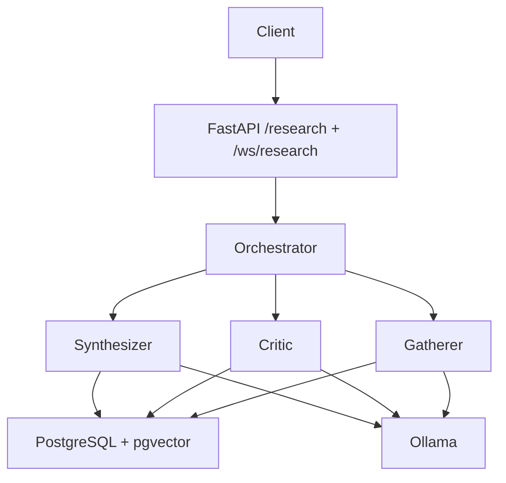
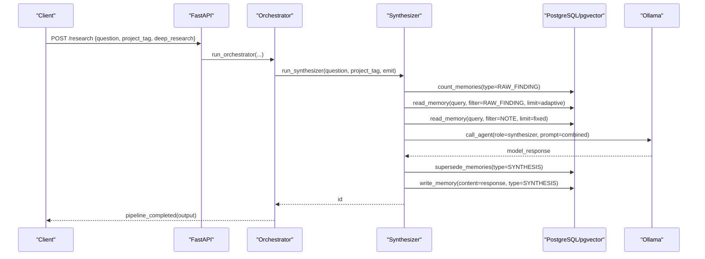
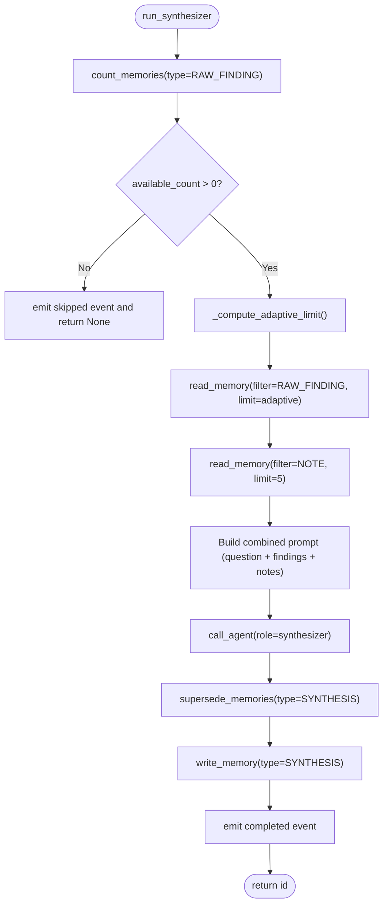
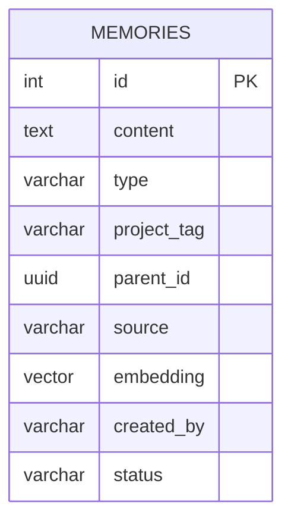
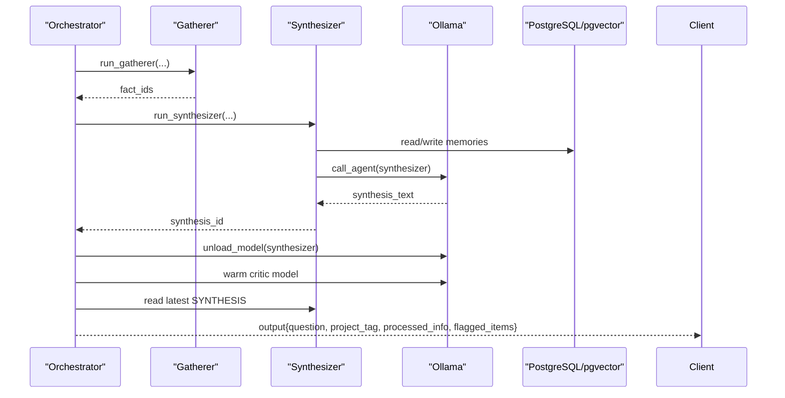
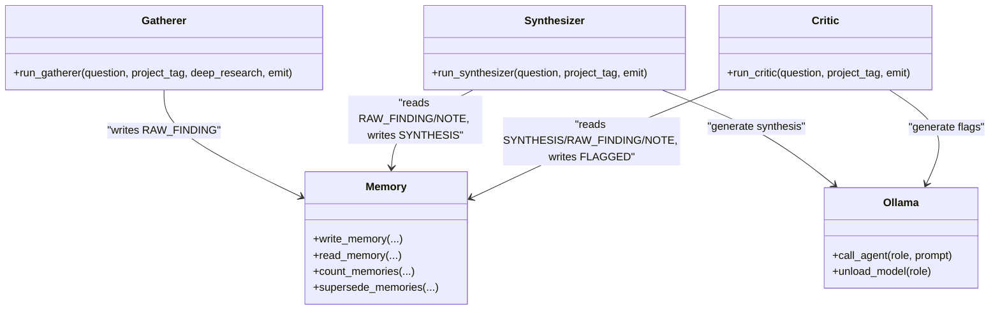
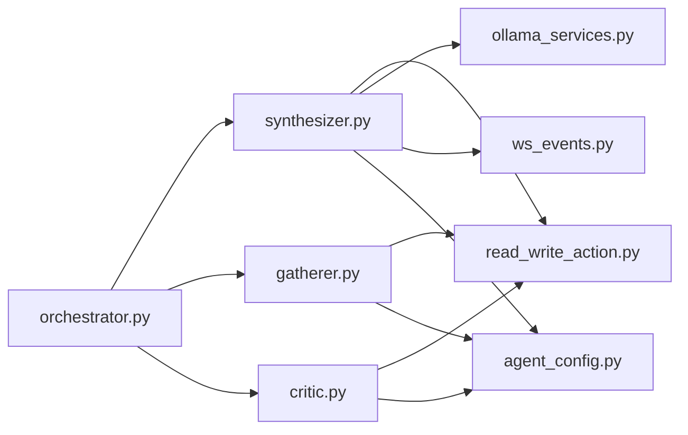

# Synthesizer Agent

<cite>
**Referenced Files in This Document**
- [synthesizer.py](file://backend/synthesizer.py)
- [agent_config.py](file://backend/agent_config.py)
- [orchestrator.py](file://backend/orchestrator.py)
- [gatherer.py](file://backend/gatherer.py)
- [read_write_action.py](file://backend/read_write_action.py)
- [ollama_services.py](file://backend/ollama_services.py)
- [critic.py](file://backend/critic.py)
- [main.py](file://backend/main.py)
</cite>

## Table of Contents
1. [Introduction](#introduction)
2. [Project Structure](#project-structure)
3. [Core Components](#core-components)
4. [Architecture Overview](#architecture-overview)
5. [Detailed Component Analysis](#detailed-component-analysis)
6. [Dependency Analysis](#dependency-analysis)
7. [Performance Considerations](#performance-considerations)
8. [Troubleshooting Guide](#troubleshooting-guide)
9. [Conclusion](#conclusion)

## Introduction
The Synthesizer agent compresses and structures raw research findings into a coherent, question-focused narrative. It reads semantically relevant RAW_FINDING entries and a fixed budget of NOTE entries from PostgreSQL (via pgvector), builds a prompt using the synthesizer system prompt, calls the LLM through Ollama, writes the resulting SYNTHESIS back to memory, and emits lifecycle events for downstream consumers. The orchestrator coordinates the full pipeline: Gatherer → Synthesizer → Critic, with model swapping and timing instrumentation.

## Project Structure
At a high level, the backend is a FastAPI service that exposes REST and WebSocket endpoints. The orchestrator drives three agents:
- Gatherer: searches the web, extracts facts, writes RAW_FINDING rows.
- Synthesizer: retrieves top-k semantically relevant findings and notes, generates synthesis, writes SYNTHESIS row.
- Critic: validates synthesis against source material, writes FLAGGED rows if issues are found.

Memory is stored in PostgreSQL with vector embeddings for semantic retrieval. Model calls go through Ollama with role-specific prompts and token limits.

**Diagram sources**
- [main.py:34-46](file://backend/main.py#L34-L46)
- [orchestrator.py:12-94](file://backend/orchestrator.py#L12-L94)
- [gatherer.py:91-149](file://backend/gatherer.py#L91-L149)
- [synthesizer.py:31-101](file://backend/synthesizer.py#L31-L101)
- [critic.py:33-122](file://backend/critic.py#L33-L122)
- [read_write_action.py:14-51](file://backend/read_write_action.py#L14-L51)
- [ollama_services.py:4-17](file://backend/ollama_services.py#L4-L17)

**Section sources**
- [main.py:34-46](file://backend/main.py#L34-L46)
- [orchestrator.py:12-94](file://backend/orchestrator.py#L12-L94)

## Core Components
- Synthesizer: Reads adaptive number of RAW_FINDINGs and fixed number of NOTEs; constructs a prompt per the synthesizer system prompt; calls the LLM; marks previous SYNTHESIS as SUPERSEDED; writes new SYNTHESIS; emits events.
- Agent configuration: Role-specific prompts, model selection by tier, and max tokens.
- Memory layer: Embedding-based retrieval and write operations over PostgreSQL with pgvector.
- Ollama integration: Unified call_agent wrapper with keep-alive and token limits; model unload helper.
- Orchestrator: Coordinates agents, unloads/loads models between stages, collects output.

**Section sources**
- [synthesizer.py:31-101](file://backend/synthesizer.py#L31-L101)
- [agent_config.py:80-111](file://backend/agent_config.py#L80-L111)
- [read_write_action.py:14-51](file://backend/read_write_action.py#L14-L51)
- [ollama_services.py:4-17](file://backend/ollama_services.py#L4-L17)
- [orchestrator.py:30-78](file://backend/orchestrator.py#L30-L78)

## Architecture Overview
The Synthesizer operates within a multi-agent pipeline orchestrated by the orchestrator. After Gatherer produces RAW_FINDING entries, Synthesizer performs semantic retrieval of the most relevant findings and user notes, composes a structured prompt, and generates a concise synthesis. The orchestrator then swaps models (unloads the synthesizer’s smaller model, warms up the critic’s larger model) before running the Critic.

**Diagram sources**
- [orchestrator.py:30-78](file://backend/orchestrator.py#L30-L78)
- [synthesizer.py:31-101](file://backend/synthesizer.py#L31-L101)
- [read_write_action.py:54-97](file://backend/read_write_action.py#L54-L97)
- [ollama_services.py:4-17](file://backend/ollama_services.py#L4-L17)

## Detailed Component Analysis

### Synthesizer Agent
Responsibilities:
- Compute an adaptive limit for RAW_FINDING retrieval based on available count.
- Retrieve top-k semantically relevant RAW_FINDINGs and a fixed budget of NOTEs.
- Build a combined prompt using the synthesizer system prompt and retrieved content.
- Call the LLM via Ollama with appropriate model and token limits.
- Mark existing SYNTHESIS entries as SUPERSEDED to avoid stale results in semantic search.
- Write the new SYNTHESIS to memory and emit lifecycle events.

Key behaviors:
- Adaptive limit rule: target = min(max(int(available_count * 0.4), 5), 20, available_count).
- Fixed note budget: NOTE_LIMIT = 5.
- Prompt composition: concatenates question, raw findings, and optional user notes.
- Superseding: updates status of prior SYNTHESIS rows to SUPERSEDED before writing new ones.

**Diagram sources**
- [synthesizer.py:19-28](file://backend/synthesizer.py#L19-L28)
- [synthesizer.py:31-101](file://backend/synthesizer.py#L31-L101)
- [read_write_action.py:54-97](file://backend/read_write_action.py#L54-L97)

Input/Output formats:
- Input: question (string), project_tag (string), optional emit callback.
- Output: id of the newly written SYNTHESIS row or None if no findings exist.

Configuration options:
- FINDINGS_FRACTION = 0.4, MIN_FINDINGS = 5, MAX_FINDINGS = 20.
- NOTE_LIMIT = 5.
- ROLE = "synthesizer".

Model and prompt strategy:
- Uses the synthesizer system prompt defined in agent configuration.
- Max tokens set per role via configuration.

Error handling:
- If no RAW_FINDINGs exist, returns None and emits a skip event.
- Emits detailed timing and step events for observability.

**Section sources**
- [synthesizer.py:8-16](file://backend/synthesizer.py#L8-L16)
- [synthesizer.py:19-28](file://backend/synthesizer.py#L19-L28)
- [synthesizer.py:31-101](file://backend/synthesizer.py#L31-L101)
- [agent_config.py:34-46](file://backend/agent_config.py#L34-L46)
- [agent_config.py:80-111](file://backend/agent_config.py#L80-L111)

### Memory Integration (PostgreSQL + pgvector)
- Writes: embed content using HuggingFace embeddings, insert into memories table with fields including embedding vector, type, project_tag, parent_id, source, created_by.
- Reads: embed query, perform vector similarity ORDER BY embedding <=> query_vector::vector, filter by project_tag and optionally type, limit results.
- Counting: COUNT ACTIVE memories by type and project_tag.
- Superseding: UPDATE status to SUPERSEDED for all ACTIVE memories of a given type and project_tag.

Data model (as used by the code):
- Table: memories
- Columns referenced: id, content, type, project_tag, parent_id, source, embedding, created_by, status

**Diagram sources**
- [read_write_action.py:14-51](file://backend/read_write_action.py#L14-L51)
- [read_write_action.py:54-97](file://backend/read_write_action.py#L54-L97)

**Section sources**
- [read_write_action.py:14-51](file://backend/read_write_action.py#L14-L51)
- [read_write_action.py:54-97](file://backend/read_write_action.py#L54-L97)

### Ollama Integration and Model Management
- call_agent: selects model and system prompt by role, sets keep_alive and num_predict token limit, returns response text.
- unload_model: forces a specific role’s model to unload immediately to free VRAM.

Model tiers and roles:
- Tier selection via CURRENT_TIER.
- Roles: gatherer, synthesizer, critic, followup.
- Each role has a configured model name and max_tokens.

**Section sources**
- [ollama_services.py:4-17](file://backend/ollama_services.py#L4-L17)
- [ollama_services.py:20-26](file://backend/ollama_services.py#L20-L26)
- [agent_config.py:80-111](file://backend/agent_config.py#L80-L111)

### Orchestration and Pipeline Flow
- Orchestrator runs Gatherer first; if no results, stops early.
- Runs Synthesizer; if None, stops early.
- Unloads synthesizer model, pre-warms critic model, runs Critic.
- Reads latest SYNTHESIS and returns output with flagged items.

**Diagram sources**
- [orchestrator.py:12-94](file://backend/orchestrator.py#L12-L94)
- [gatherer.py:91-149](file://backend/gatherer.py#L91-L149)
- [synthesizer.py:31-101](file://backend/synthesizer.py#L31-L101)

**Section sources**
- [orchestrator.py:12-94](file://backend/orchestrator.py#L12-L94)

### Relationship with Gatherer and Critic
- Gatherer writes RAW_FINDING entries; Synthesizer consumes them.
- Critic reads the generated SYNTHESIS and RAW_FINDINGs (and NOTEs) to validate claims and produce FLAGGED entries linked to the synthesis via parent_id.

**Diagram sources**
- [gatherer.py:91-149](file://backend/gatherer.py#L91-L149)
- [synthesizer.py:31-101](file://backend/synthesizer.py#L31-L101)
- [critic.py:33-122](file://backend/critic.py#L33-L122)
- [read_write_action.py:14-51](file://backend/read_write_action.py#L14-L51)
- [ollama_services.py:4-17](file://backend/ollama_services.py#L4-L17)

## Dependency Analysis
- Synthesizer depends on:
  - read_write_action for memory operations and counting/superseding.
  - ollama_services for LLM calls.
  - ws_events for emitting pipeline events.
- Orchestrator coordinates agents and manages model lifecycle.
- Agent configuration centralizes prompts, model names per tier, and token limits.

**Diagram sources**
- [synthesizer.py:1-5](file://backend/synthesizer.py#L1-L5)
- [orchestrator.py:1-9](file://backend/orchestrator.py#L1-L9)
- [gatherer.py:1-8](file://backend/gatherer.py#L1-L8)
- [critic.py:1-5](file://backend/critic.py#L1-L5)
- [agent_config.py:80-111](file://backend/agent_config.py#L80-L111)

**Section sources**
- [synthesizer.py:1-5](file://backend/synthesizer.py#L1-L5)
- [orchestrator.py:1-9](file://backend/orchestrator.py#L1-L9)

## Performance Considerations
- Adaptive retrieval: Synthesizer uses 40% of available RAW_FINDINGs bounded between 5 and 20 to balance context size and relevance.
- Fixed note budget: NOTE_LIMIT = 5 ensures user ingested documents do not crowd out web findings.
- Model management: Orchestrator unloads the synthesizer model after use and pre-warms the critic model to isolate load time from generation time.
- Embeddings: Embedding model is loaded once at module import; ensure offline mode is enabled to avoid network delays.
- Vector search: Semantic retrieval uses pgvector cosine similarity ordering; ensure proper indexing on embedding column for large datasets.

[No sources needed since this section provides general guidance]

## Troubleshooting Guide
Common issues and signals:
- No findings available: Synthesizer skips and emits a skip event; check Gatherer output and project_tag consistency.
- Format failures: Ensure LLM responses adhere to expected formats (e.g., “FACT:” lines for Gatherer, “FLAG:” lines for Critic).
- Stale synthesis results: Synthesizer marks prior SYNTHESIS rows as SUPERSEDED; verify status transitions if retrieval returns outdated content.
- Model VRAM pressure: Use unload_model between stages; monitor model keep_alive settings.

Operational tips:
- Inspect emitted events for durations and counts to pinpoint bottlenecks.
- Validate project_tag scoping across agents and memory queries.
- Confirm database connectivity and pgvector registration.

**Section sources**
- [synthesizer.py:31-101](file://backend/synthesizer.py#L31-L101)
- [critic.py:33-122](file://backend/critic.py#L33-L122)
- [read_write_action.py:54-97](file://backend/read_write_action.py#L54-L97)
- [ollama_services.py:20-26](file://backend/ollama_services.py#L20-L26)

## Conclusion
The Synthesizer agent is a focused compression engine that transforms semantically relevant findings and notes into a concise, coherent synthesis aligned with the research question. It integrates tightly with PostgreSQL/pgvector for memory, Ollama for generation, and the orchestrator for pipeline control. Its adaptive retrieval, fixed note budget, and superseding mechanism ensure efficient, accurate, and up-to-date synthesis generation suitable for downstream critique and presentation.