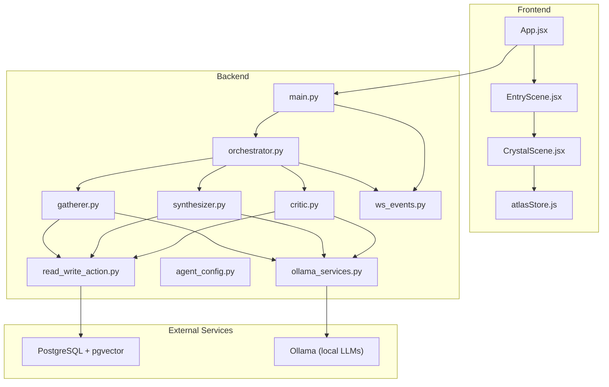
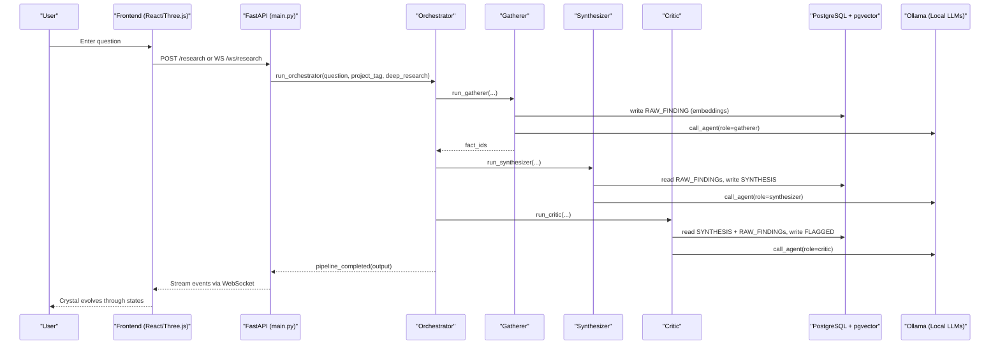
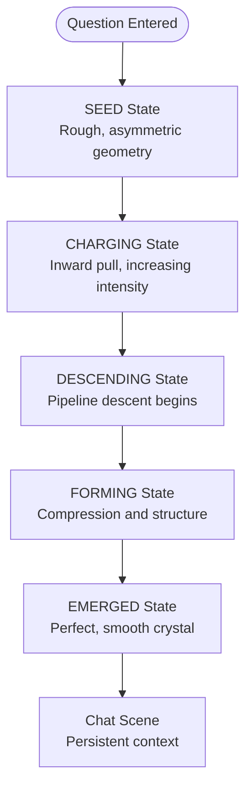
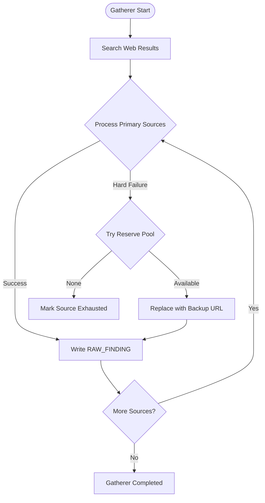
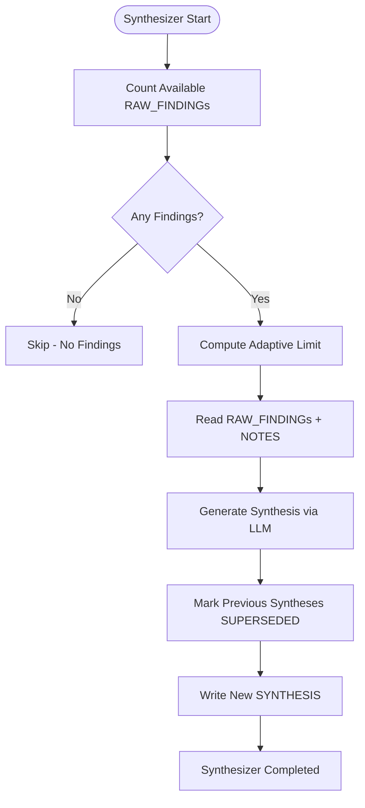
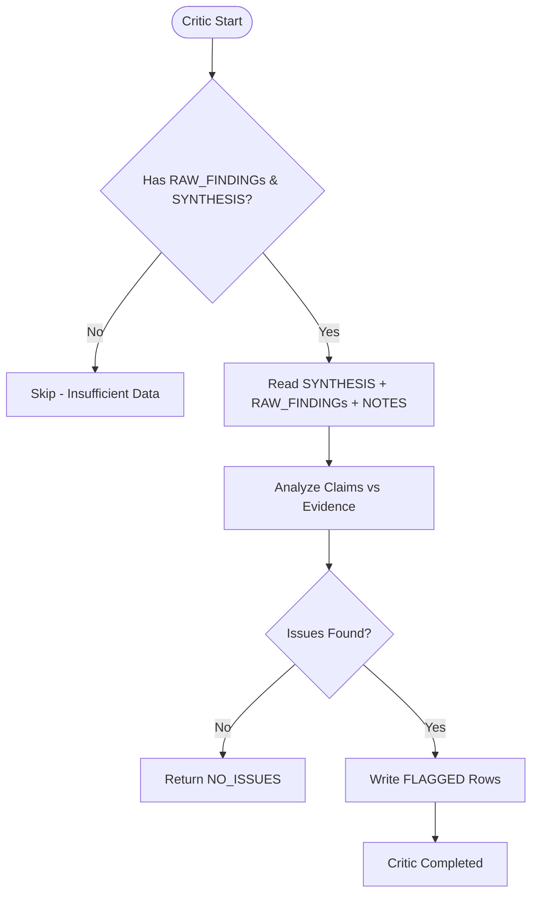
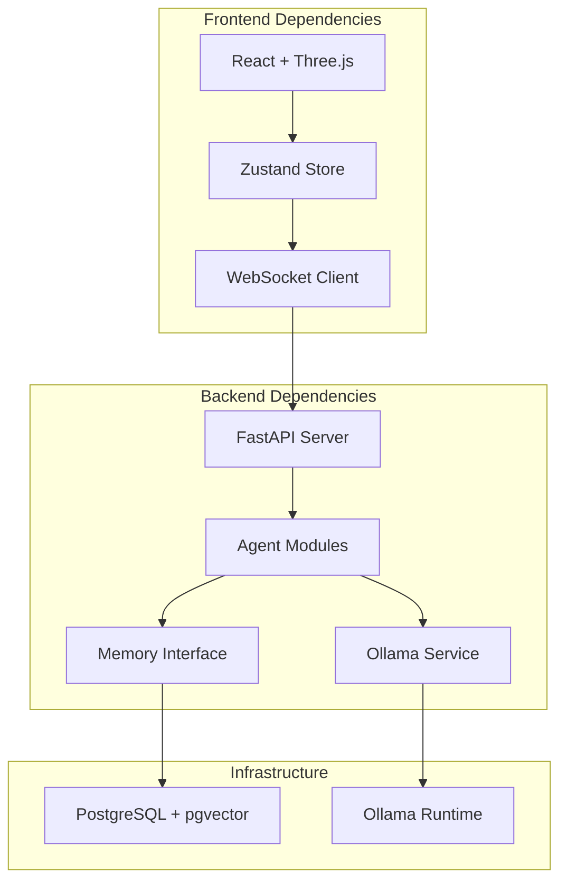

# Project Overview

<cite>
**Referenced Files in This Document**
- [ATLASRESEARCH_MASTER.md](file://ATLASRESEARCH_MASTER.md)
- [main.py](file://backend/main.py)
- [orchestrator.py](file://backend/orchestrator.py)
- [gatherer.py](file://backend/gatherer.py)
- [synthesizer.py](file://backend/synthesizer.py)
- [critic.py](file://backend/critic.py)
- [agent_config.py](file://backend/agent_config.py)
- [read_write_action.py](file://backend/read_write_action.py)
- [ws_events.py](file://backend/ws_events.py)
- [ollama_services.py](file://backend/ollama_services.py)
- [App.jsx](file://frontend/src/App.jsx)
- [EntryScene.jsx](file://frontend/src/scenes/EntryScene.jsx)
- [CrystalScene.jsx](file://frontend/src/components/crystal/CrystalScene.jsx)
- [atlasStore.js](file://frontend/src/store/atlasStore.js)
- [package.json](file://frontend/package.json)
</cite>

## Table of Contents
1. Introduction
2. Project Structure
3. Core Components
4. Architecture Overview
5. Detailed Component Analysis
6. Dependency Analysis
7. Performance Considerations
8. Troubleshooting Guide
9. Conclusion

## Introduction
Atlas Research is a fully local, offline three-agent research pipeline that transforms traditional web-based research into an immersive, spatial, and cinematic interface powered by 3D crystal visualization. The system’s core metaphor is crystallisation: questions enter as raw, formless energy and emerge as structured knowledge crystals after passing through three specialized agents. The frontend renders a real-time 3D scene where the research process itself becomes the interface—no conventional loading spinners or progress bars, only a living crystal that reflects state, depth, and outcome.

The backend orchestrates a sequential pipeline using shared PostgreSQL + pgvector memory for persistent, semantically searchable knowledge. Agents communicate via structured WebSocket events emitted from the FastAPI server to the React/Three.js frontend. Local LLM execution runs through Ollama, while vector embeddings are computed with a lightweight Hugging Face model and stored alongside content in PostgreSQL.

This overview provides both conceptual guidance for newcomers learning about AI research pipelines and technical details for experienced developers evaluating the architecture.

**Section sources**
- [ATLASRESEARCH_MASTER.md:24-46](file://ATLASRESEARCH_MASTER.md#L24-L46)

## Project Structure
At a high level, the project consists of:
- Frontend (React + Three.js): A cinematic 3D experience driven by custom shaders, post-processing effects, and real-time state updates over WebSocket.
- Backend (FastAPI): Orchestrates the three-agent pipeline, manages WebSocket streaming, and integrates with Ollama and PostgreSQL/pgvector.
- Shared Memory: PostgreSQL with pgvector stores RAW_FINDING, SYNTHESIS, FLAGGED, and NOTE entries, enabling semantic retrieval across pipeline stages.

**Diagram sources**
- [App.jsx:1-42](file://frontend/src/App.jsx#L1-L42)
- [EntryScene.jsx:1-8](file://frontend/src/scenes/EntryScene.jsx#L1-L8)
- [CrystalScene.jsx:1-116](file://frontend/src/components/crystal/CrystalScene.jsx#L1-L116)
- [atlasStore.js:1-25](file://frontend/src/store/atlasStore.js#L1-L25)
- [main.py:1-110](file://backend/main.py#L1-L110)
- [orchestrator.py:1-98](file://backend/orchestrator.py#L1-L98)
- [gatherer.py:1-152](file://backend/gatherer.py#L1-L152)
- [synthesizer.py:1-101](file://backend/synthesizer.py#L1-L101)
- [critic.py:1-122](file://backend/critic.py#L1-L122)
- [ollama_services.py:1-26](file://backend/ollama_services.py#L1-L26)
- [agent_config.py:1-111](file://backend/agent_config.py#L1-L111)
- [read_write_action.py:1-100](file://backend/read_write_action.py#L1-L100)
- [ws_events.py:1-14](file://backend/ws_events.py#L1-L14)

**Section sources**
- [ATLASRESEARCH_MASTER.md:111-167](file://ATLASRESEARCH_MASTER.md#L111-L167)
- [package.json:1-35](file://frontend/package.json#L1-L35)

## Core Components
- Gatherer Agent: Searches the web, extracts source text, calls the LLM to extract specific facts, and writes RAW_FINDING rows to PostgreSQL with vector embeddings.
- Synthesizer Agent: Reads relevant RAW_FINDINGs (and optional user notes), generates a coherent synthesis, marks previous syntheses as superseded, and writes a new SYNTHESIS row.
- Critic Agent: Reviews the synthesis against original findings and notes, flags unsupported claims or contradictions, and writes FLAGGED rows linked to the synthesis.
- Orchestrator: Coordinates agent execution, emits lifecycle events, manages model load/unload, and returns final output.
- Memory Layer: PostgreSQL with pgvector enables semantic search and persistent storage; embeddings are generated locally via a Hugging Face model.
- Frontend Experience: Real-time 3D visualization of the pipeline using React/Three.js, custom GLSL shaders, and post-processing effects; state managed via Zustand store and updated through WebSocket events.

**Section sources**
- [gatherer.py:1-152](file://backend/gatherer.py#L1-L152)
- [synthesizer.py:1-101](file://backend/synthesizer.py#L1-L101)
- [critic.py:1-122](file://backend/critic.py#L1-L122)
- [orchestrator.py:1-98](file://backend/orchestrator.py#L1-L98)
- [read_write_action.py:1-100](file://backend/read_write_action.py#L1-L100)
- [ATLASRESEARCH_MASTER.md:91-109](file://ATLASRESEARCH_MASTER.md#L91-L109)

## Architecture Overview
The system follows a clear separation between the cinematic frontend and the deterministic backend pipeline. The frontend never talks directly to Ollama or PostgreSQL; all interactions go through FastAPI endpoints and WebSocket streams.

**Diagram sources**
- [main.py:34-110](file://backend/main.py#L34-L110)
- [orchestrator.py:12-94](file://backend/orchestrator.py#L12-L94)
- [gatherer.py:91-152](file://backend/gatherer.py#L91-L152)
- [synthesizer.py:31-101](file://backend/synthesizer.py#L31-L101)
- [critic.py:33-122](file://backend/critic.py#L33-L122)
- [read_write_action.py:14-52](file://backend/read_write_action.py#L14-L52)
- [ws_events.py:1-14](file://backend/ws_events.py#L1-L14)

## Detailed Component Analysis

### Crystallisation Metaphor and Visual Pipeline
The crystallisation metaphor drives every visual decision:
- Entry: Warm, chaotic energy representing the question.
- Descent: Three-layer shaft where intelligence compresses and structures data.
- Emergence: A faceted, cold, permanent crystal symbolizing synthesized knowledge.
- Chat: Persistent context beneath the crystal for follow-up dialogue.

The frontend uses custom GLSL shaders for vertex displacement, fluid turbulence, frost spread, and particle coloring. Post-processing effects include bloom, chromatic aberration, vignette, noise, and ACES filmic tone mapping. GPU quality detection adapts rendering parameters for performance.

**Diagram sources**
- [ATLASRESEARCH_MASTER.md:91-109](file://ATLASRESEARCH_MASTER.md#L91-L109)
- [CrystalScene.jsx:19-89](file://frontend/src/components/crystal/CrystalScene.jsx#L19-L89)
- [atlasStore.js:3-25](file://frontend/src/store/atlasStore.js#L3-L25)

**Section sources**
- [ATLASRESEARCH_MASTER.md:91-109](file://ATLASRESEARCH_MASTER.md#L91-L109)
- [CrystalScene.jsx:1-116](file://frontend/src/components/crystal/CrystalScene.jsx#L1-L116)

### Gatherer Agent Analysis
The Gatherer performs web search, source extraction, LLM-powered fact extraction, and memory persistence:
- Uses DuckDuckGo for search results with reserve pool fallback
- Extracts text using trafilatura with timeout configuration
- Calls LLM to extract FACT: lines from source content
- Writes RAW_FINDING rows with vector embeddings to PostgreSQL
- Emits detailed events for each stage (search, fetch, generation, memory write)

**Diagram sources**
- [gatherer.py:91-152](file://backend/gatherer.py#L91-L152)

**Section sources**
- [gatherer.py:1-152](file://backend/gatherer.py#L1-L152)

### Synthesizer Agent Analysis
The Synthesizer creates structured knowledge from raw findings:
- Adaptive limit calculation based on available RAW_FINDINGs (40% with min/max bounds)
- Retrieves both RAW_FINDINGs and user-provided NOTES
- Generates coherent synthesis using LLM with strict formatting rules
- Marks previous syntheses as SUPERSEDED to prevent stale results
- Writes new SYNTHESIS with vector embedding for semantic search

**Diagram sources**
- [synthesizer.py:31-101](file://backend/synthesizer.py#L31-L101)

**Section sources**
- [synthesizer.py:1-101](file://backend/synthesizer.py#L1-L101)

### Critic Agent Analysis
The Critic stress-tests the synthesis against original evidence:
- Retrieves synthesis and supporting RAW_FINDINGs/NOTES
- Identifies unsupported claims, contradictions, and significant gaps
- Returns NO_ISSUES for clean synthesis or FLAG: lines for issues
- Writes FLAGGED rows linked to the synthesis parent_id
- Provides actionable feedback for refinement

**Diagram sources**
- [critic.py:33-122](file://backend/critic.py#L33-L122)

**Section sources**
- [critic.py:1-122](file://backend/critic.py#L1-L122)

### Technology Stack Summary
- **Frontend**: React 18, Three.js, @react-three/fiber, @react-three/drei, custom GLSL shaders, GSAP animations, Zustand state management
- **Backend**: FastAPI with WebSocket support, CORS middleware, Pydantic validation
- **AI/ML**: Ollama for local LLM execution (qwen3:8b/14b models), Hugging Face embeddings (all-MiniLM-L6-v2)
- **Database**: PostgreSQL with pgvector for semantic search and persistent memory
- **Build Tools**: Vite, Tailwind CSS, vite-plugin-glsl for shader imports

**Section sources**
- [package.json:1-35](file://frontend/package.json#L1-L35)
- [ATLASRESEARCH_MASTER.md:111-167](file://ATLASRESEARCH_MASTER.md#L111-L167)
- [agent_config.py:80-111](file://backend/agent_config.py#L80-L111)
- [read_write_action.py:1-12](file://backend/read_write_action.py#L1-L12)

## Dependency Analysis
The system exhibits clear layering with minimal coupling:
- Frontend depends only on FastAPI backend (never direct database or LLM access)
- Backend orchestrates agents without tight inter-agent dependencies
- Memory layer provides consistent interface for all agents
- External services (Ollama, PostgreSQL) are abstracted behind service layers

**Diagram sources**
- [main.py:1-110](file://backend/main.py#L1-L110)
- [orchestrator.py:1-98](file://backend/orchestrator.py#L1-L98)
- [read_write_action.py:1-100](file://backend/read_write_action.py#L1-L100)
- [ollama_services.py:1-26](file://backend/ollama_services.py#L1-L26)

**Section sources**
- [main.py:1-110](file://backend/main.py#L1-L110)
- [orchestrator.py:1-98](file://backend/orchestrator.py#L1-L98)

## Performance Considerations
- **GPU Quality Detection**: Automatically adjusts rendering parameters (samples, resolution) based on hardware capabilities
- **Model Management**: Strategic model loading/unloading to optimize VRAM usage (8b for gathering, 14b for criticism)
- **Adaptive Limits**: Dynamic sizing of data retrieval based on available findings to prevent overwhelming LLM context windows
- **Efficient Embeddings**: Lightweight embedding model (all-MiniLM-L6-v2) balances accuracy with performance
- **Streaming Events**: WebSocket-based event streaming prevents blocking UI during long-running operations
- **Shader Optimization**: Custom GLSL shaders provide visual richness without excessive CPU overhead

## Troubleshooting Guide
Common issues and their resolutions:
- **WebSocket Connection Failures**: Verify FastAPI CORS settings and frontend origin configuration
- **Model Loading Errors**: Ensure Ollama service is running and models are properly installed
- **Database Connection Issues**: Check PostgreSQL credentials and pgvector extension availability
- **Performance Degradation**: Monitor GPU quality detection and adjust rendering parameters
- **Event Streaming Problems**: Validate event format consistency between backend and frontend parsers

**Section sources**
- [main.py:15-20](file://backend/main.py#L15-L20)
- [ws_events.py:1-14](file://backend/ws_events.py#L1-L14)
- [read_write_action.py:16-17](file://backend/read_write_action.py#L16-L17)

## Conclusion
Atlas Research represents a sophisticated approach to AI-powered research by combining a cinematic 3D interface with a robust three-agent pipeline. The crystallisation metaphor provides both a compelling user experience and a clear architectural framework. The system successfully demonstrates how local AI can be made accessible through immersive visualization while maintaining technical rigor through modular agent design and persistent memory management.

For beginners, this system illustrates fundamental concepts of multi-agent AI systems, semantic search, and real-time data processing. For experienced developers, it showcases advanced techniques in WebGL rendering, WebSocket streaming, and efficient LLM orchestration—all running completely offline on local hardware.

The project serves as both a practical research tool and an educational example of modern AI application architecture, bridging the gap between complex backend processes and intuitive user experiences.