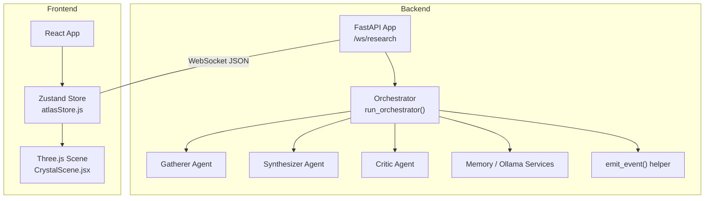
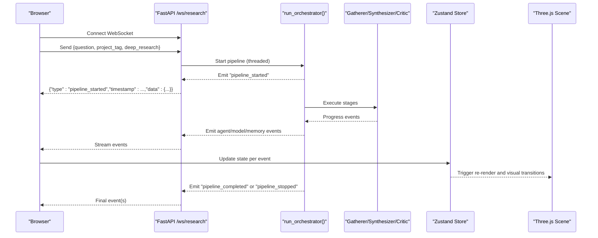
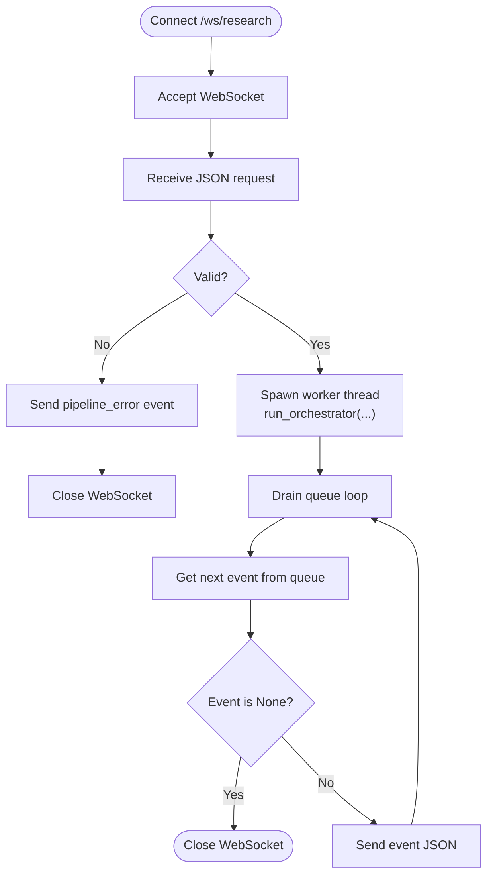
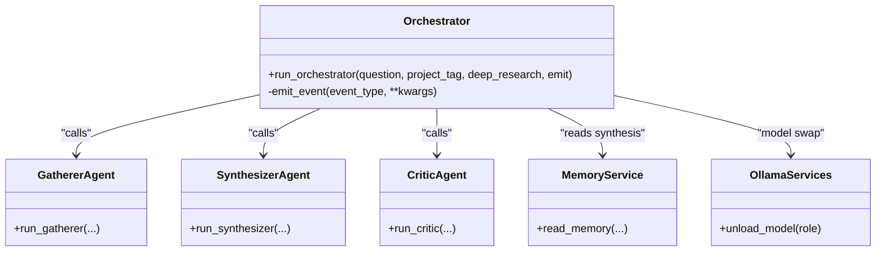
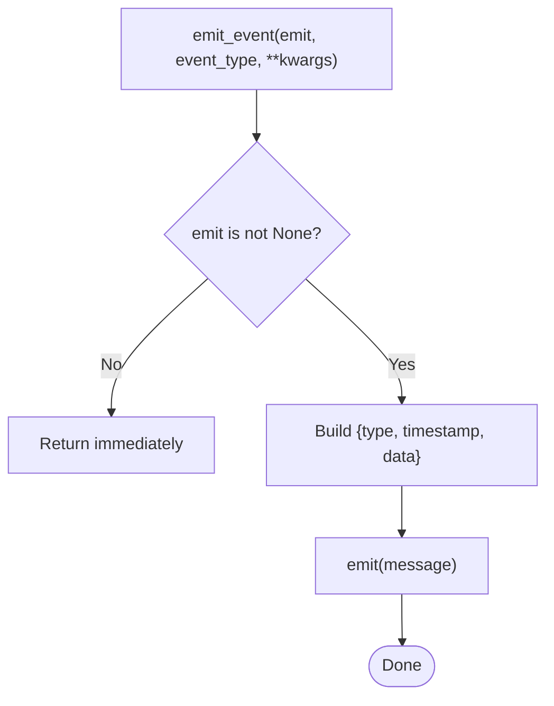
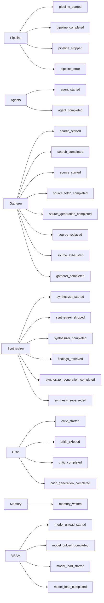
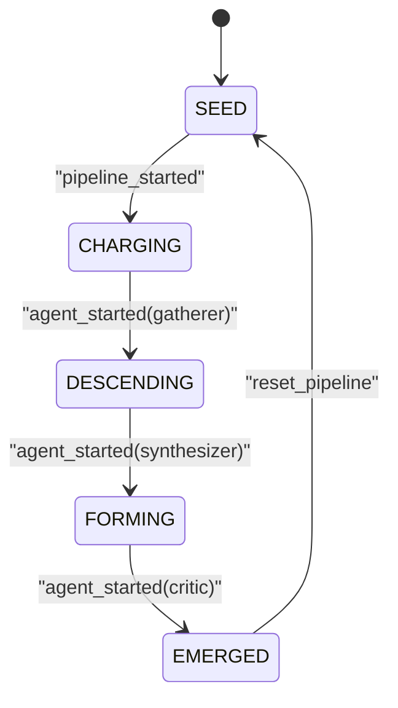
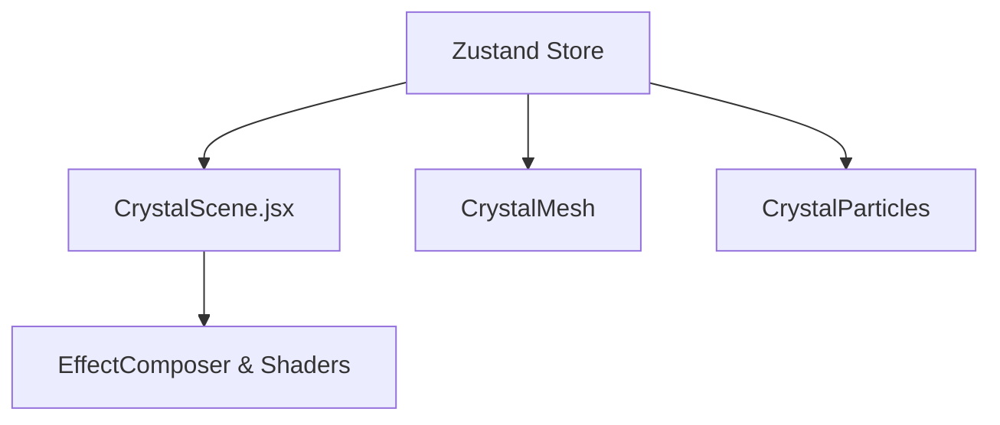
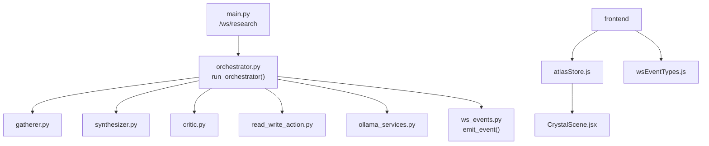

# Real-time Communication

<cite>
**Referenced Files in This Document**
- [main.py](file://backend/main.py)
- [orchestrator.py](file://backend/orchestrator.py)
- [ws_events.py](file://backend/ws_events.py)
- [atlasStore.js](file://frontend/src/store/atlasStore.js)
- [wsEventTypes.js](file://frontend/src/utils/wsEventTypes.js)
- [CrystalScene.jsx](file://frontend/src/components/crystal/CrystalScene.jsx)
- [ATLASRESEARCH_MASTER.md](file://ATLASRESEARCH_MASTER.md)
</cite>

## Table of Contents
1. [Introduction](#introduction)
2. [Project Structure](#project-structure)
3. [Core Components](#core-components)
4. [Architecture Overview](#architecture-overview)
5. [Detailed Component Analysis](#detailed-component-analysis)
6. [Dependency Analysis](#dependency-analysis)
7. [Performance Considerations](#performance-considerations)
8. [Troubleshooting Guide](#troubleshooting-guide)
9. [Conclusion](#conclusion)
10. [Appendices](#appendices)

## Introduction
This document explains the real-time WebSocket communication system that powers the application’s event-driven architecture. It covers the complete WebSocket protocol, connection handling, message formats, and the full catalog of events used across the research pipeline, crystal state transitions, and chat. It also details how backend events drive frontend updates through a Zustand store, which triggers React component re-renders and Three.js scene changes. Finally, it provides debugging strategies, performance monitoring guidance, and best practices for reliable real-time communication under varying network conditions.

## Project Structure
The real-time system spans backend FastAPI endpoints and orchestrators that emit structured events, and a frontend that consumes these events to update UI and 3D scenes.

**Diagram sources**
- [main.py:71-110](file://backend/main.py#L71-L110)
- [orchestrator.py:12-94](file://backend/orchestrator.py#L12-L94)
- [ws_events.py:3-13](file://backend/ws_events.py#L3-L13)
- [atlasStore.js:1-84](file://frontend/src/store/atlasStore.js#L1-L84)
- [CrystalScene.jsx:29-89](file://frontend/src/components/crystal/CrystalScene.jsx#L29-L89)

**Section sources**
- [main.py:71-110](file://backend/main.py#L71-L110)
- [orchestrator.py:12-94](file://backend/orchestrator.py#L12-L94)
- [ws_events.py:3-13](file://backend/ws_events.py#L3-L13)
- [atlasStore.js:1-84](file://frontend/src/store/atlasStore.js#L1-L84)
- [CrystalScene.jsx:29-89](file://frontend/src/components/crystal/CrystalScene.jsx#L29-L89)

## Core Components
- Backend WebSocket endpoint: Accepts a JSON request, validates it, starts the pipeline on a worker thread, and streams events back over the socket.
- Orchestrator: Drives the research pipeline (gatherer → synthesizer → critic), emitting typed events at each stage.
- Event emitter helper: Normalizes all emitted messages into a consistent structure with type, timestamp, and data fields.
- Frontend event types catalog: Centralized constants mapping event names to readable identifiers.
- Zustand store: Holds application state (scene, crystal state, pipeline stage, results, chat messages, VRAM status) and exposes setters used by components.
- 3D scene integration: The Three.js scene reads from the store to animate and transition visuals based on real-time events.

**Section sources**
- [main.py:71-110](file://backend/main.py#L71-L110)
- [orchestrator.py:12-94](file://backend/orchestrator.py#L12-L94)
- [ws_events.py:3-13](file://backend/ws_events.py#L3-L13)
- [wsEventTypes.js:1-44](file://frontend/src/utils/wsEventTypes.js#L1-L44)
- [atlasStore.js:1-84](file://frontend/src/store/atlasStore.js#L1-L84)
- [CrystalScene.jsx:29-89](file://frontend/src/components/crystal/CrystalScene.jsx#L29-L89)

## Architecture Overview
The system follows an event-driven pattern where backend agents publish lifecycle and progress events. The frontend listens to these events, updates the Zustand store, and reacts by re-rendering UI and adjusting the Three.js scene.

**Diagram sources**
- [main.py:71-110](file://backend/main.py#L71-L110)
- [orchestrator.py:12-94](file://backend/orchestrator.py#L12-L94)
- [ws_events.py:3-13](file://backend/ws_events.py#L3-L13)
- [atlasStore.js:1-84](file://frontend/src/store/atlasStore.js#L1-L84)
- [CrystalScene.jsx:29-89](file://frontend/src/components/crystal/CrystalScene.jsx#L29-L89)

## Detailed Component Analysis

### Backend WebSocket Endpoint (/ws/research)
- Accepts a WebSocket connection and a JSON payload containing question, project_tag, and deep_research.
- Validates input using Pydantic; returns a structured error event if invalid.
- Spawns a background thread to run the blocking orchestrator while concurrently draining a queue to send events to the client.
- Handles disconnects gracefully, ensuring the pipeline continues running even if the client disconnects early.

**Diagram sources**
- [main.py:71-110](file://backend/main.py#L71-L110)

**Section sources**
- [main.py:71-110](file://backend/main.py#L71-L110)

### Orchestrator Pipeline and Events
- Emits a comprehensive set of events covering pipeline lifecycle, agent execution, model load/unload, memory writes, and completion/failure states.
- Tracks timing for each stage and includes durations in relevant events.
- Returns output only after successful completion of all stages; otherwise emits stop reasons.

**Diagram sources**
- [orchestrator.py:12-94](file://backend/orchestrator.py#L12-L94)

**Section sources**
- [orchestrator.py:12-94](file://backend/orchestrator.py#L12-L94)

### Event Emitter Helper
- Normalizes all events into a consistent shape: type, timestamp, data.
- Safely no-ops when emit is None (e.g., CLI usage).

**Diagram sources**
- [ws_events.py:3-13](file://backend/ws_events.py#L3-L13)

**Section sources**
- [ws_events.py:3-13](file://backend/ws_events.py#L3-L13)

### Frontend Event Types Catalog
- Centralized constants define all supported event types for pipeline, agents, gatherer, synthesizer, critic, memory, and VRAM operations.
- Ensures consistent parsing and mapping across the frontend.

**Diagram sources**
- [wsEventTypes.js:1-44](file://frontend/src/utils/wsEventTypes.js#L1-L44)

**Section sources**
- [wsEventTypes.js:1-44](file://frontend/src/utils/wsEventTypes.js#L1-L44)

### Zustand Store and State Synchronization
- Stores current scene, crystal state, pipeline stage, errors, inputs, results, data shards, scan line flags, VRAM swapping, and chat messages.
- Provides setters to update state atomically; components subscribe to specific slices to minimize re-renders.
- Reset function clears all pipeline-related state for reuse.

**Diagram sources**
- [atlasStore.js:1-84](file://frontend/src/store/atlasStore.js#L1-L84)

**Section sources**
- [atlasStore.js:1-84](file://frontend/src/store/atlasStore.js#L1-L84)

### Three.js Scene Integration
- Reads store values like currentScene and crystalState to control rendering effects and animations.
- Uses GPU quality detection to adapt effect parameters.
- Integrates post-processing effects (Bloom, Chromatic Aberration, Vignette, Noise, DepthOfField, ToneMapping) driven by store state.

**Diagram sources**
- [CrystalScene.jsx:29-89](file://frontend/src/components/crystal/CrystalScene.jsx#L29-L89)
- [atlasStore.js:1-84](file://frontend/src/store/atlasStore.js#L1-L84)

**Section sources**
- [CrystalScene.jsx:29-89](file://frontend/src/components/crystal/CrystalScene.jsx#L29-L89)
- [atlasStore.js:1-84](file://frontend/src/store/atlasStore.js#L1-L84)

## Dependency Analysis
The backend orchestrator coordinates multiple agents and services, emitting events via a shared helper. The frontend depends on centralized event type constants and the Zustand store to react to events.

**Diagram sources**
- [main.py:71-110](file://backend/main.py#L71-L110)
- [orchestrator.py:12-94](file://backend/orchestrator.py#L12-L94)
- [ws_events.py:3-13](file://backend/ws_events.py#L3-L13)
- [atlasStore.js:1-84](file://frontend/src/store/atlasStore.js#L1-L84)
- [wsEventTypes.js:1-44](file://frontend/src/utils/wsEventTypes.js#L1-L44)
- [CrystalScene.jsx:29-89](file://frontend/src/components/crystal/CrystalScene.jsx#L29-L89)

**Section sources**
- [main.py:71-110](file://backend/main.py#L71-L110)
- [orchestrator.py:12-94](file://backend/orchestrator.py#L12-L94)
- [ws_events.py:3-13](file://backend/ws_events.py#L3-L13)
- [atlasStore.js:1-84](file://frontend/src/store/atlasStore.js#L1-L84)
- [wsEventTypes.js:1-44](file://frontend/src/utils/wsEventTypes.js#L1-L44)
- [CrystalScene.jsx:29-89](file://frontend/src/components/crystal/CrystalScene.jsx#L29-L89)

## Performance Considerations
- Threading isolation: The backend runs the blocking orchestrator on a worker thread to avoid stalling the FastAPI event loop.
- Queue-based streaming: Events are queued and drained asynchronously to ensure non-blocking transmission.
- GPU adaptation: The frontend detects low-end GPUs and reduces effect samples/resolution accordingly.
- Minimal re-renders: Zustand selectors should be used to subscribe only to needed state slices.
- Model warm-up: The orchestrator performs a throwaway call to pre-warm models before generation to reduce latency spikes.

[No sources needed since this section provides general guidance]

## Troubleshooting Guide
- Invalid request handling: If the WebSocket receives malformed JSON, a structured pipeline_error event is sent and the connection closes.
- Early disconnect: If the client disconnects, the backend continues running the pipeline; events are still produced but not consumed.
- Error propagation: Exceptions in the pipeline thread are captured and emitted as pipeline_error events with a message field.
- Debugging tips:
  - Inspect event payloads for timestamps and data fields to trace timing and content.
  - Monitor store updates to confirm correct mapping of events to state changes.
  - Use browser DevTools Network tab to observe WebSocket frames and verify event sequence.

**Section sources**
- [main.py:71-110](file://backend/main.py#L71-L110)
- [orchestrator.py:12-94](file://backend/orchestrator.py#L12-L94)
- [ws_events.py:3-13](file://backend/ws_events.py#L3-L13)

## Conclusion
The real-time system leverages a robust backend WebSocket endpoint and a structured event protocol to drive a responsive, event-driven frontend. By centralizing event types and synchronizing state through Zustand, the application achieves seamless UI and 3D scene updates. Proper threading, queue management, and GPU adaptations ensure reliability and performance under varied conditions. Following the documented patterns and troubleshooting strategies will help maintain a stable and efficient real-time experience.

[No sources needed since this section summarizes without analyzing specific files]

## Appendices

### Complete WebSocket Event Map
A comprehensive catalog of all WebSocket event types and their intended visual consequences is documented in the master guide. Refer to the referenced file for the exhaustive list and mappings.

**Section sources**
- [ATLASRESEARCH_MASTER.md:952-1643](file://ATLASRESEARCH_MASTER.md#L952-L1643)