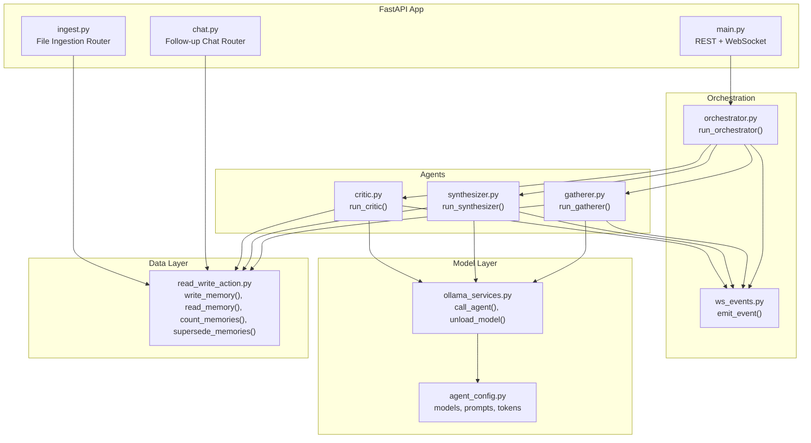
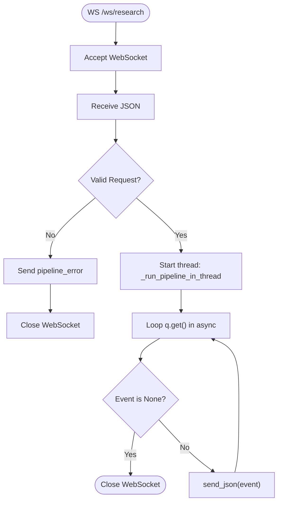
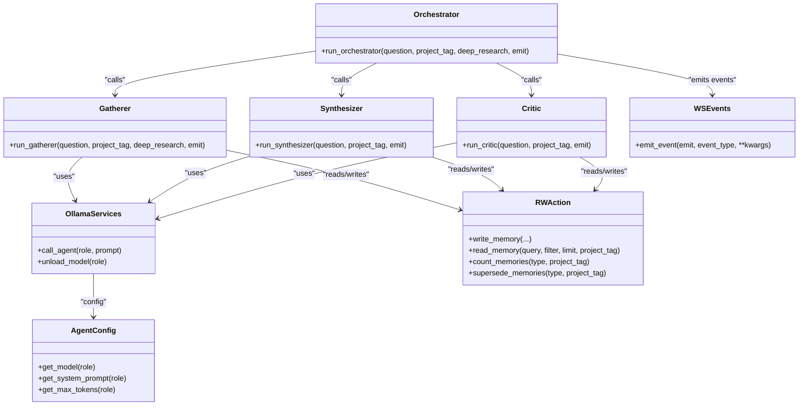
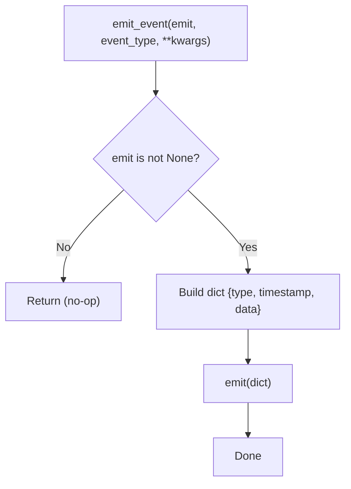
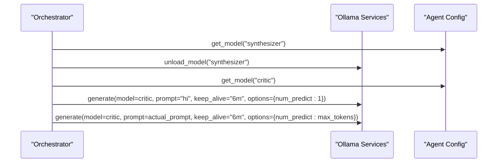
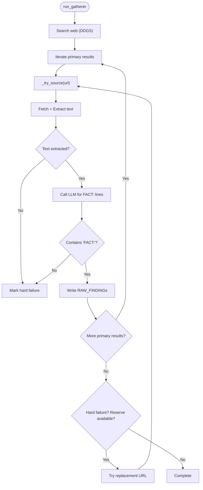
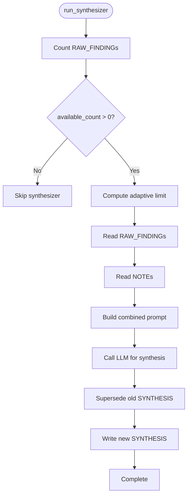
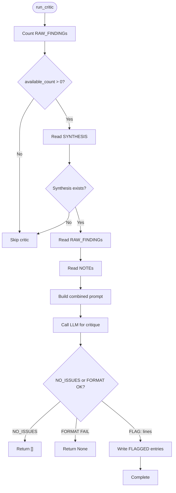
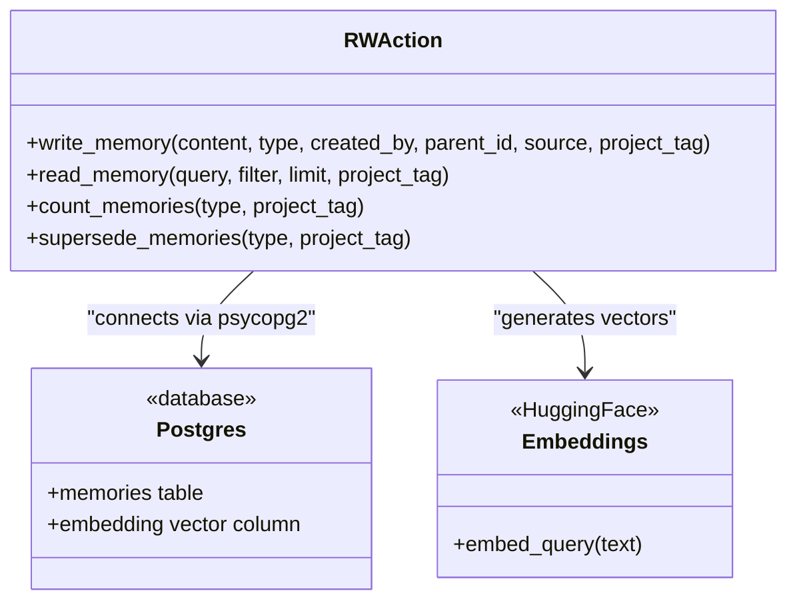
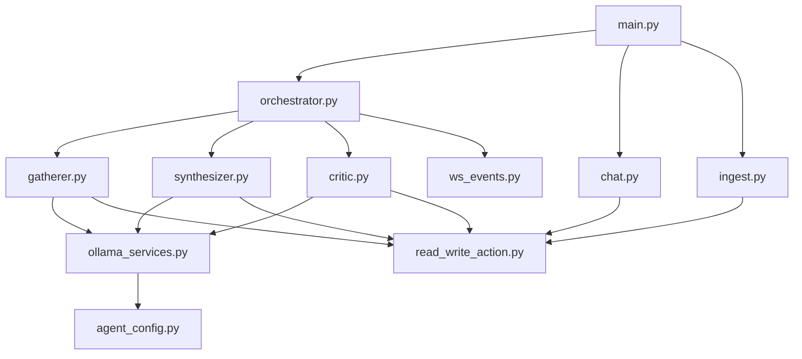

# Backend Architecture

<cite>
**Referenced Files in This Document**
- [main.py](file://backend/main.py)
- [orchestrator.py](file://backend/orchestrator.py)
- [ws_events.py](file://backend/ws_events.py)
- [ollama_services.py](file://backend/ollama_services.py)
- [gatherer.py](file://backend/gatherer.py)
- [synthesizer.py](file://backend/synthesizer.py)
- [critic.py](file://backend/critic.py)
- [agent_config.py](file://backend/agent_config.py)
- [read_write_action.py](file://backend/read_write_action.py)
- [chat.py](file://backend/chat.py)
- [ingest.py](file://backend/ingest.py)
</cite>

## Table of Contents
1. [Introduction](#introduction)
2. [Project Structure](#project-structure)
3. [Core Components](#core-components)
4. [Architecture Overview](#architecture-overview)
5. [Detailed Component Analysis](#detailed-component-analysis)
6. [Dependency Analysis](#dependency-analysis)
7. [Performance Considerations](#performance-considerations)
8. [Troubleshooting Guide](#troubleshooting-guide)
9. [Conclusion](#conclusion)

## Introduction
This document describes the Atlas Research backend architecture built with FastAPI. It covers REST endpoints, a WebSocket-based real-time pipeline for research execution, and an event-driven communication system that emits structured events to the frontend. The core orchestration pattern coordinates three agents—Gatherer, Synthesizer, and Critic—in a sequential pipeline with dynamic model lifecycle management via Ollama. The design emphasizes non-blocking operations using async/await patterns, robust error handling, and clear pipeline state transitions.

## Project Structure
The backend is organized into modular components:
- Application entrypoint and routing (FastAPI app, CORS, routers)
- Multi-agent orchestrator coordinating Gatherer, Synthesizer, and Critic
- Event emission utilities for structured WebSocket messages
- Model integration layer for Ollama calls and memory optimization
- Data persistence layer with vector search over PostgreSQL
- Feature routers for chat follow-up and file ingestion



**Diagram sources**
- [main.py:1-110](file://backend/main.py#L1-L110)
- [orchestrator.py:1-98](file://backend/orchestrator.py#L1-L98)
- [ws_events.py:1-14](file://backend/ws_events.py#L1-L14)
- [gatherer.py:1-152](file://backend/gatherer.py#L1-L152)
- [synthesizer.py:1-101](file://backend/synthesizer.py#L1-L101)
- [critic.py:1-122](file://backend/critic.py#L1-L122)
- [ollama_services.py:1-26](file://backend/ollama_services.py#L1-L26)
- [agent_config.py:1-111](file://backend/agent_config.py#L1-L111)
- [read_write_action.py:1-100](file://backend/read_write_action.py#L1-L100)
- [chat.py:1-72](file://backend/chat.py#L1-L72)
- [ingest.py:1-140](file://backend/ingest.py#L1-L140)

**Section sources**
- [main.py:1-110](file://backend/main.py#L1-L110)
- [orchestrator.py:1-98](file://backend/orchestrator.py#L1-L98)
- [ws_events.py:1-14](file://backend/ws_events.py#L1-L14)
- [gatherer.py:1-152](file://backend/gatherer.py#L1-L152)
- [synthesizer.py:1-101](file://backend/synthesizer.py#L1-L101)
- [critic.py:1-122](file://backend/critic.py#L1-L122)
- [ollama_services.py:1-26](file://backend/ollama_services.py#L1-L26)
- [agent_config.py:1-111](file://backend/agent_config.py#L1-L111)
- [read_write_action.py:1-100](file://backend/read_write_action.py#L1-L100)
- [chat.py:1-72](file://backend/chat.py#L1-L72)
- [ingest.py:1-140](file://backend/ingest.py#L1-L140)

## Core Components
- FastAPI application and middleware:
  - CORS configured for local frontend development
  - REST endpoint /research triggers synchronous orchestration
  - WebSocket endpoint /ws/research streams real-time pipeline events
- Orchestrator:
  - Sequentially executes Gatherer → Synthesizer → Critic
  - Emits structured events at each stage
  - Manages model lifecycle (unload/load) between phases
- Agents:
  - Gatherer: searches web, extracts content, calls LLM to extract facts, writes RAW_FINDING entries
  - Synthesizer: reads RAW_FINDINGs and NOTEs, generates synthesis text, writes SYNTHESIS entry
  - Critic: reviews synthesis against findings and notes, writes FLAGGED entries or returns no issues
- Event system:
  - Centralized emit_event helper ensures consistent message shape for frontend consumption
- Model integration:
  - call_agent wraps Ollama generation with role-specific prompts and token limits
  - unload_model forces immediate model unloading to free VRAM
- Data persistence:
  - Vector embeddings via HuggingFace embeddings and pgvector
  - Semantic retrieval by project_tag and type filters
  - Superseding mechanism to keep current synthesis dominant in search results

**Section sources**
- [main.py:1-110](file://backend/main.py#L1-L110)
- [orchestrator.py:1-98](file://backend/orchestrator.py#L1-L98)
- [ws_events.py:1-14](file://backend/ws_events.py#L1-L14)
- [gatherer.py:1-152](file://backend/gatherer.py#L1-L152)
- [synthesizer.py:1-101](file://backend/synthesizer.py#L1-L101)
- [critic.py:1-122](file://backend/critic.py#L1-L122)
- [ollama_services.py:1-26](file://backend/ollama_services.py#L1-L26)
- [agent_config.py:1-111](file://backend/agent_config.py#L1-L111)
- [read_write_action.py:1-100](file://backend/read_write_action.py#L1-L100)

## Architecture Overview
The backend exposes two primary interfaces:
- REST POST /research: runs the full pipeline synchronously and returns final output
- WebSocket GET /ws/research: streams structured events as the pipeline progresses

The orchestrator drives the multi-agent workflow and manages model lifecycle to optimize memory usage. Each agent emits events through ws_events.emit_event, which are forwarded to the frontend via the WebSocket connection.

```mermaid
sequenceDiagram
participant FE as "Frontend"
participant API as "FastAPI main.py"
participant ORCH as "Orchestrator orchestrator.py"
participant G as "Gatherer gatherer.py"
participant S as "Synthesizer synthesizer.py"
participant C as "Critic critic.py"
participant OLL as "Ollama ollama_services.py"
participant DB as "Postgres+pgvector read_write_action.py"
participant EVT as "Events ws_events.py"
FE->>API : POST /research or WS /ws/research
alt REST
API->>ORCH : run_orchestrator(question, project_tag, deep_research)
ORCH->>EVT : emit "pipeline_started"
ORCH->>G : run_gatherer(...)
G->>DB : write RAW_FINDINGs
G-->>ORCH : fact_ids
ORCH->>S : run_synthesizer(...)
S->>DB : read RAW_FINDINGs, NOTEs; write SYNTHESIS
S-->>ORCH : synthesis_id
ORCH->>OLL : unload synthesizer model
ORCH->>OLL : load critic model (warmup)
ORCH->>C : run_critic(...)
C->>DB : read SYNTHESIS, RAW_FINDINGs, NOTEs; write FLAGGED
C-->>ORCH : flagged_ids
ORCH->>EVT : emit "pipeline_completed" with output
ORCH-->>API : output dict
API-->>FE : JSON response
else WS
API->>ORCH : run_orchestrator(..., emit=q.put)
loop events
ORCH->>EVT : emit structured event
EVT-->>API : queue item
API-->>FE : send_json(event)
end
API-->>FE : close after sentinel None
end
```

**Diagram sources**
- [main.py:34-110](file://backend/main.py#L34-L110)
- [orchestrator.py:12-94](file://backend/orchestrator.py#L12-L94)
- [gatherer.py:91-149](file://backend/gatherer.py#L91-L149)
- [synthesizer.py:31-101](file://backend/synthesizer.py#L31-L101)
- [critic.py:33-122](file://backend/critic.py#L33-L122)
- [ollama_services.py:4-26](file://backend/ollama_services.py#L4-L26)
- [read_write_action.py:14-100](file://backend/read_write_action.py#L14-L100)
- [ws_events.py:1-14](file://backend/ws_events.py#L1-L14)

## Detailed Component Analysis

### FastAPI Application and Endpoints
- REST endpoint /research:
  - Accepts a request body with question, project_tag, and deep_research flag
  - Calls run_orchestrator synchronously and returns the final output
  - Raises HTTPException on failure
- WebSocket endpoint /ws/research:
  - Accepts JSON request, validates it, and starts a background thread running the orchestrator
  - Uses a queue to bridge blocking orchestrator events to the async event loop
  - Streams structured events to the client until a sentinel None indicates completion
  - Handles validation errors and disconnects gracefully



**Diagram sources**
- [main.py:71-110](file://backend/main.py#L71-L110)

**Section sources**
- [main.py:23-46](file://backend/main.py#L23-L46)
- [main.py:71-110](file://backend/main.py#L71-L110)

### Orchestrator: Multi-Agent Pipeline
- Executes Gatherer, then Synthesizer, then Critic sequentially
- Emits events for pipeline start, agent start/completion, model unload/load, and pipeline completion
- Unloads the synthesizer model before loading the critic model to manage VRAM
- Performs a warmup call to isolate model load time from generation time
- Reads the latest synthesis from memory and constructs the final output including flagged items



**Diagram sources**
- [orchestrator.py:12-94](file://backend/orchestrator.py#L12-L94)
- [gatherer.py:91-149](file://backend/gatherer.py#L91-L149)
- [synthesizer.py:31-101](file://backend/synthesizer.py#L31-L101)
- [critic.py:33-122](file://backend/critic.py#L33-L122)
- [ollama_services.py:4-26](file://backend/ollama_services.py#L4-L26)
- [agent_config.py:80-111](file://backend/agent_config.py#L80-L111)
- [ws_events.py:1-14](file://backend/ws_events.py#L1-L14)
- [read_write_action.py:14-100](file://backend/read_write_action.py#L14-L100)

**Section sources**
- [orchestrator.py:12-94](file://backend/orchestrator.py#L12-L94)

### Event System: Structured WebSocket Events
- emit_event centralizes event creation with consistent structure: type, timestamp, data
- If emit is None (e.g., CLI usage), events are ignored
- All agents and the orchestrator use this helper to ensure uniformity for frontend consumers



**Diagram sources**
- [ws_events.py:1-14](file://backend/ws_events.py#L1-L14)

**Section sources**
- [ws_events.py:1-14](file://backend/ws_events.py#L1-L14)

### Model Lifecycle Management with Ollama
- call_agent selects model, system prompt, and token limit per role
- unload_model forces immediate model unloading by calling generate with keep_alive=0
- Orchestrator unloads synthesizer model before loading critic model to free VRAM
- Warmup call isolates model load time from generation time for accurate timing metrics



**Diagram sources**
- [orchestrator.py:43-59](file://backend/orchestrator.py#L43-L59)
- [ollama_services.py:4-26](file://backend/ollama_services.py#L4-L26)
- [agent_config.py:80-111](file://backend/agent_config.py#L80-L111)

**Section sources**
- [ollama_services.py:4-26](file://backend/ollama_services.py#L4-L26)
- [orchestrator.py:43-59](file://backend/orchestrator.py#L43-L59)

### Gatherer Agent: Web Search and Fact Extraction
- Searches web using DDGS with adaptive result counts based on deep_research flag
- Extracts text from URLs using trafilatura with configurable timeouts
- Calls LLM to extract FACT: lines; skips if NO_RELEVANT_INFO or format fails
- Writes extracted facts as RAW_FINDING entries with semantic embeddings
- Implements fallback reserve pool when primary sources fail



**Diagram sources**
- [gatherer.py:91-149](file://backend/gatherer.py#L91-L149)

**Section sources**
- [gatherer.py:91-149](file://backend/gatherer.py#L91-L149)

### Synthesizer Agent: Coherent Summary Generation
- Computes adaptive limit for RAW_FINDINGs based on available count
- Retrieves NOTEs with fixed budget to include user ingested documents
- Builds combined prompt with findings and notes
- Generates synthesis text and writes SYNTHESIS entry
- Supersedes previous SYNTHESIS entries to maintain search dominance



**Diagram sources**
- [synthesizer.py:31-101](file://backend/synthesizer.py#L31-L101)

**Section sources**
- [synthesizer.py:31-101](file://backend/synthesizer.py#L31-L101)

### Critic Agent: Quality Assurance and Flagging
- Computes adaptive limit for RAW_FINDINGs similar to Synthesizer
- Retrieves SYNTHESIS and NOTEs for context
- Builds prompt combining synthesis, findings, and notes
- Returns NO_ISSUES if no problems found, otherwise parses FLAG: lines
- Writes FLAGGED entries linked to the synthesis parent_id



**Diagram sources**
- [critic.py:33-122](file://backend/critic.py#L33-L122)

**Section sources**
- [critic.py:33-122](file://backend/critic.py#L33-L122)

### Data Persistence Layer: Vector Search and Memory Management
- Embeddings generated via HuggingFace all-MiniLM-L6-v2
- PostgreSQL with pgvector enables semantic similarity search
- Functions support writing memories, reading with filters, counting records, and superseding older versions
- Project tagging ensures isolation across different research projects



**Diagram sources**
- [read_write_action.py:14-100](file://backend/read_write_action.py#L14-L100)

**Section sources**
- [read_write_action.py:14-100](file://backend/read_write_action.py#L14-L100)

### Chat Follow-up Endpoint
- Provides conversational follow-up based on existing synthesis
- Retrieves synthesis content by ID and constructs prompt with system instructions
- Supports saving corrections back to the database as CORRECTION entries
- Uses httpx to communicate with Ollama chat API

**Section sources**
- [chat.py:1-72](file://backend/chat.py#L1-L72)

### File Ingestion Endpoint
- Accepts PDF, MD, or TXT files and chunks them appropriately
- Extracts text using pypdf for PDFs and regex-based chunking for markdown/text
- Writes chunks as NOTE entries with semantic embeddings
- Returns metadata about processed chunks and source information

**Section sources**
- [ingest.py:1-140](file://backend/ingest.py#L1-L140)

## Dependency Analysis
The backend exhibits clear separation of concerns with minimal coupling:
- FastAPI routes depend on orchestrator and routers
- Orchestrator depends on agents, event emitter, and model services
- Agents depend on model services and data persistence
- Data persistence depends on PostgreSQL and embedding models
- Configuration is centralized in agent_config



**Diagram sources**
- [main.py:1-110](file://backend/main.py#L1-L110)
- [orchestrator.py:1-98](file://backend/orchestrator.py#L1-L98)
- [gatherer.py:1-152](file://backend/gatherer.py#L1-L152)
- [synthesizer.py:1-101](file://backend/synthesizer.py#L1-L101)
- [critic.py:1-122](file://backend/critic.py#L1-L122)
- [ollama_services.py:1-26](file://backend/ollama_services.py#L1-L26)
- [agent_config.py:1-111](file://backend/agent_config.py#L1-L111)
- [read_write_action.py:1-100](file://backend/read_write_action.py#L1-L100)
- [chat.py:1-72](file://backend/chat.py#L1-L72)
- [ingest.py:1-140](file://backend/ingest.py#L1-L140)

**Section sources**
- [main.py:1-110](file://backend/main.py#L1-L110)
- [orchestrator.py:1-98](file://backend/orchestrator.py#L1-L98)

## Performance Considerations
- Non-blocking I/O:
  - WebSocket handler uses asyncio.to_thread for both orchestrator execution and queue operations
  - Prevents event loop blocking during long-running tasks
- Model lifecycle optimization:
  - Dynamic model unloading frees VRAM between phases
  - Warmup calls isolate model load times for accurate metrics
- Adaptive data retrieval:
  - Synthesizer and Critic compute limits based on available data to avoid overwhelming prompts
- Concurrency considerations:
  - Background thread ensures pipeline continues even if client disconnects
  - Queue-based event streaming prevents memory buildup

[No sources needed since this section provides general guidance]

## Troubleshooting Guide
Common issues and their handling:
- Invalid WebSocket requests:
  - Validation errors return pipeline_error events and close the connection
- Pipeline failures:
  - Exceptions in orchestrator thread are caught and emitted as pipeline_error events
  - Sentinel None ensures the reader loop never hangs
- Model loading issues:
  - Warmup calls help identify model loading problems separately from generation
- Database connectivity:
  - Connection errors will propagate through the data layer functions
- File ingestion errors:
  - Unsupported formats and encoding issues return appropriate HTTP exceptions

**Section sources**
- [main.py:76-83](file://backend/main.py#L76-L83)
- [main.py:65-68](file://backend/main.py#L65-L68)
- [ingest.py:93-121](file://backend/ingest.py#L93-L121)

## Conclusion
The Atlas Research backend implements a robust, event-driven architecture for multi-agent research workflows. The FastAPI application provides both REST and WebSocket interfaces, with the orchestrator coordinating sequential execution of specialized agents. The system leverages Ollama for dynamic model management and PostgreSQL with pgvector for semantic search capabilities. The design emphasizes non-blocking operations, comprehensive error handling, and clear state management across all research phases, making it suitable for real-time collaborative research applications.

[No sources needed since this section summarizes without analyzing specific files]