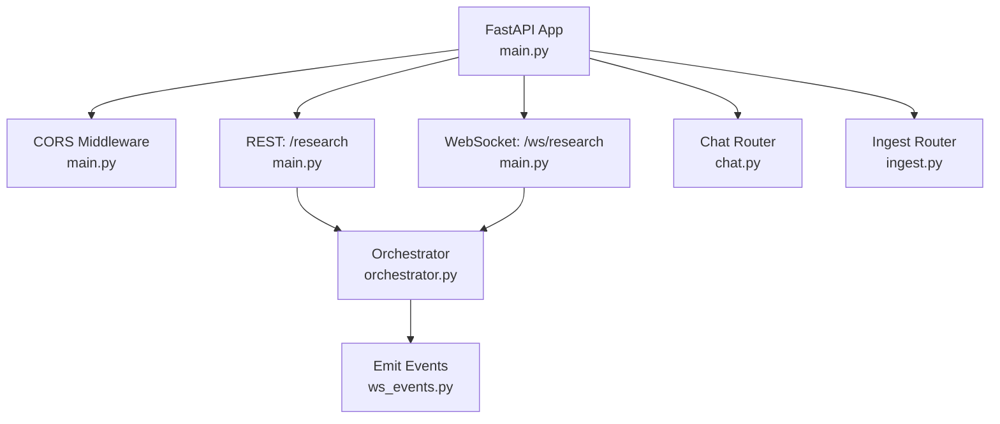
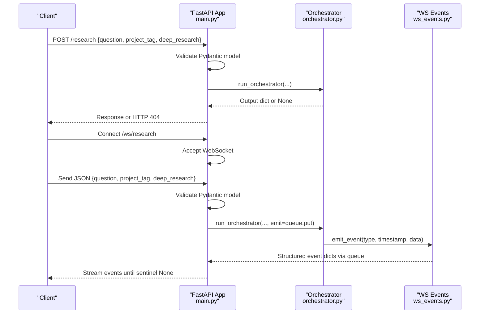
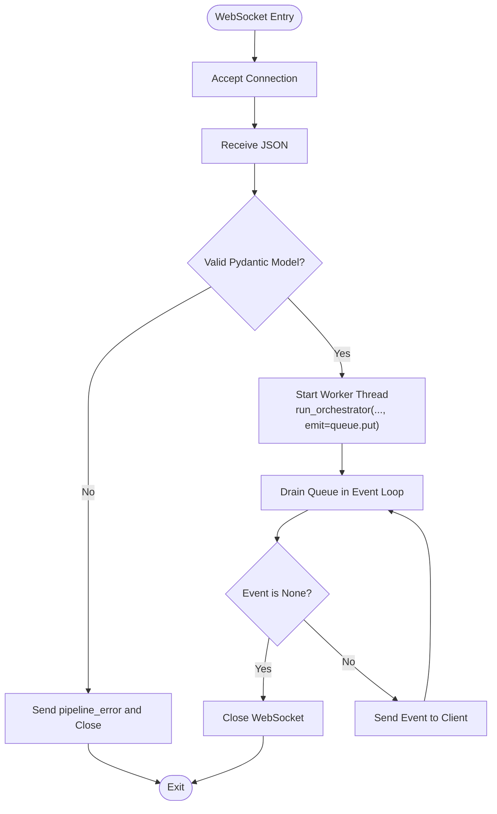
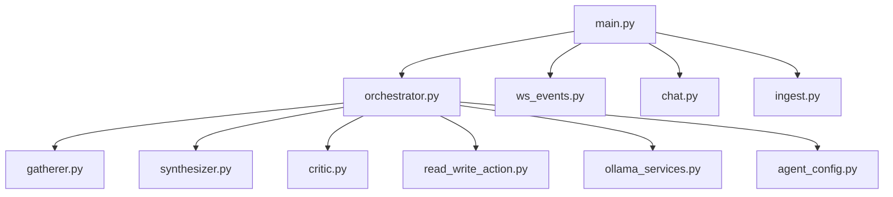

# FastAPI Application Layer

<cite>
**Referenced Files in This Document**
- [main.py](file://backend/main.py)
- [orchestrator.py](file://backend/orchestrator.py)
- [ws_events.py](file://backend/ws_events.py)
- [chat.py](file://backend/chat.py)
- [ingest.py](file://backend/ingest.py)
</cite>

## Table of Contents
1. [Introduction](#introduction)
2. [Project Structure](#project-structure)
3. [Core Components](#core-components)
4. [Architecture Overview](#architecture-overview)
5. [Detailed Component Analysis](#detailed-component-analysis)
6. [Dependency Analysis](#dependency-analysis)
7. [Performance Considerations](#performance-considerations)
8. [Troubleshooting Guide](#troubleshooting-guide)
9. [Conclusion](#conclusion)

## Introduction
This document explains the FastAPI application layer for Atlas Research, focusing on:
- Application setup and CORS middleware configuration to allow cross-origin requests from the frontend.
- REST endpoints, especially the /research POST endpoint that accepts research queries with question, project_tag, and deep_research parameters.
- Pydantic model validation for request bodies and error handling patterns.
- WebSocket endpoint at /ws/research for real-time communication, including connection lifecycle, JSON message parsing, and error handling for invalid requests and disconnections.
- Examples of request/response schemas and WebSocket message formats.

## Project Structure
The backend is organized into a single entry point (FastAPI app) and modular routers for additional features:
- main.py: FastAPI app initialization, CORS middleware, REST and WebSocket endpoints, and request models.
- orchestrator.py: Orchestrates multi-agent pipeline execution and emits structured events.
- ws_events.py: Helper to emit standardized WebSocket event dictionaries.
- chat.py: Chat-related router with its own Pydantic model and HTTP endpoints.
- ingest.py: Ingestion router for file uploads and chunking logic.

**Diagram sources**
- [main.py:11-20](file://backend/main.py#L11-L20)
- [main.py:34-46](file://backend/main.py#L34-L46)
- [main.py:71-110](file://backend/main.py#L71-L110)
- [orchestrator.py:12-94](file://backend/orchestrator.py#L12-L94)
- [ws_events.py:3-14](file://backend/ws_events.py#L3-L14)
- [chat.py:11-72](file://backend/chat.py#L11-L72)
- [ingest.py:6-140](file://backend/ingest.py#L6-L140)

**Section sources**
- [main.py:11-20](file://backend/main.py#L11-L20)
- [main.py:34-46](file://backend/main.py#L34-L46)
- [main.py:71-110](file://backend/main.py#L71-L110)
- [orchestrator.py:12-94](file://backend/orchestrator.py#L12-L94)
- [ws_events.py:3-14](file://backend/ws_events.py#L3-L14)
- [chat.py:11-72](file://backend/chat.py#L11-L72)
- [ingest.py:6-140](file://backend/ingest.py#L6-L140)

## Core Components
- FastAPI app and routers:
  - The app includes routers for chat and ingest under prefixes /chat and /ingest.
  - CORS middleware is configured to allow requests from http://localhost:5173 with permissive methods and headers.
- Request model:
  - A Pydantic model defines the expected fields for research requests: question (string), project_tag (string), deep_research (boolean, default False).
- REST endpoint:
  - POST /research validates the request body using the Pydantic model and invokes the orchestrator to run the research pipeline. Returns the orchestrator output or raises an HTTP 404 when the pipeline returns None.
- WebSocket endpoint:
  - GET /ws/research accepts a WebSocket connection, parses a JSON message into the same Pydantic model, runs the pipeline asynchronously on a worker thread, and streams structured events back to the client until completion or disconnect.

**Section sources**
- [main.py:11-20](file://backend/main.py#L11-L20)
- [main.py:23-27](file://backend/main.py#L23-L27)
- [main.py:34-46](file://backend/main.py#L34-L46)
- [main.py:71-110](file://backend/main.py#L71-L110)

## Architecture Overview
The application exposes two primary interfaces:
- REST API for synchronous research requests.
- WebSocket API for streaming real-time progress and results.

**Diagram sources**
- [main.py:34-46](file://backend/main.py#L34-L46)
- [main.py:71-110](file://backend/main.py#L71-L110)
- [orchestrator.py:12-94](file://backend/orchestrator.py#L12-L94)
- [ws_events.py:3-14](file://backend/ws_events.py#L3-L14)

## Detailed Component Analysis

### REST Endpoint: POST /research
- Purpose: Accepts a research query and returns the final synthesized result.
- Input schema:
  - question: string
  - project_tag: string
  - deep_research: boolean (default False)
- Behavior:
  - Validates input using the Pydantic model.
  - Calls the orchestrator to execute the multi-agent pipeline.
  - If the orchestrator returns None, raises HTTPException with status 404 and a generic detail.
  - Otherwise, returns the orchestrator’s output dictionary.
- Error handling:
  - Invalid request bodies trigger automatic Pydantic validation errors (FastAPI returns 422 by default).
  - Pipeline failures are represented by returning None, which the endpoint translates to HTTP 404.

Request example (JSON):
{
  "question": "How does load balancing work?",
  "project_tag": "backend_perf",
  "deep_research": true
}

Response example (JSON):
{
  "question": "How does load balancing work?",
  "project_tag": "backend_perf",
  "processed_info": "...synthesis text...",
  "flagged_items": ["...critic flags..."]
}

**Section sources**
- [main.py:23-27](file://backend/main.py#L23-L27)
- [main.py:34-46](file://backend/main.py#L34-L46)
- [orchestrator.py:83-94](file://backend/orchestrator.py#L83-L94)

### WebSocket Endpoint: GET /ws/research
- Purpose: Streams real-time events while running the research pipeline.
- Connection lifecycle:
  - Accepts the WebSocket connection.
  - Reads one JSON message from the client.
  - Parses and validates the message using the same Pydantic model.
  - Starts the orchestrator on a worker thread and concurrently drains a queue to send events back to the client.
  - Exits gracefully when the orchestrator signals completion or the client disconnects.
- Message format:
  - Client sends a single JSON object with fields: question, project_tag, deep_research.
  - Server responds with a stream of structured events containing type, timestamp, and data fields.
  - A sentinel None indicates completion; the server then closes the connection.
- Error handling:
  - Validation errors return a pipeline_error event and close the connection.
  - Disconnections are caught and handled without raising exceptions.

Client-to-server message example (JSON):
{
  "question": "How does load balancing work?",
  "project_tag": "backend_perf",
  "deep_research": true
}

Server-to-client event examples (JSON):
{
  "type": "pipeline_started",
  "timestamp": 1718000000.0,
  "data": {"question": "...", "project_tag": "...", "deep_research": true}
}
{
  "type": "agent_started",
  "timestamp": 1718000001.0,
  "data": {"agent": "gatherer"}
}
{
  "type": "agent_completed",
  "timestamp": 1718000005.0,
  "data": {"agent": "gatherer", "duration": 4.12, "fact_count": 12}
}
{
  "type": "model_unload_started",
  "timestamp": 1718000006.0,
  "data": {"role": "synthesizer"}
}
{
  "type": "model_load_completed",
  "timestamp": 1718000008.0,
  "data": {"role": "critic", "model": "qwen3:14b", "duration": 1.87}
}
{
  "type": "pipeline_completed",
  "timestamp": 1718000015.0,
  "data": {"duration": 15.0, "output": {"question": "...", "project_tag": "...", "processed_info": "...", "flagged_items": [...]}}
}
{
  "type": "pipeline_error",
  "timestamp": 1718000000.0,
  "data": {"message": "invalid request: ..."}
}

**Diagram sources**
- [main.py:71-110](file://backend/main.py#L71-L110)
- [ws_events.py:3-14](file://backend/ws_events.py#L3-L14)

**Section sources**
- [main.py:71-110](file://backend/main.py#L71-L110)
- [ws_events.py:3-14](file://backend/ws_events.py#L3-L14)

### CORS Middleware Configuration
- Allows cross-origin requests from http://localhost:5173 (frontend dev server).
- Permits all methods and headers to simplify development integration.
- Ensures the browser can call both REST and WebSocket endpoints from the frontend.

**Section sources**
- [main.py:15-20](file://backend/main.py#L15-L20)

### Additional Routers
- Chat router (/chat): Provides a POST endpoint for follow-up conversations using Ollama and PostgreSQL. Uses its own Pydantic model for messages and related fields.
- Ingest router (/ingest): Provides a POST endpoint for uploading PDF, Markdown, or TXT files, chunking content, and writing notes to the database.

**Section sources**
- [chat.py:11-72](file://backend/chat.py#L11-L72)
- [ingest.py:6-140](file://backend/ingest.py#L6-L140)

## Dependency Analysis
The FastAPI application composes several modules:
- main.py depends on orchestrator.py for pipeline execution and ws_events.py for event emission.
- orchestrator.py coordinates gatherer, synthesizer, critic agents and manages model loading/unloading.
- chat.py and ingest.py are independent routers included under their respective prefixes.

**Diagram sources**
- [main.py:11-13](file://backend/main.py#L11-L13)
- [main.py:34-46](file://backend/main.py#L34-L46)
- [main.py:71-110](file://backend/main.py#L71-L110)
- [orchestrator.py:1-9](file://backend/orchestrator.py#L1-L9)

**Section sources**
- [main.py:11-13](file://backend/main.py#L11-L13)
- [orchestrator.py:1-9](file://backend/orchestrator.py#L1-L9)

## Performance Considerations
- Asynchronous processing:
  - The WebSocket endpoint runs the blocking orchestrator on a worker thread to avoid stalling the event loop.
  - Queue draining uses asyncio.to_thread to prevent blocking while waiting for events.
- Model management:
  - The orchestrator unloads and loads models strategically to balance memory usage and latency.
- Streaming:
  - Real-time events provide immediate feedback to clients during long-running operations.

[No sources needed since this section provides general guidance]

## Troubleshooting Guide
Common issues and resolutions:
- Invalid request body:
  - For REST: FastAPI returns 422 with validation details. Ensure all required fields are present and correctly typed.
  - For WebSocket: A pipeline_error event is sent and the connection closes. Verify the JSON structure matches the Pydantic model.
- Pipeline returns None:
  - REST endpoint returns HTTP 404. Check logs for reasons such as empty gatherer results or missing synthesizer/critic outputs.
- WebSocket disconnects:
  - The endpoint handles disconnections gracefully. Clients should reconnect if necessary and resend the initial request.

**Section sources**
- [main.py:34-46](file://backend/main.py#L34-L46)
- [main.py:71-110](file://backend/main.py#L71-L110)
- [orchestrator.py:25-28](file://backend/orchestrator.py#L25-L28)
- [orchestrator.py:38-41](file://backend/orchestrator.py#L38-L41)
- [orchestrator.py:75-78](file://backend/orchestrator.py#L75-L78)

## Conclusion
The FastAPI application layer for Atlas Research provides a robust interface for research queries through both REST and WebSocket endpoints. It leverages Pydantic for strict input validation, CORS middleware for frontend integration, and asynchronous processing for responsive real-time communication. The orchestrator coordinates multi-agent workflows and emits structured events, enabling clients to monitor progress and handle errors effectively.

[No sources needed since this section summarizes without analyzing specific files]