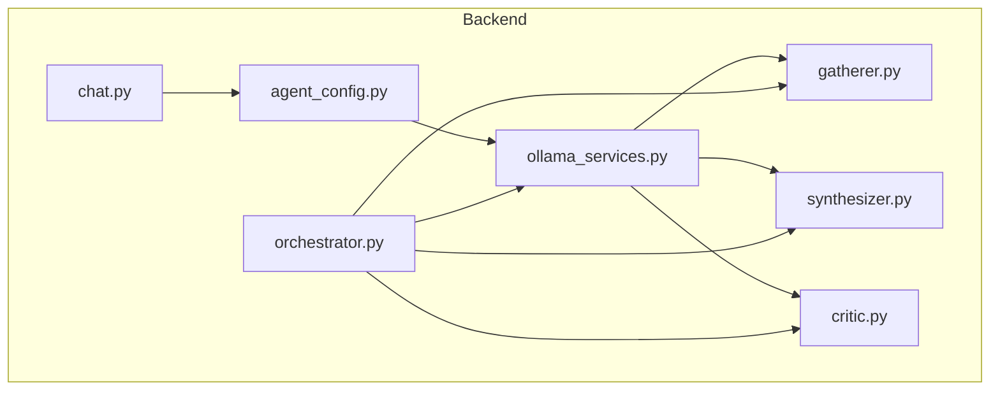
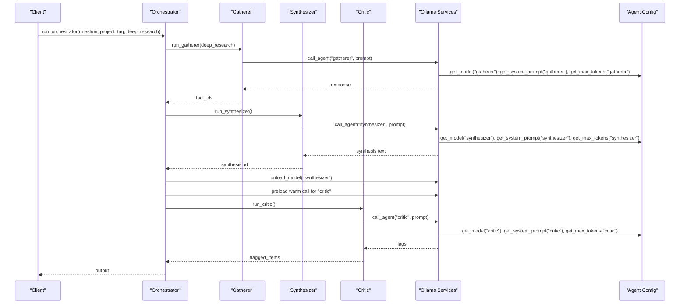
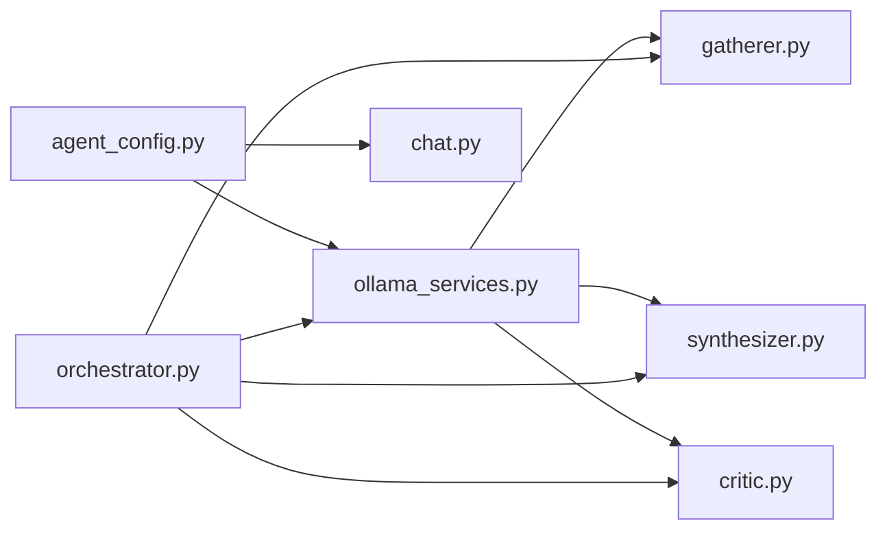

# Agent Configuration System

<cite>
**Referenced Files in This Document**
- [agent_config.py](file://backend/agent_config.py)
- [ollama_services.py](file://backend/ollama_services.py)
- [orchestrator.py](file://backend/orchestrator.py)
- [gatherer.py](file://backend/gatherer.py)
- [synthesizer.py](file://backend/synthesizer.py)
- [critic.py](file://backend/critic.py)
- [chat.py](file://backend/chat.py)
- [atlasStore.js](file://frontend/src/store/atlasStore.js)
- [synthesizer-critic-trace.md](file://Documentation/synthesizer-critic-trace.md)
</cite>

## Table of Contents
1. [Introduction](#introduction)
2. [Project Structure](#project-structure)
3. [Core Components](#core-components)
4. [Architecture Overview](#architecture-overview)
5. [Detailed Component Analysis](#detailed-component-analysis)
6. [Dependency Analysis](#dependency-analysis)
7. [Performance Considerations](#performance-considerations)
8. [Troubleshooting Guide](#troubleshooting-guide)
9. [Conclusion](#conclusion)
10. [Appendices](#appendices)

## Introduction
This document explains the agent configuration system that defines prompts, model selections, and processing parameters for each agent role. It details how get_model() maps roles to specific Ollama models (8b for synthesizer, 14b for critic), documents prompt templates and customization options, describes deep research mode behavior, and provides guidance for configuring new agents and tuning performance characteristics.

## Project Structure
The backend centralizes agent configuration in a single module and exposes helpers used by all agents and services:
- agent_config.py: Role definitions, system prompts, per-role token limits, and model selection via tiers.
- ollama_services.py: Shared call_agent() and unload_model() functions that use the configuration to invoke Ollama.
- orchestrator.py: Pipeline orchestration that wires Gatherer → Synthesizer → Critic with model lifecycle management.
- gatherer.py, synthesizer.py, critic.py: Role-specific logic that constructs prompts and persists results.
- chat.py: Follow-up conversation endpoint using the followup role’s model and prompt.
- atlasStore.js: Frontend state including the deep_research toggle passed into the pipeline.

**Diagram sources**
- [agent_config.py:1-111](file://backend/agent_config.py#L1-L111)
- [ollama_services.py:1-26](file://backend/ollama_services.py#L1-L26)
- [orchestrator.py:1-98](file://backend/orchestrator.py#L1-L98)
- [gatherer.py:1-152](file://backend/gatherer.py#L1-L152)
- [synthesizer.py:1-101](file://backend/synthesizer.py#L1-L101)
- [critic.py:1-122](file://backend/critic.py#L1-L122)
- [chat.py:1-72](file://backend/chat.py#L1-L72)

**Section sources**
- [agent_config.py:1-111](file://backend/agent_config.py#L1-L111)
- [orchestrator.py:1-98](file://backend/orchestrator.py#L1-L98)

## Core Components
- Model selection and mapping:
  - get_model(role) returns the model name for a given role based on the active tier.
  - The default tier is configured as CURRENT_TIER = "gpu".
  - In the gpu tier, the synthesizer uses an 8b model and the critic uses a 14b model.
- Prompt templates:
  - Each role has a dedicated system prompt string defining its responsibilities and output format.
- Token limits:
  - Per-role max_tokens control generation length and prevent truncation or overuse.
- Shared service layer:
  - call_agent(role, prompt) resolves model, system prompt, and token limit from configuration and calls Ollama.
  - unload_model(role) frees VRAM by forcing the assigned model to unload.

Key behaviors:
- Orchestrator coordinates the pipeline and manages model lifecycle (unload/load) between stages.
- Agents build structured prompts combining question, retrieved findings, and notes where applicable.
- Deep research mode increases search breadth in the Gatherer stage.

**Section sources**
- [agent_config.py:80-111](file://backend/agent_config.py#L80-L111)
- [ollama_services.py:1-26](file://backend/ollama_services.py#L1-L26)
- [orchestrator.py:43-73](file://backend/orchestrator.py#L43-L73)

## Architecture Overview
The configuration system is centralized and consumed uniformly across agents and services. The orchestrator drives the flow and ensures appropriate models are loaded/unloaded to balance memory usage and latency.

**Diagram sources**
- [orchestrator.py:12-94](file://backend/orchestrator.py#L12-L94)
- [ollama_services.py:4-17](file://backend/ollama_services.py#L4-L17)
- [agent_config.py:104-111](file://backend/agent_config.py#L104-L111)

## Detailed Component Analysis

### Model Selection and Mapping (get_model)
- get_model(role) selects the model name based on the active tier (CURRENT_TIER).
- In the default "gpu" tier:
  - synthesizer uses an 8b model.
  - critic uses a 14b model.
- Other tiers exist for CPU environments with smaller models.

Customization:
- Change CURRENT_TIER to switch model sets globally.
- Extend the models dictionary to add new tiers or adjust role-to-model mappings.

**Section sources**
- [agent_config.py:1](file://backend/agent_config.py#L1)
- [agent_config.py:80-84](file://backend/agent_config.py#L80-L84)
- [agent_config.py:104-105](file://backend/agent_config.py#L104-L105)

### Prompt Templates and Customization
Each role has a dedicated system prompt controlling behavior and output structure:
- Gatherer: Extracts atomic, checkable facts; enforces strict formatting and rejects non-factual content.
- Synthesizer: Organizes raw findings and user notes into a concise, coherent write-up without adding external claims.
- Critic: Validates the synthesis against raw findings and notes; outputs FLAG: lines or NO_ISSUES.
- Followup: Conversational assistant that distinguishes synthesis-backed answers from extended knowledge.

Customization options:
- Edit the corresponding prompt constants to refine instructions, examples, or constraints.
- Ensure output formats remain consistent so parsing logic continues to work (e.g., FACT:, FLAG:, NO_ISSUES).

**Section sources**
- [agent_config.py:3-31](file://backend/agent_config.py#L3-L31)
- [agent_config.py:34-45](file://backend/agent_config.py#L34-L45)
- [agent_config.py:48-61](file://backend/agent_config.py#L48-L61)
- [agent_config.py:63-77](file://backend/agent_config.py#L63-L77)

### Processing Parameters and Token Limits
- Per-role max_tokens define generation caps aligned with expected output sizes:
  - gatherer: larger cap due to multi-fact extraction.
  - synthesizer: bounded paragraphs.
  - critic: short flag lines or a single NO_ISSUES.
  - followup: conversational responses.
- These values help avoid truncation and manage resource usage.

Adjustments:
- Increase caps if prompts produce longer outputs.
- Decrease caps to reduce latency when shorter responses are acceptable.

**Section sources**
- [agent_config.py:93-102](file://backend/agent_config.py#L93-L102)

### Shared Service Layer (call_agent and unload_model)
- call_agent(role, prompt):
  - Resolves model, system prompt, and token limit from configuration.
  - Invokes Ollama generate with keep_alive and think settings.
- unload_model(role):
  - Forces the current model for a role to unload from memory, freeing VRAM before switching roles.

Configuration integration:
- All agents rely on this shared function, ensuring uniform behavior and centralized configuration access.

**Section sources**
- [ollama_services.py:4-17](file://backend/ollama_services.py#L4-L17)
- [ollama_services.py:20-26](file://backend/ollama_services.py#L20-L26)

### Deep Research Mode Behavior
- deep_research is a boolean parameter passed through the orchestrator to the Gatherer.
- When enabled, Gatherer increases the number of search results processed (primary + reserve pool), improving coverage at the cost of additional time.
- Frontend state includes a deepResearch toggle that flows into backend calls.

Impact:
- More sources increase the likelihood of comprehensive findings but extend total runtime.
- Subsequent stages (Synthesizer, Critic) operate independently of deep_research; they adapt their input size via adaptive retrieval limits.

**Section sources**
- [orchestrator.py:12-21](file://backend/orchestrator.py#L12-L21)
- [gatherer.py:91-109](file://backend/gatherer.py#L91-L109)
- [atlasStore.js:23-24](file://frontend/src/store/atlasStore.js#L23-L24)

### Agent-Specific Logic and Prompts

#### Gatherer
- Constructs a prompt combining the research question and source text.
- Enforces strict output format: lines starting with "FACT:" or a single "NO_RELEVANT_INFO".
- Writes each extracted fact as a RAW_FINDING memory entry.

Customization:
- Adjust the Gatherer prompt to change extraction criteria or examples.
- Tune search result counts via deep_research.

**Section sources**
- [gatherer.py:12-88](file://backend/gatherer.py#L12-L88)
- [gatherer.py:91-149](file://backend/gatherer.py#L91-L149)
- [agent_config.py:3-31](file://backend/agent_config.py#L3-L31)

#### Synthesizer
- Computes an adaptive limit for RAW_FINDING retrieval based on available count.
- Combines findings and optional user notes into a prompt.
- Writes the synthesized text as a SYNTHESIS memory entry and marks older syntheses superseded.

Customization:
- Modify MIN_FINDINGS, MAX_FINDINGS, FINDINGS_FRACTION, and NOTE_LIMIT to tune input volume.
- Refine the Synthesizer prompt to alter structure or tone.

**Section sources**
- [synthesizer.py:8-16](file://backend/synthesizer.py#L8-L16)
- [synthesizer.py:19-28](file://backend/synthesizer.py#L19-L28)
- [synthesizer.py:31-101](file://backend/synthesizer.py#L31-L101)
- [agent_config.py:34-45](file://backend/agent_config.py#L34-L45)

#### Critic
- Retrieves the latest SYNTHESIS and applies the same adaptive limit for RAW_FINDING retrieval.
- Builds a prompt comparing synthesis against findings and notes.
- Parses "FLAG:" lines or "NO_ISSUES"; writes flagged items as FLAGGED memories linked to the synthesis.

Customization:
- Adjust adaptive limits similarly to Synthesizer.
- Refine the Critic prompt to improve issue detection specificity.

**Section sources**
- [critic.py:9-17](file://backend/critic.py#L9-L17)
- [critic.py:20-30](file://backend/critic.py#L20-L30)
- [critic.py:33-122](file://backend/critic.py#L33-L122)
- [agent_config.py:48-61](file://backend/agent_config.py#L48-L61)

#### Followup (Chat Endpoint)
- Uses the followup role’s model and system prompt to respond to user questions within the context of an existing synthesis.
- Supports saving corrections back into memory as CORRECTION entries.

Customization:
- Update the followup prompt to change conversational style or boundaries between synthesis-backed and extended knowledge.

**Section sources**
- [chat.py:21-72](file://backend/chat.py#L21-L72)
- [agent_config.py:63-77](file://backend/agent_config.py#L63-L77)

## Dependency Analysis
The configuration module is the single source of truth for model selection, prompts, and token limits. All agents and services depend on it through helper functions.

**Diagram sources**
- [agent_config.py:104-111](file://backend/agent_config.py#L104-L111)
- [ollama_services.py:1-26](file://backend/ollama_services.py#L1-L26)
- [orchestrator.py:1-98](file://backend/orchestrator.py#L1-L98)
- [gatherer.py:1-152](file://backend/gatherer.py#L1-L152)
- [synthesizer.py:1-101](file://backend/synthesizer.py#L1-L101)
- [critic.py:1-122](file://backend/critic.py#L1-L122)
- [chat.py:1-72](file://backend/chat.py#L1-L72)

**Section sources**
- [agent_config.py:104-111](file://backend/agent_config.py#L104-L111)
- [ollama_services.py:1-26](file://backend/ollama_services.py#L1-L26)

## Performance Considerations
- Think mode:
  - Disabling the model’s “thinking” phase significantly reduces latency for Synthesizer and Critic, while having limited impact on Gatherer due to its inherently generation-heavy task.
- Token caps:
  - Per-role max_tokens must align with expected output sizes to avoid truncation.
- Model lifecycle:
  - Unloading the synthesizer model and warming up the critic model isolates load times and improves throughput.
- Adaptive retrieval:
  - Using adaptive limits prevents under-serving or overloading downstream agents with too few or too many inputs.

Evidence and observations:
- With think=False, Synthesizer and Critic complete in ~3–4 seconds each under GPU tier conditions.
- Total pipeline runtime is dominated by Gatherer, whose cost is structural to multi-source extraction.

**Section sources**
- [synthesizer-critic-trace.md:77-106](file://Documentation/synthesizer-critic-trace.md#L77-L106)
- [orchestrator.py:43-73](file://backend/orchestrator.py#L43-L73)
- [agent_config.py:93-102](file://backend/agent_config.py#L93-L102)

## Troubleshooting Guide
Common issues and resolutions:
- Empty or truncated responses:
  - Ensure think=False is set in the shared service layer.
  - Verify per-role max_tokens are sufficient for the prompt complexity.
- Format failures:
  - Gatherer must return lines prefixed with "FACT:" or "NO_RELEVANT_INFO".
  - Critic must return "FLAG:" lines or "NO_ISSUES".
- Stale synthesis retrieval:
  - Ensure old syntheses are marked superseded to avoid ambiguous semantic search results.
- VRAM pressure:
  - Use unload_model between stages to free memory before loading heavier models.

Operational tips:
- Monitor emitted events for timing and outcomes to pinpoint bottlenecks.
- Validate prompt changes do not break expected output formats.

**Section sources**
- [synthesizer-critic-trace.md:69-91](file://Documentation/synthesizer-critic-trace.md#L69-L91)
- [gatherer.py:56-63](file://backend/gatherer.py#L56-L63)
- [critic.py:97-101](file://backend/critic.py#L97-L101)
- [orchestrator.py:43-73](file://backend/orchestrator.py#L43-L73)

## Conclusion
The agent configuration system centralizes model selection, prompts, and token limits, enabling consistent behavior across roles. get_model() maps roles to specific Ollama models, with the default GPU tier assigning an 8b model to the synthesizer and a 14b model to the critic. Prompt templates define clear responsibilities and output formats for each agent. Deep research mode expands search breadth in the Gatherer stage. Tuning involves adjusting prompts, token caps, and model tiers while leveraging adaptive retrieval and model lifecycle management to optimize performance.

## Appendices

### How to Configure New Agents
Steps:
- Add a new role constant and prompt template in the configuration module.
- Include the role in the models dictionary for each tier.
- Set a suitable max_tokens value reflecting expected output size.
- Implement or update the agent script to construct prompts and persist results.
- If needed, update the orchestrator to include the new role in the pipeline.

References:
- Adding role prompts and tokens: [agent_config.py:86-102](file://backend/agent_config.py#L86-L102)
- Extending model mappings: [agent_config.py:80-84](file://backend/agent_config.py#L80-L84)
- Shared service usage: [ollama_services.py:4-17](file://backend/ollama_services.py#L4-L17)

### Modifying Existing Prompts
Guidelines:
- Keep output formats stable to preserve parsing logic (FACT:, FLAG:, NO_ISSUES).
- Provide concrete examples in prompts to steer behavior.
- Test changes with representative queries and monitor event logs for anomalies.

References:
- Gatherer prompt: [agent_config.py:3-31](file://backend/agent_config.py#L3-L31)
- Synthesizer prompt: [agent_config.py:34-45](file://backend/agent_config.py#L34-L45)
- Critic prompt: [agent_config.py:48-61](file://backend/agent_config.py#L48-L61)
- Followup prompt: [agent_config.py:63-77](file://backend/agent_config.py#L63-L77)

### Adjusting Model Selection Criteria
Options:
- Switch CURRENT_TIER to select different model sets (e.g., cpu-low, cpu-high, gpu).
- Override role-to-model mappings in the models dictionary for fine-grained control.
- Ensure hardware capabilities match selected model sizes to avoid out-of-memory errors.

References:
- Tier definition: [agent_config.py:1](file://backend/agent_config.py#L1)
- Model mappings: [agent_config.py:80-84](file://backend/agent_config.py#L80-L84)
- get_model usage: [agent_config.py:104-105](file://backend/agent_config.py#L104-L105)

### Relationship Between Configuration and Performance
- Larger models (e.g., 14b) provide higher quality but incur longer load and inference times.
- Smaller models (e.g., 8b) trade off quality for speed and lower memory usage.
- Disabling thinking mode reduces overhead for comparison/organization tasks.
- Adaptive retrieval balances input volume to prevent under- or over-loading downstream agents.

References:
- Performance trace: [synthesizer-critic-trace.md:77-106](file://Documentation/synthesizer-critic-trace.md#L77-L106)
- Token caps: [agent_config.py:93-102](file://backend/agent_config.py#L93-L102)
- Model lifecycle: [orchestrator.py:43-73](file://backend/orchestrator.py#L43-L73)