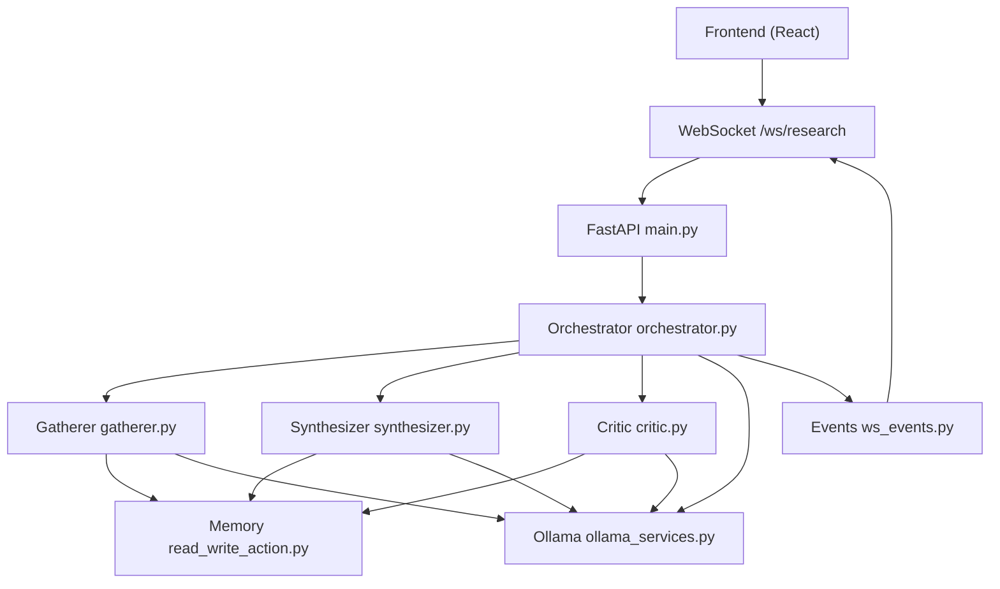
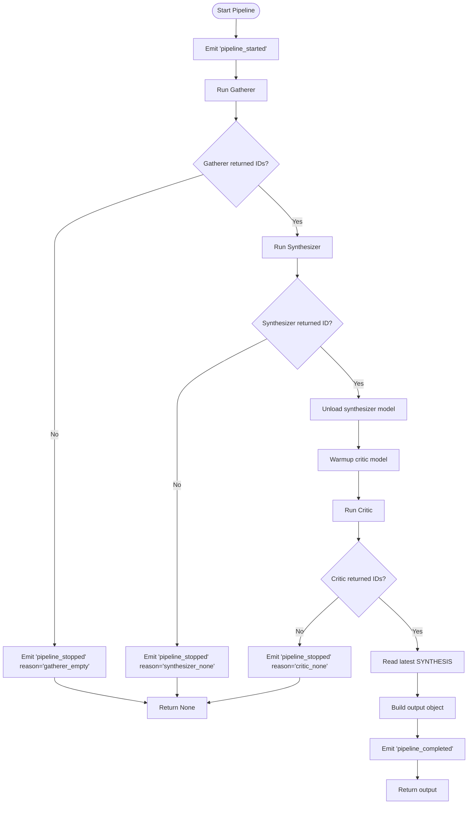
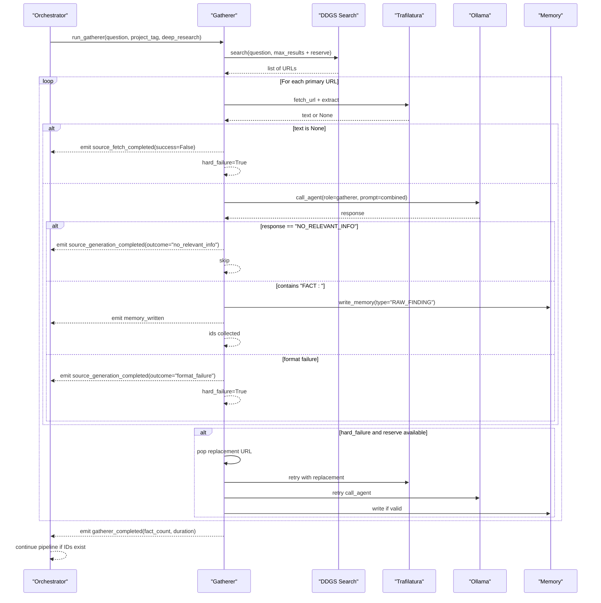
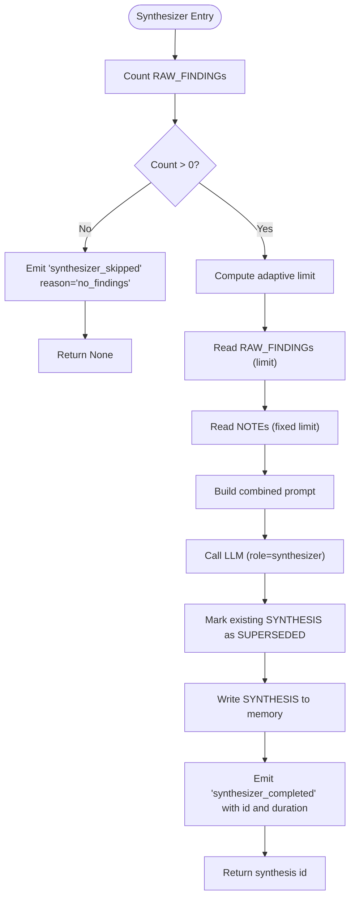
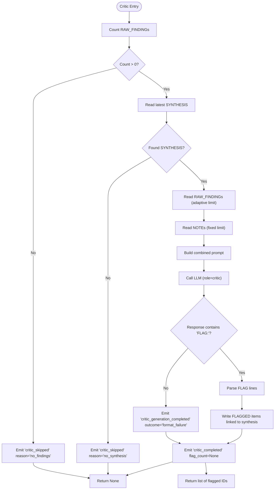
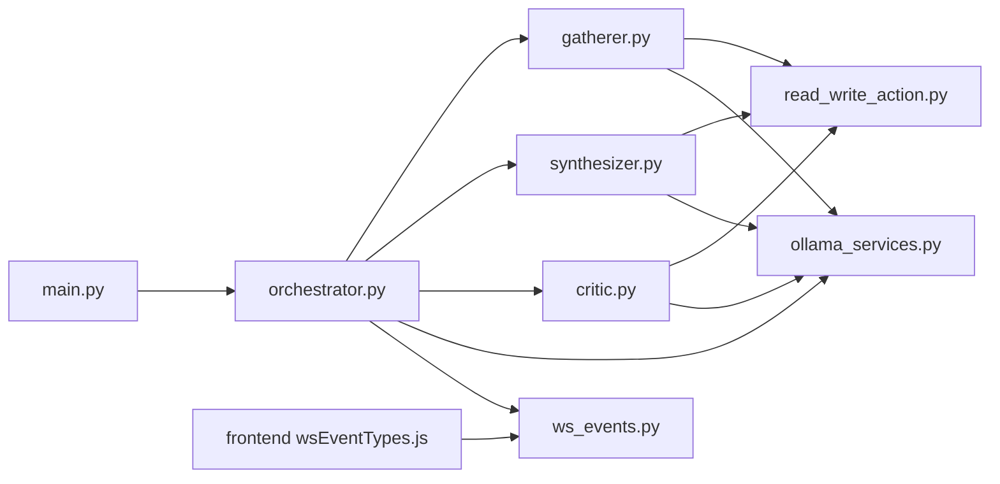

# Multi-Agent Orchestration System

<cite>
**Referenced Files in This Document**
- [main.py](file://backend/main.py)
- [orchestrator.py](file://backend/orchestrator.py)
- [agent_config.py](file://backend/agent_config.py)
- [gatherer.py](file://backend/gatherer.py)
- [synthesizer.py](file://backend/synthesizer.py)
- [critic.py](file://backend/critic.py)
- [ollama_services.py](file://backend/ollama_services.py)
- [read_write_action.py](file://backend/read_write_action.py)
- [ws_events.py](file://backend/ws_events.py)
- [wsEventTypes.js](file://frontend/src/utils/wsEventTypes.js)
</cite>

## Table of Contents
1. [Introduction](#introduction)
2. [Project Structure](#project-structure)
3. [Core Components](#core-components)
4. [Architecture Overview](#architecture-overview)
5. [Detailed Component Analysis](#detailed-component-analysis)
6. [Dependency Analysis](#dependency-analysis)
7. [Performance Considerations](#performance-considerations)
8. [Troubleshooting Guide](#troubleshooting-guide)
9. [Conclusion](#conclusion)

## Introduction
This document explains the multi-agent orchestration system that coordinates the sequential execution of three specialized agents: Gatherer, Synthesizer, and Critic. The orchestrator acts as the central coordinator, managing agent lifecycle, timing, data flow, and model resource management. Each agent processes data sequentially with robust error handling and state management. The system integrates with an event emission mechanism to stream progress updates to the frontend over WebSockets. Configuration for prompts, model selection, and processing parameters is centralized in a dedicated configuration module.

## Project Structure
The backend implements a FastAPI application that exposes REST and WebSocket endpoints. The orchestrator drives a pipeline composed of three agents. Agents interact with a vectorized memory store and call local LLMs via Ollama. Events are emitted through a simple helper and consumed by the frontend using typed constants.



**Diagram sources**
- [main.py:34-46](file://backend/main.py#L34-L46)
- [main.py:71-110](file://backend/main.py#L71-L110)
- [orchestrator.py:12-94](file://backend/orchestrator.py#L12-L94)
- [gatherer.py:91-149](file://backend/gatherer.py#L91-L149)
- [synthesizer.py:31-101](file://backend/synthesizer.py#L31-L101)
- [critic.py:33-122](file://backend/critic.py#L33-L122)
- [ollama_services.py:4-17](file://backend/ollama_services.py#L4-L17)
- [read_write_action.py:14-31](file://backend/read_write_action.py#L14-L31)
- [ws_events.py:3-14](file://backend/ws_events.py#L3-L14)

**Section sources**
- [main.py:1-110](file://backend/main.py#L1-L110)
- [orchestrator.py:1-98](file://backend/orchestrator.py#L1-L98)

## Core Components
- Orchestrator: Coordinates the end-to-end research pipeline, emits lifecycle events, manages model loading/unloading, and aggregates results.
- Gatherer: Searches the web, extracts content, calls the LLM to extract facts, persists them, and handles fallback sources.
- Synthesizer: Retrieves relevant findings and notes, builds a synthesis, persists it, and emits detailed progress events.
- Critic: Reviews the synthesis against raw findings and notes, flags issues, and persists flagged items.
- Ollama Services: Centralizes LLM calls and model unload logic.
- Memory Layer: Vectorized storage with semantic search, counting, and superseding utilities.
- Event Emission: Lightweight helper to emit structured events to the frontend.
- Configuration: Defines system prompts, model selections per tier, and token limits per role.

**Section sources**
- [orchestrator.py:12-94](file://backend/orchestrator.py#L12-L94)
- [gatherer.py:91-149](file://backend/gatherer.py#L91-L149)
- [synthesizer.py:31-101](file://backend/synthesizer.py#L31-L101)
- [critic.py:33-122](file://backend/critic.py#L33-L122)
- [ollama_services.py:4-26](file://backend/ollama_services.py#L4-L26)
- [read_write_action.py:14-100](file://backend/read_write_action.py#L14-L100)
- [ws_events.py:3-14](file://backend/ws_events.py#L3-L14)
- [agent_config.py:80-111](file://backend/agent_config.py#L80-L111)

## Architecture Overview
The system follows a sequential pipeline pattern orchestrated by a single function. Each agent runs in order, emitting granular events at key steps. The orchestrator also manages VRAM by unloading models between stages and warming up the next model before generation.

```mermaid
sequenceDiagram
participant FE as "Frontend"
participant API as "FastAPI main.py"
participant ORCH as "Orchestrator"
participant G as "Gatherer"
participant S as "Synthesizer"
participant C as "Critic"
participant DB as "Memory (Postgres+pgvector)"
participant LM as "Ollama"
FE->>API : POST /research or WS /ws/research
API->>ORCH : run_orchestrator(question, project_tag, deep_research)
ORCH->>FE : emit_event("pipeline_started")
ORCH->>G : run_gatherer(...)
G->>DB : write RAW_FINDING
G-->>ORCH : fact_ids
ORCH->>FE : emit_event("agent_completed", agent="gatherer")
ORCH->>S : run_synthesizer(...)
S->>DB : read RAW_FINDING, NOTE; write SYNTHESIS
S-->>ORCH : synthesis_id
ORCH->>LM : unload synthesizer model
ORCH->>LM : warmup critic model
ORCH->>C : run_critic(...)
C->>DB : read SYNTHESIS, RAW_FINDING, NOTE; write FLAGGED
C-->>ORCH : flagged_ids
ORCH->>LM : unload critic model
ORCH->>FE : emit_event("pipeline_completed", output)
```

**Diagram sources**
- [main.py:34-46](file://backend/main.py#L34-L46)
- [main.py:71-110](file://backend/main.py#L71-L110)
- [orchestrator.py:12-94](file://backend/orchestrator.py#L12-L94)
- [gatherer.py:91-149](file://backend/gatherer.py#L91-L149)
- [synthesizer.py:31-101](file://backend/synthesizer.py#L31-L101)
- [critic.py:33-122](file://backend/critic.py#L33-L122)
- [ollama_services.py:4-26](file://backend/ollama_services.py#L4-L26)
- [read_write_action.py:14-100](file://backend/read_write_action.py#L14-L100)
- [ws_events.py:3-14](file://backend/ws_events.py#L3-L14)

## Detailed Component Analysis

### Orchestrator
The orchestrator sequences the pipeline, measures durations, emits lifecycle and stage-specific events, and manages model resources. It stops early if any agent fails to produce expected outputs and returns aggregated results upon completion.

Key responsibilities:
- Emit pipeline start and completion events.
- Execute Gatherer, Synthesizer, and Critic in sequence.
- Unload and warm up models to optimize VRAM usage.
- Aggregate final output including processed synthesis text and flagged items.

Error handling:
- Stops on empty Gatherer results.
- Stops on null Synthesizer result.
- Stops on null Critic result.

Timing and events:
- Emits agent started/completed events with duration and counts.
- Emits model unload/load events around transitions.

**Section sources**
- [orchestrator.py:12-94](file://backend/orchestrator.py#L12-L94)

#### Orchestrator Flowchart


**Diagram sources**
- [orchestrator.py:12-94](file://backend/orchestrator.py#L12-L94)

### Gatherer Agent
The Gatherer performs web search, fetches and extracts content from URLs, invokes the LLM to extract factual statements, validates format, persists facts, and supports fallback sources.

Highlights:
- Adaptive search count based on deep_research flag.
- Reserve pool for fallback when primary extraction fails.
- Strict format validation requiring “FACT:” lines.
- Emits detailed source-level events for fetch, generation, and memory writes.

Error handling:
- Skips sources returning “NO_RELEVANT_INFO”.
- Treats extraction failures and format failures as hard failures, triggering replacement attempts.

**Section sources**
- [gatherer.py:12-88](file://backend/gatherer.py#L12-L88)
- [gatherer.py:91-149](file://backend/gatherer.py#L91-L149)

#### Gatherer Sequence


**Diagram sources**
- [gatherer.py:12-88](file://backend/gatherer.py#L12-L88)
- [gatherer.py:91-149](file://backend/gatherer.py#L91-L149)

### Synthesizer Agent
The Synthesizer reads adaptive amounts of RAW_FINDINGs and a fixed budget of NOTEs, constructs a synthesis, marks previous syntheses as superseded, persists the new synthesis, and emits detailed progress events.

Highlights:
- Adaptive limit calculation ensures balanced input size relative to available findings.
- Separate note budget prevents ingestion noise from overwhelming web findings.
- Supersedes prior syntheses to avoid stale results in future searches.

Error handling:
- Skips if no RAW_FINDINGs are available.
- Emits skipped events with reasons.

**Section sources**
- [synthesizer.py:19-28](file://backend/synthesizer.py#L19-L28)
- [synthesizer.py:31-101](file://backend/synthesizer.py#L31-L101)

#### Synthesizer Flowchart


**Diagram sources**
- [synthesizer.py:31-101](file://backend/synthesizer.py#L31-L101)

### Critic Agent
The Critic reviews the Synthesizer’s output against the original RAW_FINDINGs and NOTEs, identifies unsupported claims, contradictions, and gaps, and persists flagged items linked to the synthesis.

Highlights:
- Uses the same adaptive limit and note budget as the Synthesizer for consistent context.
- Validates output format requiring “FLAG:” lines.
- Persists flagged items with parent_id linking to the synthesis.

Error handling:
- Skips if no RAW_FINDINGs or no SYNTHESIS exist.
- Returns None on format failures; otherwise returns list of flagged IDs.

**Section sources**
- [critic.py:20-31](file://backend/critic.py#L20-L31)
- [critic.py:33-122](file://backend/critic.py#L33-L122)

#### Critic Flowchart


**Diagram sources**
- [critic.py:33-122](file://backend/critic.py#L33-L122)

### Ollama Services
Centralizes LLM calls and model unload operations. All agents use this service to ensure consistent model selection, system prompts, and token limits.

Key functions:
- call_agent: Builds request using role-based configuration and returns generated text.
- unload_model: Forces immediate unload of a specific model to free VRAM.

**Section sources**
- [ollama_services.py:4-17](file://backend/ollama_services.py#L4-L17)
- [ollama_services.py:20-26](file://backend/ollama_services.py#L20-L26)

### Memory Layer
Provides vectorized storage and retrieval with semantic similarity search. Functions include writing memories, reading with filters and limits, counting records, and superseding older records.

Key functions:
- write_memory: Embeds content and inserts into Postgres with pgvector.
- read_memory: Performs semantic search with optional type filter and limit.
- count_memories: Counts active records by type and project tag.
- supersede_memories: Marks active records as superseded to prevent stale matches.

**Section sources**
- [read_write_action.py:14-31](file://backend/read_write_action.py#L14-L31)
- [read_write_action.py:33-51](file://backend/read_write_action.py#L33-L51)
- [read_write_action.py:54-73](file://backend/read_write_action.py#L54-L73)
- [read_write_action.py:76-97](file://backend/read_write_action.py#L76-L97)

### Event Emission
A lightweight helper emits structured events containing type, timestamp, and data payload. If no emitter is provided (e.g., synchronous CLI), it becomes a no-op.

**Section sources**
- [ws_events.py:3-14](file://backend/ws_events.py#L3-L14)

### Configuration Management
Defines system prompts per role, model selection per tier, and maximum tokens per role. The orchestrator and agents rely on these settings to ensure consistent behavior across environments.

Key elements:
- Prompt templates for gatherer, synthesizer, critic, and followup roles.
- Model mappings for different tiers (cpu-low, cpu-high, gpu).
- Token limits tuned to observed output shapes per role.
- Accessor functions to retrieve model, prompt, and token limits by role.

**Section sources**
- [agent_config.py:3-31](file://backend/agent_config.py#L3-L31)
- [agent_config.py:34-45](file://backend/agent_config.py#L34-L45)
- [agent_config.py:48-61](file://backend/agent_config.py#L48-L61)
- [agent_config.py:80-111](file://backend/agent_config.py#L80-L111)

## Dependency Analysis
The system exhibits clear separation of concerns:
- Orchestrator depends on agents and shared services.
- Agents depend on memory layer and Ollama services.
- Main entry points expose HTTP and WebSocket interfaces.
- Frontend consumes typed WebSocket events.



**Diagram sources**
- [main.py:34-46](file://backend/main.py#L34-L46)
- [orchestrator.py:12-94](file://backend/orchestrator.py#L12-L94)
- [gatherer.py:91-149](file://backend/gatherer.py#L91-L149)
- [synthesizer.py:31-101](file://backend/synthesizer.py#L31-L101)
- [critic.py:33-122](file://backend/critic.py#L33-L122)
- [ollama_services.py:4-26](file://backend/ollama_services.py#L4-L26)
- [read_write_action.py:14-100](file://backend/read_write_action.py#L14-L100)
- [ws_events.py:3-14](file://backend/ws_events.py#L3-L14)
- [wsEventTypes.js:1-45](file://frontend/src/utils/wsEventTypes.js#L1-L45)

**Section sources**
- [main.py:1-110](file://backend/main.py#L1-L110)
- [orchestrator.py:1-98](file://backend/orchestrator.py#L1-L98)
- [gatherer.py:1-152](file://backend/gatherer.py#L1-L152)
- [synthesizer.py:1-101](file://backend/synthesizer.py#L1-L101)
- [critic.py:1-122](file://backend/critic.py#L1-L122)
- [ollama_services.py:1-26](file://backend/ollama_services.py#L1-L26)
- [read_write_action.py:1-100](file://backend/read_write_action.py#L1-L100)
- [ws_events.py:1-14](file://backend/ws_events.py#L1-L14)
- [wsEventTypes.js:1-45](file://frontend/src/utils/wsEventTypes.js#L1-L45)

## Performance Considerations
- Model VRAM management: Unload models between stages and warm up the next model to minimize cold-start latency during generation.
- Adaptive input sizing: Synthesizer and Critic compute limits based on available findings to balance context size and performance.
- Fallback sources: Gatherer uses a reserve pool to mitigate extraction failures without stalling the pipeline.
- Semantic search efficiency: Vector embeddings enable fast retrieval; ensure embedding model load time is accounted for in overall latency.

[No sources needed since this section provides general guidance]

## Troubleshooting Guide
Common issues and recovery mechanisms:
- Empty Gatherer results: Pipeline stops early with a specific reason; verify search queries and source availability.
- Synthesizer skipped: Occurs when no RAW_FINDINGs exist; ensure Gatherer succeeded and persisted facts.
- Critic skipped: Occurs when no RAW_FINDINGs or SYNTHESIS exist; check upstream stages.
- Format failures: Both Gatherer and Critic validate output formats; adjust prompts or model selection if repeated failures occur.
- WebSocket disconnects: The backend continues running the pipeline in a background thread; events drain into a queue until completion.

**Section sources**
- [orchestrator.py:25-28](file://backend/orchestrator.py#L25-L28)
- [orchestrator.py:38-41](file://backend/orchestrator.py#L38-L41)
- [orchestrator.py:75-78](file://backend/orchestrator.py#L75-L78)
- [gatherer.py:47-63](file://backend/gatherer.py#L47-L63)
- [critic.py:91-101](file://backend/critic.py#L91-L101)
- [main.py:96-109](file://backend/main.py#L96-L109)

## Conclusion
The multi-agent orchestration system provides a robust, sequential pipeline for research tasks. The orchestrator coordinates agent lifecycles, manages model resources, and streams progress to the frontend. Agents implement focused responsibilities with strong error handling and state management. Configuration centralization ensures consistency across roles and environments. The design balances performance and reliability through adaptive input sizing, fallback strategies, and explicit event-driven communication.

[No sources needed since this section summarizes without analyzing specific files]