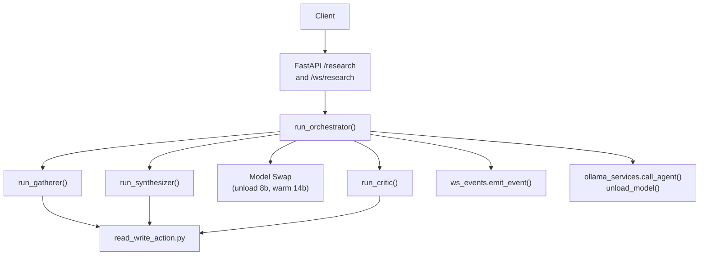
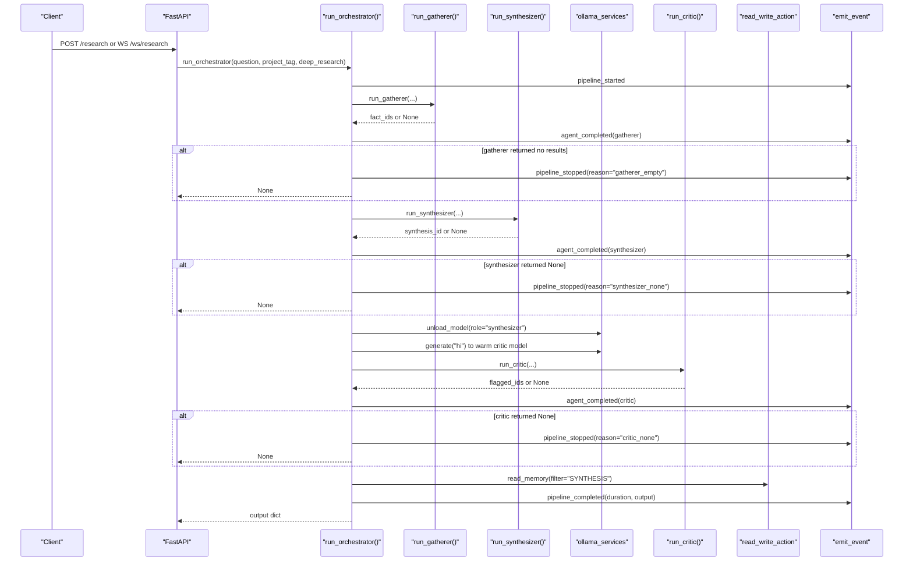
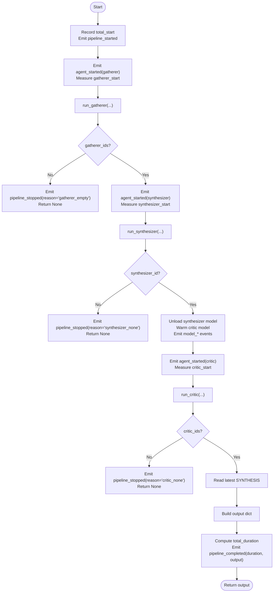
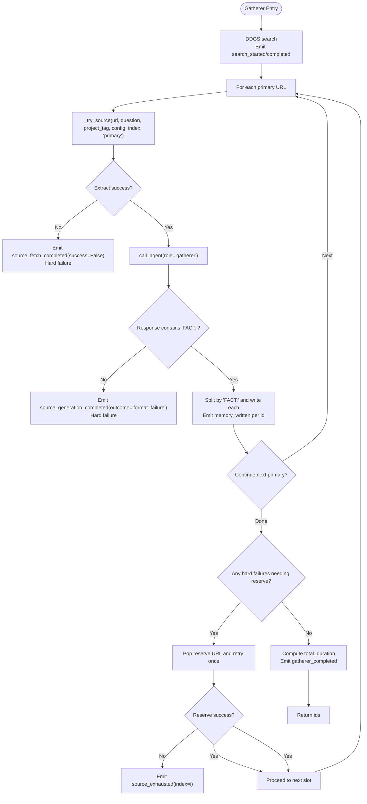
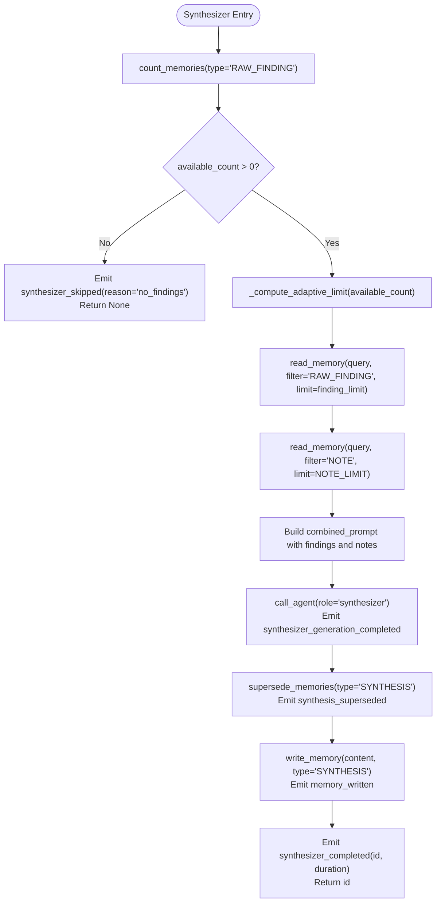
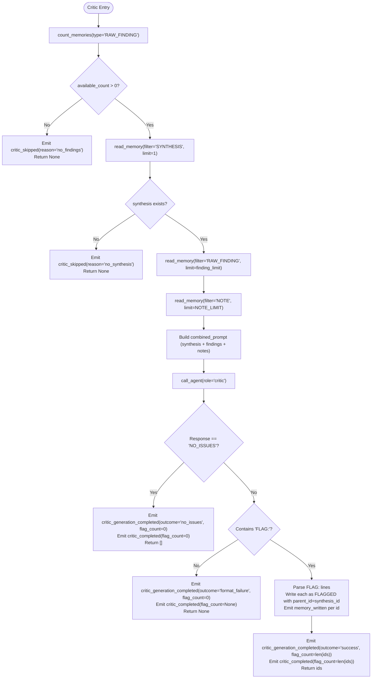
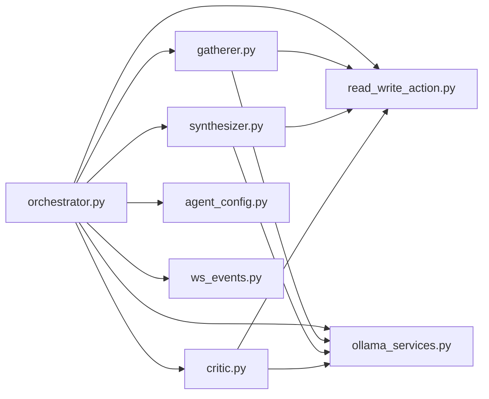

# Orchestrator Execution Flow

<cite>
**Referenced Files in This Document**
- [orchestrator.py](file://backend/orchestrator.py)
- [gatherer.py](file://backend/gatherer.py)
- [synthesizer.py](file://backend/synthesizer.py)
- [critic.py](file://backend/critic.py)
- [ws_events.py](file://backend/ws_events.py)
- [main.py](file://backend/main.py)
- [ollama_services.py](file://backend/ollama_services.py)
- [agent_config.py](file://backend/agent_config.py)
- [read_write_action.py](file://backend/read_write_action.py)
</cite>

## Table of Contents
1. [Introduction](#introduction)
2. [Project Structure](#project-structure)
3. [Core Components](#core-components)
4. [Architecture Overview](#architecture-overview)
5. [Detailed Component Analysis](#detailed-component-analysis)
6. [Dependency Analysis](#dependency-analysis)
7. [Performance Considerations](#performance-considerations)
8. [Troubleshooting Guide](#troubleshooting-guide)
9. [Conclusion](#conclusion)

## Introduction
This document explains the orchestrator’s execution flow that coordinates the sequential processing of three agents: Gatherer, Synthesizer, and Critic. It covers the full lifecycle from initialization to completion, including timing measurements, real-time event emission for updates, state transitions between agents, and conditional logic that stops the pipeline when an agent fails to produce results. It also provides concrete examples of execution sequences, timing annotations, and how different failure scenarios are handled with appropriate error events.

## Project Structure
The backend implements a FastAPI application that exposes both synchronous and WebSocket endpoints. The orchestrator is the central coordinator that invokes each agent in sequence, measures durations, emits structured events, and manages model loading/unloading between stages.

**Diagram sources**
- [main.py:34-46](file://backend/main.py#L34-L46)
- [main.py:71-110](file://backend/main.py#L71-L110)
- [orchestrator.py:12-94](file://backend/orchestrator.py#L12-L94)
- [gatherer.py:91-149](file://backend/gatherer.py#L91-L149)
- [synthesizer.py:31-101](file://backend/synthesizer.py#L31-L101)
- [critic.py:33-122](file://backend/critic.py#L33-L122)
- [ws_events.py:1-14](file://backend/ws_events.py#L1-L14)
- [ollama_services.py:1-26](file://backend/ollama_services.py#L1-L26)
- [read_write_action.py:14-51](file://backend/read_write_action.py#L14-L51)

**Section sources**
- [main.py:34-46](file://backend/main.py#L34-L46)
- [main.py:71-110](file://backend/main.py#L71-L110)
- [orchestrator.py:12-94](file://backend/orchestrator.py#L12-L94)

## Core Components
- Orchestrator: Coordinates the pipeline, measures stage timings, emits events, handles model swaps, and returns final output or early stop signals.
- Gatherer: Searches web sources, extracts facts via LLM, writes RAW_FINDING memories, and emits per-source events.
- Synthesizer: Retrieves adaptive limits of RAW_FINDINGs and NOTEs, generates a SYNTHESIS, marks previous syntheses as superseded, and writes the result.
- Critic: Reads the latest SYNTHESIS and RAW_FINDINGs (plus NOTEs), checks for issues, writes FLAGGED items linked to the synthesis, and returns flagged IDs.
- Event Emitter: A thin helper that wraps emit callbacks into structured dictionaries with timestamps.
- Ollama Services: Centralized model calls and explicit unload operations to manage VRAM across model roles.
- Agent Config: Role-specific prompts, models, and token caps.
- Memory Layer: PostgreSQL + pgvector accessors for read/write/count/supersede operations.

**Section sources**
- [orchestrator.py:12-94](file://backend/orchestrator.py#L12-L94)
- [gatherer.py:91-149](file://backend/gatherer.py#L91-L149)
- [synthesizer.py:31-101](file://backend/synthesizer.py#L31-L101)
- [critic.py:33-122](file://backend/critic.py#L33-L122)
- [ws_events.py:1-14](file://backend/ws_events.py#L1-L14)
- [ollama_services.py:1-26](file://backend/ollama_services.py#L1-L26)
- [agent_config.py:80-111](file://backend/agent_config.py#L80-L111)
- [read_write_action.py:14-97](file://backend/read_write_action.py#L14-L97)

## Architecture Overview
The orchestrator executes a strict sequential pipeline with clear checkpoints and event emissions at each step. It uses time.time() around major phases to compute durations and emits structured events through ws_events.emit_event(). Between Synthesizer and Critic, it performs a model swap: unloads the synthesizer model and warms up the critic model to isolate generation timing.

**Diagram sources**
- [main.py:34-46](file://backend/main.py#L34-L46)
- [main.py:71-110](file://backend/main.py#L71-L110)
- [orchestrator.py:12-94](file://backend/orchestrator.py#L12-L94)
- [gatherer.py:91-149](file://backend/gatherer.py#L91-L149)
- [synthesizer.py:31-101](file://backend/synthesizer.py#L31-L101)
- [critic.py:33-122](file://backend/critic.py#L33-L122)
- [ollama_services.py:1-26](file://backend/ollama_services.py#L1-L26)
- [read_write_action.py:33-51](file://backend/read_write_action.py#L33-L51)

## Detailed Component Analysis

### Orchestrator Lifecycle and State Transitions
- Initialization: Records total start time and emits pipeline_started with question, project_tag, and deep_research flag.
- Gatherer Stage: Emits agent_started, measures duration, emits agent_completed with fact_count. Stops if gatherer_ids is empty and emits pipeline_stopped(reason="gatherer_empty").
- Synthesizer Stage: Emits agent_started, measures duration, emits agent_completed with id. Stops if synthesizer_id is None and emits pipeline_stopped(reason="synthesizer_none").
- Model Swap: Unloads synthesizer model, warms critic model with a throwaway call to measure load time separately, emits model_unload_started/completed and model_load_started/completed.
- Critic Stage: Emits agent_started, measures duration, emits agent_completed with flag_count. Stops if critic_ids is None and emits pipeline_stopped(reason="critic_none").
- Completion: Reads the latest SYNTHESIS text, constructs output object, computes total_duration, emits pipeline_completed(duration, output), and returns output.

**Diagram sources**
- [orchestrator.py:12-94](file://backend/orchestrator.py#L12-L94)

**Section sources**
- [orchestrator.py:12-94](file://backend/orchestrator.py#L12-L94)

### Gatherer Pipeline Details
- Search: Uses DDGS to fetch URLs; emits search_started/search_completed with counts and durations.
- Source Processing: For each primary URL, attempts fetch+extract, then call_agent with role=gatherer. If extraction fails or format check fails, tries one replacement from reserve pool; emits source_fetch_completed, source_generation_completed, source_replaced, source_exhausted accordingly.
- Memory Writes: Each valid FACT is written as RAW_FINDING with write_memory; emits memory_written with id, type, source, project_tag, and duration.
- Completion: Emits gatherer_completed with total duration and fact_count; returns list of ids.

**Diagram sources**
- [gatherer.py:91-149](file://backend/gatherer.py#L91-L149)
- [gatherer.py:12-88](file://backend/gatherer.py#L12-L88)

**Section sources**
- [gatherer.py:91-149](file://backend/gatherer.py#L91-L149)

### Synthesizer Pipeline Details
- Adaptive Limit: Computes finding_limit based on available RAW_FINDING count using MIN_FINDINGS=5, MAX_FINDINGS=20, FINDINGS_FRACTION=0.4.
- Retrieval: Reads RAW_FINDINGs and NOTEs with semantic search; emits findings_retrieved and notes_retrieved events.
- Generation: Builds combined prompt and calls call_agent(role='synthesizer'); emits synthesizer_generation_completed with duration.
- Supersede & Write: Marks existing SYNTHESIS rows as SUPERSEDED, writes new SYNTHESIS, emits memory_written with id and duration.
- Completion: Emits synthesizer_completed with id and total_duration; returns id.

**Diagram sources**
- [synthesizer.py:31-101](file://backend/synthesizer.py#L31-L101)

**Section sources**
- [synthesizer.py:31-101](file://backend/synthesizer.py#L31-L101)

### Critic Pipeline Details
- Prerequisites: Requires RAW_FINDINGs and a SYNTHESIS; otherwise skips with appropriate events.
- Retrieval: Reads SYNTHESIS (limit=1), RAW_FINDINGs (adaptive limit), and NOTEs (fixed limit); emits findings_retrieved and notes_retrieved.
- Generation: Builds combined_prompt with synthesis and findings; calls call_agent(role='critic').
- Outcome Handling:
  - NO_ISSUES: Emits critic_generation_completed(outcome='no_issues', flag_count=0) and critic_completed(flag_count=0); returns [].
  - Format Failure: Emits critic_generation_completed(outcome='format_failure', flag_count=0) and critic_completed(flag_count=None); returns None.
  - Success: Parses FLAG: lines, writes each as FLAGGED with parent_id pointing to synthesis; emits memory_written per id; emits critic_generation_completed(outcome='success', flag_count=len(ids)) and critic_completed(flag_count=len(ids)); returns ids.

**Diagram sources**
- [critic.py:33-122](file://backend/critic.py#L33-L122)

**Section sources**
- [critic.py:33-122](file://backend/critic.py#L33-L122)

### Event Emission and Timing Annotations
- Orchestrator emits: pipeline_started, agent_started, agent_completed, model_unload_started, model_unload_completed, model_load_started, model_load_completed, pipeline_stopped, pipeline_completed.
- Gatherer emits: search_started, search_completed, source_started, source_fetch_completed, source_generation_completed, source_replaced, source_exhausted, memory_written, gatherer_completed.
- Synthesizer emits: synthesizer_started, findings_retrieved, notes_retrieved, synthesizer_generation_completed, synthesis_superseded, memory_written, synthesizer_completed, synthesizer_skipped.
- Critic emits: critic_started, findings_retrieved, notes_retrieved, critic_generation_completed, critic_completed, critic_skipped, memory_written.
- All events include timestamp and data payload; emit callback is optional and safe to be None.

**Section sources**
- [orchestrator.py:12-94](file://backend/orchestrator.py#L12-L94)
- [gatherer.py:91-149](file://backend/gatherer.py#L91-L149)
- [synthesizer.py:31-101](file://backend/synthesizer.py#L31-L101)
- [critic.py:33-122](file://backend/critic.py#L33-L122)
- [ws_events.py:1-14](file://backend/ws_events.py#L1-L14)

### Error Handling and Conditional Logic
- Early stops:
  - Gatherer returns no results → pipeline_stopped(reason="gatherer_empty"), return None.
  - Synthesizer returns None → pipeline_stopped(reason="synthesizer_none"), return None.
  - Critic returns None → pipeline_stopped(reason="critic_none"), return None.
- Format failures:
  - Gatherer source format failure → continues with reserve pool if available; emits source_generation_completed(outcome="format_failure").
  - Critic format failure → returns None and emits critic_generation_completed(outcome="format_failure", flag_count=0).
- Skips due to missing prerequisites:
  - Synthesizer skipped if no RAW_FINDINGs → emits synthesizer_skipped(reason="no_findings").
  - Critic skipped if no RAW_FINDINGs or no SYNTHESIS → emits critic_skipped(reason="no_findings" or "no_synthesis").

**Section sources**
- [orchestrator.py:25-41](file://backend/orchestrator.py#L25-L41)
- [orchestrator.py:75-78](file://backend/orchestrator.py#L75-L78)
- [gatherer.py:56-63](file://backend/gatherer.py#L56-L63)
- [synthesizer.py:38-41](file://backend/synthesizer.py#L38-L41)
- [critic.py:40-52](file://backend/critic.py#L40-L52)
- [critic.py:97-101](file://backend/critic.py#L97-L101)

### WebSocket Integration and Real-Time Updates
- Synchronous endpoint POST /research calls run_orchestrator directly and returns response or raises HTTPException 404 if None.
- WebSocket endpoint /ws/research runs the orchestrator in a background thread via asyncio.to_thread, emitting events through a queue; client receives structured events until sentinel None.
- Errors during pipeline execution are captured and emitted as pipeline_error events with message details.

**Section sources**
- [main.py:34-46](file://backend/main.py#L34-L46)
- [main.py:49-68](file://backend/main.py#L49-L68)
- [main.py:71-110](file://backend/main.py#L71-L110)

## Dependency Analysis
The orchestrator depends on:
- Agent modules: gatherer, synthesizer, critic.
- Memory layer: read_write_action for DB operations.
- Ollama services: call_agent and unload_model for model management.
- Agent config: get_model for role-based model selection.
- Event emitter: ws_events.emit_event for structured events.

**Diagram sources**
- [orchestrator.py:1-10](file://backend/orchestrator.py#L1-L10)
- [gatherer.py:1-8](file://backend/gatherer.py#L1-L8)
- [synthesizer.py:1-5](file://backend/synthesizer.py#L1-L5)
- [critic.py:1-5](file://backend/critic.py#L1-L5)
- [read_write_action.py:1-12](file://backend/read_write_action.py#L1-L12)
- [ollama_services.py:1-3](file://backend/ollama_services.py#L1-L3)
- [agent_config.py:80-111](file://backend/agent_config.py#L80-L111)
- [ws_events.py:1-14](file://backend/ws_events.py#L1-L14)

**Section sources**
- [orchestrator.py:1-10](file://backend/orchestrator.py#L1-L10)
- [gatherer.py:1-8](file://backend/gatherer.py#L1-L8)
- [synthesizer.py:1-5](file://backend/synthesizer.py#L1-L5)
- [critic.py:1-5](file://backend/critic.py#L1-L5)

## Performance Considerations
- Timing measurements:
  - Orchestrator records total_start and per-stage durations for gatherer, synthesizer, critic, and model unload/load steps.
  - Agents emit detailed timing events for search, fetch+extract, call_agent, and memory writes.
- Model management:
  - Explicit unload_model after synthesizer to free VRAM before loading critic model.
  - Warm-up call to isolate critic model load time from generation time.
- Adaptive retrieval:
  - Synthesizer and Critic use adaptive limits to avoid overloading prompts and ensure sufficient context.
- Known bottlenecks:
  - Gatherer dominates runtime due to multi-source extraction and model inference; optimizations focused on reducing unnecessary overhead (offline HF hub, keep_alive, timeouts).

[No sources needed since this section provides general guidance]

## Troubleshooting Guide
Common failure scenarios and their handling:
- Gatherer empty results:
  - Symptom: pipeline_stopped(reason="gatherer_empty").
  - Action: Verify search configuration, DDGS availability, and source extractability; check reserve pool usage.
- Synthesizer skipped:
  - Symptom: synthesizer_skipped(reason="no_findings").
  - Action: Ensure Gatherer produced RAW_FINDINGs; verify project_tag consistency.
- Critic skipped:
  - Symptom: critic_skipped(reason="no_findings" or "no_synthesis").
  - Action: Confirm RAW_FINDINGs exist and Synthesizer wrote a SYNTHESIS; check status flags if multiple versions exist.
- Format failures:
  - Gatherer source format failure: continue with reserve pool; inspect prompt and model behavior.
  - Critic format failure: review prompt constraints and model token caps; ensure think=False is set globally.
- WebSocket errors:
  - pipeline_error events contain message details; validate request schema and handle disconnects gracefully.

**Section sources**
- [orchestrator.py:25-41](file://backend/orchestrator.py#L25-L41)
- [orchestrator.py:75-78](file://backend/orchestrator.py#L75-L78)
- [gatherer.py:56-63](file://backend/gatherer.py#L56-L63)
- [synthesizer.py:38-41](file://backend/synthesizer.py#L38-L41)
- [critic.py:40-52](file://backend/critic.py#L40-L52)
- [critic.py:97-101](file://backend/critic.py#L97-L101)
- [main.py:78-81](file://backend/main.py#L78-L81)

## Conclusion
The orchestrator provides a robust, event-driven pipeline that coordinates Gatherer, Synthesizer, and Critic with precise timing measurements and clear state transitions. Conditional logic ensures early termination on failures, while structured events enable real-time monitoring and debugging. Model management between stages optimizes resource usage, and adaptive retrieval strategies balance context quality with prompt constraints. This design supports reliable, observable research workflows suitable for both synchronous and asynchronous client interactions.