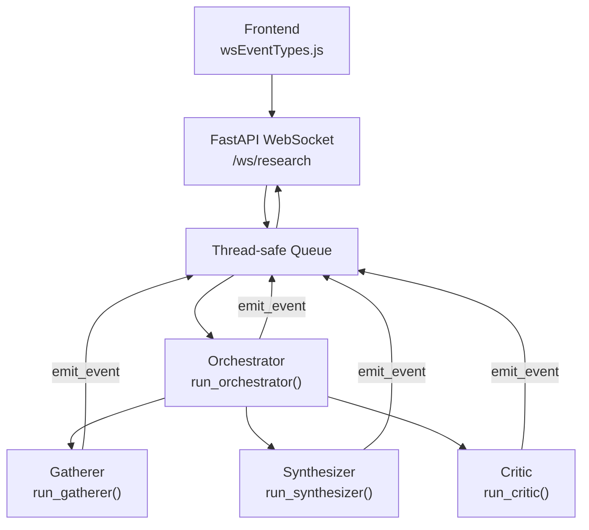
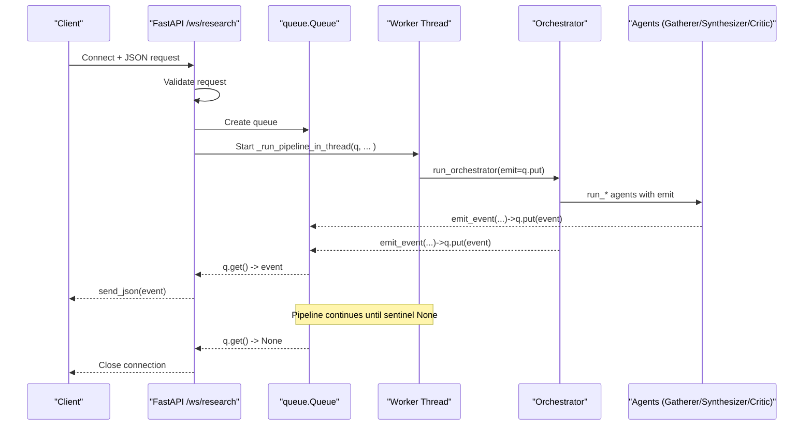
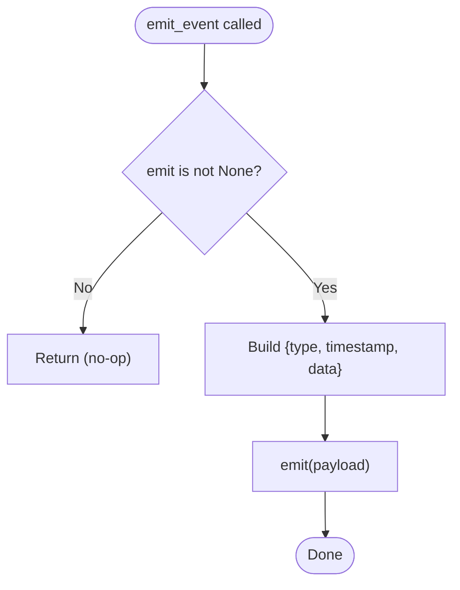
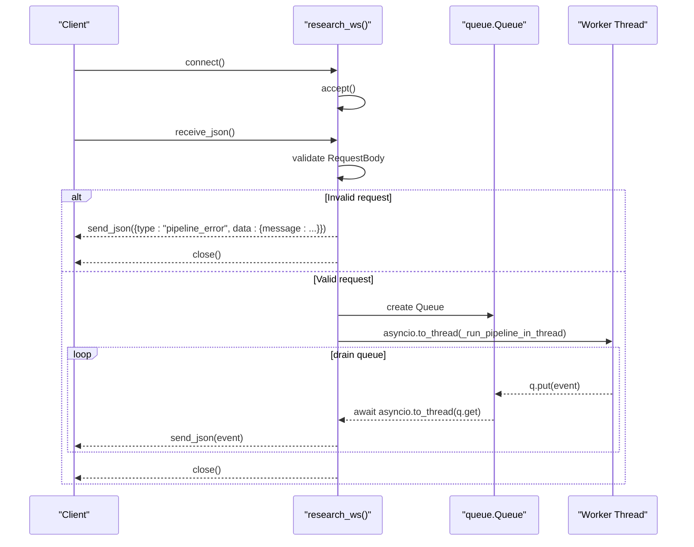
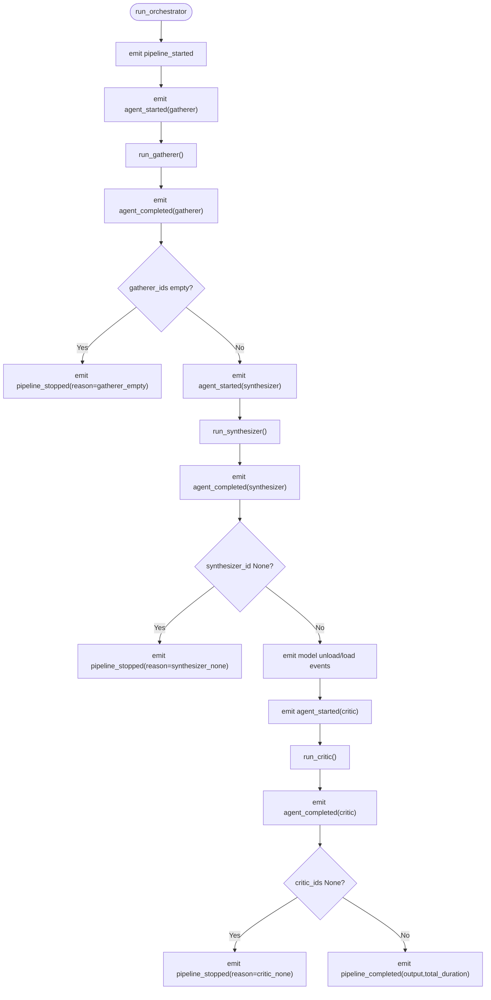
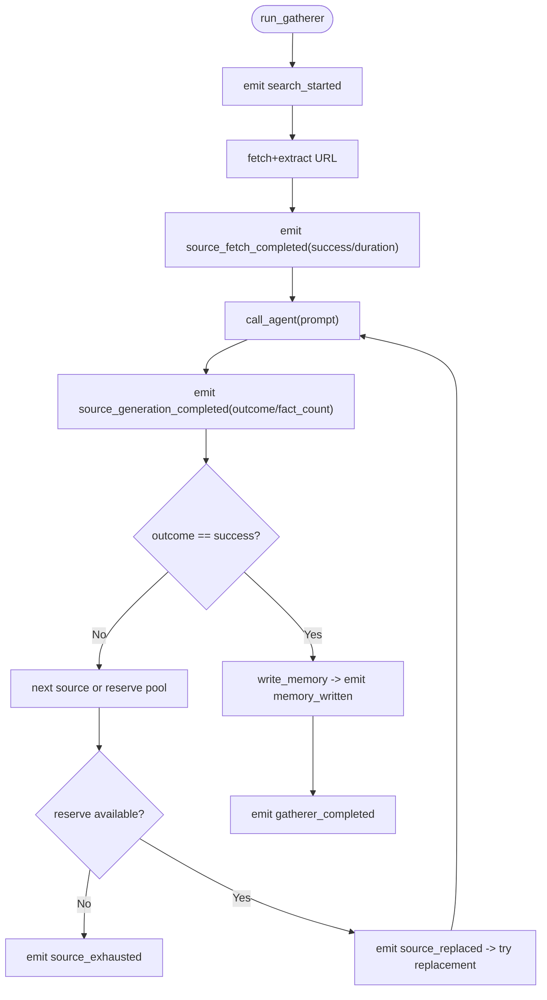
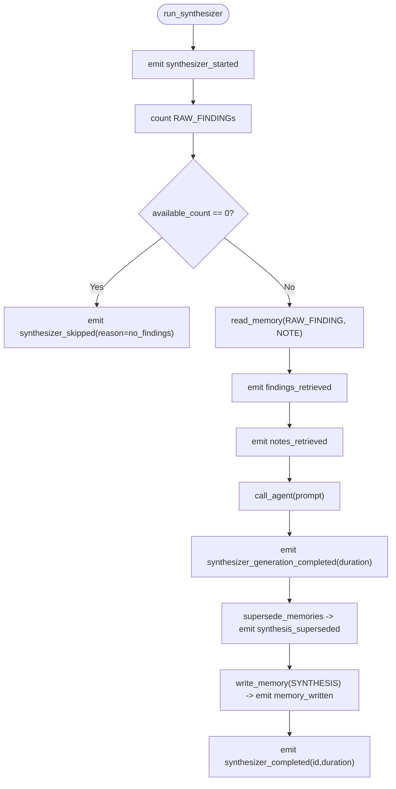
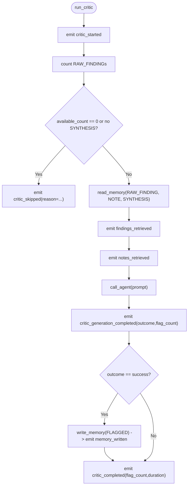
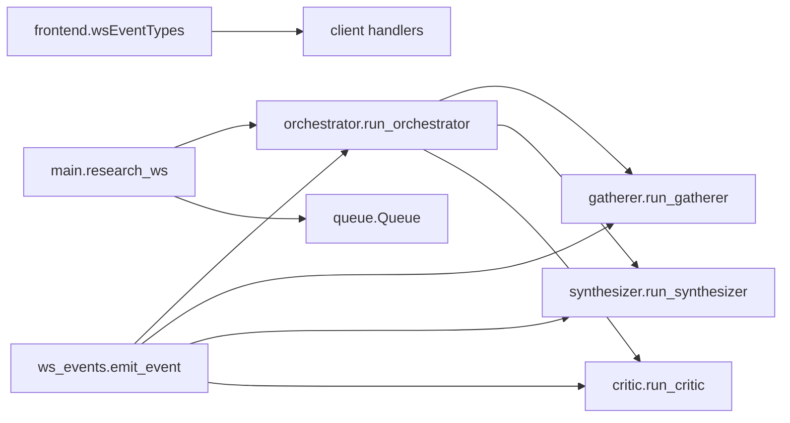

# WebSocket Event System

<cite>
**Referenced Files in This Document**
- [main.py](file://backend/main.py)
- [orchestrator.py](file://backend/orchestrator.py)
- [gatherer.py](file://backend/gatherer.py)
- [synthesizer.py](file://backend/synthesizer.py)
- [critic.py](file://backend/critic.py)
- [ws_events.py](file://backend/ws_events.py)
- [wsEventTypes.js](file://frontend/src/utils/wsEventTypes.js)
</cite>

## Table of Contents
1. [Introduction](#introduction)
2. [Project Structure](#project-structure)
3. [Core Components](#core-components)
4. [Architecture Overview](#architecture-overview)
5. [Detailed Component Analysis](#detailed-component-analysis)
6. [Dependency Analysis](#dependency-analysis)
7. [Performance Considerations](#performance-considerations)
8. [Troubleshooting Guide](#troubleshooting-guide)
9. [Conclusion](#conclusion)
10. [Appendices](#appendices)

## Introduction
This document explains the real-time communication system built with WebSockets that streams pipeline progress from the backend to the frontend. It covers:
- The structured event payload format used across all events
- The event emission patterns throughout the pipeline stages (Gatherer, Synthesizer, Critic)
- Thread-safe queuing that prevents blocking the FastAPI event loop while ensuring reliable delivery
- Error handling and cleanup when clients disconnect early
- Client-side event type definitions and recommended handling patterns

## Project Structure
The WebSocket implementation spans a small set of focused modules:
- Backend entrypoint and WebSocket endpoint
- Orchestrator coordinating agents and emitting lifecycle events
- Agents (Gatherer, Synthesizer, Critic) emitting stage-specific events
- A shared helper for consistent event payloads
- Frontend constants defining event types consumed by client logic

**Diagram sources**
- [main.py:71-110](file://backend/main.py#L71-L110)
- [orchestrator.py:12-94](file://backend/orchestrator.py#L12-L94)
- [gatherer.py:91-149](file://backend/gatherer.py#L91-L149)
- [synthesizer.py:31-101](file://backend/synthesizer.py#L31-L101)
- [critic.py:33-122](file://backend/critic.py#L33-L122)
- [ws_events.py:3-13](file://backend/ws_events.py#L3-L13)
- [wsEventTypes.js:1-44](file://frontend/src/utils/wsEventTypes.js#L1-L44)

**Section sources**
- [main.py:71-110](file://backend/main.py#L71-L110)
- [wsEventTypes.js:1-44](file://frontend/src/utils/wsEventTypes.js#L1-L44)

## Core Components
- Structured event emitter: Ensures every event has a consistent shape with type, timestamp, and data fields.
- WebSocket endpoint: Accepts requests, validates input, starts the pipeline on a worker thread, and drains a queue to send events without blocking the event loop.
- Orchestrator: Emits lifecycle events around each agent run and model load/unload operations.
- Agents: Emit granular progress events during their work (searching, fetching, generation, memory writes).
- Frontend event types: Centralized constants for all event names used by the client.

Key responsibilities:
- Non-blocking execution: Pipeline runs in a separate thread; queue reads are offloaded to avoid blocking the async loop.
- Reliable delivery: Sentinel value signals completion so the reader loop terminates cleanly.
- Consistent payloads: All events follow the same structure for predictable client parsing.

**Section sources**
- [ws_events.py:3-13](file://backend/ws_events.py#L3-L13)
- [main.py:49-110](file://backend/main.py#L49-L110)
- [orchestrator.py:12-94](file://backend/orchestrator.py#L12-L94)
- [gatherer.py:91-149](file://backend/gatherer.py#L91-L149)
- [synthesizer.py:31-101](file://backend/synthesizer.py#L31-L101)
- [critic.py:33-122](file://backend/critic.py#L33-L122)
- [wsEventTypes.js:1-44](file://frontend/src/utils/wsEventTypes.js#L1-L44)

## Architecture Overview
The WebSocket flow is designed for responsiveness and reliability:
- The client connects to /ws/research and sends a JSON request.
- The server validates the request and spawns a background thread to run the orchestrator.
- The orchestrator and agents emit structured events via a shared helper into a thread-safe queue.
- The WebSocket coroutine continuously reads from the queue and forwards events to the client.
- On client disconnect or error, the server handles cleanup gracefully while allowing the background pipeline to finish.

**Diagram sources**
- [main.py:71-110](file://backend/main.py#L71-L110)
- [orchestrator.py:12-94](file://backend/orchestrator.py#L12-L94)
- [gatherer.py:91-149](file://backend/gatherer.py#L91-L149)
- [synthesizer.py:31-101](file://backend/synthesizer.py#L31-L101)
- [critic.py:33-122](file://backend/critic.py#L33-L122)
- [ws_events.py:3-13](file://backend/ws_events.py#L3-L13)

## Detailed Component Analysis

### Event Emitter and Payload Contract
All events share a uniform structure:
- type: string identifying the event kind
- timestamp: numeric epoch time when emitted
- data: object containing event-specific fields

The emitter ensures no-op behavior when running synchronously (e.g., CLI), making it safe to call even without an active WebSocket.

**Diagram sources**
- [ws_events.py:3-13](file://backend/ws_events.py#L3-L13)

**Section sources**
- [ws_events.py:3-13](file://backend/ws_events.py#L3-L13)

### WebSocket Endpoint and Thread-Safe Queuing
Responsibilities:
- Accept WebSocket connections and parse JSON requests
- Validate inputs and return structured errors if invalid
- Run the pipeline in a worker thread using asyncio.to_thread
- Drain the queue asynchronously to avoid blocking the event loop
- Handle client disconnects and close the connection cleanly

Key behaviors:
- Errors produce a pipeline_error event with a message field inside data
- A sentinel None is always enqueued at the end to terminate the reader loop
- If the client disconnects, the background thread continues until completion

**Diagram sources**
- [main.py:71-110](file://backend/main.py#L71-L110)
- [main.py:49-68](file://backend/main.py#L49-L68)

**Section sources**
- [main.py:71-110](file://backend/main.py#L71-L110)
- [main.py:49-68](file://backend/main.py#L49-L68)

### Orchestrator Events
Lifecycle events emitted by the orchestrator:
- pipeline_started: includes question, project_tag, deep_research
- agent_started/agent_completed: per agent with duration and counts where applicable
- model_unload_started/model_unload_completed: VRAM management around model swaps
- model_load_started/model_load_completed: warm-up and loading of critic model
- pipeline_stopped: early termination reasons (gatherer_empty, synthesizer_none, critic_none)
- pipeline_completed: final output and total duration

**Diagram sources**
- [orchestrator.py:12-94](file://backend/orchestrator.py#L12-L94)

**Section sources**
- [orchestrator.py:12-94](file://backend/orchestrator.py#L12-L94)

### Gatherer Events
Granular events during search and source processing:
- search_started/search_completed: search parameters and result counts
- source_started/source_fetch_completed: per-source fetch timing and success
- source_generation_completed: model response outcome (success, no_relevant_info, format_failure)
- memory_written: after writing RAW_FINDING rows
- source_replaced/source_exhausted: fallback behavior when primary sources fail
- gatherer_completed: summary with fact_count and duration

**Diagram sources**
- [gatherer.py:91-149](file://backend/gatherer.py#L91-L149)

**Section sources**
- [gatherer.py:91-149](file://backend/gatherer.py#L91-L149)

### Synthesizer Events
Events during synthesis generation and memory updates:
- synthesizer_started: begins synthesis phase
- findings_retrieved: adaptive limit and retrieved count
- notes_retrieved: user notes budget and retrieval count
- synthesizer_generation_completed: model generation timing
- synthesis_superseded: marks previous syntheses outdated
- memory_written: persists new SYNTHESIS row
- synthesizer_completed: final id and duration

**Diagram sources**
- [synthesizer.py:31-101](file://backend/synthesizer.py#L31-L101)

**Section sources**
- [synthesizer.py:31-101](file://backend/synthesizer.py#L31-L101)

### Critic Events
Events during critique generation and flagging:
- critic_started: begins critique phase
- findings_retrieved/notes_retrieved: data budgets and retrieval counts
- critic_generation_completed: outcome and flag_count
- memory_written: persists FLAGGED rows linked to synthesis
- critic_completed: final flag_count and duration

**Diagram sources**
- [critic.py:33-122](file://backend/critic.py#L33-L122)

**Section sources**
- [critic.py:33-122](file://backend/critic.py#L33-L122)

### Frontend Event Types
The frontend centralizes event names to ensure consistency between server emissions and client handlers:
- Pipeline-level: started, completed, stopped, error
- Agent-level: started, completed
- Gatherer-level: search, source, generation, replacement, exhaustion, completion
- Synthesizer-level: started, skipped, completed, findings retrieval, generation, supersession
- Critic-level: started, skipped, completed, generation
- Memory-level: written
- VRAM-level: model unload/load lifecycle

These constants should be used when routing incoming events to UI state updates or logs.

**Section sources**
- [wsEventTypes.js:1-44](file://frontend/src/utils/wsEventTypes.js#L1-L44)

## Dependency Analysis
The event system exhibits clear separation of concerns:
- ws_events.py provides a single, reusable emitter used by all pipeline components
- main.py wires the WebSocket lifecycle and queues
- orchestrator.py coordinates agents and emits high-level lifecycle events
- Each agent module emits domain-specific events
- Frontend uses centralized event type constants

**Diagram sources**
- [ws_events.py:3-13](file://backend/ws_events.py#L3-L13)
- [main.py:71-110](file://backend/main.py#L71-L110)
- [orchestrator.py:12-94](file://backend/orchestrator.py#L12-L94)
- [gatherer.py:91-149](file://backend/gatherer.py#L91-L149)
- [synthesizer.py:31-101](file://backend/synthesizer.py#L31-L101)
- [critic.py:33-122](file://backend/critic.py#L33-L122)
- [wsEventTypes.js:1-44](file://frontend/src/utils/wsEventTypes.js#L1-L44)

**Section sources**
- [ws_events.py:3-13](file://backend/ws_events.py#L3-L13)
- [main.py:71-110](file://backend/main.py#L71-L110)
- [orchestrator.py:12-94](file://backend/orchestrator.py#L12-L94)
- [gatherer.py:91-149](file://backend/gatherer.py#L91-L149)
- [synthesizer.py:31-101](file://backend/synthesizer.py#L31-L101)
- [critic.py:33-122](file://backend/critic.py#L33-L122)
- [wsEventTypes.js:1-44](file://frontend/src/utils/wsEventTypes.js#L1-L44)

## Performance Considerations
- Non-blocking I/O: The WebSocket read loop uses asyncio.to_thread for queue.get(), preventing event loop stalls.
- Background execution: The orchestrator runs in a worker thread via asyncio.to_thread, keeping the HTTP/WebSocket layer responsive.
- Minimal serialization overhead: Events are plain dicts serialized to JSON; keep payloads concise.
- Backpressure: If the client cannot keep up, the queue may grow; consider rate-limiting or dropping non-critical events in high-throughput scenarios.
- Model loading: Warm-up calls isolate pure load times from generation durations, improving measurement accuracy.

[No sources needed since this section provides general guidance]

## Troubleshooting Guide
Common issues and resolutions:
- Invalid request payload: Server responds with a pipeline_error event including a descriptive message; verify schema validation on the client side.
- Early client disconnect: The server catches WebSocketDisconnect, stops sending events, and closes the socket; the background pipeline continues until completion.
- No events received: Ensure the client subscribes to the correct event types and handles both data and error events.
- Stalled UI: Confirm the client processes the sentinel None to terminate the event stream and reset UI state.

Error event examples:
- Invalid request: type "pipeline_error", data.message contains validation details
- Unexpected exceptions: type "pipeline_error", data.message contains exception text

Cleanup procedures:
- Always close the WebSocket after the sentinel None is received
- Release any resources tied to the connection (timers, listeners)
- Reset UI state to idle or error states based on the last event type

**Section sources**
- [main.py:71-110](file://backend/main.py#L71-L110)
- [main.py:49-68](file://backend/main.py#L49-L68)

## Conclusion
The WebSocket event system provides a robust, non-blocking, and consistent mechanism for streaming real-time pipeline progress. By standardizing event payloads and leveraging a thread-safe queue, the backend maintains responsiveness while delivering reliable updates. The frontend can rely on centralized event types to build predictable UI interactions and error handling flows.

[No sources needed since this section summarizes without analyzing specific files]

## Appendices

### Event Payload Examples
- Generic event shape:
  - type: string (e.g., "pipeline_started")
  - timestamp: number (epoch seconds)
  - data: object (event-specific fields)

- Example: pipeline_started
  - type: "pipeline_started"
  - timestamp: <number>
  - data: {question: "<string>", project_tag: "<string>", deep_research: <boolean>}

- Example: search_completed
  - type: "search_completed"
  - timestamp: <number>
  - data: {duration: <number>, result_count: <number>, max_results: <number>}

- Example: source_generation_completed (success)
  - type: "source_generation_completed"
  - timestamp: <number>
  - data: {index: <number>, url: "<string>", attempt_label: "<string>", duration: <number>, outcome: "success", fact_count: <number>}

- Example: synthesizer_skipped
  - type: "synthesizer_skipped"
  - timestamp: <number>
  - data: {reason: "no_findings"}

- Example: critic_generation_completed (no_issues)
  - type: "critic_generation_completed"
  - timestamp: <number>
  - data: {duration: <number>, outcome: "no_issues", flag_count: 0}

- Example: pipeline_error
  - type: "pipeline_error"
  - timestamp: <number>
  - data: {message: "<error description>"}

**Section sources**
- [ws_events.py:3-13](file://backend/ws_events.py#L3-L13)
- [orchestrator.py:12-94](file://backend/orchestrator.py#L12-L94)
- [gatherer.py:91-149](file://backend/gatherer.py#L91-L149)
- [synthesizer.py:31-101](file://backend/synthesizer.py#L31-L101)
- [critic.py:33-122](file://backend/critic.py#L33-L122)
- [main.py:71-110](file://backend/main.py#L71-L110)

### Client-Side Handling Patterns
Recommended approach:
- Maintain a map of event handlers keyed by WS_EVENTS constants
- For each incoming event:
  - Log timestamp and type for diagnostics
  - Update UI state based on event type (progress bars, status messages, results)
  - Handle errors by displaying messages and resetting UI
  - Terminate streaming upon receiving a sentinel None (if implemented)

Example handler categories:
- Pipeline lifecycle: started, completed, stopped, error
- Agent progress: started/completed with durations and counts
- Data operations: findings retrieval, memory writes, synthesis supersession
- Resource management: model unload/load events for VRAM visibility

[No sources needed since this section provides general guidance]