# Data Flow & Communication

<cite>
**Referenced Files in This Document**
- [main.py](file://backend/main.py)
- [ws_events.py](file://backend/ws_events.py)
- [orchestrator.py](file://backend/orchestrator.py)
- [gatherer.py](file://backend/gatherer.py)
- [synthesizer.py](file://backend/synthesizer.py)
- [critic.py](file://backend/critic.py)
- [read_write_action.py](file://backend/read_write_action.py)
- [ollama_services.py](file://backend/ollama_services.py)
- [agent_config.py](file://backend/agent_config.py)
- [wsEventTypes.js](file://frontend/src/utils/wsEventTypes.js)
- [atlasStore.js](file://frontend/src/store/atlasStore.js)
</cite>

## Table of Contents
1. Introduction
2. Project Structure
3. Core Components
4. Architecture Overview
5. Detailed Component Analysis
6. Dependency Analysis
7. Performance Considerations
8. Troubleshooting Guide
9. Conclusion

## Introduction
This document explains the end-to-end data flow and communication patterns of Atlas Research, from user input through a WebSocket connection to the FastAPI backend, orchestrator processing, agent execution, and PostgreSQL storage. It details the bidirectional protocol where the frontend sends research questions and receives real-time progress updates via WebSocket events. It also documents how the Zustand store maps incoming events to state changes that drive UI updates, and describes the data transformation pipeline where raw facts are synthesized and critiqued before being stored. Finally, it covers error propagation, retry mechanisms, and connection recovery strategies for reliability.

## Project Structure
The system is split into a Python FastAPI backend and a React/Vite frontend:
- Backend modules implement the WebSocket endpoint, event emission, orchestration, agents (Gatherer, Synthesizer, Critic), LLM integration, and database operations.
- Frontend defines event type constants and a Zustand store for application state.

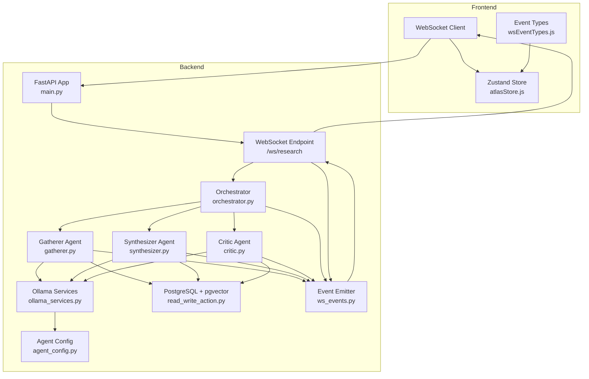

**Diagram sources**
- [main.py:1-110](file://backend/main.py#L1-L110)
- [orchestrator.py:1-98](file://backend/orchestrator.py#L1-L98)
- [gatherer.py:1-152](file://backend/gatherer.py#L1-L152)
- [synthesizer.py:1-101](file://backend/synthesizer.py#L1-L101)
- [critic.py:1-122](file://backend/critic.py#L1-L122)
- [ollama_services.py:1-26](file://backend/ollama_services.py#L1-L26)
- [agent_config.py:1-111](file://backend/agent_config.py#L1-L111)
- [read_write_action.py:1-100](file://backend/read_write_action.py#L1-L100)
- [ws_events.py:1-14](file://backend/ws_events.py#L1-L14)
- [wsEventTypes.js:1-45](file://frontend/src/utils/wsEventTypes.js#L1-L45)
- [atlasStore.js:1-84](file://frontend/src/store/atlasStore.js#L1-L84)

**Section sources**
- [main.py:1-110](file://backend/main.py#L1-L110)
- [wsEventTypes.js:1-45](file://frontend/src/utils/wsEventTypes.js#L1-L45)
- [atlasStore.js:1-84](file://frontend/src/store/atlasStore.js#L1-L84)

## Core Components
- FastAPI WebSocket endpoint: Accepts JSON requests, validates them, runs the orchestrator on a worker thread, and streams events back over WebSocket.
- Orchestrator: Coordinates the Gatherer, Synthesizer, and Critic phases; emits lifecycle and timing events; manages model loading/unloading.
- Agents:
  - Gatherer: Searches web sources, extracts text, calls LLM to extract facts, writes RAW_FINDING rows, emits source-level events.
  - Synthesizer: Reads RAW_FINDINGs and NOTEs, generates a synthesis, marks old syntheses as superseded, writes SYNTHESIS row.
  - Critic: Reads synthesis and findings, flags issues, writes FLAGGED rows.
- Database layer: Uses psycopg2 with pgvector to embed queries and persist structured memories.
- Event emitter: Central helper to emit standardized WebSocket events with timestamps and typed payloads.
- Frontend event types and store: Define event names and map events to state updates for UI rendering.

**Section sources**
- [main.py:34-110](file://backend/main.py#L34-L110)
- [orchestrator.py:12-94](file://backend/orchestrator.py#L12-L94)
- [gatherer.py:91-152](file://backend/gatherer.py#L91-L152)
- [synthesizer.py:31-101](file://backend/synthesizer.py#L31-L101)
- [critic.py:33-122](file://backend/critic.py#L33-L122)
- [read_write_action.py:14-100](file://backend/read_write_action.py#L14-L100)
- [ws_events.py:1-14](file://backend/ws_events.py#L1-L14)
- [wsEventTypes.js:1-45](file://frontend/src/utils/wsEventTypes.js#L1-L45)
- [atlasStore.js:1-84](file://frontend/src/store/atlasStore.js#L1-L84)

## Architecture Overview
The system uses a synchronous pipeline executed on a background thread, with asynchronous event streaming over WebSocket. The frontend connects to /ws/research, sends a JSON payload, and receives a stream of typed events. Each agent emits granular events for progress, timing, and results. The database stores embeddings alongside content for semantic retrieval.

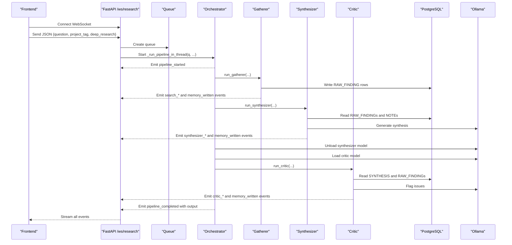

**Diagram sources**
- [main.py:71-110](file://backend/main.py#L71-L110)
- [orchestrator.py:12-94](file://backend/orchestrator.py#L12-L94)
- [gatherer.py:91-152](file://backend/gatherer.py#L91-L152)
- [synthesizer.py:31-101](file://backend/synthesizer.py#L31-L101)
- [critic.py:33-122](file://backend/critic.py#L33-L122)
- [read_write_action.py:14-100](file://backend/read_write_action.py#L14-L100)
- [ollama_services.py:1-26](file://backend/ollama_services.py#L1-L26)

## Detailed Component Analysis

### WebSocket Endpoint and Streaming
- Accepts connections at /ws/research, validates request body using Pydantic, and starts a background thread to run the orchestrator.
- Streams events by reading from a queue until a sentinel None is received or the client disconnects.
- Emits pipeline_error for invalid requests and ensures graceful close.

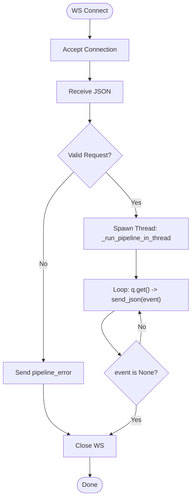

**Diagram sources**
- [main.py:71-110](file://backend/main.py#L71-L110)

**Section sources**
- [main.py:23-46](file://backend/main.py#L23-L46)
- [main.py:71-110](file://backend/main.py#L71-L110)

### Orchestrator Pipeline
- Emits pipeline_started, then sequentially runs Gatherer, Synthesizer, and Critic.
- Manages model swaps: unloads synthesizer model, pre-warms critic model, measures load times, and emits model lifecycle events.
- Collects final output and emits pipeline_completed with processed_info and flagged_items.

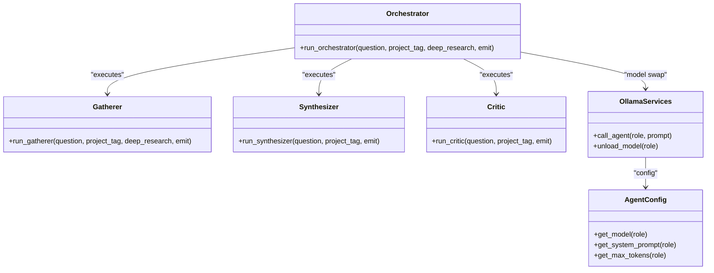

**Diagram sources**
- [orchestrator.py:12-94](file://backend/orchestrator.py#L12-L94)
- [ollama_services.py:1-26](file://backend/ollama_services.py#L1-L26)
- [agent_config.py:104-111](file://backend/agent_config.py#L104-L111)

**Section sources**
- [orchestrator.py:12-94](file://backend/orchestrator.py#L12-L94)

### Gatherer Agent
- Performs web search with DDGS, fetches and extracts text, calls LLM to extract FACT lines, writes RAW_FINDING rows, and emits detailed source-level events.
- Implements retry logic with reserve pool: if a primary source fails hard, tries one replacement; otherwise emits source_exhausted.

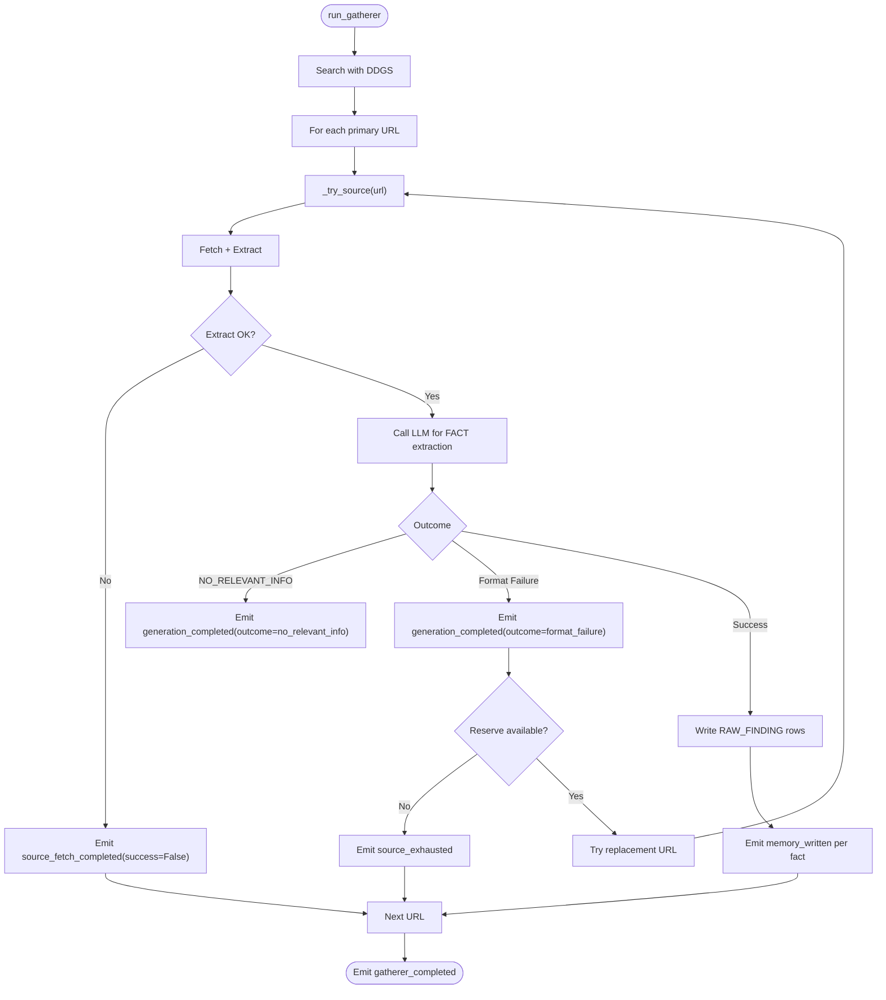

**Diagram sources**
- [gatherer.py:91-152](file://backend/gatherer.py#L91-L152)

**Section sources**
- [gatherer.py:12-89](file://backend/gatherer.py#L12-L89)
- [gatherer.py:91-152](file://backend/gatherer.py#L91-L152)

### Synthesizer Agent
- Computes adaptive limit based on available RAW_FINDINGs and fixed budget for NOTEs.
- Retrieves relevant data, builds prompt, calls LLM, supersedes previous SYNTHESIS rows, writes new SYNTHESIS, and emits lifecycle events.

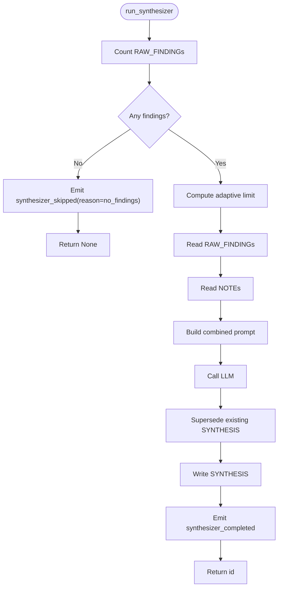

**Diagram sources**
- [synthesizer.py:31-101](file://backend/synthesizer.py#L31-L101)

**Section sources**
- [synthesizer.py:31-101](file://backend/synthesizer.py#L31-L101)

### Critic Agent
- Reads SYNTHESIS and RAW_FINDINGs (plus NOTEs), calls LLM to identify issues, writes FLAGGED rows linked to the synthesis, and emits lifecycle events.
- Handles NO_ISSUES and format failures gracefully.

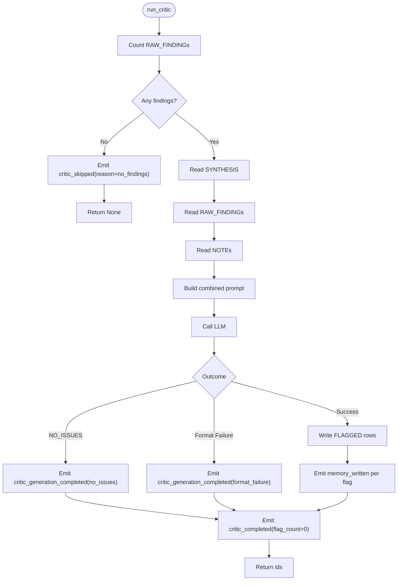

**Diagram sources**
- [critic.py:33-122](file://backend/critic.py#L33-L122)

**Section sources**
- [critic.py:33-122](file://backend/critic.py#L33-L122)

### Database Layer (PostgreSQL + pgvector)
- Embeds queries using HuggingFace embeddings and performs vector similarity searches.
- Persists structured memories with metadata and supports counting and superseding records.

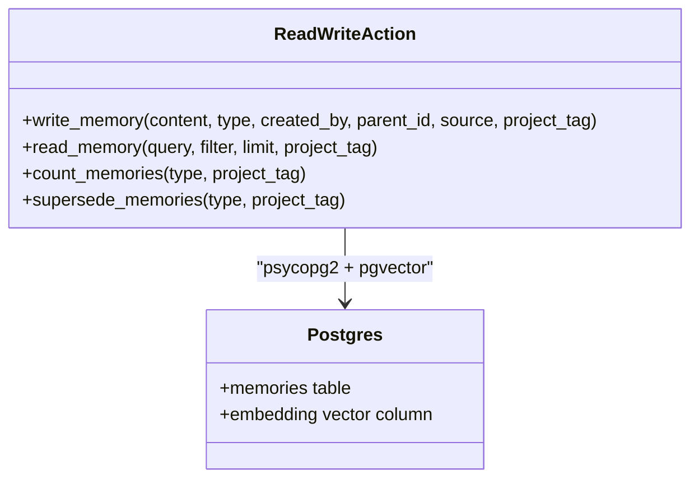

**Diagram sources**
- [read_write_action.py:14-100](file://backend/read_write_action.py#L14-L100)

**Section sources**
- [read_write_action.py:14-100](file://backend/read_write_action.py#L14-L100)

### Event Emitter and Protocol
- All agents and the orchestrator use a centralized emit_event helper to produce consistent event dictionaries with type, timestamp, and data fields.
- Frontend defines event type constants aligned with backend emissions.

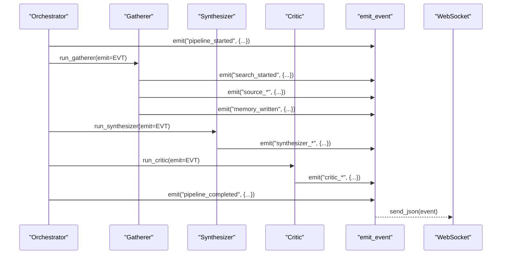

**Diagram sources**
- [ws_events.py:1-14](file://backend/ws_events.py#L1-L14)
- [orchestrator.py:12-94](file://backend/orchestrator.py#L12-L94)
- [gatherer.py:91-152](file://backend/gatherer.py#L91-L152)
- [synthesizer.py:31-101](file://backend/synthesizer.py#L31-L101)
- [critic.py:33-122](file://backend/critic.py#L33-L122)

**Section sources**
- [ws_events.py:1-14](file://backend/ws_events.py#L1-L14)
- [wsEventTypes.js:1-45](file://frontend/src/utils/wsEventTypes.js#L1-L45)

### Frontend State Mapping (Zustand)
- The store exposes fields for scene, crystal state, pipeline stage, errors, inputs, results, data shards, scan line, VRAM swapping, and chat messages.
- Incoming WebSocket events should be mapped to setters such as setPipelineStage, setPipelineError, addShard, updateShard, removeShard, setResults, and setVramSwapping to reflect real-time progress and outcomes.

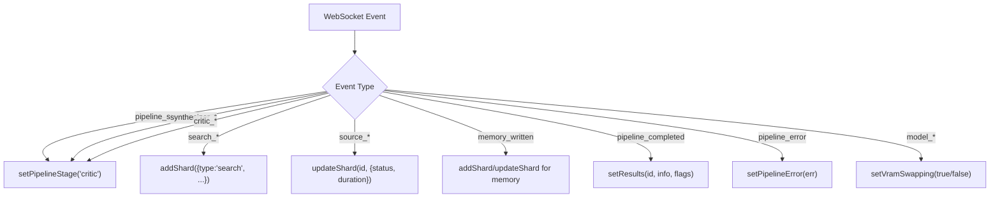

**Diagram sources**
- [atlasStore.js:1-84](file://frontend/src/store/atlasStore.js#L1-L84)
- [wsEventTypes.js:1-45](file://frontend/src/utils/wsEventTypes.js#L1-L45)

**Section sources**
- [atlasStore.js:1-84](file://frontend/src/store/atlasStore.js#L1-L84)
- [wsEventTypes.js:1-45](file://frontend/src/utils/wsEventTypes.js#L1-L45)

## Dependency Analysis
The backend components have clear dependencies:
- Orchestrator depends on agents and LLM services.
- Agents depend on read_write_action for DB operations and ollama_services for LLM calls.
- read_write_action depends on psycopg2 and pgvector for embedding and querying.
- ws_events provides a shared event emission mechanism used across the pipeline.

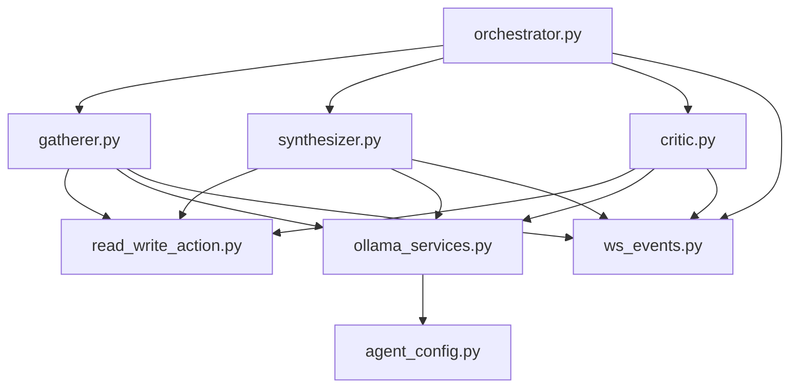

**Diagram sources**
- [orchestrator.py:1-98](file://backend/orchestrator.py#L1-L98)
- [gatherer.py:1-152](file://backend/gatherer.py#L1-L152)
- [synthesizer.py:1-101](file://backend/synthesizer.py#L1-L101)
- [critic.py:1-122](file://backend/critic.py#L1-L122)
- [read_write_action.py:1-100](file://backend/read_write_action.py#L1-L100)
- [ollama_services.py:1-26](file://backend/ollama_services.py#L1-L26)
- [agent_config.py:1-111](file://backend/agent_config.py#L1-L111)
- [ws_events.py:1-14](file://backend/ws_events.py#L1-L14)

**Section sources**
- [orchestrator.py:1-98](file://backend/orchestrator.py#L1-L98)
- [gatherer.py:1-152](file://backend/gatherer.py#L1-L152)
- [synthesizer.py:1-101](file://backend/synthesizer.py#L1-L101)
- [critic.py:1-122](file://backend/critic.py#L1-L122)
- [read_write_action.py:1-100](file://backend/read_write_action.py#L1-L100)
- [ollama_services.py:1-26](file://backend/ollama_services.py#L1-L26)
- [agent_config.py:1-111](file://backend/agent_config.py#L1-L111)
- [ws_events.py:1-14](file://backend/ws_events.py#L1-L14)

## Performance Considerations
- Model lifecycle management: The orchestrator explicitly unloads and loads models to minimize VRAM usage and measure warm-up time separately from generation time.
- Adaptive limits: Synthesizer and Critic compute limits based on available findings to balance throughput and context size.
- Embedding overhead: read_write_action loads an embedding model once at import time; subsequent queries reuse it.
- Queue-based streaming: Using a queue decouples blocking agent execution from the async event loop, preventing stalls.

[No sources needed since this section provides general guidance]

## Troubleshooting Guide
Common issues and recovery strategies:
- Invalid request validation: The WebSocket handler sends a pipeline_error event and closes the connection when the request body fails validation.
- Early client disconnect: If the client disconnects, the background pipeline continues to completion; events are simply not consumed.
- Source failures: Gatherer emits source_fetch_completed with success=false and may try a reserve URL; if both fail, it emits source_exhausted.
- Format failures: Both Gatherer and Critic check for expected prefixes ("FACT:" and "FLAG:") and emit generation_completed with outcome indicating failure.
- Empty pipelines: Orchestrator emits pipeline_stopped with reasons like gatherer_empty, synthesizer_none, or critic_none when intermediate steps return no results.
- Memory operations: Errors in DB operations will propagate up; ensure connectivity and correct credentials.

**Section sources**
- [main.py:76-83](file://backend/main.py#L76-L83)
- [gatherer.py:27-38](file://backend/gatherer.py#L27-L38)
- [gatherer.py:127-144](file://backend/gatherer.py#L127-L144)
- [synthesizer.py:38-41](file://backend/synthesizer.py#L38-L41)
- [critic.py:91-101](file://backend/critic.py#L91-L101)
- [orchestrator.py:25-41](file://backend/orchestrator.py#L25-L41)
- [orchestrator.py:75-78](file://backend/orchestrator.py#L75-L78)

## Conclusion
Atlas Research implements a robust, event-driven research pipeline with clear separation of concerns: a FastAPI WebSocket endpoint streams real-time progress, an orchestrator coordinates agents, and specialized agents handle gathering, synthesis, and critique. The database layer persists structured memories with embeddings for semantic retrieval. Error handling and retries ensure resilience, while model lifecycle management optimizes resource usage. The frontend’s event types and Zustand store enable responsive UI updates driven by backend events.