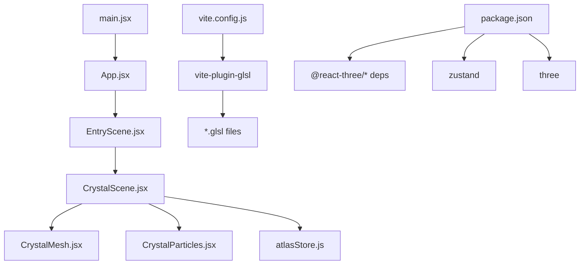
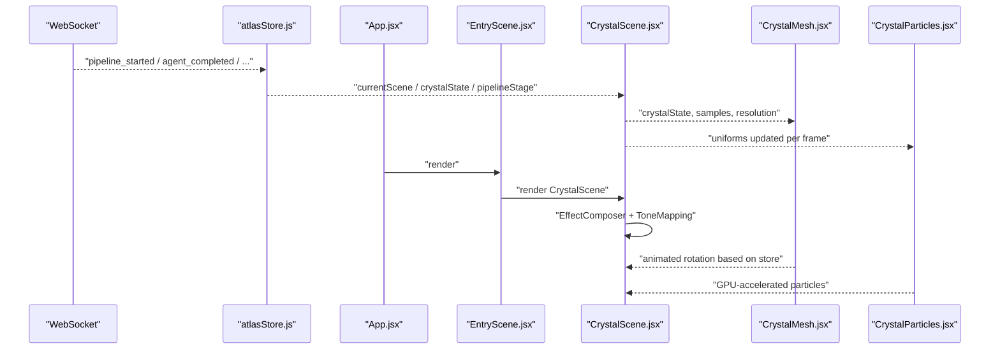
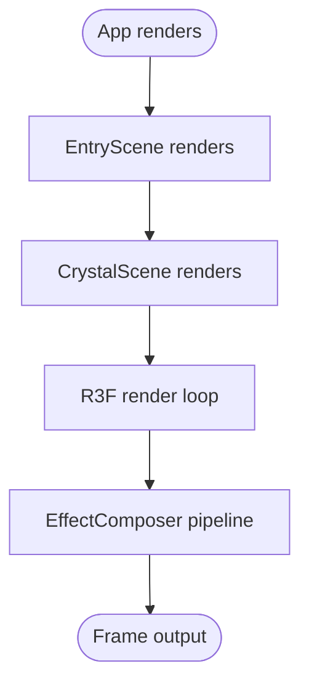
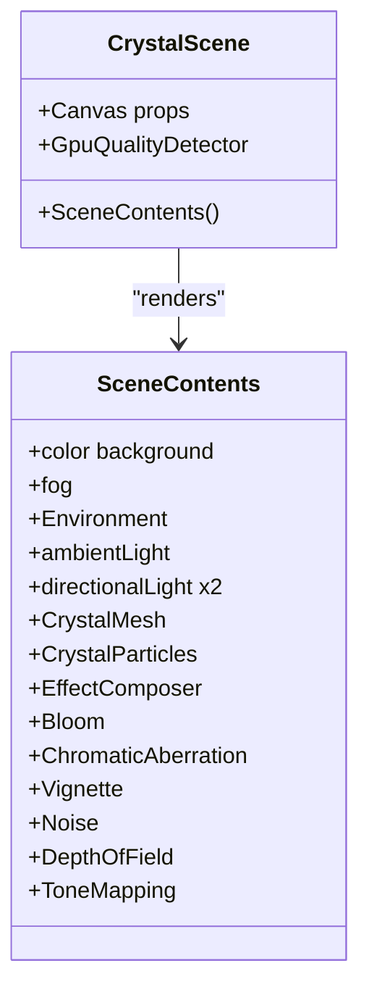
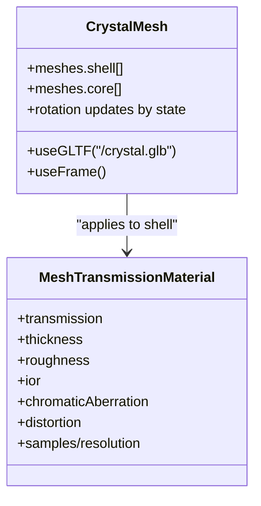
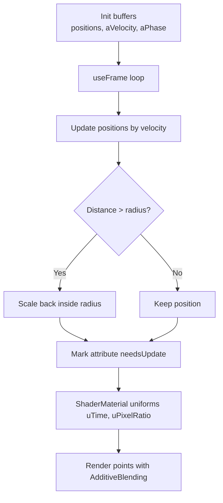
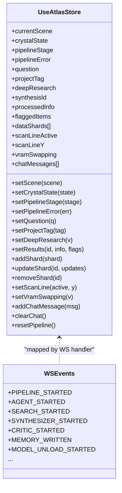
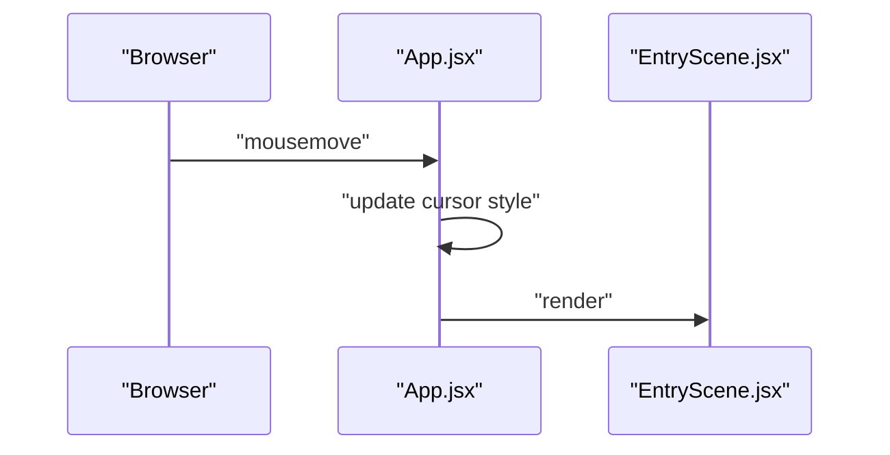
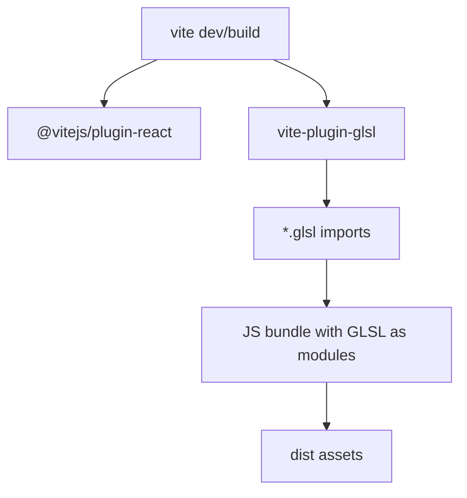
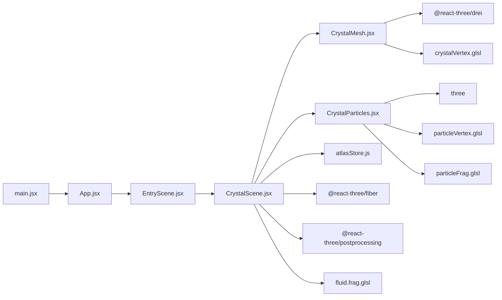

# Frontend Architecture

<cite>
**Referenced Files in This Document**
- [App.jsx](file://frontend/src/App.jsx)
- [EntryScene.jsx](file://frontend/src/scenes/EntryScene.jsx)
- [CrystalScene.jsx](file://frontend/src/components/crystal/CrystalScene.jsx)
- [CrystalMesh.jsx](file://frontend/src/components/crystal/CrystalMesh.jsx)
- [CrystalParticles.jsx](file://frontend/src/components/crystal/CrystalParticles.jsx)
- [atlasStore.js](file://frontend/src/store/atlasStore.js)
- [wsEventTypes.js](file://frontend/src/utils/wsEventTypes.js)
- [vite.config.js](file://frontend/vite.config.js)
- [package.json](file://frontend/package.json)
- [particleVertex.glsl](file://frontend/src/components/crystal/shaders/particleVertex.glsl)
- [particleFrag.glsl](file://frontend/src/components/crystal/shaders/particleFrag.glsl)
- [crystalVertex.glsl](file://frontend/src/components/crystal/shaders/crystalVertex.glsl)
- [fluid.frag.glsl](file://frontend/src/components/crystal/shaders/fluid.frag.glsl)
- [main.jsx](file://frontend/src/main.jsx)
</cite>

## Table of Contents
1. Introduction
2. Project Structure
3. Core Components
4. Architecture Overview
5. Detailed Component Analysis
6. Dependency Analysis
7. Performance Considerations
8. Troubleshooting Guide
9. Conclusion

## Introduction
This document describes the Atlas Research frontend architecture, focusing on the React component hierarchy built on Three.js for 3D visualization, the scene management system (EntryScene and CrystalScene), Zustand-based state synchronization with WebSocket events, component composition orchestrated by App.jsx, integration between React and Three.js WebGL rendering including custom GLSL shaders, and Vite build configuration for shader processing and asset optimization.

## Project Structure
The frontend is a React application using Vite as the build tool. Three.js rendering is provided via @react-three/fiber and @react-three/drei, with post-processing effects from @react-three/postprocessing. State is managed centrally with Zustand. Custom GLSL shaders are imported directly and processed by vite-plugin-glsl.

**Diagram sources**
- [main.jsx:1-11](file://frontend/src/main.jsx#L1-L11)
- [App.jsx:1-42](file://frontend/src/App.jsx#L1-L42)
- [EntryScene.jsx:1-8](file://frontend/src/scenes/EntryScene.jsx#L1-L8)
- [CrystalScene.jsx:1-116](file://frontend/src/components/crystal/CrystalScene.jsx#L1-L116)
- [CrystalMesh.jsx:1-103](file://frontend/src/components/crystal/CrystalMesh.jsx#L1-L103)
- [CrystalParticles.jsx:1-130](file://frontend/src/components/crystal/CrystalParticles.jsx#L1-L130)
- [atlasStore.js:1-84](file://frontend/src/store/atlasStore.js#L1-L84)
- [vite.config.js:1-8](file://frontend/vite.config.js#L1-L8)
- [package.json:1-35](file://frontend/package.json#L1-L35)

**Section sources**
- [main.jsx:1-11](file://frontend/src/main.jsx#L1-L11)
- [App.jsx:1-42](file://frontend/src/App.jsx#L1-L42)
- [EntryScene.jsx:1-8](file://frontend/src/scenes/EntryScene.jsx#L1-L8)
- [CrystalScene.jsx:1-116](file://frontend/src/components/crystal/CrystalScene.jsx#L1-L116)
- [CrystalMesh.jsx:1-103](file://frontend/src/components/crystal/CrystalMesh.jsx#L1-L103)
- [CrystalParticles.jsx:1-130](file://frontend/src/components/crystal/CrystalParticles.jsx#L1-L130)
- [atlasStore.js:1-84](file://frontend/src/store/atlasStore.js#L1-L84)
- [vite.config.js:1-8](file://frontend/vite.config.js#L1-L8)
- [package.json:1-35](file://frontend/package.json#L1-L35)

## Core Components
- EntryScene: A thin wrapper that currently renders the full 3D crystal experience via CrystalScene. It serves as the entry point for scene composition and future overlays (e.g., ring text, input).
- CrystalScene: The core Three.js Canvas setup, environment, lighting, post-processing, GPU quality detection, and orchestration of CrystalMesh and CrystalParticles. It subscribes to Zustand store values to drive visual behavior.
- CrystalMesh: Loads a glTF model, splits geometry into shell and core parts, applies MeshTransmissionMaterial for glass-like refraction, and animates rotation based on crystalState and user input.
- CrystalParticles: A high-performance particle system driven by custom vertex and fragment shaders, updating positions per frame and using additive blending for glow.

Key responsibilities:
- Scene composition and lifecycle: EntryScene -> CrystalScene
- Rendering pipeline: Canvas -> Lights/Environment -> Effects -> ToneMapping
- Data-driven visuals: Zustand store fields control animation intensity, effect toggles, and state transitions
- Shader integration: GLSL modules imported and used in shaderMaterial

**Section sources**
- [EntryScene.jsx:1-8](file://frontend/src/scenes/EntryScene.jsx#L1-L8)
- [CrystalScene.jsx:1-116](file://frontend/src/components/crystal/CrystalScene.jsx#L1-L116)
- [CrystalMesh.jsx:1-103](file://frontend/src/components/crystal/CrystalMesh.jsx#L1-L103)
- [CrystalParticles.jsx:1-130](file://frontend/src/components/crystal/CrystalParticles.jsx#L1-L130)

## Architecture Overview
The frontend follows an event-driven architecture where WebSocket messages update a centralized Zustand store. Components subscribe to relevant slices of state and reactively re-render or animate accordingly. The 3D scene is encapsulated within React components using @react-three/fiber, which manages the render loop and GPU resources declaratively.

**Diagram sources**
- [atlasStore.js:1-84](file://frontend/src/store/atlasStore.js#L1-L84)
- [App.jsx:1-42](file://frontend/src/App.jsx#L1-L42)
- [EntryScene.jsx:1-8](file://frontend/src/scenes/EntryScene.jsx#L1-L8)
- [CrystalScene.jsx:1-116](file://frontend/src/components/crystal/CrystalScene.jsx#L1-L116)
- [CrystalMesh.jsx:1-103](file://frontend/src/components/crystal/CrystalMesh.jsx#L1-L103)
- [CrystalParticles.jsx:1-130](file://frontend/src/components/crystal/CrystalParticles.jsx#L1-L130)

## Detailed Component Analysis

### EntryScene and Scene Management
EntryScene composes the current scene. Currently it renders CrystalScene, providing a clear extension point for additional UI overlays or scene switching logic. Future phases can add HTML overlays or transition logic while keeping the 3D layer isolated.

**Diagram sources**
- [App.jsx:1-42](file://frontend/src/App.jsx#L1-L42)
- [EntryScene.jsx:1-8](file://frontend/src/scenes/EntryScene.jsx#L1-L8)
- [CrystalScene.jsx:1-116](file://frontend/src/components/crystal/CrystalScene.jsx#L1-L116)

**Section sources**
- [EntryScene.jsx:1-8](file://frontend/src/scenes/EntryScene.jsx#L1-L8)

### CrystalScene: Three.js Integration and Post-Processing
CrystalScene sets up the R3F Canvas, environment map, lighting, and post-processing stack. It detects GPU capabilities to adjust sampling and resolution for performance. Depth-of-field and other effects are conditionally enabled based on store state.

Key behaviors:
- Canvas configuration: antialiasing, tone mapping, DPR range, camera FOV and position
- Environment and lighting: HDR environment, ambient and directional lights
- Effect chain: Bloom, Chromatic Aberration, Vignette, Noise, DepthOfField, ToneMapping
- Quality adaptation: Low-end GPU path reduces multisampling and effect resolution

**Diagram sources**
- [CrystalScene.jsx:1-116](file://frontend/src/components/crystal/CrystalScene.jsx#L1-L116)

**Section sources**
- [CrystalScene.jsx:1-116](file://frontend/src/components/crystal/CrystalScene.jsx#L1-L116)

### CrystalMesh: Model Loading, Materials, and Animation
CrystalMesh loads a glTF model, clones the scene graph, and separates shell and core meshes. Shell uses MeshTransmissionMaterial for realistic refraction; core uses emissive standard material. Rotation speed adapts to crystalState and user input length.

**Diagram sources**
- [CrystalMesh.jsx:1-103](file://frontend/src/components/crystal/CrystalMesh.jsx#L1-L103)

**Section sources**
- [CrystalMesh.jsx:1-103](file://frontend/src/components/crystal/CrystalMesh.jsx#L1-L103)

### CrystalParticles: Custom Shaders and GPU Updates
CrystalParticles creates a buffer of points with per-particle velocity and phase attributes. Each frame, positions are updated on CPU and marked for GPU upload. Vertex shader computes color and alpha based on velocity magnitude and time; fragment shader renders soft glowing circles with additive blending.

**Diagram sources**
- [CrystalParticles.jsx:1-130](file://frontend/src/components/crystal/CrystalParticles.jsx#L1-L130)
- [particleVertex.glsl:1-33](file://frontend/src/components/crystal/shaders/particleVertex.glsl#L1-L33)
- [particleFrag.glsl:1-19](file://frontend/src/components/crystal/shaders/particleFrag.glsl#L1-L19)

**Section sources**
- [CrystalParticles.jsx:1-130](file://frontend/src/components/crystal/CrystalParticles.jsx#L1-L130)
- [particleVertex.glsl:1-33](file://frontend/src/components/crystal/shaders/particleVertex.glsl#L1-L33)
- [particleFrag.glsl:1-19](file://frontend/src/components/crystal/shaders/particleFrag.glsl#L1-L19)

### Zustand State Management and WebSocket Event Synchronization
atlasStore centralizes all UI-relevant state: current scene, crystal state, pipeline stage, results, data shards, chat messages, and flags like scan line and VRAM swapping. Actions expose setters and batched updates. wsEventTypes enumerates backend WebSocket event names, enabling consistent mapping in a WebSocket handler (not shown here) to dispatch store updates.

**Diagram sources**
- [atlasStore.js:1-84](file://frontend/src/store/atlasStore.js#L1-L84)
- [wsEventTypes.js:1-45](file://frontend/src/utils/wsEventTypes.js#L1-L45)

**Section sources**
- [atlasStore.js:1-84](file://frontend/src/store/atlasStore.js#L1-L84)
- [wsEventTypes.js:1-45](file://frontend/src/utils/wsEventTypes.js#L1-L45)

### App.jsx Orchestration and Custom Cursor
App.jsx mounts EntryScene and implements a lightweight custom cursor overlay that tracks mouse movement. This keeps the 3D canvas free of default cursors and provides a consistent UX across scenes.

**Diagram sources**
- [App.jsx:1-42](file://frontend/src/App.jsx#L1-L42)
- [EntryScene.jsx:1-8](file://frontend/src/scenes/EntryScene.jsx#L1-L8)

**Section sources**
- [App.jsx:1-42](file://frontend/src/App.jsx#L1-L42)

### Build Configuration with Vite and GLSL Shaders
Vite config enables the React plugin and vite-plugin-glsl to import .glsl files as JavaScript modules. This allows direct usage of GLSL code in shaderMaterial and ensures proper bundling and minification. package.json lists dependencies for Three.js ecosystem and Zustand.

**Diagram sources**
- [vite.config.js:1-8](file://frontend/vite.config.js#L1-L8)
- [package.json:1-35](file://frontend/package.json#L1-L35)

**Section sources**
- [vite.config.js:1-8](file://frontend/vite.config.js#L1-L8)
- [package.json:1-35](file://frontend/package.json#L1-L35)

## Dependency Analysis
The following diagram maps key runtime dependencies among components and libraries.

**Diagram sources**
- [main.jsx:1-11](file://frontend/src/main.jsx#L1-L11)
- [App.jsx:1-42](file://frontend/src/App.jsx#L1-L42)
- [EntryScene.jsx:1-8](file://frontend/src/scenes/EntryScene.jsx#L1-L8)
- [CrystalScene.jsx:1-116](file://frontend/src/components/crystal/CrystalScene.jsx#L1-L116)
- [CrystalMesh.jsx:1-103](file://frontend/src/components/crystal/CrystalMesh.jsx#L1-L103)
- [CrystalParticles.jsx:1-130](file://frontend/src/components/crystal/CrystalParticles.jsx#L1-L130)
- [atlasStore.js:1-84](file://frontend/src/store/atlasStore.js#L1-L84)
- [particleVertex.glsl:1-33](file://frontend/src/components/crystal/shaders/particleVertex.glsl#L1-L33)
- [particleFrag.glsl:1-19](file://frontend/src/components/crystal/shaders/particleFrag.glsl#L1-L19)
- [crystalVertex.glsl:1-87](file://frontend/src/components/crystal/shaders/crystalVertex.glsl#L1-L87)
- [fluid.frag.glsl:1-106](file://frontend/src/components/crystal/shaders/fluid.frag.glsl#L1-L106)

**Section sources**
- [CrystalScene.jsx:1-116](file://frontend/src/components/crystal/CrystalScene.jsx#L1-L116)
- [CrystalMesh.jsx:1-103](file://frontend/src/components/crystal/CrystalMesh.jsx#L1-L103)
- [CrystalParticles.jsx:1-130](file://frontend/src/components/crystal/CrystalParticles.jsx#L1-L130)
- [atlasStore.js:1-84](file://frontend/src/store/atlasStore.js#L1-L84)

## Performance Considerations
- GPU quality detection: CrystalScene adapts multisampling and effect resolution based on MAX_TEXTURE_SIZE to maintain smooth framerates on low-end devices.
- Post-processing cost: Bloom, ChromaticAberration, Vignette, Noise, and DepthOfField contribute to GPU load; consider disabling or reducing parameters on constrained hardware.
- Transmission material: MeshTransmissionMaterial is expensive; samples and resolution are tuned per device capability.
- Particle updates: Position updates occur every frame; ensure attribute updates are minimal and reuse arrays where possible.
- Tone mapping: ACES Filmic applied at the end of the EffectComposer chain; avoid redundant tone mapping elsewhere.

[No sources needed since this section provides general guidance]

## Troubleshooting Guide
- Shaders not compiling: Ensure vite-plugin-glsl is enabled and .glsl files are imported correctly. Check browser console for GLSL compilation errors.
- Poor performance: Reduce EffectComposer passes, lower samples/resolution for transmission, disable DepthOfField on low-end GPUs.
- State not reflecting: Verify WebSocket handler maps incoming events to correct store actions. Confirm selectors in components match store keys.
- Memory leaks: Dispose geometries and materials in cleanup hooks when unmounting particle systems or dynamic meshes.

**Section sources**
- [vite.config.js:1-8](file://frontend/vite.config.js#L1-L8)
- [CrystalParticles.jsx:1-130](file://frontend/src/components/crystal/CrystalParticles.jsx#L1-L130)
- [CrystalScene.jsx:1-116](file://frontend/src/components/crystal/CrystalScene.jsx#L1-L116)
- [atlasStore.js:1-84](file://frontend/src/store/atlasStore.js#L1-L84)

## Conclusion
The Atlas Research frontend combines React, Three.js, and Zustand to deliver an interactive 3D visualization with robust state synchronization and shader-driven effects. EntryScene and CrystalScene encapsulate scene composition and rendering, while Zustand centralizes state for event-driven updates. Vite and vite-plugin-glsl streamline shader integration and asset optimization. This architecture supports scalable scene expansion, performance tuning, and seamless integration with backend WebSocket events.

[No sources needed since this section summarizes without analyzing specific files]