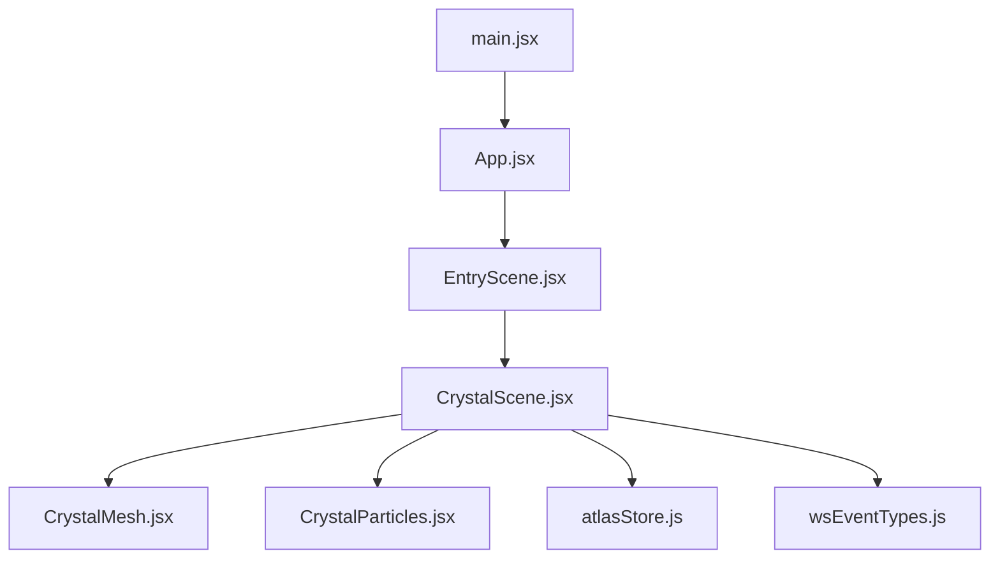
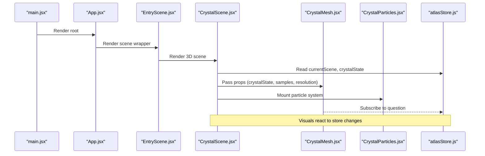
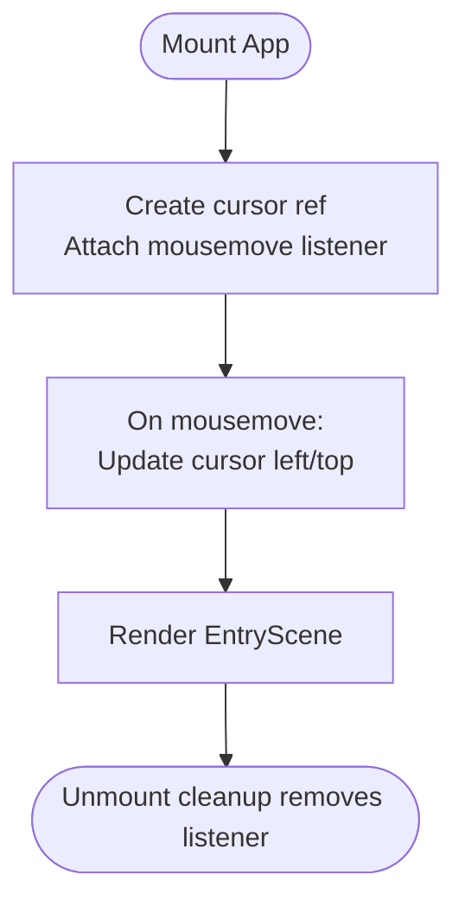
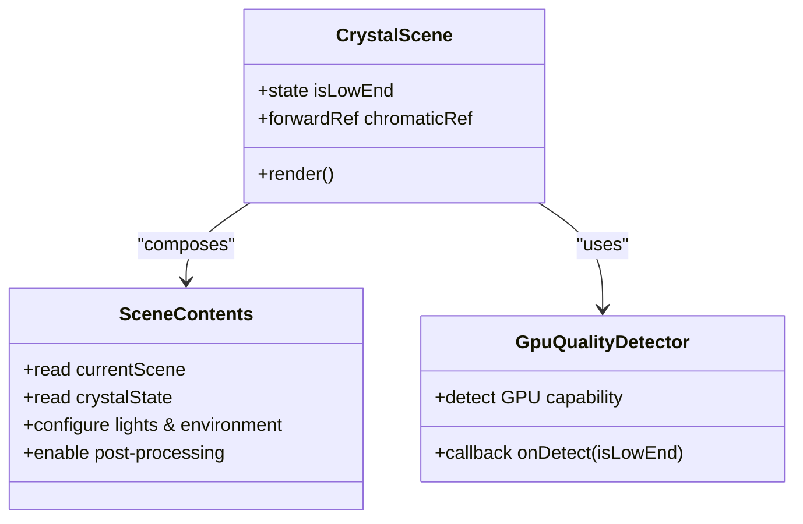
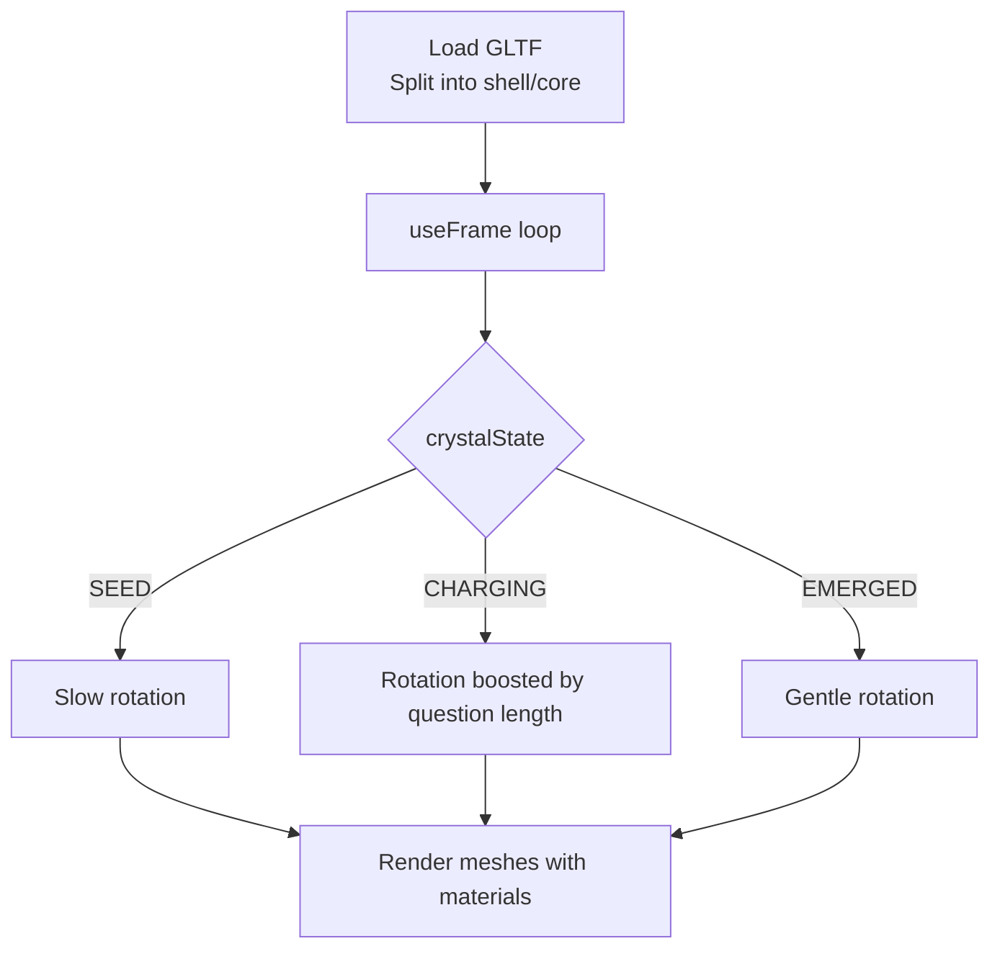
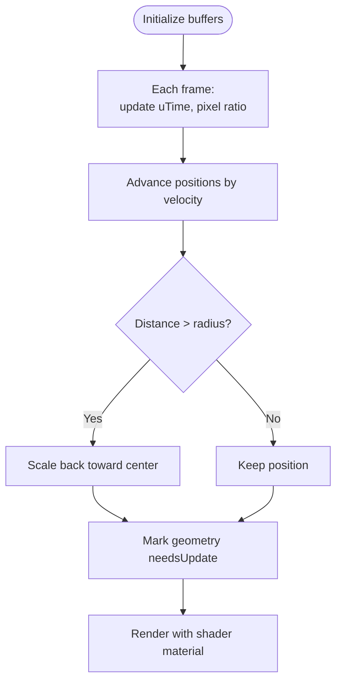
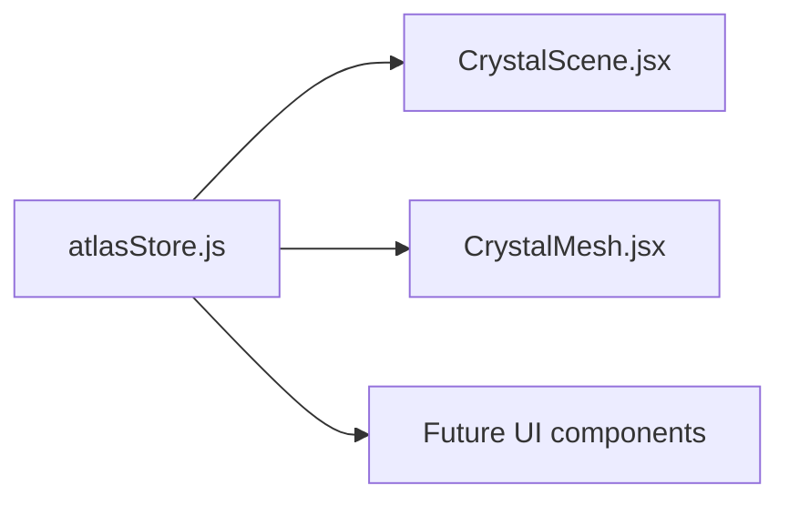
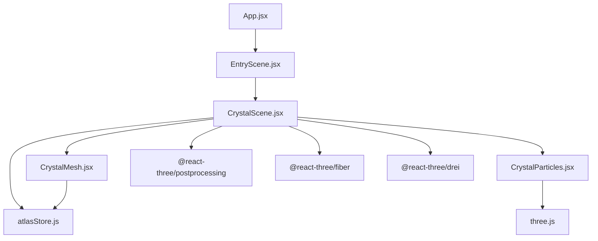

# React Component Hierarchy

<cite>
**Referenced Files in This Document**
- [main.jsx](file://frontend/src/main.jsx)
- [App.jsx](file://frontend/src/App.jsx)
- [EntryScene.jsx](file://frontend/src/scenes/EntryScene.jsx)
- [CrystalScene.jsx](file://frontend/src/components/crystal/CrystalScene.jsx)
- [CrystalMesh.jsx](file://frontend/src/components/crystal/CrystalMesh.jsx)
- [CrystalParticles.jsx](file://frontend/src/components/crystal/CrystalParticles.jsx)
- [atlasStore.js](file://frontend/src/store/atlasStore.js)
- [wsEventTypes.js](file://frontend/src/utils/wsEventTypes.js)
</cite>

## Table of Contents
1. [Introduction](#introduction)
2. [Project Structure](#project-structure)
3. [Core Components](#core-components)
4. [Architecture Overview](#architecture-overview)
5. [Detailed Component Analysis](#detailed-component-analysis)
6. [Dependency Analysis](#dependency-analysis)
7. [Performance Considerations](#performance-considerations)
8. [Troubleshooting Guide](#troubleshooting-guide)
9. [Conclusion](#conclusion)

## Introduction
This document explains the React component hierarchy in Atlas Research with a focus on how App.jsx orchestrates custom cursor behavior and scene composition, how EntryScene acts as the main entry point for the Three.js canvas, and how CrystalScene renders the 3D crystal visualization while handling user interactions. It also covers component composition patterns driven by pipeline state, prop passing between components, event handling patterns, lifecycle management, communication with the global store (Zustand), and how WebSocket events are intended to update visual state.

## Project Structure
The frontend is a React application bootstrapped via Vite. The root component mounts the app, which composes a minimal HTML overlay (custom cursor) and a scene layer that hosts the Three.js canvas. Scenes are composed conditionally based on global pipeline state stored in Zustand.

**Diagram sources**
- [main.jsx:1-11](file://frontend/src/main.jsx#L1-L11)
- [App.jsx:1-42](file://frontend/src/App.jsx#L1-L42)
- [EntryScene.jsx:1-8](file://frontend/src/scenes/EntryScene.jsx#L1-L8)
- [CrystalScene.jsx:1-116](file://frontend/src/components/crystal/CrystalScene.jsx#L1-L116)
- [CrystalMesh.jsx:1-103](file://frontend/src/components/crystal/CrystalMesh.jsx#L1-L103)
- [CrystalParticles.jsx:1-130](file://frontend/src/components/crystal/CrystalParticles.jsx#L1-L130)
- [atlasStore.js:1-84](file://frontend/src/store/atlasStore.js#L1-L84)
- [wsEventTypes.js:1-45](file://frontend/src/utils/wsEventTypes.js#L1-L45)

**Section sources**
- [main.jsx:1-11](file://frontend/src/main.jsx#L1-L11)
- [App.jsx:1-42](file://frontend/src/App.jsx#L1-L42)
- [EntryScene.jsx:1-8](file://frontend/src/scenes/EntryScene.jsx#L1-L8)
- [CrystalScene.jsx:1-116](file://frontend/src/components/crystal/CrystalScene.jsx#L1-L116)
- [CrystalMesh.jsx:1-103](file://frontend/src/components/crystal/CrystalMesh.jsx#L1-L103)
- [CrystalParticles.jsx:1-130](file://frontend/src/components/crystal/CrystalParticles.jsx#L1-L130)
- [atlasStore.js:1-84](file://frontend/src/store/atlasStore.js#L1-L84)
- [wsEventTypes.js:1-45](file://frontend/src/utils/wsEventTypes.js#L1-L45)

## Core Components
- App.jsx: Root component that installs a fixed-position custom cursor element and renders the scene layer. It uses a ref and mousemove listener to track pointer position.
- EntryScene.jsx: Thin wrapper that currently renders the 3D scene; designed to be extended later with additional UI overlays.
- CrystalScene.jsx: Renders the Three.js Canvas, configures lighting, environment, post-processing effects, and composes CrystalMesh and CrystalParticles. It detects GPU capability and adapts effect quality accordingly.
- CrystalMesh.jsx: Loads and transforms a GLTF crystal model into shell and core parts, applies transmission material to the shell, and animates rotation based on crystal state and user input.
- CrystalParticles.jsx: Manages a particle system using custom shaders and updates positions each frame with wrapping logic.
- atlasStore.js: Global Zustand store holding scene state, crystal state, pipeline stage, inputs, results, data shards, chat messages, and utilities to reset or update state.
- wsEventTypes.js: Centralized constants for WebSocket event names used across the application.

**Section sources**
- [App.jsx:1-42](file://frontend/src/App.jsx#L1-L42)
- [EntryScene.jsx:1-8](file://frontend/src/scenes/EntryScene.jsx#L1-L8)
- [CrystalScene.jsx:1-116](file://frontend/src/components/crystal/CrystalScene.jsx#L1-L116)
- [CrystalMesh.jsx:1-103](file://frontend/src/components/crystal/CrystalMesh.jsx#L1-L103)
- [CrystalParticles.jsx:1-130](file://frontend/src/components/crystal/CrystalParticles.jsx#L1-L130)
- [atlasStore.js:1-84](file://frontend/src/store/atlasStore.js#L1-L84)
- [wsEventTypes.js:1-45](file://frontend/src/utils/wsEventTypes.js#L1-L45)

## Architecture Overview
The application follows a layered architecture:
- Presentation Layer: React components render UI and 3D content.
- State Layer: Zustand store provides reactive state consumed by components.
- Integration Layer: WebSocket events (defined in wsEventTypes.js) drive state transitions and visual updates.

**Diagram sources**
- [main.jsx:1-11](file://frontend/src/main.jsx#L1-L11)
- [App.jsx:1-42](file://frontend/src/App.jsx#L1-L42)
- [EntryScene.jsx:1-8](file://frontend/src/scenes/EntryScene.jsx#L1-L8)
- [CrystalScene.jsx:1-116](file://frontend/src/components/crystal/CrystalScene.jsx#L1-L116)
- [CrystalMesh.jsx:1-103](file://frontend/src/components/crystal/CrystalMesh.jsx#L1-L103)
- [CrystalParticles.jsx:1-130](file://frontend/src/components/crystal/CrystalParticles.jsx#L1-L130)
- [atlasStore.js:1-84](file://frontend/src/store/atlasStore.js#L1-L84)

## Detailed Component Analysis

### App.jsx: Root Component and Custom Cursor
Responsibilities:
- Creates a fixed-position custom cursor element tracked via a ref.
- Subscribes to window mousemove events to update cursor position.
- Renders the scene layer (EntryScene).

Key behaviors:
- Lifecycle: useEffect sets up and tears down the mousemove listener.
- Prop passing: No props passed to EntryScene; composition is implicit.
- Event handling: Direct DOM event binding for cursor movement.

**Diagram sources**
- [App.jsx:1-42](file://frontend/src/App.jsx#L1-L42)

**Section sources**
- [App.jsx:1-42](file://frontend/src/App.jsx#L1-L42)

### EntryScene.jsx: Main Entry Point for Scene Orchestration
Responsibilities:
- Serves as the primary scene container.
- Currently renders only the 3D scene (CrystalScene).
- Designed to be extended with additional UI overlays in future phases.

Prop passing:
- None currently; it delegates rendering to CrystalScene.

Lifecycle:
- Minimal; no side effects at this level.

**Section sources**
- [EntryScene.jsx:1-8](file://frontend/src/scenes/EntryScene.jsx#L1-L8)

### CrystalScene.jsx: 3D Scene Composition and Effect Management
Responsibilities:
- Initializes the Three.js Canvas with performance-oriented settings.
- Detects GPU capability and adjusts sampling/resolution for post-processing.
- Composes lighting, environment map, and post-processing effects (Bloom, ChromaticAberration, Vignette, Noise, DepthOfField, ToneMapping).
- Renders CrystalMesh and CrystalParticles.
- Reads currentScene and crystalState from the store to enable/disable effects like DepthOfField.

Key behaviors:
- Lifecycle: useEffect inside GpuQualityDetector reads WebGL context parameters to determine low-end GPUs.
- Prop passing:
  - To CrystalMesh: crystalState, samples, resolution.
  - To EffectComposer: refs for ChromaticAberration and DepthOfField.
- Event handling: Indirectly reacts to store updates; no direct DOM events here.
- Performance: Uses Canvas dpr range, multisampling toggles, and conditional effect enabling.

**Diagram sources**
- [CrystalScene.jsx:1-116](file://frontend/src/components/crystal/CrystalScene.jsx#L1-L116)

**Section sources**
- [CrystalScene.jsx:1-116](file://frontend/src/components/crystal/CrystalScene.jsx#L1-L116)

### CrystalMesh.jsx: 3D Crystal Rendering and Animation
Responsibilities:
- Loads a GLTF model and splits geometry into shell and core meshes.
- Applies MeshTransmissionMaterial to the shell and standard material to the core.
- Animates rotation per frame based on crystalState and user input (question length).
- Preloads the GLTF asset.

Key behaviors:
- Lifecycle: useFrame loop updates rotation; useMemo computes mesh structure once.
- Prop passing: Receives crystalState, samples, resolution; subscribes to question from store.
- Interaction: Rotation speed increases when charging based on question length.

**Diagram sources**
- [CrystalMesh.jsx:1-103](file://frontend/src/components/crystal/CrystalMesh.jsx#L1-L103)

**Section sources**
- [CrystalMesh.jsx:1-103](file://frontend/src/components/crystal/CrystalMesh.jsx#L1-L103)

### CrystalParticles.jsx: Particle System with Custom Shaders
Responsibilities:
- Generates initial positions, velocities, and phases for particles.
- Updates positions each frame with wrap-around logic beyond a radius.
- Uses custom vertex and fragment shaders for rendering with additive blending.

Key behaviors:
- Lifecycle: useFrame updates uniforms and geometry attributes; useEffect disposes resources on unmount.
- Performance: BufferGeometry with typed arrays; frustum culling disabled for full coverage.

**Diagram sources**
- [CrystalParticles.jsx:1-130](file://frontend/src/components/crystal/CrystalParticles.jsx#L1-L130)

**Section sources**
- [CrystalParticles.jsx:1-130](file://frontend/src/components/crystal/CrystalParticles.jsx#L1-L130)

### Global Store and Pipeline State
Responsibilities:
- Holds currentScene, crystalState, pipelineStage, inputs, results, dataShards, chatMessages, and utility functions to update/reset state.
- Provides selectors for components to subscribe to relevant slices of state.

Component integration:
- CrystalScene reads currentScene and crystalState to toggle effects.
- CrystalMesh reads question to influence animation behavior.

**Diagram sources**
- [atlasStore.js:1-84](file://frontend/src/store/atlasStore.js#L1-L84)
- [CrystalScene.jsx:1-116](file://frontend/src/components/crystal/CrystalScene.jsx#L1-L116)
- [CrystalMesh.jsx:1-103](file://frontend/src/components/crystal/CrystalMesh.jsx#L1-L103)

**Section sources**
- [atlasStore.js:1-84](file://frontend/src/store/atlasStore.js#L1-L84)
- [CrystalScene.jsx:1-116](file://frontend/src/components/crystal/CrystalScene.jsx#L1-L116)
- [CrystalMesh.jsx:1-103](file://frontend/src/components/crystal/CrystalMesh.jsx#L1-L103)

### WebSocket Events and Visual State Updates
Integration points:
- wsEventTypes.js centralizes event names for pipeline, agents, gatherer, synthesizer, critic, memory, and VRAM operations.
- Components should subscribe to these events and dispatch actions to atlasStore to update currentScene, crystalState, pipelineStage, and other fields.
- Example flow: On PIPELINE_STARTED, set pipelineStage; on AGENT_COMPLETED, transition crystalState; on SYNTHESIZER_COMPLETED, update synthesisId and processedInfo.

Note: WebSocket subscription and dispatch logic are not present in the analyzed files; integration should occur in a dedicated hook or service layer that updates the store.

**Section sources**
- [wsEventTypes.js:1-45](file://frontend/src/utils/wsEventTypes.js#L1-L45)
- [atlasStore.js:1-84](file://frontend/src/store/atlasStore.js#L1-L84)

## Dependency Analysis
Components depend on:
- @react-three/fiber and @react-three/drei for 3D rendering and helpers.
- @react-three/postprocessing for visual effects.
- three.js for core 3D functionality.
- zustand for global state management.
- Custom shaders for particle rendering.

**Diagram sources**
- [App.jsx:1-42](file://frontend/src/App.jsx#L1-L42)
- [EntryScene.jsx:1-8](file://frontend/src/scenes/EntryScene.jsx#L1-L8)
- [CrystalScene.jsx:1-116](file://frontend/src/components/crystal/CrystalScene.jsx#L1-L116)
- [CrystalMesh.jsx:1-103](file://frontend/src/components/crystal/CrystalMesh.jsx#L1-L103)
- [CrystalParticles.jsx:1-130](file://frontend/src/components/crystal/CrystalParticles.jsx#L1-L130)
- [atlasStore.js:1-84](file://frontend/src/store/atlasStore.js#L1-L84)

**Section sources**
- [App.jsx:1-42](file://frontend/src/App.jsx#L1-L42)
- [EntryScene.jsx:1-8](file://frontend/src/scenes/EntryScene.jsx#L1-L8)
- [CrystalScene.jsx:1-116](file://frontend/src/components/crystal/CrystalScene.jsx#L1-L116)
- [CrystalMesh.jsx:1-103](file://frontend/src/components/crystal/CrystalMesh.jsx#L1-L103)
- [CrystalParticles.jsx:1-130](file://frontend/src/components/crystal/CrystalParticles.jsx#L1-L130)
- [atlasStore.js:1-84](file://frontend/src/store/atlasStore.js#L1-L84)

## Performance Considerations
- GPU detection: Low-end devices reduce multisampling and effect resolution to maintain frame rate.
- Canvas configuration: dpr range and powerPreference optimize rendering performance.
- Post-processing: Conditional enabling of DepthOfField based on scene state avoids unnecessary cost.
- Geometry reuse: useMemo caches mesh structures to avoid recomputation.
- Resource cleanup: Particle system disposes geometry and materials on unmount.

[No sources needed since this section provides general guidance]

## Troubleshooting Guide
Common issues and resolutions:
- Custom cursor not moving: Ensure mousemove listener is attached and ref is valid; check for pointerEvents interference.
- 3D scene not rendering: Verify Canvas props, environment file path, and GLTF preload status.
- Effects too heavy on low-end devices: Confirm GPU detection callback triggers and reduces sampling/resolution.
- State not updating visuals: Ensure components subscribe to correct store slices and that WebSocket handlers dispatch appropriate store updates.
- Memory leaks: Confirm geometry and materials are disposed in cleanup effects.

**Section sources**
- [App.jsx:1-42](file://frontend/src/App.jsx#L1-L42)
- [CrystalScene.jsx:1-116](file://frontend/src/components/crystal/CrystalScene.jsx#L1-L116)
- [CrystalParticles.jsx:1-130](file://frontend/src/components/crystal/CrystalParticles.jsx#L1-L130)
- [atlasStore.js:1-84](file://frontend/src/store/atlasStore.js#L1-L84)

## Conclusion
Atlas Research’s React component hierarchy centers around App.jsx for UI-level concerns (custom cursor), EntryScene.jsx as the scene entry point, and CrystalScene.jsx orchestrating the 3D rendering pipeline. CrystalMesh.jsx and CrystalParticles.jsx handle detailed 3D visuals and animations, all driven by a centralized Zustand store. While WebSocket event types are defined, their integration should update the store to reflect pipeline progress and trigger visual transitions. The design balances performance through adaptive quality settings and careful resource management, ensuring smooth interactions and responsive visuals.