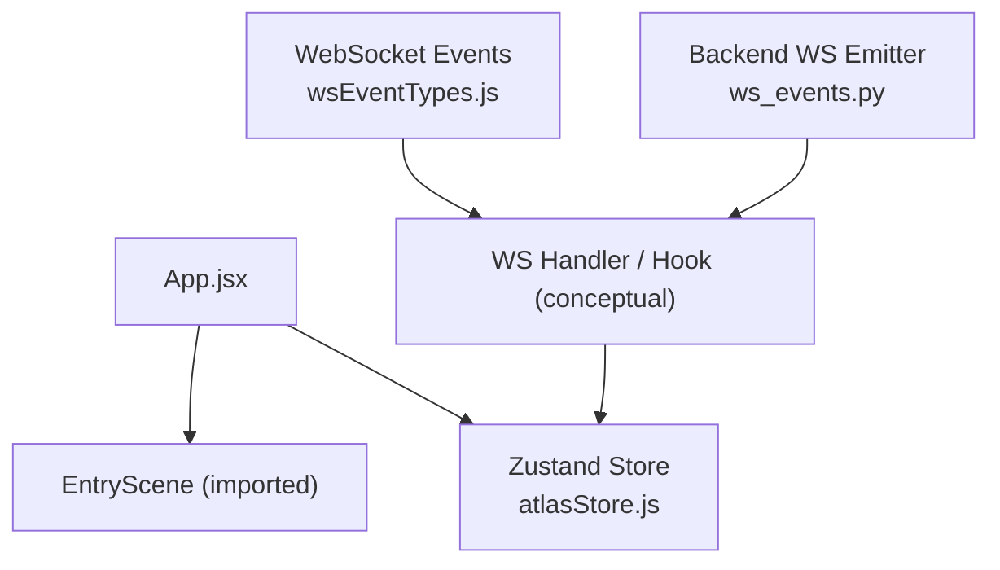
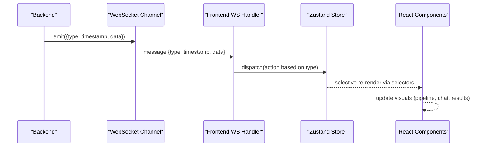
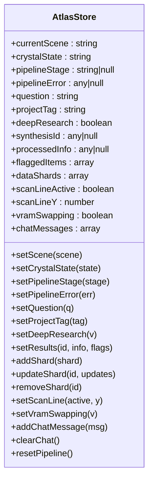
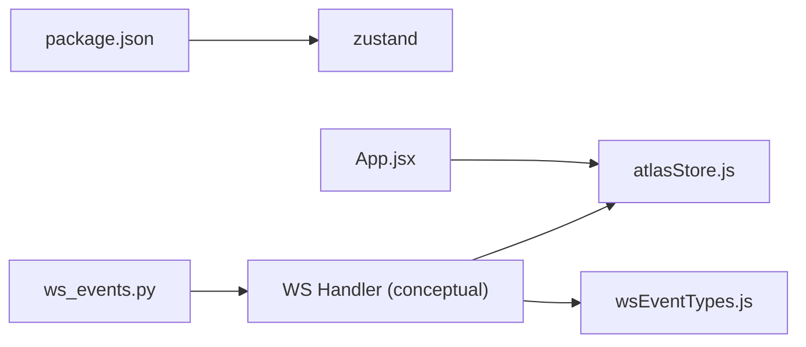

# State Management with Zustand

<cite>
**Referenced Files in This Document**
- [atlasStore.js](file://frontend/src/store/atlasStore.js)
- [wsEventTypes.js](file://frontend/src/utils/wsEventTypes.js)
- [App.jsx](file://frontend/src/App.jsx)
- [package.json](file://frontend/package.json)
- [ws_events.py](file://backend/ws_events.py)
</cite>

## Table of Contents
1. [Introduction](#introduction)
2. [Project Structure](#project-structure)
3. [Core Components](#core-components)
4. [Architecture Overview](#architecture-overview)
5. [Detailed Component Analysis](#detailed-component-analysis)
6. [Dependency Analysis](#dependency-analysis)
7. [Performance Considerations](#performance-considerations)
8. [Troubleshooting Guide](#troubleshooting-guide)
9. [Conclusion](#conclusion)

## Introduction
This document explains the Zustand-based state management system used by Atlas Research to coordinate the research pipeline, WebSocket-driven events, and UI updates. It focuses on the global store structure, event-driven updates from WebSocket messages, and how components subscribe to changes to render the current scene, pipeline progress, synthesis results, and chat history. It also provides best practices for persistence, performance optimization using selectors, and debugging techniques.

## Project Structure
The frontend is a React application built with Vite and uses Zustand for global state. The core state lives in a single store module, while WebSocket event types are centralized in a utility file. The entry point renders the root component that hosts scenes.

**Diagram sources**
- [App.jsx:1-42](file://frontend/src/App.jsx#L1-L42)
- [atlasStore.js:1-84](file://frontend/src/store/atlasStore.js#L1-L84)
- [wsEventTypes.js:1-45](file://frontend/src/utils/wsEventTypes.js#L1-L45)
- [ws_events.py:1-13](file://backend/ws_events.py#L1-L13)

**Section sources**
- [App.jsx:1-42](file://frontend/src/App.jsx#L1-L42)
- [package.json:10-23](file://frontend/package.json#L10-L23)

## Core Components
The Zustand store defines the entire application state surface area and exposes actions to mutate it. Key areas include:
- Scene control and crystal lifecycle states
- Pipeline stage tracking and error handling
- Input fields for research queries and project tagging
- Results storage for synthesis outputs and flagged items
- Data shards collection with bounded size and update/remove helpers
- Scan line animation state
- VRAM swapping indicator
- Chat message history
- Global reset action

These pieces collectively drive the UI and visualization layers through reactive updates.

**Section sources**
- [atlasStore.js:1-84](file://frontend/src/store/atlasStore.js#L1-L84)

## Architecture Overview
Atlas Research follows an event-driven architecture where backend WebSocket events trigger front-end store updates. The flow is:
- Backend emits structured events via a helper function.
- Frontend receives events and maps them to store actions.
- Store updates propagate to subscribed components, which re-render only the parts they consume.

**Diagram sources**
- [ws_events.py:1-13](file://backend/ws_events.py#L1-L13)
- [wsEventTypes.js:1-45](file://frontend/src/utils/wsEventTypes.js#L1-L45)
- [atlasStore.js:1-84](file://frontend/src/store/atlasStore.js#L1-L84)

## Detailed Component Analysis

### Zustand Store: atlasStore.js
The store encapsulates all global state and actions. It is created once and exported for consumption across the app.

Key responsibilities:
- Scene and crystal state transitions
- Pipeline stage progression and error capture
- User input and configuration flags
- Synthesis results and flagged items
- Data shard management with capacity limits and targeted updates
- Scan line animation toggles
- VRAM swapping status
- Chat message accumulation and clearing
- Full pipeline reset

State categories and their roles:
- Scene and Crystal: Control high-level view transitions and visual metaphors for pipeline phases.
- Pipeline: Track active agent stage and errors.
- Input: Capture user query, project tag, and deep research mode.
- Results: Persist synthesis identifiers, processed content, and flagged elements.
- Data Shards: Maintain a bounded list of incoming facts with add/update/remove operations.
- Scan Line: Drive search visualization.
- VRAM Swapping: Reflect model load/unload activity.
- Chat: Append and clear conversation history.
- Reset: Reinitialize all slices to defaults.

**Diagram sources**
- [atlasStore.js:1-84](file://frontend/src/store/atlasStore.js#L1-L84)

**Section sources**
- [atlasStore.js:1-84](file://frontend/src/store/atlasStore.js#L1-L84)

### WebSocket Event Types: wsEventTypes.js
Centralizes all WebSocket event strings used by the frontend. These constants ensure consistent mapping between backend events and store actions.

Categories:
- Pipeline lifecycle events
- Agent lifecycle events
- Gatherer-specific events
- Synthesizer-specific events
- Critic-specific events
- Memory events
- VRAM model load/unload events

Components or hooks should import these constants when handling incoming messages to dispatch appropriate store actions.

**Section sources**
- [wsEventTypes.js:1-45](file://frontend/src/utils/wsEventTypes.js#L1-L45)

### Backend Event Emission: ws_events.py
Defines a helper to emit structured WebSocket messages containing type, timestamp, and payload data. This ensures consistent event shapes consumed by the frontend.

**Section sources**
- [ws_events.py:1-13](file://backend/ws_events.py#L1-L13)

### Entry Point and App Shell: App.jsx
Renders the root component and includes a minimal overlay element. While not directly managing state, it demonstrates the application shell where scenes and overlays are composed.

**Section sources**
- [App.jsx:1-42](file://frontend/src/App.jsx#L1-L42)

## Dependency Analysis
Zustand is a dependency declared in the package manifest. The store is imported by components and hooks to read and update state. WebSocket event types are imported by handlers to map incoming messages to store actions.

**Diagram sources**
- [package.json:10-23](file://frontend/package.json#L10-L23)
- [atlasStore.js:1-84](file://frontend/src/store/atlasStore.js#L1-L84)
- [wsEventTypes.js:1-45](file://frontend/src/utils/wsEventTypes.js#L1-L45)
- [ws_events.py:1-13](file://backend/ws_events.py#L1-L13)

**Section sources**
- [package.json:10-23](file://frontend/package.json#L10-L23)

## Performance Considerations
- Use selectors to subscribe to specific slices of state rather than the whole store. This minimizes unnecessary re-renders in components.
- Prefer functional updates in store actions to avoid stale closures and reduce redundant work.
- Keep large arrays like dataShards bounded; the store already trims older entries to maintain a fixed size.
- Debounce or throttle frequent updates if needed (e.g., rapid scan line position changes).
- Avoid creating new objects inside frequently called setters; reuse structures where possible.
- For chat history, consider virtualization if the list grows large.

[No sources needed since this section provides general guidance]

## Troubleshooting Guide
Common issues and remedies:
- No UI updates after WebSocket messages:
  - Verify that the handler imports the correct event constants and dispatches the corresponding store actions.
  - Ensure the store actions are invoked with the expected payload shape.
- Stale state in components:
  - Confirm that components use selectors to subscribe to the exact fields they need.
  - Check for accidental object references causing shallow equality mismatches.
- Excessive re-renders:
  - Audit selectors for over-broad subscriptions.
  - Memoize derived values where appropriate.
- Chat not appending:
  - Validate that addChatMessage is called with a valid message object.
  - Ensure clearChat is not inadvertently resetting state at unexpected times.
- Pipeline stuck:
  - Inspect pipelineStage and pipelineError fields to determine the last known state.
  - Use resetPipeline to recover from inconsistent states during development.

[No sources needed since this section provides general guidance]

## Conclusion
The Atlas Research frontend leverages a concise Zustand store to centralize global state for scenes, pipeline progress, results, and chat. WebSocket events are mapped to store actions, enabling a clean separation between transport logic and UI state. By following selector-based subscriptions, bounded data structures, and consistent event typing, the application achieves responsive updates and maintainable architecture.

[No sources needed since this section summarizes without analyzing specific files]