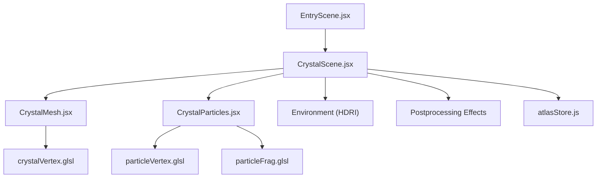
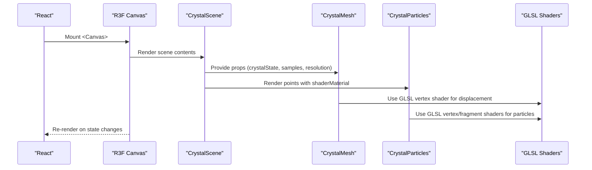
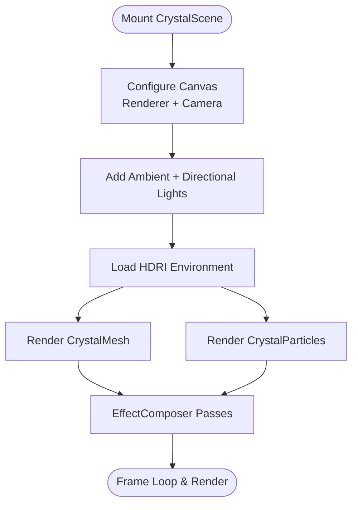
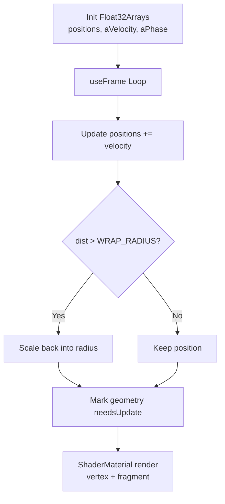
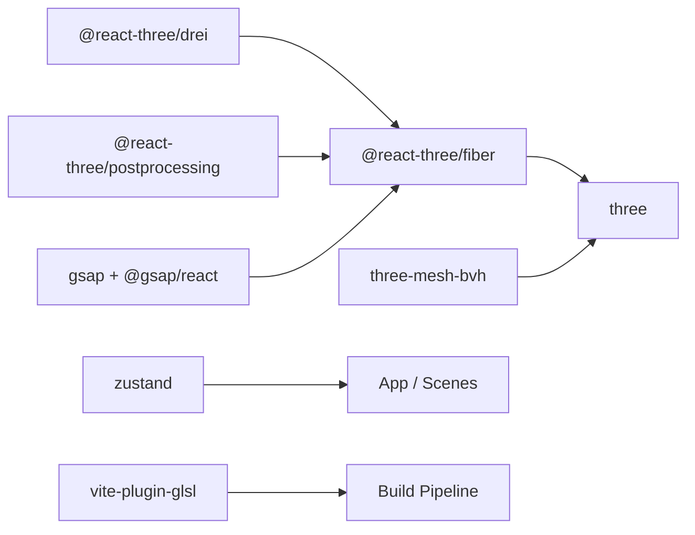

# Three.js Integration and Rendering

<cite>
**Referenced Files in This Document**
- [CrystalScene.jsx](file://frontend/src/components/crystal/CrystalScene.jsx)
- [CrystalMesh.jsx](file://frontend/src/components/crystal/CrystalMesh.jsx)
- [CrystalParticles.jsx](file://frontend/src/components/crystal/CrystalParticles.jsx)
- [particleVertex.glsl](file://frontend/src/components/crystal/shaders/particleVertex.glsl)
- [particleFrag.glsl](file://frontend/src/components/crystal/shaders/particleFrag.glsl)
- [crystalVertex.glsl](file://frontend/src/components/crystal/shaders/crystalVertex.glsl)
- [fluid.frag.glsl](file://frontend/src/components/crystal/shaders/fluid.frag.glsl)
- [frost.frag.glsl](file://frontend/src/components/crystal/shaders/frost.frag.glsl)
- [vite.config.js](file://frontend/vite.config.js)
- [package.json](file://frontend/package.json)
- [EntryScene.jsx](file://frontend/src/scenes/EntryScene.jsx)
- [atlasStore.js](file://frontend/src/store/atlasStore.js)
</cite>

## Table of Contents
1. [Introduction](#introduction)
2. [Project Structure](#project-structure)
3. [Core Components](#core-components)
4. [Architecture Overview](#architecture-overview)
5. [Detailed Component Analysis](#detailed-component-analysis)
6. [Dependency Analysis](#dependency-analysis)
7. [Performance Considerations](#performance-considerations)
8. [Troubleshooting Guide](#troubleshooting-guide)
9. [Conclusion](#conclusion)
10. [Appendices](#appendices)

## Introduction
This document explains how Atlas Research integrates Three.js via React Three Fiber to render interactive 3D visuals. It focuses on:
- How React components bridge to WebGL through React Three Fiber
- The CrystalMesh component for dynamic geometry morphing using GLSL noise
- The CrystalParticles system for GPU-accelerated particle effects
- Shader integration with custom GLSL vertex and fragment shaders
- Build configuration for .glsl files and asset optimization
- Camera setup, lighting, and animation loops
- Performance considerations including instancing, texture loading, and memory management
- User interaction handling and synchronization with research pipeline events

## Project Structure
The 3D rendering is implemented under the frontend’s React application:
- Scene composition and postprocessing are defined in a dedicated scene component
- Visual assets (crystal model and HDRI environment) are loaded at runtime
- Custom GLSL shaders are imported as modules and applied to materials
- Global state drives visual behavior and animations



**Diagram sources**
- [EntryScene.jsx:1-8](file://frontend/src/scenes/EntryScene.jsx#L1-L8)
- [CrystalScene.jsx:1-116](file://frontend/src/components/crystal/CrystalScene.jsx#L1-L116)
- [CrystalMesh.jsx:1-103](file://frontend/src/components/crystal/CrystalMesh.jsx#L1-L103)
- [CrystalParticles.jsx:1-130](file://frontend/src/components/crystal/CrystalParticles.jsx#L1-L130)
- [particleVertex.glsl:1-33](file://frontend/src/components/crystal/shaders/particleVertex.glsl#L1-L33)
- [particleFrag.glsl:1-19](file://frontend/src/components/crystal/shaders/particleFrag.glsl#L1-L19)
- [crystalVertex.glsl:1-87](file://frontend/src/components/crystal/shaders/crystalVertex.glsl#L1-L87)
- [atlasStore.js:1-84](file://frontend/src/store/atlasStore.js#L1-L84)

**Section sources**
- [EntryScene.jsx:1-8](file://frontend/src/scenes/EntryScene.jsx#L1-L8)
- [CrystalScene.jsx:1-116](file://frontend/src/components/crystal/CrystalScene.jsx#L1-L116)

## Core Components
- CrystalScene: Sets up the Canvas, camera, lights, environment, postprocessing, and composes the crystal and particles. Detects GPU capability to adapt quality settings.
- CrystalMesh: Loads a GLTF crystal model, extracts shell and core meshes, applies transmission material to the shell and emissive standard material to the core, and rotates based on state.
- CrystalParticles: Manages a point cloud with per-particle attributes (position, velocity, phase), updates positions each frame, and renders with custom shaders for color and glow.

Key responsibilities:
- State-driven visuals: reads global store values to adjust rotation speed, effect toggles, and quality parameters
- Frame loop: uses the Fiber hook to update uniforms and geometry attributes every frame
- Resource lifecycle: preloads assets and disposes resources on unmount

**Section sources**
- [CrystalScene.jsx:19-116](file://frontend/src/components/crystal/CrystalScene.jsx#L19-L116)
- [CrystalMesh.jsx:1-103](file://frontend/src/components/crystal/CrystalMesh.jsx#L1-L103)
- [CrystalParticles.jsx:1-130](file://frontend/src/components/crystal/CrystalParticles.jsx#L1-L130)

## Architecture Overview
React Three Fiber acts as the bridge between React components and Three.js/WebGL. The scene tree is composed declaratively, while imperative updates occur in the frame loop. Postprocessing adds cinematic effects.



**Diagram sources**
- [CrystalScene.jsx:91-116](file://frontend/src/components/crystal/CrystalScene.jsx#L91-L116)
- [CrystalMesh.jsx:6-100](file://frontend/src/components/crystal/CrystalMesh.jsx#L6-L100)
- [CrystalParticles.jsx:96-129](file://frontend/src/components/crystal/CrystalParticles.jsx#L96-L129)
- [crystalVertex.glsl:1-87](file://frontend/src/components/crystal/shaders/crystalVertex.glsl#L1-L87)
- [particleVertex.glsl:1-33](file://frontend/src/components/crystal/shaders/particleVertex.glsl#L1-L33)
- [particleFrag.glsl:1-19](file://frontend/src/components/crystal/shaders/particleFrag.glsl#L1-L19)

## Detailed Component Analysis

### CrystalScene
Responsibilities:
- Configures the renderer (antialiasing, tone mapping, exposure, DPR range)
- Sets camera FOV and position
- Adds ambient and directional lights
- Loads an HDRI environment map
- Composes CrystalMesh and CrystalParticles
- Applies postprocessing effects (Bloom, ChromaticAberration, Vignette, Noise, DepthOfField, ToneMapping)
- Detects low-end GPUs and reduces sampling/resolution accordingly

Camera and lighting:
- Camera: perspective with moderate FOV and near/far planes tuned for close-up crystal shots
- Lighting: ambient base light plus two directional lights for key and fill

Postprocessing:
- EffectComposer wraps multiple passes; ACES Filmic tone mapping is applied last

GPU quality detection:
- Reads MAX_TEXTURE_SIZE from WebGL context to decide lower sample count and resolution for transmission material



**Diagram sources**
- [CrystalScene.jsx:91-116](file://frontend/src/components/crystal/CrystalScene.jsx#L91-L116)
- [CrystalScene.jsx:29-89](file://frontend/src/components/crystal/CrystalScene.jsx#L29-L89)

**Section sources**
- [CrystalScene.jsx:19-116](file://frontend/src/components/crystal/CrystalScene.jsx#L19-L116)

### CrystalMesh
Responsibilities:
- Loads a GLTF model containing the crystal geometry
- Traverses cloned scene to separate shell and core meshes
- Disposes original materials to avoid leaks
- Applies MeshTransmissionMaterial to shell parts and a soft emissive material to core parts
- Rotates the group based on current crystal state

Dynamic morphing:
- Uses a GLSL vertex shader that displaces vertices along normals using fractal Brownian motion (FBM) noise
- Displacement amount controls the transition from raw seed to smooth emerged crystal

```mermaid
classDiagram
class CrystalMesh {
+props : crystalState, samples, resolution
-groupRef
-meshes : {shell[], core[]}
+useFrame()
+render()
}
class GLSL_Vertex {
+uniforms : uTime, uDisplacementAmount, uGlowIntensity
+fbmNoise()
+displaceVertices()
}
CrystalMesh --> GLSL_Vertex : "uses"
```

**Diagram sources**
- [CrystalMesh.jsx:1-103](file://frontend/src/components/crystal/CrystalMesh.jsx#L1-L103)
- [crystalVertex.glsl:1-87](file://frontend/src/components/crystal/shaders/crystalVertex.glsl#L1-L87)

**Section sources**
- [CrystalMesh.jsx:1-103](file://frontend/src/components/crystal/CrystalMesh.jsx#L1-L103)
- [crystalVertex.glsl:1-87](file://frontend/src/components/crystal/shaders/crystalVertex.glsl#L1-L87)

### CrystalParticles
Responsibilities:
- Initializes a point cloud with per-particle attributes: position, velocity, and phase
- Updates positions each frame by adding velocity and wrapping particles beyond a radius
- Exposes uniforms (time, pixel ratio, size) to shaders
- Renders with additive blending and depth write disabled for glow

Shaders:
- Vertex shader computes per-particle color based on velocity magnitude and pulsing alpha
- Fragment shader draws soft glowing circles with exponential falloff



**Diagram sources**
- [CrystalParticles.jsx:14-86](file://frontend/src/components/crystal/CrystalParticles.jsx#L14-L86)
- [particleVertex.glsl:15-32](file://frontend/src/components/crystal/shaders/particleVertex.glsl#L15-L32)
- [particleFrag.glsl:7-18](file://frontend/src/components/crystal/shaders/particleFrag.glsl#L7-L18)

**Section sources**
- [CrystalParticles.jsx:1-130](file://frontend/src/components/crystal/CrystalParticles.jsx#L1-L130)
- [particleVertex.glsl:1-33](file://frontend/src/components/crystal/shaders/particleVertex.glsl#L1-L33)
- [particleFrag.glsl:1-19](file://frontend/src/components/crystal/shaders/particleFrag.glsl#L1-L19)

### Shaders Overview
- crystalVertex.glsl: Implements 3D Perlin-like noise and FBM to displace vertices along normals, enabling morphing between raw and refined states
- particleVertex.glsl: Maps per-particle velocity to color and alpha, sets billboard sizes
- particleFrag.glsl: Draws soft glowing points with radial falloff
- fluid.frag.glsl: Domain-warped noise for animated fluid textures (used elsewhere in the project)
- frost.frag.glsl: Voronoi-based ice growth pattern driven by a uniform controlling coverage

These shaders are imported directly as modules thanks to the build plugin.

**Section sources**
- [crystalVertex.glsl:1-87](file://frontend/src/components/crystal/shaders/crystalVertex.glsl#L1-L87)
- [particleVertex.glsl:1-33](file://frontend/src/components/crystal/shaders/particleVertex.glsl#L1-L33)
- [particleFrag.glsl:1-19](file://frontend/src/components/crystal/shaders/particleFrag.glsl#L1-L19)
- [fluid.frag.glsl:1-106](file://frontend/src/components/crystal/shaders/fluid.frag.glsl#L1-L106)
- [frost.frag.glsl:1-110](file://frontend/src/components/crystal/shaders/frost.frag.glsl#L1-L110)

## Dependency Analysis
Three.js ecosystem dependencies and their roles:
- @react-three/fiber: Declarative React renderer for Three.js
- @react-three/drei: Utilities like MeshTransmissionMaterial and Environment
- @react-three/postprocessing: EffectComposer and effect primitives
- three-mesh-bvh: BVH acceleration for complex geometry interactions
- gsap + @gsap/react: Animation orchestration
- zustand: Global state for scenes, pipeline stages, and UI
- vite-plugin-glsl: Enables importing .glsl files as modules



**Diagram sources**
- [package.json:10-33](file://frontend/package.json#L10-L33)

**Section sources**
- [package.json:10-33](file://frontend/package.json#L10-L33)

## Performance Considerations
- Geometry instancing: For large numbers of repeated objects, prefer InstancedMesh over individual meshes to reduce draw calls
- Texture loading: Use compressed formats (e.g., KTX2/ASTC) and mipmaps; preload critical textures and models
- Memory management: Dispose geometries, materials, and textures on unmount or when replaced; avoid keeping references after disposal
- Transmission material cost: Reduce samples and resolution on low-end devices; the scene already adapts based on GPU capability
- Postprocessing: Limit effect complexity and enable multisampling only when needed; disable expensive effects (like DOF) on low-end GPUs
- Particle systems: Keep attribute arrays typed (Float32Array) and minimize per-frame allocations; batch updates where possible
- VRAM swapping: Monitor and throttle heavy operations if VRAM pressure is detected; consider streaming or level-of-detail strategies

[No sources needed since this section provides general guidance]

## Troubleshooting Guide
Common issues and resolutions:
- Shaders not compiling: Ensure uniform names match between JS and GLSL; verify attribute names and types; check browser console for GLSL errors
- Missing textures or models: Confirm paths and availability; use preloading utilities to avoid flicker
- Poor performance: Lower transmission samples/resolution; reduce particle counts; disable non-critical postprocessing effects
- Memory leaks: Verify dispose calls for geometries and materials; ensure no lingering references in closures or stores
- Interaction problems: Validate raycasting setup and BVH usage for complex geometry; ensure correct coordinate spaces

**Section sources**
- [CrystalParticles.jsx:88-94](file://frontend/src/components/crystal/CrystalParticles.jsx#L88-L94)
- [CrystalMesh.jsx:15-40](file://frontend/src/components/crystal/CrystalMesh.jsx#L15-L40)

## Conclusion
Atlas Research leverages React Three Fiber to compose a performant, visually rich 3D experience. CrystalMesh demonstrates dynamic morphing via GLSL noise, while CrystalParticles showcases efficient GPU-driven particle effects. The build configuration enables seamless shader imports, and the scene adapts to device capabilities. With careful attention to performance and resource management, the system scales across diverse hardware while maintaining high visual fidelity.

[No sources needed since this section summarizes without analyzing specific files]

## Appendices

### Build Configuration for .glsl Files
- vite.config.js includes the GLSL plugin to import .glsl files as modules
- package.json lists the plugin and related dependencies

**Section sources**
- [vite.config.js:1-8](file://frontend/vite.config.js#L1-L8)
- [package.json:24-33](file://frontend/package.json#L24-L33)

### Camera Setup and Lighting
- Camera: Perspective camera with FOV and positioning configured in the Canvas props
- Lighting: Ambient light for base illumination and two directional lights for key and fill

**Section sources**
- [CrystalScene.jsx:96-116](file://frontend/src/components/crystal/CrystalScene.jsx#L96-L116)
- [CrystalScene.jsx:44-46](file://frontend/src/components/crystal/CrystalScene.jsx#L44-L46)

### Animation Loops and State Sync
- useFrame updates uniforms and geometry attributes each frame
- Global store values drive rotation speeds and effect toggles

**Section sources**
- [CrystalMesh.jsx:42-54](file://frontend/src/components/crystal/CrystalMesh.jsx#L42-L54)
- [CrystalParticles.jsx:53-86](file://frontend/src/components/crystal/CrystalParticles.jsx#L53-L86)
- [atlasStore.js:1-84](file://frontend/src/store/atlasStore.js#L1-L84)

### User Interaction and Pipeline Events
- Interactions can be handled via Drei utilities and GSAP timelines
- Pipeline events (gatherer, synthesizer, critic) update store state which drives visual transitions

**Section sources**
- [atlasStore.js:12-16](file://frontend/src/store/atlasStore.js#L12-L16)
- [ATLASRESEARCH_MASTER.md:157-169](file://ATLASRESEARCH_MASTER.md#L157-L169)