# System Architecture

<cite>
**Referenced Files in This Document**
- [main.py](file://backend/main.py)
- [orchestrator.py](file://backend/orchestrator.py)
- [gatherer.py](file://backend/gatherer.py)
- [synthesizer.py](file://backend/synthesizer.py)
- [critic.py](file://backend/critic.py)
- [ollama_services.py](file://backend/ollama_services.py)
- [agent_config.py](file://backend/agent_config.py)
- [read_write_action.py](file://backend/read_write_action.py)
- [ws_events.py](file://backend/ws_events.py)
- [App.jsx](file://frontend/src/App.jsx)
- [atlasStore.js](file://frontend/src/store/atlasStore.js)
- [wsEventTypes.js](file://frontend/src/utils/wsEventTypes.js)
</cite>

## Table of Contents
1. Introduction
2. Project Structure
3. Core Components
4. Architecture Overview
5. Detailed Component Analysis
6. Dependency Analysis
7. Performance Considerations
8. Troubleshooting Guide
9. Conclusion

## Introduction
This document describes the Atlas Research system as an event-driven microservices architecture with a reactive frontend. The FastAPI backend orchestrates three specialized AI agents (Gatherer, Synthesizer, Critic) that process research sequentially through a multi-agent pipeline. The React/Three.js frontend communicates exclusively via WebSockets to receive real-time progress and results. All interactions with Ollama and PostgreSQL are encapsulated within the backend; the frontend never directly accesses these systems. Real-time communication is implemented through structured WebSocket events, state management uses Zustand, and persistent memory leverages PostgreSQL with vector search for semantic retrieval.

## Project Structure
The repository is organized into two primary layers:
- Backend (FastAPI): HTTP endpoints, WebSocket server, orchestrator, agent modules, Ollama integration, and PostgreSQL persistence with vector embeddings.
- Frontend (React + Three.js): 3D scene entry point, global state store, and WebSocket event type definitions.

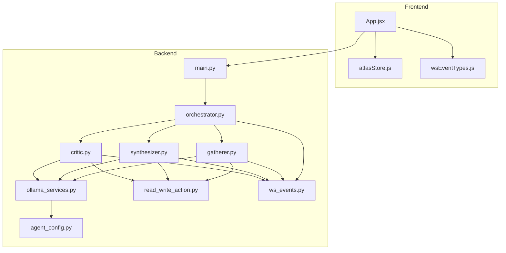

**Diagram sources**
- [main.py:1-110](file://backend/main.py#L1-L110)
- [orchestrator.py:1-98](file://backend/orchestrator.py#L1-L98)
- [gatherer.py:1-152](file://backend/gatherer.py#L1-L152)
- [synthesizer.py:1-101](file://backend/synthesizer.py#L1-L101)
- [critic.py:1-122](file://backend/critic.py#L1-L122)
- [ollama_services.py:1-26](file://backend/ollama_services.py#L1-L26)
- [agent_config.py:1-111](file://backend/agent_config.py#L1-L111)
- [read_write_action.py:1-100](file://backend/read_write_action.py#L1-L100)
- [ws_events.py:1-14](file://backend/ws_events.py#L1-L14)
- [App.jsx:1-42](file://frontend/src/App.jsx#L1-L42)
- [atlasStore.js:1-84](file://frontend/src/store/atlasStore.js#L1-L84)
- [wsEventTypes.js:1-45](file://frontend/src/utils/wsEventTypes.js#L1-L45)

**Section sources**
- [main.py:1-110](file://backend/main.py#L1-L110)
- [App.jsx:1-42](file://frontend/src/App.jsx#L1-L42)
- [atlasStore.js:1-84](file://frontend/src/store/atlasStore.js#L1-L84)
- [wsEventTypes.js:1-45](file://frontend/src/utils/wsEventTypes.js#L1-L45)

## Core Components
- FastAPI Orchestrator: Exposes HTTP and WebSocket endpoints, runs the multi-agent pipeline on a worker thread, and streams structured events back to the client.
- Gatherer Agent: Performs web search, fetches and extracts content from URLs, calls the LLM to extract facts, and persists findings to the database.
- Synthesizer Agent: Retrieves relevant raw findings and notes, generates a coherent synthesis using the LLM, and stores it with versioning semantics.
- Critic Agent: Reviews the synthesis against raw findings and notes, flags issues, and persists flagged items linked to the synthesis.
- Ollama Integration: Centralized model selection, prompt configuration, token limits, and VRAM management (model unload/load).
- Persistent Memory: PostgreSQL with pgvector for embedding-based semantic retrieval, plus helpers to count and supersede records.
- WebSocket Events: A unified emitter used by all components to publish typed events consumed by the frontend.

**Section sources**
- [main.py:34-110](file://backend/main.py#L34-L110)
- [orchestrator.py:12-94](file://backend/orchestrator.py#L12-L94)
- [gatherer.py:91-152](file://backend/gatherer.py#L91-L152)
- [synthesizer.py:31-101](file://backend/synthesizer.py#L31-L101)
- [critic.py:33-122](file://backend/critic.py#L33-L122)
- [ollama_services.py:4-26](file://backend/ollama_services.py#L4-L26)
- [read_write_action.py:14-100](file://backend/read_write_action.py#L14-L100)
- [ws_events.py:1-14](file://backend/ws_events.py#L1-L14)

## Architecture Overview
Atlas Research follows an event-driven microservices pattern:
- The frontend initiates research via a WebSocket connection to the FastAPI backend.
- The backend orchestrates a sequential pipeline across three agents, emitting typed events at each step.
- Agents interact with Ollama for generation and PostgreSQL for persistent memory with vector search.
- The frontend updates its Zustand store reactively based on incoming events, driving the 3D visualization and UI state.

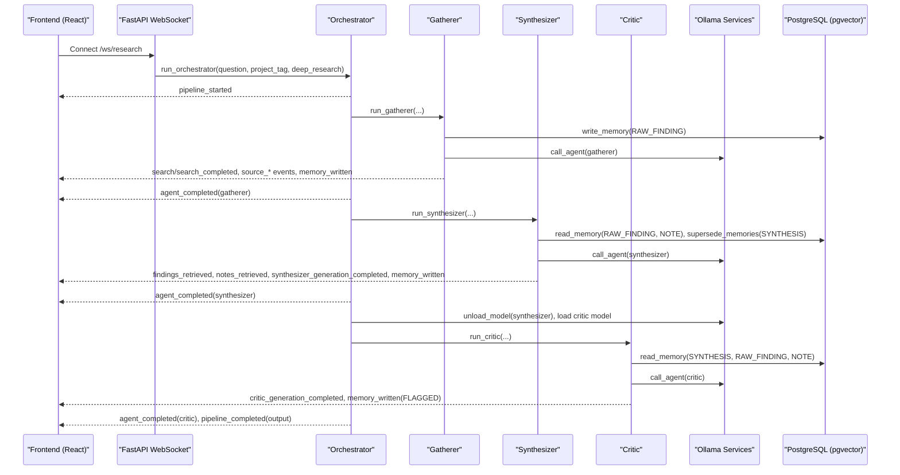

**Diagram sources**
- [main.py:71-110](file://backend/main.py#L71-L110)
- [orchestrator.py:12-94](file://backend/orchestrator.py#L12-L94)
- [gatherer.py:91-152](file://backend/gatherer.py#L91-L152)
- [synthesizer.py:31-101](file://backend/synthesizer.py#L31-L101)
- [critic.py:33-122](file://backend/critic.py#L33-L122)
- [ollama_services.py:4-26](file://backend/ollama_services.py#L4-L26)
- [read_write_action.py:14-100](file://backend/read_write_action.py#L14-L100)
- [ws_events.py:1-14](file://backend/ws_events.py#L1-L14)

## Detailed Component Analysis

### FastAPI Orchestrator and WebSocket Server
- HTTP endpoint exposes a synchronous research API that delegates to the orchestrator.
- WebSocket endpoint accepts JSON requests, validates them, spawns a background thread to run the blocking orchestrator, and streams events via a queue to the client.
- Error handling includes validation errors and pipeline exceptions, emitting structured error events.

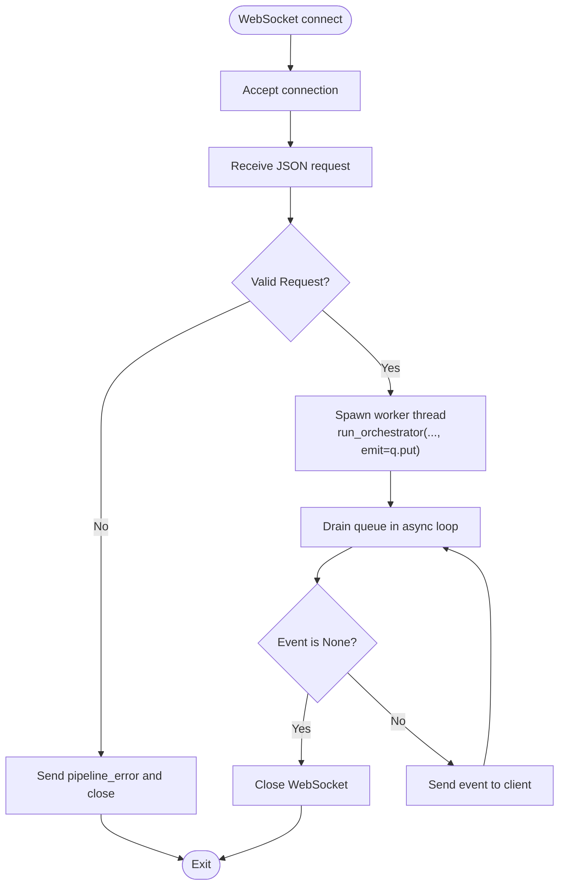

**Diagram sources**
- [main.py:71-110](file://backend/main.py#L71-L110)

**Section sources**
- [main.py:23-46](file://backend/main.py#L23-L46)
- [main.py:71-110](file://backend/main.py#L71-L110)

### Multi-Agent Pipeline (Orchestrator)
- Sequentially executes Gatherer → Synthesizer → Critic.
- Emits lifecycle events for each agent start/completion and model load/unload phases.
- Coordinates model swapping to optimize VRAM usage (unload 8B after Synthesizer, warm-load 14B before Critic).
- Finalizes output by reading the latest SYNTHESIS and returning aggregated results.

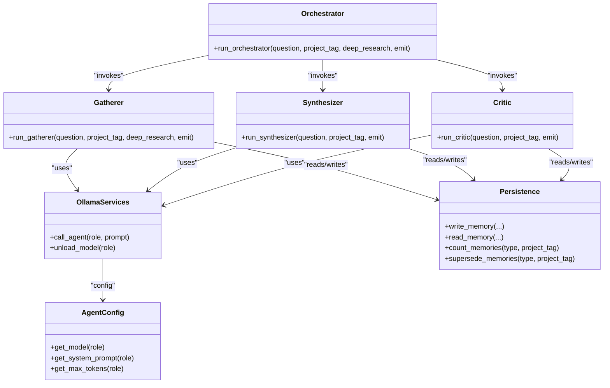

**Diagram sources**
- [orchestrator.py:12-94](file://backend/orchestrator.py#L12-L94)
- [gatherer.py:91-152](file://backend/gatherer.py#L91-L152)
- [synthesizer.py:31-101](file://backend/synthesizer.py#L31-L101)
- [critic.py:33-122](file://backend/critic.py#L33-L122)
- [ollama_services.py:4-26](file://backend/ollama_services.py#L4-L26)
- [agent_config.py:80-111](file://backend/agent_config.py#L80-L111)
- [read_write_action.py:14-100](file://backend/read_write_action.py#L14-L100)

**Section sources**
- [orchestrator.py:12-94](file://backend/orchestrator.py#L12-L94)

### Gatherer Agent
- Searches for top N results (with reserve pool), fetches and extracts text, prompts the LLM to extract FACT lines, and writes each fact as RAW_FINDING.
- Emits detailed events per source attempt, including fetch success/failure, generation outcome, and memory writes.
- Supports fallback to reserve URLs when primary extraction fails.

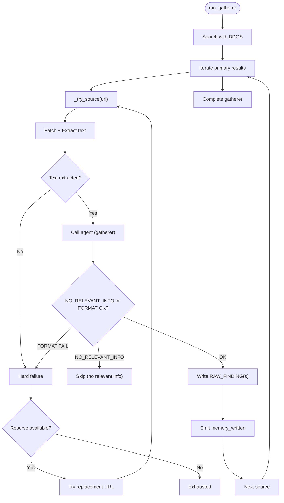

**Diagram sources**
- [gatherer.py:91-152](file://backend/gatherer.py#L91-L152)

**Section sources**
- [gatherer.py:12-89](file://backend/gatherer.py#L12-L89)
- [gatherer.py:91-152](file://backend/gatherer.py#L91-L152)

### Synthesizer Agent
- Computes adaptive limit for RAW_FINDINGs and fixed budget for NOTEs.
- Reads relevant materials, constructs a prompt, generates a synthesis, supersedes prior SYNTHESIS entries, and writes the new synthesis.
- Emits events for retrieval counts, generation completion, and memory writes.

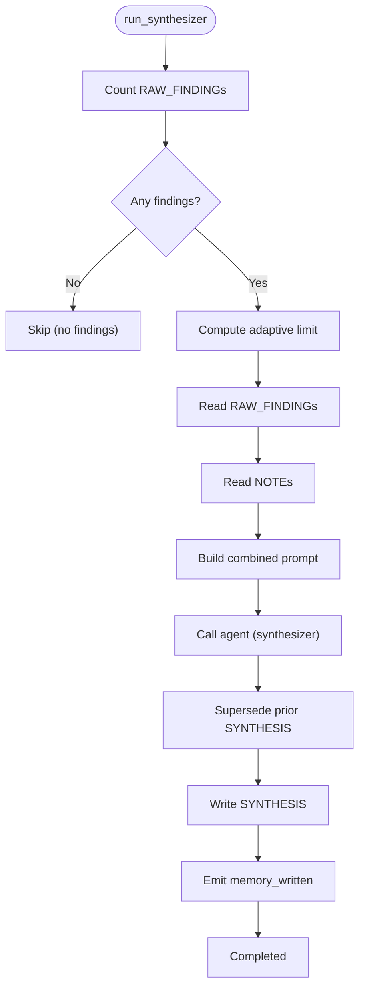

**Diagram sources**
- [synthesizer.py:31-101](file://backend/synthesizer.py#L31-L101)

**Section sources**
- [synthesizer.py:19-29](file://backend/synthesizer.py#L19-L29)
- [synthesizer.py:31-101](file://backend/synthesizer.py#L31-L101)

### Critic Agent
- Retrieves the latest SYNTHESIS and relevant RAW_FINDINGs and NOTEs.
- Calls the LLM to identify issues; if no issues, returns empty list; otherwise writes FLAGGED items linked to the synthesis.
- Emits events for retrieval counts, generation outcomes, and memory writes.

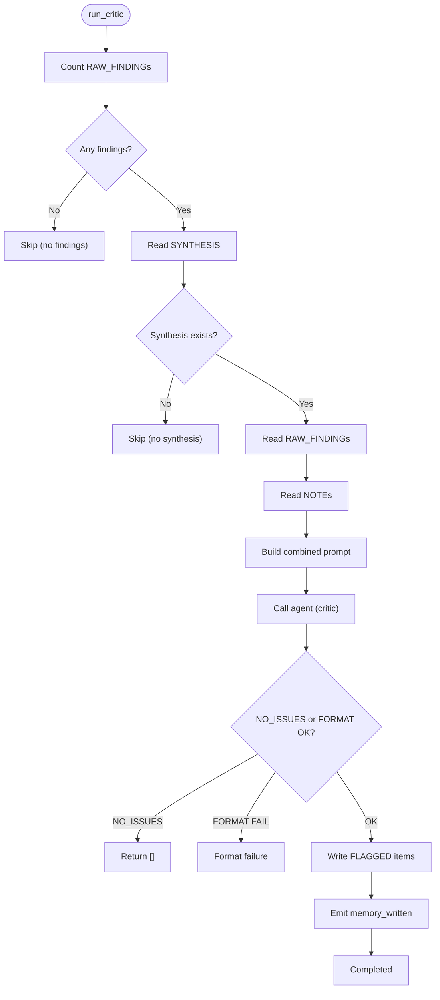

**Diagram sources**
- [critic.py:33-122](file://backend/critic.py#L33-L122)

**Section sources**
- [critic.py:20-31](file://backend/critic.py#L20-L31)
- [critic.py:33-122](file://backend/critic.py#L33-L122)

### Ollama Integration and Model Management
- Centralizes model selection, system prompts, and token limits per role.
- Provides a helper to generate responses and a utility to unload models immediately to free VRAM.
- Orchestrator coordinates model unloading/loading between Synthesizer and Critic stages.

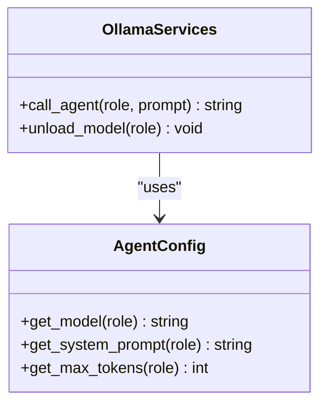

**Diagram sources**
- [ollama_services.py:4-26](file://backend/ollama_services.py#L4-L26)
- [agent_config.py:80-111](file://backend/agent_config.py#L80-L111)

**Section sources**
- [ollama_services.py:4-26](file://backend/ollama_services.py#L4-L26)
- [agent_config.py:80-111](file://backend/agent_config.py#L80-L111)

### Persistent Memory with PostgreSQL Vector Search
- Embeddings are generated using a local HuggingFace model and stored alongside content in PostgreSQL.
- Semantic retrieval orders results by vector similarity; filters support type and project scoping.
- Helpers enable counting active memories and superseding previous versions to maintain consistency.

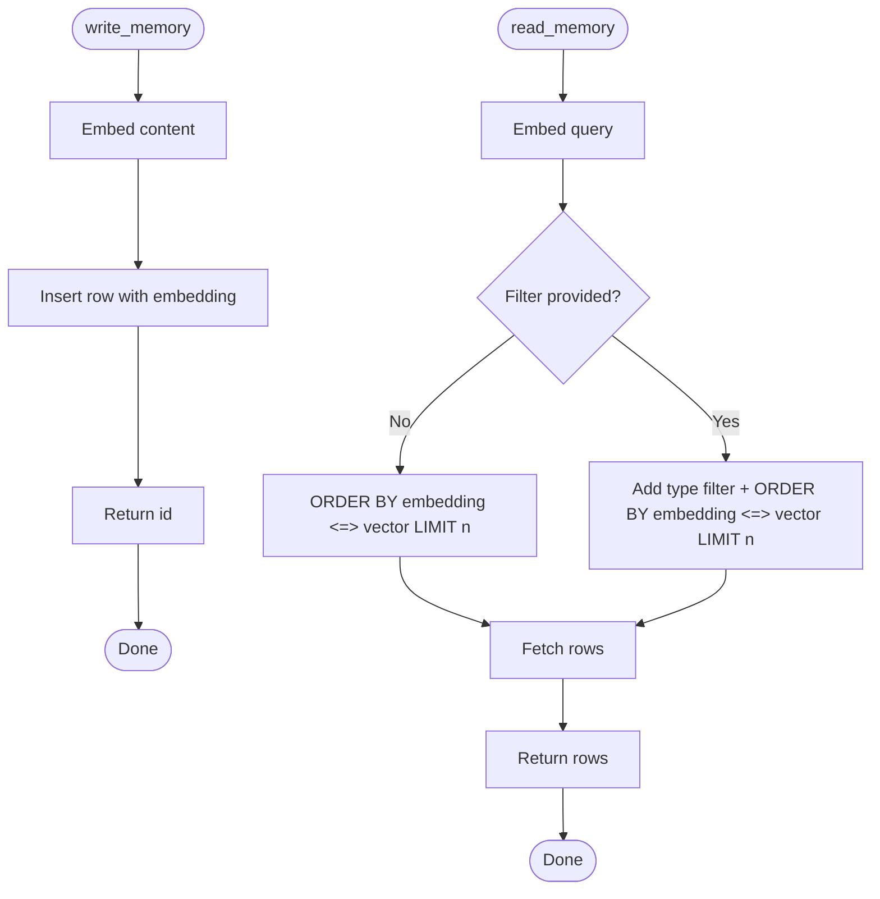

**Diagram sources**
- [read_write_action.py:14-52](file://backend/read_write_action.py#L14-L52)

**Section sources**
- [read_write_action.py:14-100](file://backend/read_write_action.py#L14-L100)

### Frontend State Management and Reactive Updates
- Zustand store maintains scene state, crystal animation states, pipeline stage tracking, input parameters, results, data shards, chat messages, and scan line visuals.
- WebSocket event types are centrally defined for consistent consumption across the application.
- The main App component initializes the 3D EntryScene and manages a custom cursor overlay.

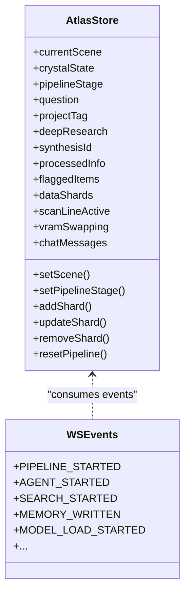

**Diagram sources**
- [atlasStore.js:1-84](file://frontend/src/store/atlasStore.js#L1-L84)
- [wsEventTypes.js:1-45](file://frontend/src/utils/wsEventTypes.js#L1-L45)

**Section sources**
- [atlasStore.js:1-84](file://frontend/src/store/atlasStore.js#L1-L84)
- [wsEventTypes.js:1-45](file://frontend/src/utils/wsEventTypes.js#L1-L45)
- [App.jsx:1-42](file://frontend/src/App.jsx#L1-L42)

## Dependency Analysis
The backend exhibits clear separation of concerns:
- Orchestrator depends on agent modules and shared utilities (Ollama services, config, persistence, event emitter).
- Agents depend on persistence and Ollama services but remain decoupled from the WebSocket layer via the emit callback.
- Frontend depends only on the WebSocket interface and event type constants.

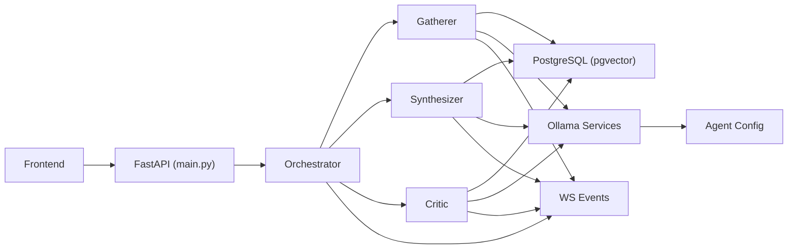

**Diagram sources**
- [main.py:1-110](file://backend/main.py#L1-L110)
- [orchestrator.py:1-98](file://backend/orchestrator.py#L1-L98)
- [gatherer.py:1-152](file://backend/gatherer.py#L1-L152)
- [synthesizer.py:1-101](file://backend/synthesizer.py#L1-L101)
- [critic.py:1-122](file://backend/critic.py#L1-L122)
- [ollama_services.py:1-26](file://backend/ollama_services.py#L1-L26)
- [agent_config.py:1-111](file://backend/agent_config.py#L1-L111)
- [read_write_action.py:1-100](file://backend/read_write_action.py#L1-L100)
- [ws_events.py:1-14](file://backend/ws_events.py#L1-L14)

**Section sources**
- [main.py:1-110](file://backend/main.py#L1-L110)
- [orchestrator.py:1-98](file://backend/orchestrator.py#L1-L98)

## Performance Considerations
- Background execution: The blocking orchestrator runs on a worker thread to avoid blocking the FastAPI event loop while streaming events.
- Model VRAM management: Unloading the 8B model after Synthesizer and pre-warming the 14B model before Critic reduces cold-start latency and optimizes GPU memory.
- Adaptive retrieval limits: Both Synthesizer and Critic compute dynamic limits based on available findings to balance context size and performance.
- Embedding model loading: Local embedding model initialization occurs once at import time; ensure offline mode is configured to avoid network delays.
- Queue-based event streaming: Using a thread-safe queue decouples producer/consumer rates and prevents backpressure issues.

[No sources needed since this section provides general guidance]

## Troubleshooting Guide
- Invalid WebSocket request: Validation errors result in a pipeline_error event and immediate close; verify JSON structure matches the expected schema.
- No findings or synthesis: Agents may skip steps if prerequisites are missing; check upstream events for skipped reasons and ensure Gatherer produced RAW_FINDINGs.
- Format failures: If LLM outputs do not match expected formats (e.g., missing "FACT:" or "FLAG:"), agents emit format_failure events; review prompts and model behavior.
- Database connectivity: Ensure PostgreSQL credentials and pgvector extension are correctly configured; connection strings are embedded in persistence helpers.
- Model loading issues: Monitor model_unload/model_load events; confirm Ollama availability and sufficient VRAM for model sizes.

**Section sources**
- [main.py:76-81](file://backend/main.py#L76-L81)
- [gatherer.py:56-63](file://backend/gatherer.py#L56-L63)
- [critic.py:97-101](file://backend/critic.py#L97-L101)
- [read_write_action.py:16-17](file://backend/read_write_action.py#L16-L17)
- [orchestrator.py:44-59](file://backend/orchestrator.py#L44-L59)

## Conclusion
Atlas Research implements a robust, event-driven microservices architecture where a FastAPI backend orchestrates three specialized AI agents to perform sequential research tasks. The reactive React/Three.js frontend consumes structured WebSocket events to update state and render immersive visualizations. By encapsulating all external dependencies (Ollama, PostgreSQL) behind well-defined interfaces and leveraging vector search for semantic memory, the system achieves scalability, clarity, and performance. The multi-agent pipeline pattern ensures focused responsibilities, while real-time communication and centralized state management provide a responsive user experience.

[No sources needed since this section summarizes without analyzing specific files]