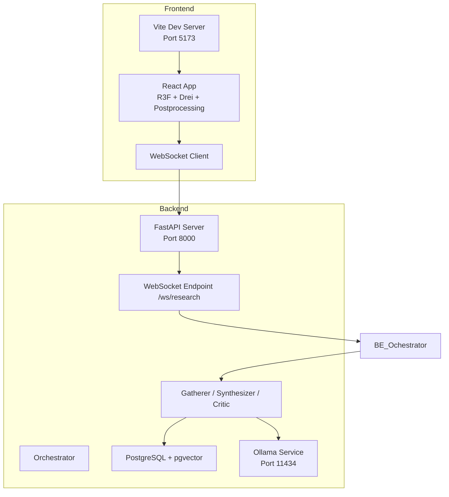
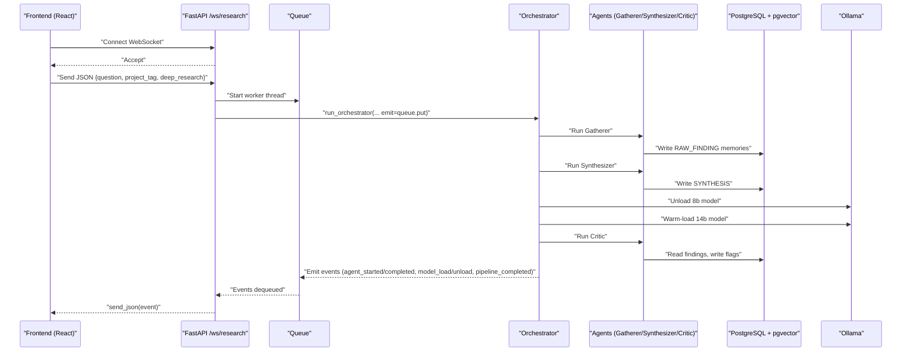
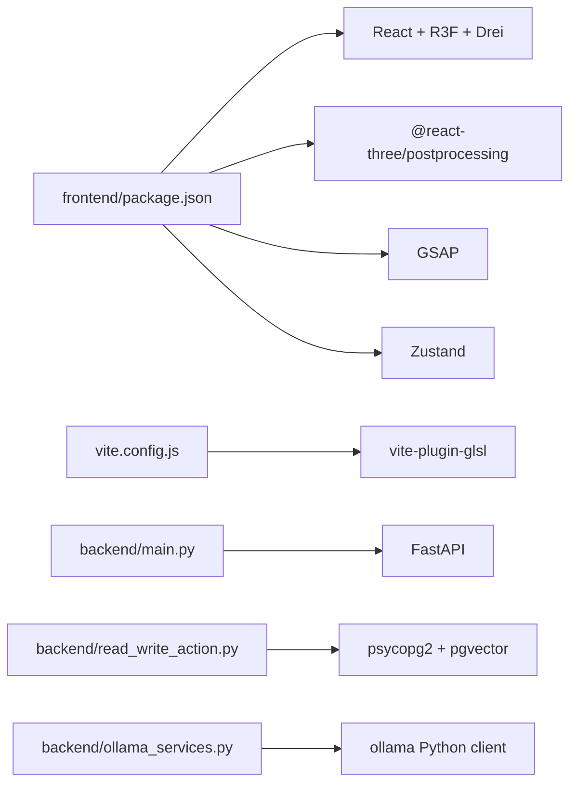

# Troubleshooting & FAQ

<cite>
**Referenced Files in This Document**
- [ATLASRESEARCH_MASTER.md](file://ATLASRESEARCH_MASTER.md)
- [main.py](file://backend/main.py)
- [orchestrator.py](file://backend/orchestrator.py)
- [ollama_services.py](file://backend/ollama_services.py)
- [read_write_action.py](file://backend/read_write_action.py)
- [ws_events.py](file://backend/ws_events.py)
- [package.json](file://frontend/package.json)
- [vite.config.js](file://frontend/vite.config.js)
- [App.jsx](file://frontend/src/App.jsx)
- [wsEventTypes.js](file://frontend/src/utils/wsEventTypes.js)
</cite>

## Table of Contents
1. Introduction
2. Project Structure
3. Core Components
4. Architecture Overview
5. Detailed Component Analysis
6. Dependency Analysis
7. Performance Considerations
8. Troubleshooting Guide
9. Conclusion
10. Appendices

## Introduction
This document provides comprehensive troubleshooting guidance for Atlas Research, focusing on connection problems (WebSocket, database, Ollama), performance bottlenecks (3D rendering, memory usage, agent processing delays), debugging strategies (shader compilation, React rendering, Python exceptions), log analysis techniques, deployment issues (ports, dependencies, environment variables), and frequently asked questions about system requirements, supported browsers, hardware recommendations, and feature limitations. It also includes monitoring and alerting strategies for production deployments and diagnostic commands for system health checks.

## Project Structure
Atlas Research consists of:
- A FastAPI backend that exposes REST endpoints and a WebSocket endpoint for real-time pipeline events.
- A React + Three.js frontend built with Vite, using custom GLSL shaders and post-processing effects.
- External services: Ollama for local LLM inference and PostgreSQL with pgvector for semantic memory storage.

**Diagram sources**
- [ATLASRESEARCH_MASTER.md:36-46](file://ATLASRESEARCH_MASTER.md#L36-L46)
- [main.py:15-21](file://backend/main.py#L15-L21)
- [main.py:71-110](file://backend/main.py#L71-L110)
- [orchestrator.py:12-94](file://backend/orchestrator.py#L12-L94)
- [read_write_action.py:14-51](file://backend/read_write_action.py#L14-L51)
- [ollama_services.py:4-17](file://backend/ollama_services.py#L4-L17)

**Section sources**
- [ATLASRESEARCH_MASTER.md:36-46](file://ATLASRESEARCH_MASTER.md#L36-L46)
- [package.json:1-35](file://frontend/package.json#L1-L35)
- [vite.config.js:1-8](file://frontend/vite.config.js#L1-L8)

## Core Components
- Backend entrypoint and CORS configuration ensure the frontend can communicate with the server during development.
- WebSocket endpoint streams structured events to the frontend as the research pipeline executes.
- Orchestrator coordinates agents and emits lifecycle events including model load/unload timing.
- Database access uses psycopg2 and pgvector; embedding model is loaded once at import time.
- Ollama integration calls local models with keep-alive and token limits.

Key implementation references:
- FastAPI app setup and CORS: [main.py:15-21](file://backend/main.py#L15-L21)
- WebSocket handler and queue-based event streaming: [main.py:71-110](file://backend/main.py#L71-L110)
- Orchestrator flow and timing logs: [orchestrator.py:12-94](file://backend/orchestrator.py#L12-L94)
- DB connection and embeddings initialization: [read_write_action.py:9-12](file://backend/read_write_action.py#L9-L12), [read_write_action.py:14-51](file://backend/read_write_action.py#L14-L51)
- Ollama call and model unload: [ollama_services.py:4-17](file://backend/ollama_services.py#L4-L17), [ollama_services.py:20-26](file://backend/ollama_services.py#L20-L26)
- WS event structure helper: [ws_events.py:3-14](file://backend/ws_events.py#L3-L14)
- Frontend WS event types mapping: [wsEventTypes.js:1-45](file://frontend/src/utils/wsEventTypes.js#L1-L45)
- Vite GLSL plugin enabling shader imports: [vite.config.js:1-8](file://frontend/vite.config.js#L1-L8)

**Section sources**
- [main.py:15-21](file://backend/main.py#L15-L21)
- [main.py:71-110](file://backend/main.py#L71-L110)
- [orchestrator.py:12-94](file://backend/orchestrator.py#L12-L94)
- [read_write_action.py:9-12](file://backend/read_write_action.py#L9-L12)
- [read_write_action.py:14-51](file://backend/read_write_action.py#L14-L51)
- [ollama_services.py:4-17](file://backend/ollama_services.py#L4-L17)
- [ws_events.py:3-14](file://backend/ws_events.py#L3-L14)
- [wsEventTypes.js:1-45](file://frontend/src/utils/wsEventTypes.js#L1-L45)
- [vite.config.js:1-8](file://frontend/vite.config.js#L1-L8)

## Architecture Overview
The runtime architecture centers around a WebSocket-driven pipeline where the frontend initiates research via HTTP or WS, and the backend streams progress and results through structured events.

**Diagram sources**
- [main.py:71-110](file://backend/main.py#L71-L110)
- [orchestrator.py:12-94](file://backend/orchestrator.py#L12-L94)
- [read_write_action.py:14-51](file://backend/read_write_action.py#L14-L51)
- [ollama_services.py:4-17](file://backend/ollama_services.py#L4-L17)

## Detailed Component Analysis

### WebSocket Connectivity Troubleshooting
Symptoms:
- Frontend cannot connect to ws://localhost:8000/ws/research
- Connection drops immediately after sending request
- No events received despite successful connection

Common causes and fixes:
- CORS misconfiguration: Ensure allow_origins includes http://localhost:5173.
- Port conflicts: Confirm FastAPI is listening on port 8000 and not blocked by firewall.
- Invalid request payload: Validation errors will send a pipeline_error and close the socket.
- Early client disconnect: The backend continues running the pipeline; events are queued but unread.

Debug steps:
- Verify CORS settings in the backend.
- Use browser dev tools Network tab to inspect WebSocket handshake and frames.
- Check backend logs for ValidationError messages and pipeline_error events.
- Reconnect logic should handle transient failures and retry with backoff.

Relevant code paths:
- CORS middleware: [main.py:15-21](file://backend/main.py#L15-L21)
- WebSocket accept and JSON parsing: [main.py:71-84](file://backend/main.py#L71-L84)
- Event emission helper: [ws_events.py:3-14](file://backend/ws_events.py#L3-L14)
- Frontend event type constants: [wsEventTypes.js:1-45](file://frontend/src/utils/wsEventTypes.js#L1-L45)

**Section sources**
- [main.py:15-21](file://backend/main.py#L15-L21)
- [main.py:71-84](file://backend/main.py#L71-L84)
- [ws_events.py:3-14](file://backend/ws_events.py#L3-L14)
- [wsEventTypes.js:1-45](file://frontend/src/utils/wsEventTypes.js#L1-L45)

### Database Connection Failures
Symptoms:
- psycopg2 connection errors
- Embedding model load fails due to offline mode
- Queries return empty results or raise exceptions

Common causes and fixes:
- Incorrect credentials or missing database: Ensure dbname, user, password match your PostgreSQL instance.
- pgvector extension not enabled: Install and enable pgvector in the target database.
- Offline embedding model download: HF_HUB_OFFLINE=1 prevents downloads; ensure model cache exists.

Debug steps:
- Test connectivity with psql using the same credentials used in read_write_action.py.
- Verify pgvector extension is installed and registered_vector is called before queries.
- Check if the HuggingFace model cache contains all-MiniLM-L6-v2 when running offline.

Relevant code paths:
- DB connection string and vector registration: [read_write_action.py:14-18](file://backend/read_write_action.py#L14-L18)
- Embedding model load and offline flag: [read_write_action.py:7-12](file://backend/read_write_action.py#L7-L12)
- Query execution patterns: [read_write_action.py:33-51](file://backend/read_write_action.py#L33-L51)

**Section sources**
- [read_write_action.py:7-12](file://backend/read_write_action.py#L7-L12)
- [read_write_action.py:14-18](file://backend/read_write_action.py#L14-L18)
- [read_write_action.py:33-51](file://backend/read_write_action.py#L33-L51)

### Ollama Service Availability
Symptoms:
- ollama.generate raises connection errors
- Model load/unload takes too long or fails
- VRAM pressure causes slowdowns

Common causes and fixes:
- Ollama not running or wrong port: Confirm service is reachable at localhost:11434.
- Model names mismatch: Ensure get_model returns valid model names for the selected tier.
- Keep-alive and token limits: Tune keep_alive and num_predict to balance responsiveness and memory.

Debug steps:
- Ping Ollama health endpoint or run a simple generate call from a script.
- Monitor GPU memory usage during model warm-up and generation.
- Unload models between stages to free VRAM.

Relevant code paths:
- Ollama call wrapper: [ollama_services.py:4-17](file://backend/ollama_services.py#L4-L17)
- Model unload helper: [ollama_services.py:20-26](file://backend/ollama_services.py#L20-L26)
- Model selection and prompts: [agent_config.py:80-111](file://backend/agent_config.py#L80-L111)

**Section sources**
- [ollama_services.py:4-17](file://backend/ollama_services.py#L4-L17)
- [ollama_services.py:20-26](file://backend/ollama_services.py#L20-L26)
- [agent_config.py:80-111](file://backend/agent_config.py#L80-L111)

### Performance Bottlenecks: 3D Rendering, Memory Usage, Agent Delays
Rendering:
- High sample counts or resolution in MeshTransmissionMaterial can cause frame drops.
- Large geometry and complex shaders increase GPU workload.

Memory:
- Embedding model loads into CPU/RAM at import time.
- Ollama models consume VRAM; unloading between stages is critical.

Agent delays:
- Long-running network I/O or slow LLM responses.
- Database query latency or missing indexes.

Optimization tips:
- Reduce transmission samples/resolution on low-end GPUs.
- Use efficient geometries and limit draw calls.
- Pre-warm models and reuse connections where possible.
- Profile orchestrator timings and identify slow agents.

Relevant code paths:
- Orchestrator timing logs: [orchestrator.py:22-23](file://backend/orchestrator.py#L22-L23), [orchestrator.py:34-36](file://backend/orchestrator.py#L34-L36), [orchestrator.py:65-67](file://backend/orchestrator.py#L65-L67)
- Embedding model load timing: [read_write_action.py:9-12](file://backend/read_write_action.py#L9-L12)
- Model unload/load events: [orchestrator.py:44-59](file://backend/orchestrator.py#L44-L59)

**Section sources**
- [orchestrator.py:22-23](file://backend/orchestrator.py#L22-L23)
- [orchestrator.py:34-36](file://backend/orchestrator.py#L34-L36)
- [orchestrator.py:44-59](file://backend/orchestrator.py#L44-L59)
- [orchestrator.py:65-67](file://backend/orchestrator.py#L65-L67)
- [read_write_action.py:9-12](file://backend/read_write_action.py#L9-L12)

### Debugging Shader Compilation Errors
Symptoms:
- Blank scene or black textures
- Console errors indicating GLSL compilation failure
- Inconsistent behavior across browsers

Common causes and fixes:
- Missing vite-plugin-glsl or incorrect import paths
- Syntax errors in .glsl files
- Uniform mismatches between JS and GLSL

Debug steps:
- Ensure vite.config.js includes glsl plugin.
- Validate GLSL syntax using online validators or IDE extensions.
- Log uniform values in JS to confirm correct updates.

Relevant code paths:
- Vite GLSL plugin configuration: [vite.config.js:1-8](file://frontend/vite.config.js#L1-L8)

**Section sources**
- [vite.config.js:1-8](file://frontend/vite.config.js#L1-L8)

### React Component Rendering Problems
Symptoms:
- UI not updating on state changes
- Custom cursor not moving
- Scene re-renders excessively

Common causes and fixes:
- Missing event listeners or improper cleanup
- State updates not triggering re-renders
- Overuse of heavy computations in render path

Debug steps:
- Inspect useEffect hooks and event listener registration.
- Use React DevTools to track state and props.
- Memoize expensive computations and avoid unnecessary re-renders.

Relevant code paths:
- Custom cursor mousemove listener: [App.jsx:7-18](file://frontend/src/App.jsx#L7-L18)

**Section sources**
- [App.jsx:7-18](file://frontend/src/App.jsx#L7-L18)

### Python Backend Exceptions
Symptoms:
- Pipeline stops early with errors
- WebSocket sends pipeline_error and closes
- Unexpected None returns from agents

Common causes and fixes:
- Validation errors in request body
- Agent failures returning None
- Unhandled exceptions in worker threads

Debug steps:
- Inspect ValidationError handling and error messages sent over WS.
- Add logging around agent calls to capture stack traces.
- Ensure sentinel None is always enqueued to prevent hanging readers.

Relevant code paths:
- Request validation and error response: [main.py:76-81](file://backend/main.py#L76-L81)
- Worker thread exception handling and sentinel: [main.py:58-68](file://backend/main.py#L58-L68)
- Orchestrator early exits and stopped reasons: [orchestrator.py:25-28](file://backend/orchestrator.py#L25-L28), [orchestrator.py:38-41](file://backend/orchestrator.py#L38-L41), [orchestrator.py:75-78](file://backend/orchestrator.py#L75-L78)

**Section sources**
- [main.py:76-81](file://backend/main.py#L76-L81)
- [main.py:58-68](file://backend/main.py#L58-L68)
- [orchestrator.py:25-28](file://backend/orchestrator.py#L25-L28)
- [orchestrator.py:38-41](file://backend/orchestrator.py#L38-L41)
- [orchestrator.py:75-78](file://backend/orchestrator.py#L75-L78)

### Log Analysis Techniques
- Backend prints timing markers like [ORCH TIMING] and [TIMING] for embedding model load.
- WebSocket events include timestamps and structured data fields.
- Use structured logging to correlate frontend actions with backend events.

Recommended practices:
- Centralize logs with correlation IDs per request.
- Parse WS event streams to reconstruct pipeline timelines.
- Monitor error rates and latency percentiles.

Relevant code paths:
- Timing prints in orchestrator: [orchestrator.py:22-23](file://backend/orchestrator.py#L22-L23), [orchestrator.py:34-36](file://backend/orchestrator.py#L34-36), [orchestrator.py:65-67](file://backend/orchestrator.py#L65-67)
- Embedding model load timing: [read_write_action.py:9-12](file://backend/read_write_action.py#L9-12)
- WS event structure: [ws_events.py:3-14](file://backend/ws_events.py#L3-14)

**Section sources**
- [orchestrator.py:22-23](file://backend/orchestrator.py#L22-L23)
- [orchestrator.py:34-36](file://backend/orchestrator.py#L34-36)
- [orchestrator.py:65-67](file://backend/orchestrator.py#L65-67)
- [read_write_action.py:9-12](file://backend/read_write_action.py#L9-12)
- [ws_events.py:3-14](file://backend/ws_events.py#L3-14)

### Deployment Issues: Ports, Dependencies, Environment Variables
- Port conflicts: FastAPI on 8000, Vite on 5173, Ollama on 11434, PostgreSQL on 5432.
- Dependency versions: Pin exact versions in package.json and backend requirements.
- Environment variables: HF_HUB_OFFLINE controls embedding model downloads; ensure model cache exists.

Checklist:
- Verify ports are free and firewalls allow traffic.
- Confirm dependency versions match those in package.json and backend lockfiles.
- Set HF_HUB_OFFLINE=1 only when models are pre-cached.

Relevant code paths:
- Service ports reference: [ATLASRESEARCH_MASTER.md:36-46](file://ATLASRESEARCH_MASTER.md#L36-L46)
- Frontend dependencies: [package.json:10-33](file://frontend/package.json#L10-L33)
- Offline embedding flag: [read_write_action.py:7](file://backend/read_write_action.py#L7)

**Section sources**
- [ATLASRESEARCH_MASTER.md:36-46](file://ATLASRESEARCH_MASTER.md#L36-L46)
- [package.json:10-33](file://frontend/package.json#L10-L33)
- [read_write_action.py:7](file://backend/read_write_action.py#L7)

### Monitoring and Alerting Strategies
- Instrument WebSocket event throughput and latency.
- Track agent durations and error rates.
- Monitor Ollama model load/unload times and VRAM usage.
- Alert on pipeline_stopped with non-empty reason fields.

Implementation ideas:
- Emit metrics alongside WS events (e.g., Prometheus counters).
- Use centralized logging with trace IDs.
- Healthcheck endpoints for Ollama and PostgreSQL.

[No sources needed since this section provides general guidance]

### Diagnostic Commands for System Health Checks
- Check FastAPI status: curl http://localhost:8000/
- Verify Ollama availability: curl http://localhost:11434/api/tags
- Test PostgreSQL connectivity: psql -U postgres -d AtlasResearch -c "SELECT 1;"
- Inspect active WebSocket connections: use browser dev tools or backend logs

[No sources needed since this section provides general guidance]

## Dependency Analysis
The system’s external dependencies include:
- FastAPI and WebSocket support for backend networking
- psycopg2 and pgvector for database operations
- ollama Python client for LLM inference
- React ecosystem libraries for 3D rendering and state management
- Vite and GLSL plugin for shader processing

**Diagram sources**
- [package.json:10-33](file://frontend/package.json#L10-L33)
- [vite.config.js:1-8](file://frontend/vite.config.js#L1-L8)
- [main.py:1-10](file://backend/main.py#L1-L10)
- [read_write_action.py:1-3](file://backend/read_write_action.py#L1-L3)
- [ollama_services.py:1-2](file://backend/ollama_services.py#L1-L2)

**Section sources**
- [package.json:10-33](file://frontend/package.json#L10-L33)
- [vite.config.js:1-8](file://frontend/vite.config.js#L1-L8)
- [main.py:1-10](file://backend/main.py#L1-L10)
- [read_write_action.py:1-3](file://backend/read_write_action.py#L1-L3)
- [ollama_services.py:1-2](file://backend/ollama_services.py#L1-L2)

## Performance Considerations
- Reduce WebGL sample counts and render target resolutions for lower-end GPUs.
- Avoid heavy synchronous operations in the main thread; offload to workers where possible.
- Cache embedding vectors and reuse DB connections to reduce latency.
- Profile orchestrator timings to identify slow agents and optimize prompts or model choices.

[No sources needed since this section provides general guidance]

## Troubleshooting Guide
- WebSocket connectivity: Validate CORS, port, and request payload; inspect WS frames and backend logs.
- Database failures: Verify credentials, pgvector extension, and offline model cache.
- Ollama issues: Confirm service availability, model names, and VRAM usage; unload models between stages.
- Shader errors: Enable GLSL plugin, validate syntax, and check uniform mappings.
- React rendering: Ensure event listeners are attached and cleaned up; monitor state updates.
- Python exceptions: Handle validation errors, log agent failures, and ensure sentinel enqueueing.

[No sources needed since this section summarizes previously analyzed items]

## Conclusion
Atlas Research combines a real-time WebSocket-driven backend with a high-fidelity 3D frontend. Effective troubleshooting requires understanding the event-driven pipeline, external service dependencies, and performance-sensitive rendering. By following the diagnostic steps and optimization tips outlined here, you can resolve common issues and maintain a smooth user experience.

[No sources needed since this section summarizes without analyzing specific files]

## Appendices

### Frequently Asked Questions
- System requirements: Modern desktop with dedicated GPU recommended for 3D rendering and local LLM inference.
- Supported browsers: Latest Chrome/Firefox/Edge with WebGL 2.0 support.
- Hardware recommendations: Minimum 8 GB RAM, 4 GB VRAM for comfortable operation with medium-sized models.
- Feature limitations: Offline mode requires pre-cached embedding models; large models may exceed VRAM on consumer GPUs.

[No sources needed since this section provides general guidance]